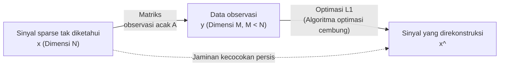

# Apa itu Compressed Sensing?

Salah satu pergeseran paradigma paling revolusioner dalam ilmu data modern dan pemrosesan sinyal adalah "Compressed Sensing" (atau Compressive Sensing). Secara tradisional, ketika mengonversi sinyal analog seperti audio, gambar, atau gelombang elektromagnetik ke dalam data digital untuk komputer, kita telah mengikuti hukum mutlak dari "Teorema Pengambilan Sampel Nyquist-Shannon" (Nyquist-Shannon sampling theorem). Namun, compressed sensing membalikkan akal sehat ini dan memberikan jaminan matematis yang mengejutkan: "Jika sebuah sinyal memenuhi kondisi tertentu (Sparsity atau kelangkaan), sinyal asli dapat dipulihkan sepenuhnya dari data observasi yang jauh lebih sedikit daripada yang diwajibkan oleh teorema pengambilan sampel."

Artikel ini akan memberikan penjelasan mendalam beserta rumus matematika, dimulai dari dasar-dasar teorema pengambilan sampel, definisi matematis dari sparsity, relaksasi ke masalah optimasi $L_1$, dan inti dari terobosan teoretis oleh Emmanuel Candès, Terence Tao, dan lainnya. Lebih jauh, artikel ini akan mencakup studi kasus penerapan seperti percepatan MRI dan rekonstruksi gambar lubang hitam, serta kode implementasi konkret menggunakan Python untuk mengungkapkan gambaran lengkap tentang compressed sensing.

## 1. Teorema Pengambilan Sampel Nyquist-Shannon dan Keterbatasannya

### Dasar-dasar Teorema Pengambilan Sampel
Pada pertengahan abad ke-20, "Teorema Pengambilan Sampel" ditetapkan sebagai dasar teori informasi oleh Claude Shannon dan Harry Nyquist. Teorema ini menentukan kondisi untuk mengubah sinyal analog kontinu menjadi sinyal digital diskrit sebagai berikut:

> **Teorema Pengambilan Sampel Nyquist-Shannon**
> Untuk sepenuhnya merekonstruksi sinyal yang bandwidth-nya dibatasi pada $f_{\max}$, sinyal tersebut harus disampel dengan frekuensi pengambilan sampel (Nyquist rate) setidaknya $2f_{\max}$.

Sebagai contoh, batas atas rentang pendengaran manusia yang dapat didengar adalah sekitar 20 kHz. Oleh karena itu, pada CD musik, pengambilan sampel dilakukan pada lebih dari dua kali lipat frekuensi tersebut, yaitu 44.1 kHz. Dinyatakan dalam rumus, jika sinyal kontinu $x(t)$ memiliki transformasi Fourier $X(f)$ dan $X(f) = 0$ untuk $|f| > f_{\max}$, $x(t)$ dipulihkan sepenuhnya oleh rumus interpolasi berikut menggunakan fungsi sinc:

$$ x(t) = \sum_{n=-\infty}^{\infty} x\left(\frac{n}{2f_{\max}}\right) \operatorname{sinc}\left(2f_{\max}t - n\right) $$

### Ledakan Data dan Keterbatasan Teorema
Teorema pengambilan sampel sangat kuat dan menjadi fondasi komunikasi digital modern. Namun, dengan kemajuan teknologi, jumlah informasi yang ditangkap oleh sensor telah meningkat secara eksplosif. Pada citra medis resolusi tinggi (MRI dan CT), susunan teleskop radio dalam astronomi, dan sistem radar ultra-wideband, melakukan pengambilan sampel menurut Nyquist rate akan menghasilkan jumlah data observasi yang terlalu masif.

Akibatnya, masalah berikut muncul:
1. **Peningkatan Waktu Pemindaian (Scanning)**: Dalam MRI, misalnya, mengumpulkan data membutuhkan waktu yang lama, yang memberikan beban fisik pada pasien.
2. **Keterbatasan Perangkat Keras**: Pembuatan konverter A/D untuk menyampel sinyal frekuensi sangat tinggi menjadi sulit secara teknis, atau sangat mahal.
3. **Tekanan pada Penyimpanan dan Komunikasi Data**: Biaya untuk menyimpan dan mentransmisikan data sampel dalam jumlah besar akan membengkak.

Paradigma tradisional adalah "mengambil sampel dalam jumlah besar dan kemudian membuang data yang tidak perlu dengan mengompresinya menggunakan perangkat lunak (seperti JPEG dan MP3)". Namun, muncul pertanyaan: "Jika pada akhirnya kita akan membuangnya, tidak bisakah kita hanya merasakan informasi yang diperlukan secara langsung sejak awal?" Compressed sensing adalah apa yang memungkinkan ini.

## 2. Definisi Matematis dari Sparsity (Kelangkaan)

Kondisi mutlak agar compressed sensing berhasil adalah **Sparsity (kelangkaan)**. Sparsity merujuk pada sifat bahwa "ketika sebuah sinyal diubah menggunakan basis (metode representasi) yang sesuai, sebagian besar komponennya menjadi nol (atau nilai yang sangat dekat dengan nol)."

### Formulasi Vektor Sparse
Pertimbangkan sebuah sinyal diskrit (vektor) $\mathbf{x} \in \mathbb{R}^N$ dengan panjang $N$. Asumsikan bahwa sinyal ini dapat direpresentasikan sebagai berikut menggunakan matriks basis ortogonal $\mathbf{\Psi} \in \mathbb{R}^{N \times N}$ (contohnya, matriks transformasi Fourier atau matriks transformasi wavelet):

$$ \mathbf{x} = \mathbf{\Psi} \mathbf{s} $$

Di sini, $\mathbf{s} \in \mathbb{R}^N$ adalah vektor koefisien pada basis $\mathbf{\Psi}$.
Ketika jumlah elemen bukan nol dalam vektor $\mathbf{s}$ ini adalah $K$ (di mana $K \ll N$), $\mathbf{x}$ dikatakan **$K$-sparse**. Secara matematis, ini didefinisikan sebagai berikut menggunakan norma $L_0$ (sebuah fungsi yang menghitung jumlah elemen bukan nol).

$$ \|\mathbf{s}\|_0 = K $$

### Sparsity di Dunia Nyata
Hebatnya, banyak sinyal di alam menjadi sparse (langka) jika kita memilih basis yang tepat.
- **Gambar**: Gambar alami tidak sparse dalam ruang piksel, tetapi ketika transformasi wavelet atau discrete cosine transform (DCT) diterapkan, sebagian besar komponen frekuensi tinggi mendekati nol, menjadikannya sparse (ini adalah prinsip di balik kompresi JPEG).
- **Audio**: Sinyal audio kontinu dalam domain waktu, tetapi dalam domain frekuensi (setelah transformasi Fourier), hanya beberapa komponen frekuensi utama (frekuensi dasar dan nada atas/harmonik) yang memiliki nilai besar.

Compressed sensing adalah teknologi yang memanfaatkan "redundansi yang melekat pada sinyal" untuk secara simultan melakukan kompresi data selama tahap pengambilan sampel.

## 3. Formulasi Compressed Sensing dan Matriks Observasi

Dengan asumsi bahwa sinyal tersebut sparse, bagaimana kita memulihkan sinyal dari data yang lebih sedikit?
Misalkan kita melakukan observasi linier $M$ kali pada sinyal tak diketahui $\mathbf{x} \in \mathbb{R}^N$ ($M < N$). Proses observasi dinyatakan sebagai berikut menggunakan matriks observasi $\mathbf{\Phi} \in \mathbb{R}^{M \times N}$.

$$ \mathbf{y} = \mathbf{\Phi} \mathbf{x} = \mathbf{\Phi} \mathbf{\Psi} \mathbf{s} = \mathbf{A} \mathbf{s} $$

Di sini,
- $\mathbf{y} \in \mathbb{R}^M$: Vektor data observasi
- $\mathbf{A} = \mathbf{\Phi} \mathbf{\Psi} \in \mathbb{R}^{M \times N}$: Matriks sensing

Tujuan kita adalah untuk memulihkan vektor koefisien $\mathbf{s}$ yang tidak diketahui (dan akhirnya $\mathbf{x}$) dari data observasi yang diberikan $\mathbf{y}$ dan matriks $\mathbf{A}$.

### Masalah Sistem Underdetermined (Kurang Ditentukan)
Namun, di sini kita menghadapi kendala matematis. Karena $M < N$ (ada lebih banyak variabel yang tidak diketahui daripada jumlah persamaan), sistem persamaan $\mathbf{y} = \mathbf{A} \mathbf{s}$ ini menjadi **sistem underdetermined**, dan terdapat jumlah solusi yang tak terhingga. Tidak mungkin untuk menemukan solusi unik menggunakan aljabar linier biasa.

Di sinilah kita menggunakan pengetahuan awal (prior knowledge) bahwa "$\mathbf{s}$ adalah sparse (komponen bukan nol-nya sangat sedikit)". Jika kita mencari solusi paling sparse (dengan jumlah komponen bukan nol yang paling sedikit) dari jumlah kandidat solusi yang tak terhingga, kemungkinan besar itu adalah sinyal yang sebenarnya. Merumuskan hal ini sebagai masalah optimasi akan terlihat seperti ini:

$$ (P_0) \quad \min_{\mathbf{s} \in \mathbb{R}^N} \|\mathbf{s}\|_0 \quad \text{subject to} \quad \mathbf{y} = \mathbf{A} \mathbf{s} $$

### Kesulitan Optimasi $L_0$
Idealnya, kita hanya perlu memecahkan masalah $(P_0)$ di atas, tetapi secara matematis diketahui bahwa masalah minimisasi $\|\mathbf{s}\|_0$ adalah **NP-hard**. Kita perlu melakukan pemeriksaan kombinasi komponen bukan nol satu per satu (brute-force), dan ketika dimensi $N$ membesar, bahkan superkomputer modern akan membutuhkan waktu lebih lama daripada umur alam semesta untuk menyelesaikannya.

## 4. Relaksasi ke Masalah Optimasi $L_1$: Terobosan Candès dan Tao

Alasan mengapa compressed sensing meledak menjadi teknologi praktis yang populer adalah karena bukti matematis yang mengejutkan yang diberikan: bahwa meskipun kita mengganti masalah optimasi $L_0$ yang tidak dapat diselesaikan ini dengan **masalah optimasi $L_1$** yang dapat dihitung, di bawah kondisi tertentu, kita dapat **mencapai jawaban benar yang sama persis**.

Antara tahun 2004 dan 2006, Emmanuel Candès, Terence Tao, dan David Donoho membangun fondasi yang kuat untuk teori ini.

### Minimisasi Norma $L_1$
Alih-alih norma $L_0$, kita menggunakan norma $L_1$, yang merupakan jumlah nilai absolut dari setiap elemen vektor.

$$ \|\mathbf{s}\|_1 = \sum_{i=1}^N |s_i| $$

Melalui hal ini, masalah direlaksasi (relaxation) menjadi berikut ini:

$$ (P_1) \quad \min_{\mathbf{s} \in \mathbb{R}^N} \|\mathbf{s}\|_1 \quad \text{subject to} \quad \mathbf{y} = \mathbf{A} \mathbf{s} $$

Masalah minimisasi $L_1$ adalah sejenis masalah optimasi cembung (convex optimization) yang dapat diselesaikan dengan tepat dalam waktu polinomial menggunakan algoritma efisiensi tinggi yang sudah ada seperti Linear Programming.

### Mengapa $L_1$? (Intuisi Geometris)
Mengapa kita menggunakan norma $L_1$ daripada norma $L_2$ (metode kuadrat terkecil)? Hal ini dapat dipahami secara geometris.
Syarat batas $\mathbf{y} = \mathbf{A}\mathbf{s}$ membentuk bidang hiper (hyperplane) di ruang dimensi tinggi. Minimisasi norma setara dengan memperluas kontur ekuipotensial (bola) yang berpusat di titik asal dan mencari titik yang pertama kali bersinggungan dengan hyperplane ini.

- **Bola $L_2$ ($\|\mathbf{s}\|_2 \le R$)**: Bentuknya adalah bola yang mulus. Titik yang bersinggungan dengan hyperplane hampir selalu terletak jauh dari setiap sumbu koordinat, dan solusi yang dihasilkan adalah vektor "padat" (dense) di mana seluruh elemennya bukan nol.
- **Bola $L_1$ ($\|\mathbf{s}\|_1 \le R$)**: Bentuknya polihedron (belah ketupat, oktahedron, dll.) dan memiliki banyak "sudut" (titik sudut). Sudut-sudut ini terletak pada sumbu koordinat. Ketika bola ini ditekan pada hyperplane, kemungkinan besar ia akan bersentuhan pada "sudut" ini. Bersinggungan di sudut berarti bahwa nilai pada sumbu koordinat lain menjadi nol, sehingga menghasilkan solusi yang sparse.

### RIP (Restricted Isometry Property)
Candès dan Tao memperkenalkan konsep **RIP (Restricted Isometry Property)** sebagai kondisi yang cukup agar minimisasi $L_1$ identik dengan minimisasi $L_0$.
Matriks sensing $\mathbf{A}$ memenuhi RIP dari orde $K$ jika terdapat suatu konstanta kecil $\delta_K \in (0,1)$ sedemikian rupa sehingga ketidaksetaraan berikut berlaku untuk vektor $K$-sparse apa pun $\mathbf{s}$:

$$ (1 - \delta_K) \|\mathbf{s}\|_2^2 \le \|\mathbf{A}\mathbf{s}\|_2^2 \le (1 + \delta_K) \|\mathbf{s}\|_2^2 $$

Secara intuitif, ini adalah properti bahwa "matriks $\mathbf{A}$ mempertahankan (hampir) panjang setiap vektor sparse". Candès dan Tao secara brilian membuktikan bahwa jika $\mathbf{A}$ memenuhi kondisi RIP tertentu, solusi untuk $(P_1)$ akan sangat cocok dengan solusi untuk $(P_0)$ di lingkungan tanpa noise (kebisingan).

Lebih jauh lagi, dari sudut pandang praktis, ditunjukkan bahwa dengan menggunakan **matriks acak** (matriks bilangan acak yang mengikuti distribusi Gaussian atau Bernoulli) sebagai matriks observasi $\mathbf{\Phi}$ akan memenuhi RIP dengan probabilitas tinggi. Dengan kata lain, "observasi secara acak" adalah strategi sampling yang paling efisien dan universal dalam compressed sensing.

Banyaknya observasi $M$ yang dibutuhkan telah terbukti cukup dalam urutan berikut sehubungan dengan panjang sinyal $N$ dan derajat sparsity $K$:

$$ M \ge C \cdot K \log\left(\frac{N}{K}\right) $$
（di mana $C$ adalah konstanta）

Ini berarti ia membutuhkan jumlah observasi yang jauh lebih sedikit (tergantung pada $K$) dibandingkan dengan pengamatan $N$ yang dibutuhkan oleh teorema pengambilan sampel.

## 5. Studi Kasus Penerapan Compressed Sensing

Teori compressed sensing telah merevolusi semua bidang di teknik informasi dan fisika.

### 1. Percepatan MRI (Magnetic Resonance Imaging)
Salah satu contoh komersial yang paling sukses adalah MRI. MRI menggunakan medan magnet kuat untuk memperoleh gambar irisan tubuh manusia, tetapi pengumpulan data (data ranah frekuensi yang disebut k-space) memiliki batasan fisik yang memakan waktu lama.
Untuk pasien anak atau organ yang bergerak seperti jantung, tetap diam untuk waktu yang lama akan sulit. Dengan menerapkan compressed sensing ke dalam MRI, data k-space disampel secara acak dan waktu pemindaian (scanning) berhasil dipersingkat menjadi sebagian kecil dari waktu sebelumnya. Saat ini, produsen peralatan medis terkemuka seperti Siemens dan GE menjual pemindai MRI yang dilengkapi standar dengan teknologi compressed sensing.

### 2. Pencitraan Lubang Hitam (Event Horizon Telescope)
Pada tahun 2019, tim peneliti internasional "Event Horizon Telescope (EHT)" berhasil mengambil gambar bayangan lubang hitam (black hole shadow) pertama dalam sejarah manusia. Untuk membangun teleskop virtual raksasa seukuran Bumi, data dari berbagai teleskop radio yang tersebar di seluruh dunia diintegrasikan (Very Long Baseline Interferometry: VLBI), namun ada batasan dalam penempatan teleskop-teleskop ini di Bumi yang menyebabkan sejumlah besar "celah (data yang hilang)" dalam data observasi.
Algoritma yang disebut CHIRP (Continuous High-resolution Image Reconstruction using Patch priors) dikembangkan untuk merekonstruksi gambar lubang hitam dari data yang sangat jarang ini. Hal ini juga dapat dikatakan sebagai aplikasi compressed sensing dengan menggunakan pengetahuan awal yang terstruktur dan sparsity pada gambar luar angkasa.

### 3. Kamera Piksel Tunggal (Single-Pixel Camera)
Sebuah tim peneliti dari Universitas Rice (Rice University) mengembangkan kamera yang hanya memiliki satu elemen penerima cahaya (piksel).
Dengan menggunakan DMD (Digital Micromirror Device), cahaya dari objek dipantulkan dalam pola acak, dan jumlah dari semuanya diukur oleh sensor tunggal. Dengan mengulang hal ini ribuan kali, gambar jutaan piksel direkonstruksi. Teknologi ini sangat berguna untuk pencitraan pada pita gelombang seperti inframerah dan gelombang terahertz, di mana pembuatan sensor dengan banyak piksel menjadi sangat mahal.

## 6. Contoh Implementasi Compressed Sensing dalam Python

Karena teori saja bisa sulit dipahami, mari kita benar-benar mensimulasikan compressed sensing menggunakan Python.
Di sini, kita akan menghasilkan sinyal sparse 1D dan memulihkan sinyal asli dari jumlah observasi acak yang sedikit dengan optimasi $L_1$. Kita akan menggunakan library `cvxpy` untuk optimasi.

### Menginstal Library yang Diperlukan
```bash
pip install numpy matplotlib cvxpy
```

### Kode Implementasi

```python
import numpy as np
import matplotlib.pyplot as plt
import cvxpy as cp

# Memperbaiki nilai random seed (seed acak)
np.random.seed(42)

# --- 1. Pengaturan Masalah ---
N = 1000  # Dimensi sinyal (jumlah yang seharusnya disampel)
K = 50    # Derajat sparsity (jumlah elemen bukan nol)
M = 250   # Jumlah observasi (hanya 25% dari N)

# --- 2. Menghasilkan Sinyal Asli yang Sparse ---
# Membuat sinyal asli x_true (nilai awal semua nol)
x_true = np.zeros(N)
# Memilih secara acak K indeks dan mengatur nilai bukan nol (distribusi Gaussian)
nonzero_indices = np.random.choice(N, K, replace=False)
x_true[nonzero_indices] = np.random.randn(K)

# --- 3. Simulasi Proses Observasi ---
# Menghasilkan matriks observasi Gaussian acak A (M x N)
A = np.random.randn(M, N)
# Normalisasi berdasarkan kolom (menjadikan norma 1)
A = A / np.linalg.norm(A, axis=0)

# Data observasi y = A * x_true
y = A @ x_true

# --- 4. Pemulihan Sinyal menggunakan Compressed Sensing (Optimasi L1) ---
# Menggunakan cvxpy untuk mendefinisikan masalah optimasi
x_reconstruct = cp.Variable(N)
# Fungsi objektif: Minimisasi norma L1
objective = cp.Minimize(cp.norm(x_reconstruct, 1))
# Syarat batas: y = A * x (Kesesuaian dengan data observasi)
constraints = [A @ x_reconstruct == y]

# Mendefinisikan dan memecahkan masalah
prob = cp.Problem(objective, constraints)
print("Sedang melakukan perhitungan optimasi...")
prob.solve(solver=cp.ECOS)

# Sinyal yang direkonstruksi
x_rec = x_reconstruct.value

# --- 5. Visualisasi Hasil ---
plt.figure(figsize=(12, 6))

plt.subplot(2, 1, 1)
plt.plot(x_true, label='True Signal', alpha=0.7)
plt.title(f'Original Sparse Signal (N={N}, K={K})')
plt.legend()
plt.grid(True)

plt.subplot(2, 1, 2)
plt.plot(x_rec, color='red', label='Reconstructed Signal', alpha=0.7)
plt.title(f'Reconstructed via L1 Minimization (M={M} measurements)')
plt.legend()
plt.grid(True)

plt.tight_layout()
plt.show()

# Memeriksa akurasi rekonstruksi
error = np.linalg.norm(x_true - x_rec)
print(f"Kesalahan rekonstruksi (L2 norm): {error:.6e}")
```

### Penjelasan Kode
1. **Pembuatan Sinyal**: Kita membuat vektor sparse `x_true` di mana hanya tempat $K=50$ yang memiliki nilai (sisanya adalah nol) dari dimensi $N=1000$.
2. **Observasi**: Menurut teorema pengambilan sampel, 1000 pengukuran diperlukan, tetapi di sini kita menggunakan matriks observasi acak `A` untuk mendapatkan data `y` dari hanya pengukuran $M=250$ kali (25%).
3. **Pemulihan (Rekonstruksi)**: Dengan hanya menggunakan data observasi `y` dan matriks `A` sebagai input, kita menggunakan `cvxpy` untuk mencari "$\mathbf{x}$ dengan norma $L_1$ terkecil yang memenuhi $\mathbf{y} = \mathbf{A}\mathbf{x}$".
4. **Hasil**: Ketika perhitungan selesai, kesalahan (error) rekonstruksi merupakan nilai yang sangat kecil (di bawah `1e-9`), mengonfirmasi bahwa sinyal yang sebenarnya **sepenuhnya (Exact) direkonstruksi** dari hanya 25% data observasi.



## 7. Kesimpulan dan Prospek ke Depan

Compressed sensing telah mengubah paradigma secara fundamental dalam sejarah pemrosesan sinyal. Pendekatan "mengukur dengan cerdas hanya apa yang diperlukan dari awal" alih-alih "mengukur dalam jumlah besar lalu membuangnya" didukung oleh teori matematika mendalam (optimasi cembung, [teori matriks acak](/id/p/random-matrix-theory/), geometri dimensi tinggi).

Saat ini, penelitian yang menggabungkan deep learning (pembelajaran mendalam) dengan compressed sensing sangat aktif dilakukan. Sebagai pengganti algoritma optimasi $L_1$ konvensional, pendekatan yang menggunakan jaringan saraf tiruan (neural networks) untuk menyelesaikan masalah invers secara lebih cepat dan akurat (Deep Unfolding / Algorithm Unrolling) menjadi mainstream. Hal ini memungkinkan rancangan matriks observasi itu sendiri untuk dipelajari dengan basis data (data-driven), sehingga mendorong penerapannya dalam mempercepat MRI dan rekonstruksi gambar yang tahan terhadap noise (kebisingan).

Keajaiban matematis dari compressed sensing untuk memberikan pandangan yang akurat ke keseluruhan secara menyeluruh dengan informasi yang sedikit, akan terus memberikan "mata" baru kepada kita di berbagai bidang yang dihadapkan pada tantangan ledakan data, seperti mengemudi secara otonom (autonomous driving), jaringan sensor IoT, dan eksplorasi ruang angkasa.
