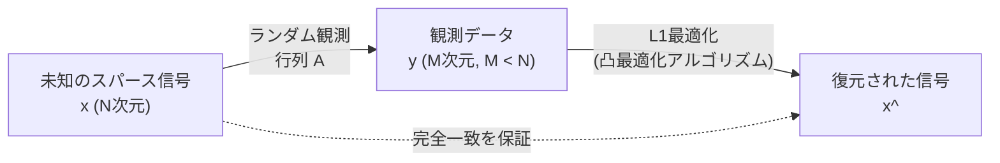

# 圧縮センシング（Compressed Sensing）とは何か？

現代のデータ科学や信号処理において、最も革命的なパラダイムシフトの一つが「圧縮センシング（Compressed Sensing / Compressive Sensing）」です。従来、音声や画像、電磁波などのアナログ信号をデジタルデータとしてコンピュータに取り込む際、私たちは「ナイキスト・シャノンのサンプリング定理」という絶対的な法則に従ってきました。しかし、圧縮センシングはこの常識を覆し、「信号が特定の条件（スパース性）を満たしていれば、サンプリング定理が要求するよりもはるかに少ない観測データから、元の信号を完全に復元できる」という驚くべき数学的保証を与えます。

この記事では、サンプリング定理の基礎から始まり、スパース性の数学的定義、$L_1$最適化問題への緩和、そしてエマニュエル・キャンデス（Emmanuel Candès）やテレンス・タオ（Terence Tao）らによる理論的ブレイクスルーの核心を数式を交えて深く解説します。さらに、MRIの高速化やブラックホール画像構築といった応用事例、Pythonを用いた具体的な実装コードまでを網羅し、圧縮センシングの全貌を明らかにします。

## 1. ナイキスト・シャノンのサンプリング定理とその限界

### サンプリング定理の基礎
20世紀の中葉、クロード・シャノン（Claude Shannon）とハリー・ナイキスト（Harry Nyquist）によって確立された情報理論の基礎に「サンプリング定理」があります。この定理は、連続的なアナログ信号を離散的なデジタル信号に変換する際の条件を以下のように定めています。

> **ナイキスト・シャノンのサンプリング定理**
> 帯域幅が $f_{\max}$ に制限された信号を完全に再構築するためには、少なくとも $2f_{\max}$ のサンプリング周波数（ナイキストレート）で信号をサンプリングしなければならない。

例えば、人間の耳に聞こえる可聴域の上限は約 20 kHz です。したがって、音楽CDではその2倍以上の 44.1 kHz でサンプリングが行われています。数式で表すと、連続信号 $x(t)$ がフーリエ変換 $X(f)$ を持ち、$|f| > f_{\max}$ で $X(f) = 0$ となる場合、$x(t)$ は以下のシンク関数（sinc関数）を用いた補間公式によって完全に復元されます。

$$ x(t) = \sum_{n=-\infty}^{\infty} x\left(\frac{n}{2f_{\max}}\right) \operatorname{sinc}\left(2f_{\max}t - n\right) $$

### データ爆発と定理の限界
サンプリング定理は非常に強力であり、現代のデジタル通信の礎となっています。しかし、技術の進歩に伴い、センサーが捉える情報量は爆発的に増加しました。高解像度の医療画像（MRIやCT）、天文学の電波望遠鏡アレイ、超広帯域のレーダーシステムなどでは、ナイキストレートに従ってサンプリングを行うと、観測しなければならないデータ量が膨大になりすぎます。

結果として、以下のような問題が生じます：
1. **スキャン時間の増大**: 例えばMRIでは、データを集めるのに長い時間がかかり、患者に肉体的負担を強いる。
2. **ハードウェアの限界**: 超高周波信号をサンプリングするためのA/Dコンバータの製造が技術的に困難、あるいは極めて高価になる。
3. **データストレージと通信の圧迫**: 大量のサンプリングデータを保存・送信するためのコストが膨れ上がる。

従来のパラダイムは「大量にサンプリングし、その後ソフトウェアで圧縮（JPEGやMP3など）して不要なデータを捨てる」というものでした。しかし、「最終的に捨てるのであれば、最初から必要な情報だけを直接センシング（取得）できないか？」という疑問が生まれます。これを可能にしたのが圧縮センシングです。

## 2. スパース性（Sparsity）の数学的定義

圧縮センシングが成立するための絶対条件が<strong>スパース性（Sparsity、疎性）</strong>です。スパース性とは、「信号をある適切な基底（表現方法）で変換したとき、その成分のほとんどがゼロ（またはゼロに非常に近い値）になる」という性質を指します。

### スパースベクトルの定式化
長さ $N$ の離散信号（ベクトル） $\mathbf{x} \in \mathbb{R}^N$ を考えます。この信号が、ある直交基底行列 $\mathbf{\Psi} \in \mathbb{R}^{N \times N}$ （例えば、フーリエ変換行列やウェーブレット変換行列）を用いて、次のように表現できるとします。

$$ \mathbf{x} = \mathbf{\Psi} \mathbf{s} $$

ここで、$\mathbf{s} \in \mathbb{R}^N$ は基底 $\mathbf{\Psi}$ 上での係数ベクトルです。
このベクトル $\mathbf{s}$ のうち、非ゼロの要素数が $K$ 個であるとき（$K \ll N$）、$\mathbf{x}$ は **$K$-スパース（$K$-sparse）** であると言います。数学的には、$L_0$ ノルム（非ゼロ要素の数を数える関数）を用いて次のように定義されます。

$$ \|\mathbf{s}\|_0 = K $$

### 実世界におけるスパース性
驚くべきことに、自然界に存在する多くの信号は、適切な基底を選ぶことでスパースになります。
- **画像**: 自然画像はピクセル空間ではスパースではありませんが、ウェーブレット変換や離散コサイン変換（DCT）を行うと、ほとんどの高周波成分がゼロに近づき、スパースになります（これがJPEG圧縮の原理です）。
- **音声**: 音声信号は時間領域では連続していますが、周波数領域（フーリエ変換後）では少数の主要な周波数成分（基本周波数と倍音）のみが大きな値を持ちます。

圧縮センシングは、この「信号に内在する冗長性」を利用して、サンプリングの段階でデータ圧縮を同時に行ってしまう技術です。

## 3. 圧縮センシングの定式化と観測行列

信号がスパースであることを前提としたとき、どのようにして少ないデータから信号を復元するのでしょうか。
未知の信号 $\mathbf{x} \in \mathbb{R}^N$ に対し、$M$ 回の線形観測を行うとします（$M < N$）。観測プロセスは、観測行列 $\mathbf{\Phi} \in \mathbb{R}^{M \times N}$ を用いて次のように表されます。

$$ \mathbf{y} = \mathbf{\Phi} \mathbf{x} = \mathbf{\Phi} \mathbf{\Psi} \mathbf{s} = \mathbf{A} \mathbf{s} $$

ここで、
- $\mathbf{y} \in \mathbb{R}^M$: 観測データベクトル
- $\mathbf{A} = \mathbf{\Phi} \mathbf{\Psi} \in \mathbb{R}^{M \times N}$: センシング行列

我々の目標は、与えられた観測データ $\mathbf{y}$ と行列 $\mathbf{A}$ から、未知の係数ベクトル $\mathbf{s}$（そして最終的に $\mathbf{x}$）を復元することです。

### 劣決定系の問題
しかし、ここで数学的な壁に直面します。$M < N$（方程式の数より未知数の数が多い）であるため、この連立方程式 $\mathbf{y} = \mathbf{A} \mathbf{s}$ は**劣決定系（underdetermined system）**となり、解が無数に存在してしまいます。通常の線形代数では一意な解を求めることは不可能です。

ここで「$\mathbf{s}$ はスパースである（非ゼロ成分が極めて少ない）」という事前知識を活用します。無数にある解の候補の中から、最もスパースな（非ゼロ成分が最も少ない）解を探し出せば、それが真の信号である可能性が高いはずです。これを最適化問題として定式化すると以下のようになります。

$$ (P_0) \quad \min_{\mathbf{s} \in \mathbb{R}^N} \|\mathbf{s}\|_0 \quad \text{subject to} \quad \mathbf{y} = \mathbf{A} \mathbf{s} $$

### $L_0$ 最適化の困難さ
理想的には上記の $(P_0)$ 問題を解けばよいのですが、数学的に $\|\mathbf{s}\|_0$ の最小化問題は **NP困難（NP-hard）** であることが知られています。非ゼロ成分の組み合わせを総当たりで調べる必要があり、次元 $N$ が大きくなると現代のスーパーコンピュータをもってしても宇宙の寿命以上の時間がかかってしまいます。

## 4. $L_1$ 最適化問題への緩和：キャンデスとタオのブレイクスルー

圧縮センシングが実用的な技術として爆発的に普及した理由は、この解けない $L_0$ 最適化問題を、計算可能な **$L_1$ 最適化問題** に置き換えても、一定の条件の下では**全く同じ正解に辿り着ける**という驚異的な数学的証明が与えられたからです。

2004年から2006年にかけて、エマニュエル・キャンデス（Emmanuel Candès）、テレンス・タオ（Terence Tao）、デイヴィッド・ドノホ（David Donoho）らは、この理論の強固な基盤を築きました。

### $L_1$ ノルム最小化
$L_0$ ノルムの代わりに、ベクトルの各要素の絶対値の和である $L_1$ ノルムを使用します。

$$ \|\mathbf{s}\|_1 = \sum_{i=1}^N |s_i| $$

これにより、問題は次のように緩和（relaxation）されます。

$$ (P_1) \quad \min_{\mathbf{s} \in \mathbb{R}^N} \|\mathbf{s}\|_1 \quad \text{subject to} \quad \mathbf{y} = \mathbf{A} \mathbf{s} $$

$L_1$ 最小化問題は凸最適化問題の一種であり、線形計画法（Linear Programming）などの既存の高効率なアルゴリズムを用いて、多項式時間で厳密解を計算することができます。

### なぜ $L_1$ なのか？（幾何学的直観）
なぜ $L_2$ ノルム（最小二乗法）ではなく、$L_1$ ノルムなのでしょうか。これは幾何学的に理解することができます。
制約条件 $\mathbf{y} = \mathbf{A}\mathbf{s}$ は、高次元空間内の超平面を形成します。ノルムの最小化とは、原点を中心とした等高面（ボール）を膨らませていき、最初にこの超平面と接する点を見つける操作に相当します。

- **$L_2$ ボール（$\|\mathbf{s}\|_2 \le R$）**: 形状は滑らかな球体です。超平面と接する点は、ほとんどの場合、すべての座標軸から離れた場所になり、結果として得られる解は要素がすべて非ゼロの「密（dense）」なベクトルになります。
- **$L_1$ ボール（$\|\mathbf{s}\|_1 \le R$）**: 形状は多面体（ひし形、八面体など）であり、多くの「角（頂点）」を持ちます。この角は座標軸上に位置しています。超平面を押し当てたとき、高い確率でこの「角」の部分で接することになります。角で接するということは、他の座標軸の値がゼロになることを意味し、結果としてスパースな解が得られるのです。

### RIP（Restricted Isometry Property: 制限等長性）
キャンデスとタオは、$L_1$ 最小化が $L_0$ 最小化と一致するための十分条件として **RIP（制限等長性）** という概念を導入しました。
センシング行列 $\mathbf{A}$ が次数 $K$ のRIPを満たすとは、任意の $K$-スパースベクトル $\mathbf{s}$ に対して、以下の不等式が成り立つような小さな定数 $\delta_K \in (0,1)$ が存在することです。

$$ (1 - \delta_K) \|\mathbf{s}\|_2^2 \le \|\mathbf{A}\mathbf{s}\|_2^2 \le (1 + \delta_K) \|\mathbf{s}\|_2^2 $$

直感的には、「行列 $\mathbf{A}$ が、任意のスパースベクトルの長さを（ほぼ）変えずに保存する」という性質です。キャンデスとタオは、$\mathbf{A}$ が特定のRIP条件を満たせば、ノイズのない状況下で $(P_1)$ の解が $(P_0)$ の解と完全に一致することを見事に証明しました。

さらに実用的な観点として、観測行列 $\mathbf{\Phi}$ として<strong>ランダム行列（ガウス分布やベルヌーイ分布に従う乱数行列）</strong>を用いると、高い確率でRIPを満たすことが示されました。つまり、「ランダムに観測する」ことが、圧縮センシングにおいて最も効率的かつ普遍的なサンプリング戦略となるのです。

必要な観測回数 $M$ は、信号の長さ $N$ とスパース度 $K$ に対して次のようなオーダーで十分であることが証明されています。

$$ M \ge C \cdot K \log\left(\frac{N}{K}\right) $$
（$C$ は定数）

これは、サンプリング定理が要求する $N$ 回の観測に比べて、はるかに少ない回数（$K$ に依存）で済むことを意味しています。

## 5. 圧縮センシングの応用事例

圧縮センシングの理論は、情報工学や物理学のあらゆる分野に革命をもたらしました。

### 1. MRI（核磁気共鳴画像法）の高速化
最も成功した商用応用例の一つがMRIです。MRIは強力な磁場を用いて人体の断層画像を取得しますが、データ（k空間と呼ばれる周波数領域データ）の収集には物理的な限界があり、時間がかかります。
小児患者や心臓のように動く臓器の撮影において、長時間の静止は困難です。圧縮センシングをMRIに応用することで、サンプリングするk空間のデータをランダムに間引きし、スキャン時間を従来の数分の一に短縮することに成功しました。現在では、SiemensやGEなどの主要な医療機器メーカーが、圧縮センシング技術を標準搭載したMRIを販売しています。

### 2. ブラックホールの撮像（イベント・ホライズン・テレスコープ）
2019年、国際研究チーム「イベント・ホライズン・テレスコープ（EHT）」が、人類史上初となるブラックホールシャドウの画像撮影に成功しました。地球サイズの巨大な仮想望遠鏡を構築するために、世界中に点在する電波望遠鏡のデータを統合（超長基線電波干渉計：VLBI）しましたが、地球上の望遠鏡の配置には限界があり、観測データには膨大な「隙間（欠損データ）」が存在しました。
このスカスカのデータからブラックホールの画像を復元するために、CHIRP（Continuous High-resolution Image Reconstruction using Patch priors）と呼ばれるアルゴリズムが開発されました。これも、宇宙の画像が持つスパース性や構造的な事前知識を活用した、圧縮センシングの応用と言えます。

### 3. 単一ピクセルカメラ（Single-Pixel Camera）
ライス大学（Rice University）の研究チームは、受光素子（ピクセル）をたった1つしか持たないカメラを開発しました。
DMD（デジタル・マイクロミラー・デバイス）を用いて、対象物の光をランダムなパターンで反射させ、その総和を1つのセンサーで測定します。これを数千回繰り返すことで、数百万ピクセルの画像を再構成します。赤外線やテラヘルツ波など、多ピクセルセンサーの製造が極めて高価な波長帯での画像化において、この技術は非常に有用です。

## 6. Pythonによる圧縮センシングの実装例

理論だけでは実感が湧きにくいため、Pythonを使って実際に圧縮センシングのシミュレーションを行ってみましょう。
ここでは、1次元のスパース信号を生成し、少数のランダム観測から $L_1$ 最適化を用いて元の信号を復元します。最適化には `cvxpy` ライブラリを使用します。

### 必要なライブラリのインストール
```bash
pip install numpy matplotlib cvxpy
```

### 実装コード

```python
import numpy as np
import matplotlib.pyplot as plt
import cvxpy as cp

# 乱数シードの固定
np.random.seed(42)

# --- 1. 問題の設定 ---
N = 1000  # 信号の次元（本来サンプリングすべき数）
K = 50    # スパース度（非ゼロ要素の数）
M = 250   # 観測回数（Nのわずか25%）

# --- 2. スパースな真の信号の生成 ---
# 真の信号 x_true を作成（初期値は全てゼロ）
x_true = np.zeros(N)
# ランダムにK個のインデックスを選び、非ゼロの値を設定（ガウス分布）
nonzero_indices = np.random.choice(N, K, replace=False)
x_true[nonzero_indices] = np.random.randn(K)

# --- 3. 観測プロセスのシミュレーション ---
# ランダムなガウス観測行列 A (M x N) を生成
A = np.random.randn(M, N)
# 列ごとに正規化（ノルムを1にする）
A = A / np.linalg.norm(A, axis=0)

# 観測データ y = A * x_true
y = A @ x_true

# --- 4. 圧縮センシングによる信号復元 (L1最適化) ---
# cvxpyを使用して最適化問題を定義
x_reconstruct = cp.Variable(N)
# 目的関数: L1ノルムの最小化
objective = cp.Minimize(cp.norm(x_reconstruct, 1))
# 制約条件: y = A * x (観測データとの一致)
constraints = [A @ x_reconstruct == y]

# 問題を定義して解く
prob = cp.Problem(objective, constraints)
print("最適化計算を実行中...")
prob.solve(solver=cp.ECOS)

# 復元された信号
x_rec = x_reconstruct.value

# --- 5. 結果の可視化 ---
plt.figure(figsize=(12, 6))

plt.subplot(2, 1, 1)
plt.plot(x_true, label='True Signal', alpha=0.7)
plt.title(f'Original Sparse Signal (N={N}, K={K})')
plt.legend()
plt.grid(True)

plt.subplot(2, 1, 2)
plt.plot(x_rec, color='red', label='Reconstructed Signal', alpha=0.7)
plt.title(f'Reconstructed via L1 Minimization (M={M} measurements)')
plt.legend()
plt.grid(True)

plt.tight_layout()
plt.show()

# 復元精度の確認
error = np.linalg.norm(x_true - x_rec)
print(f"復元誤差 (L2 norm): {error:.6e}")
```

### コードの解説
1. **信号の生成**: 次元 $N=1000$ のうち、$K=50$ 箇所だけが値を持つ（残りはゼロ）スパースベクトル `x_true` を作成します。
2. **観測**: サンプリング定理に従えば1000回の測定が必要ですが、ここではわずか $M=250$ 回（25%）のランダムな観測行列 `A` を用いて、データ `y` を取得します。
3. **復元**: 観測データ `y` と行列 `A` だけを入力とし、`cvxpy` を用いて「$\mathbf{y} = \mathbf{A}\mathbf{x}$ を満たす中で、最も $L_1$ ノルムが小さい $\mathbf{x}$」を探し出します。
4. **結果**: 計算が完了すると、復元誤差は `1e-9` 以下の極めて小さな値となり、わずか25%の観測データから真の信号が**完全（Exact）に復元**されていることが確認できます。



## 7. まとめと今後の展望

圧縮センシングは、信号処理の歴史においてパラダイムを根本から変えるものでした。「大量に測ってから捨てる」のではなく、「最初から必要な分だけを賢く測る」というアプローチは、数学の深遠な理論（凸最適化、[ランダム行列理論](/p/random-matrix-theory/)、高次元幾何学）に支えられています。

現在では、深層学習（ディープラーニング）と圧縮センシングを組み合わせた研究が盛んに行われています。従来の $L_1$ 最適化アルゴリズムの代わりに、ニューラルネットワークを用いてより高速かつ高精度に逆問題を解くアプローチ（Deep Unfolding / Algorithm Unrolling）が主流になりつつあります。これにより、観測行列の設計自体もデータ駆動で学習することが可能になり、MRIのさらなる高速化や、ノイズに強い画像再構成などへの応用が進んでいます。

少ない情報から全体を正確に見通す圧縮センシングの数学的魔法は、今後も自動運転、IoTセンサーネットワーク、宇宙探査など、データ爆発が課題となるあらゆる分野で、私たちに新しい「目」を提供し続けることでしょう。
