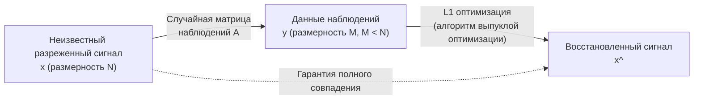

# Что такое сжатое зондирование (Compressed Sensing)?

Сжатое зондирование (Compressed Sensing / Compressive Sensing) является одним из самых революционных парадигмальных сдвигов в современной науке о данных и обработке сигналов. Традиционно, когда мы оцифровываем аналоговые сигналы, такие как звук, изображения или электромагнитные волны, мы следуем абсолютному закону — «теореме Котельникова — Шеннона — Найквиста». Однако сжатое зондирование переворачивает этот здравый смысл и дает удивительную математическую гарантию: «если сигнал удовлетворяет определенному условию (разреженности), исходный сигнал может быть полностью восстановлен из гораздо меньшего количества данных наблюдений, чем требует теорема дискретизации».

В этой статье мы подробно и с формулами разберем все, начиная от основ теоремы дискретизации, математического определения разреженности, сведения к задаче $L_1$-оптимизации, и заканчивая сутью теоретического прорыва Эммануэля Кандеса (Emmanuel Candès) и Теренса Тао (Terence Tao). Кроме того, мы охватим всю картину сжатого зондирования, включая такие примеры применения, как ускорение МРТ и построение изображений черных дыр, а также конкретный код реализации на Python.

## 1. Теорема дискретизации Найквиста-Шеннона и ее пределы

### Основы теоремы дискретизации
В середине 20-го века Клод Шеннон (Claude Shannon) и Гарри Найквист (Harry Nyquist) заложили основы теории информации, одной из которых является «теорема дискретизации» (теорема Котельникова). Эта теорема определяет условия преобразования непрерывного аналогового сигнала в дискретный цифровой сигнал следующим образом:

> **Теорема Найквиста-Шеннона-Котельникова**
> Для полного восстановления сигнала, полоса частот которого ограничена $f_{\max}$, сигнал должен быть дискретизирован с частотой дискретизации (частотой Найквиста) не менее $2f_{\max}$.

Например, верхний предел слышимого для человеческого уха диапазона составляет около 20 кГц. Поэтому на музыкальных компакт-дисках дискретизация осуществляется с более чем вдвое большей частотой — 44,1 кГц. В виде формулы, если непрерывный сигнал $x(t)$ имеет преобразование Фурье $X(f)$ и $X(f) = 0$ при $|f| > f_{\max}$, то $x(t)$ полностью восстанавливается формулой интерполяции с использованием sinc-функции:

$$ x(t) = \sum_{n=-\infty}^{\infty} x\left(\frac{n}{2f_{\max}}\right) \operatorname{sinc}\left(2f_{\max}t - n\right) $$

### Информационный взрыв и пределы теоремы
Теорема дискретизации очень сильна и является краеугольным камнем современной цифровой связи. Однако с развитием технологий объем информации, улавливаемой датчиками, резко возрос. В медицинских изображениях высокого разрешения (МРТ и КТ), массивах радиотелескопов в астрономии и сверхширокополосных радиолокационных системах, выборка в соответствии с частотой Найквиста привела бы к огромному объему данных, которые необходимо было бы наблюдать.

В результате возникают следующие проблемы:
1. **Увеличение времени сканирования**: Например, в МРТ сбор данных занимает много времени, что возлагает физическую нагрузку на пациента.
2. **Аппаратные ограничения**: Производство АЦП для выборки сверхвысокочастотных сигналов становится технически сложным или чрезвычайно дорогим.
3. **Нагрузка на хранение и передачу данных**: Затраты на хранение и передачу больших объемов данных выборки сильно возрастают.

Традиционная парадигма заключалась в том, чтобы «сделать большое количество выборок, а затем сжать их программно (например, JPEG или MP3), отбросив ненужные данные». Однако возникает вопрос: «Если мы все равно собираемся отбросить данные в конце, нельзя ли с самого начала зондировать (собирать) только нужную информацию?». Именно это и сделало возможным сжатое зондирование.

## 2. Математическое определение разреженности (Sparsity)

Абсолютным условием для работы сжатого зондирования является **разреженность (Sparsity)**. Разреженность означает свойство, при котором «когда сигнал преобразуется в определенный подходящий базис (способ представления), большинство его компонент становятся нулевыми (или очень близкими к нулю)».

### Формализация разреженного вектора
Рассмотрим дискретный сигнал (вектор) $\mathbf{x} \in \mathbb{R}^N$ длины $N$. Предположим, что этот сигнал может быть представлен с использованием некоторой матрицы ортогонального базиса $\mathbf{\Psi} \in \mathbb{R}^{N \times N}$ (например, матрицы преобразования Фурье или вейвлет-преобразования) следующим образом:

$$ \mathbf{x} = \mathbf{\Psi} \mathbf{s} $$

Здесь $\mathbf{s} \in \mathbb{R}^N$ — вектор коэффициентов в базисе $\mathbf{\Psi}$.
Если количество ненулевых элементов этого вектора $\mathbf{s}$ равно $K$ (при $K \ll N$), то говорят, что $\mathbf{x}$ является **$K$-разреженным ($K$-sparse)**. Математически это определяется с использованием $L_0$-нормы (функции, подсчитывающей количество ненулевых элементов):

$$ \|\mathbf{s}\|_0 = K $$

### Разреженность в реальном мире
Удивительно, но многие сигналы, существующие в природе, становятся разреженными при выборе подходящего базиса.
- **Изображения**: Естественные изображения не разрежены в пространстве пикселей, но при применении вейвлет-преобразования или дискретного косинусного преобразования (DCT) большинство высокочастотных компонент приближаются к нулю, что делает их разреженными (это принцип сжатия JPEG).
- **Звук**: Звуковые сигналы непрерывны во временной области, но в частотной области (после преобразования Фурье) большие значения имеют лишь несколько основных частотных компонент (основная частота и обертоны).

Сжатое зондирование — это технология, которая использует эту «избыточность, присущую сигналу», для одновременного сжатия данных на этапе выборки.

## 3. Формализация сжатого зондирования и матрица наблюдений

Предполагая, что сигнал разрежен, как нам восстановить сигнал из небольшого количества данных?
Предположим, мы проводим $M$ линейных наблюдений ($M < N$) для неизвестного сигнала $\mathbf{x} \in \mathbb{R}^N$. Процесс наблюдения выражается с помощью матрицы наблюдений $\mathbf{\Phi} \in \mathbb{R}^{M \times N}$ следующим образом:

$$ \mathbf{y} = \mathbf{\Phi} \mathbf{x} = \mathbf{\Phi} \mathbf{\Psi} \mathbf{s} = \mathbf{A} \mathbf{s} $$

Где:
- $\mathbf{y} \in \mathbb{R}^M$: Вектор данных наблюдений
- $\mathbf{A} = \mathbf{\Phi} \mathbf{\Psi} \in \mathbb{R}^{M \times N}$: Матрица зондирования

Наша цель — восстановить неизвестный вектор коэффициентов $\mathbf{s}$ (и, в конечном итоге, $\mathbf{x}$) по заданным данным наблюдений $\mathbf{y}$ и матрице $\mathbf{A}$.

### Проблема недоопределенной системы
Однако здесь мы сталкиваемся с математической стеной. Поскольку $M < N$ (неизвестных больше, чем уравнений), эта система линейных уравнений $\mathbf{y} = \mathbf{A} \mathbf{s}$ становится **недоопределенной (underdetermined system)**, имеющей бесконечное множество решений. Найти единственное решение с помощью обычной линейной алгебры невозможно.

Здесь мы используем априорные знания о том, что «$\mathbf{s}$ является разреженным (имеет крайне мало ненулевых компонент)». Если среди бесконечного числа кандидатов найти самое разреженное решение (с наименьшим числом ненулевых компонент), высока вероятность того, что это и есть истинный сигнал. При формулировании этого в виде задачи оптимизации, мы получаем следующее:

$$ (P_0) \quad \min_{\mathbf{s} \in \mathbb{R}^N} \|\mathbf{s}\|_0 \quad \text{при условии} \quad \mathbf{y} = \mathbf{A} \mathbf{s} $$

### Сложность $L_0$-оптимизации
В идеале мы хотели бы решить описанную выше задачу $(P_0)$, но математически известно, что задача минимизации $\|\mathbf{s}\|_0$ является **NP-трудной (NP-hard)**. Потребовался бы полный перебор всех комбинаций ненулевых компонент, и при больших значениях размерности $N$ на это ушло бы время, превышающее возраст Вселенной, даже с современными суперкомпьютерами.

## 4. Сведение к задаче $L_1$-оптимизации: прорыв Кандеса и Тао

Причина, по которой сжатое зондирование стало взрывной и практически применимой технологией, заключается в том, что было предоставлено поразительное математическое доказательство: если мы заменим эту неразрешимую задачу $L_0$-оптимизации на вычислимую **задачу $L_1$-оптимизации**, мы можем **получить абсолютно тот же правильный ответ** при определенных условиях.

В период с 2004 по 2006 год Эммануэль Кандес (Emmanuel Candès), Теренс Тао (Terence Tao) и Дэвид Донохо (David Donoho) заложили прочный фундамент этой теории.

### Минимизация $L_1$-нормы
Вместо $L_0$-нормы используется $L_1$-норма, которая является суммой абсолютных значений каждого элемента вектора.

$$ \|\mathbf{s}\|_1 = \sum_{i=1}^N |s_i| $$

В результате задача смягчается (relaxation) следующим образом:

$$ (P_1) \quad \min_{\mathbf{s} \in \mathbb{R}^N} \|\mathbf{s}\|_1 \quad \text{при условии} \quad \mathbf{y} = \mathbf{A} \mathbf{s} $$

Задача $L_1$-минимизации является типом задачи выпуклой оптимизации, и точное решение можно вычислить за полиномиальное время, используя существующие высокоэффективные алгоритмы, такие как линейное программирование (Linear Programming).

### Почему $L_1$? (Геометрическая интуиция)
Почему мы используем $L_1$-норму, а не $L_2$-норму (метод наименьших квадратов)? Это можно понять геометрически.
Условие $\mathbf{y} = \mathbf{A}\mathbf{s}$ образует гиперплоскость в многомерном пространстве. Минимизация нормы эквивалентна надуванию контурной поверхности (шара) с центром в начале координат до тех пор, пока она не коснется этой гиперплоскости.

- **$L_2$-шар ($\|\mathbf{s}\|_2 \le R$)**: Форма представляет собой гладкую сферу. Точка соприкосновения с гиперплоскостью в большинстве случаев будет находиться вдали от всех координатных осей, в результате чего полученное решение будет «плотным (dense)» вектором, в котором все элементы ненулевые.
- **$L_1$-шар ($\|\mathbf{s}\|_1 \le R$)**: Форма представляет собой многогранник (ромб, октаэдр и т.д.) и имеет множество «углов (вершин)». Эти углы расположены на координатных осях. Когда гиперплоскость прижимается к нему, существует высокая вероятность того, что она коснется именно в этой «угловой» части. Касание угла означает, что значения на других координатных осях равны нулю, в результате чего получается разреженное решение.

### RIP (Restricted Isometry Property: Свойство ограниченной изометрии)
Кандес и Тао ввели концепцию **RIP (свойство ограниченной изометрии)** как достаточное условие для совпадения $L_1$-минимизации с $L_0$-минимизацией.
Матрица зондирования $\mathbf{A}$ удовлетворяет RIP порядка $K$, если для любого $K$-разреженного вектора $\mathbf{s}$ существует такая небольшая константа $\delta_K \in (0,1)$, что выполняется следующее неравенство:

$$ (1 - \delta_K) \|\mathbf{s}\|_2^2 \le \|\mathbf{A}\mathbf{s}\|_2^2 \le (1 + \delta_K) \|\mathbf{s}\|_2^2 $$

Интуитивно это свойство означает, что «матрица $\mathbf{A}$ сохраняет (почти) без изменения длину любого разреженного вектора». Кандес и Тао блестяще доказали, что если $\mathbf{A}$ удовлетворяет определенному условию RIP, то при отсутствии шума решение $(P_1)$ будет полностью совпадать с решением $(P_0)$.

Более того, с практической точки зрения было показано, что если в качестве матрицы наблюдений $\mathbf{\Phi}$ использовать **случайную матрицу (матрицу случайных чисел, подчиняющихся распределению Гаусса или Бернулли)**, то она будет удовлетворять RIP с высокой вероятностью. Другими словами, «случайное наблюдение» является наиболее эффективной и универсальной стратегией выборки в сжатом зондировании.

Было доказано, что необходимое количество наблюдений $M$ должно быть порядка следующего выражения относительно длины сигнала $N$ и степени разреженности $K$:

$$ M \ge C \cdot K \log\left(\frac{N}{K}\right) $$
(где $C$ - константа)

Это означает, что требуется гораздо меньше наблюдений (зависит от $K$), по сравнению с $N$ наблюдениями, требуемыми теоремой дискретизации.

## 5. Примеры применения сжатого зондирования

Теория сжатого зондирования произвела революцию в различных областях информатики и физики.

### 1. Ускорение МРТ (магнитно-резонансной томографии)
Одним из наиболее успешных коммерческих применений является МРТ. МРТ использует сильные магнитные поля для получения томографических изображений человеческого тела, но существуют физические ограничения на сбор данных (данных частотной области, называемых k-пространством), что требует времени.
Трудно сохранять неподвижность в течение длительного времени при визуализации педиатрических пациентов или движущихся органов, таких как сердце. Применяя сжатое зондирование в МРТ, данные k-пространства для выборки случайным образом прореживаются, что успешно сокращает время сканирования до доли от прежнего времени. Сегодня крупные производители медицинского оборудования, такие как Siemens и GE, продают аппараты МРТ со стандартной технологией сжатого зондирования.

### 2. Получение изображений черных дыр (Телескоп горизонта событий)
В 2019 году международная исследовательская группа «Телескоп горизонта событий (EHT)» преуспела в получении первого в истории человечества изображения тени черной дыры. Чтобы построить виртуальный телескоп размером с Землю, они объединили данные радиотелескопов по всему миру (радиоинтерферометрия со сверхдлинными базами: РСДБ), но расположение телескопов на Земле ограничено, что привело к огромным «пробелам (пропущенным данным)» в данных наблюдений.
Для восстановления изображения черной дыры из этих разрозненных данных был разработан алгоритм под названием CHIRP (Continuous High-resolution Image Reconstruction using Patch priors). Это также можно назвать применением сжатого зондирования, использующим разреженность и структурные априорные знания изображений космоса.

### 3. Однопиксельная камера (Single-Pixel Camera)
Исследовательская группа из Университета Райса (Rice University) разработала камеру всего с одним светоприемным элементом (пикселем).
Используя DMD (цифровое микрозеркальное устройство), свет от объекта отражается случайными узорами, и общая сумма измеряется одним датчиком. Повторив это тысячи раз, можно восстановить изображение в несколько миллионов пикселей. Эта технология очень полезна для визуализации в диапазонах длин волн, таких как инфракрасное излучение и терагерцовые волны, где производство многопиксельных датчиков чрезвычайно дорого.

## 6. Пример реализации сжатого зондирования на Python

Поскольку одну лишь теорию трудно прочувствовать, давайте используем Python для фактического моделирования сжатого зондирования.
Здесь мы сгенерируем одномерный разреженный сигнал и восстановим исходный сигнал из небольшого числа случайных наблюдений с использованием $L_1$-оптимизации. Для оптимизации будем использовать библиотеку `cvxpy`.

### Установка необходимых библиотек
```bash
pip install numpy matplotlib cvxpy
```

### Код реализации

```python
import numpy as np
import matplotlib.pyplot as plt
import cvxpy as cp

# Фиксация seed для генератора случайных чисел
np.random.seed(42)

# --- 1. Постановка задачи ---
N = 1000  # Размерность сигнала (число выборок по теореме Котельникова)
K = 50    # Степень разреженности (количество ненулевых элементов)
M = 250   # Количество наблюдений (всего 25% от N)

# --- 2. Генерация истинного разреженного сигнала ---
# Создаем истинный сигнал x_true (изначально все элементы нулевые)
x_true = np.zeros(N)
# Случайным образом выбираем K индексов и задаем им ненулевые значения (гауссово распределение)
nonzero_indices = np.random.choice(N, K, replace=False)
x_true[nonzero_indices] = np.random.randn(K)

# --- 3. Симуляция процесса наблюдения ---
# Генерируем случайную гауссову матрицу наблюдений A (M x N)
A = np.random.randn(M, N)
# Нормализуем по столбцам (норма равна 1)
A = A / np.linalg.norm(A, axis=0)

# Данные наблюдений y = A * x_true
y = A @ x_true

# --- 4. Восстановление сигнала с помощью сжатого зондирования (L1 оптимизация) ---
# Определяем задачу оптимизации с использованием cvxpy
x_reconstruct = cp.Variable(N)
# Целевая функция: минимизация L1 нормы
objective = cp.Minimize(cp.norm(x_reconstruct, 1))
# Ограничения: y = A * x (соответствие данным наблюдений)
constraints = [A @ x_reconstruct == y]

# Определяем и решаем задачу
prob = cp.Problem(objective, constraints)
print("Выполняется вычисление оптимизации...")
prob.solve(solver=cp.ECOS)

# Восстановленный сигнал
x_rec = x_reconstruct.value

# --- 5. Визуализация результатов ---
plt.figure(figsize=(12, 6))

plt.subplot(2, 1, 1)
plt.plot(x_true, label='True Signal', alpha=0.7)
plt.title(f'Original Sparse Signal (N={N}, K={K})')
plt.legend()
plt.grid(True)

plt.subplot(2, 1, 2)
plt.plot(x_rec, color='red', label='Reconstructed Signal', alpha=0.7)
plt.title(f'Reconstructed via L1 Minimization (M={M} measurements)')
plt.legend()
plt.grid(True)

plt.tight_layout()
plt.show()

# Проверка точности восстановления
error = np.linalg.norm(x_true - x_rec)
print(f"Ошибка восстановления (L2 norm): {error:.6e}")
```

### Пояснение к коду
1. **Генерация сигнала**: Создается разреженный вектор `x_true` размерности $N=1000$, в котором только $K=50$ позиций имеют значения (остальные нулевые).
2. **Наблюдение**: Согласно теореме дискретизации потребовалось бы 1000 измерений, но здесь мы используем случайную матрицу наблюдений `A` всего для $M=250$ наблюдений (25%) для получения данных `y`.
3. **Восстановление**: Принимая в качестве входных данных только данные наблюдений `y` и матрицу `A`, мы используем `cvxpy`, чтобы найти «такой вектор $\mathbf{x}$, удовлетворяющий условию $\mathbf{y} = \mathbf{A}\mathbf{x}$, для которого $L_1$-норма минимальна».
4. **Результаты**: После завершения вычислений ошибка восстановления оказывается чрезвычайно мала, менее `1e-9`, подтверждая, что истинный сигнал был **идеально (Exact) восстановлен** всего по 25% данных наблюдений.



## 7. Заключение и перспективы

Сжатое зондирование в корне изменило парадигму в истории обработки сигналов. Подход, заключающийся в том, чтобы «интеллектуально измерять только то, что необходимо с самого начала», вместо того чтобы «много измерять, а затем отбрасывать», опирается на глубокую математическую теорию (выпуклая оптимизация, [теория случайных матриц](/ru/p/random-matrix-theory/), многомерная геометрия).

В настоящее время активно проводятся исследования, объединяющие глубокое обучение (deep learning) и сжатое зондирование. Вместо традиционных алгоритмов $L_1$-оптимизации основным подходом становится использование нейронных сетей для более быстрого и точного решения обратной задачи (Deep Unfolding / Algorithm Unrolling). Это позволяет изучать дизайн самой матрицы наблюдений на основе данных, а также продвигает приложения для дальнейшего ускорения МРТ и надежного к шумам восстановления изображений.

Математическая магия сжатого зондирования, позволяющая точно видеть целое по небольшому количеству информации, будет продолжать предоставлять нам новые «глаза» во всех областях, где взрывной рост данных является проблемой, таких как автономное вождение, сенсорные сети Интернета вещей (IoT) и исследование космоса.
