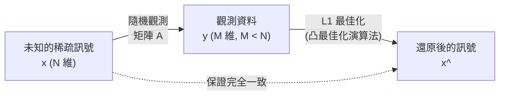

# 什麼是壓縮感測（Compressed Sensing）？

在現代資料科學與訊號處理中，「壓縮感測（Compressed Sensing / Compressive Sensing）」是最具革命性的典範轉移之一。過去，當我們將聲音、影像、電磁波等類比訊號轉換為數位資料輸入電腦時，我們總是遵循「奈奎斯特-香農取樣定理（Nyquist-Shannon sampling theorem）」這項絕對法則。然而，壓縮感測顛覆了這個常識，它提供了驚人的數學保證：「只要訊號滿足特定條件（稀疏性），就能用比取樣定理所要求的少得多的觀測資料，完美還原出原始訊號」。

本文將從取樣定理的基礎開始，深入運用數學公式解說稀疏性的數學定義、$L_1$ 最佳化問題的鬆弛（relaxation），以及 Emmanuel Candès、Terence Tao 等人的理論突破核心。此外，也會介紹 MRI 的加速、黑洞影像重建等應用實例，甚至涵蓋使用 Python 的具體實作程式碼，為您揭開壓縮感測的全貌。

## 1. 奈奎斯特-香農取樣定理及其極限

### 取樣定理的基礎
20 世紀中葉，Claude Shannon 與 Harry Nyquist 確立了資訊理論的基礎「取樣定理」。該定理針對將連續類比訊號轉換為離散數位訊號的條件，作了如下的規範：

> **奈奎斯特-香農取樣定理**
> 為了完美重建頻寬受限於 $f_{\max}$ 的訊號，必須至少以 $2f_{\max}$ 的取樣頻率（奈奎斯特速率）對訊號進行取樣。

例如，人耳能聽到的可聽頻率上限約為 20 kHz。因此，音樂 CD 採用了兩倍以上的 44.1 kHz 進行取樣。若以數學式表示，當連續訊號 $x(t)$ 具備傅立葉轉換 $X(f)$，且在 $|f| > f_{\max}$ 時 $X(f) = 0$ 的情況下，$x(t)$ 可以透過以下使用 sinc 函數的內插公式完美還原：

$$ x(t) = \sum_{n=-\infty}^{\infty} x\left(\frac{n}{2f_{\max}}\right) \operatorname{sinc}\left(2f_{\max}t - n\right) $$

### 資料爆炸與定理的極限
取樣定理非常強大，是現代數位通訊的基石。然而，隨著技術進步，感測器捕捉的資訊量呈爆炸性成長。在高解析度醫學影像（MRI 或 CT）、天文學的電波望遠鏡陣列、超寬頻雷達系統中，如果遵循奈奎斯特速率進行取樣，必須觀測的資料量將變得過於龐大。

結果導致了以下問題：
1. **掃描時間增加**：例如在 MRI 中，收集資料需要耗費大量時間，增加了病患的肉體負擔。
2. **硬體極限**：要製造能對超高頻訊號進行取樣的 A/D 轉換器，在技術上非常困難，或是成本極其高昂。
3. **資料儲存與通訊的壓力**：保存與傳送大量取樣資料的成本暴增。

傳統的典範是「大量取樣，之後再透過軟體壓縮（如 JPEG 或 MP3）捨棄不需要的資料」。但是，「既然最後都要丟棄，難道不能一開始就只直接感測（取得）必要的資訊嗎？」。實現這個想法的就是壓縮感測。

## 2. 稀疏性（Sparsity）的數學定義

壓縮感測成立的絕對條件是**稀疏性（Sparsity）**。稀疏性是指「當訊號使用某種合適的基底（表示方式）進行轉換時，其成分中絕大多數都為零（或極接近零）」的性質。

### 稀疏向量的公式化
考慮長度為 $N$ 的離散訊號（向量） $\mathbf{x} \in \mathbb{R}^N$。假設這個訊號可以使用某個正交基底矩陣 $\mathbf{\Psi} \in \mathbb{R}^{N \times N}$（例如傅立葉轉換矩陣或小波轉換矩陣），以下列方式表示：

$$ \mathbf{x} = \mathbf{\Psi} \mathbf{s} $$

其中，$\mathbf{s} \in \mathbb{R}^N$ 是在基底 $\mathbf{\Psi}$ 上的係數向量。
當這個向量 $\mathbf{s}$ 的非零元素數量為 $K$ 個（$K \ll N$）時，我們稱 $\mathbf{x}$ 為 **$K$-稀疏（$K$-sparse）**。在數學上，會使用 $L_0$ 範數（計算非零元素數量的函數）作如下定義：

$$ \|\mathbf{s}\|_0 = K $$

### 真實世界中的稀疏性
令人驚訝的是，自然界中存在的許多訊號，只要選擇合適的基底就會變得稀疏。
- **影像**：自然影像在像素空間中並不稀疏，但如果進行小波轉換或離散餘弦轉換（DCT），大部分的高頻成分會趨近於零，變得稀疏（這正是 JPEG 壓縮的原理）。
- **聲音**：聲音訊號在時間域中是連續的，但在頻率域（傅立葉轉換後）中，只有少數主要的頻率成分（基頻與泛音）具有較大的數值。

壓縮感測便是利用這種「訊號內在的冗餘性」，在取樣階段同時進行資料壓縮的技術。

## 3. 壓縮感測的公式化與觀測矩陣

在訊號具有稀疏性的前提下，要如何從少量資料中還原訊號呢？
假設對於未知的訊號 $\mathbf{x} \in \mathbb{R}^N$，進行 $M$ 次線性觀測（$M < N$）。觀測過程可以使用觀測矩陣 $\mathbf{\Phi} \in \mathbb{R}^{M \times N}$ 表示如下：

$$ \mathbf{y} = \mathbf{\Phi} \mathbf{x} = \mathbf{\Phi} \mathbf{\Psi} \mathbf{s} = \mathbf{A} \mathbf{s} $$

其中，
- $\mathbf{y} \in \mathbb{R}^M$：觀測資料向量
- $\mathbf{A} = \mathbf{\Phi} \mathbf{\Psi} \in \mathbb{R}^{M \times N}$：感測矩陣

我們的目標是從給定的觀測資料 $\mathbf{y}$ 與矩陣 $\mathbf{A}$ 中，還原出未知的係數向量 $\mathbf{s}$（並最終求得 $\mathbf{x}$）。

### 欠定系統（Underdetermined System）的問題
然而，這裡我們面臨了數學上的障礙。因為 $M < N$（方程式的數量少於未知數的數量），這個聯立方程式 $\mathbf{y} = \mathbf{A} \mathbf{s}$ 成為了**欠定系統（underdetermined system）**，存在無限多組解。在一般的線性代數中，是不可能求出唯一解的。

這時我們就要活用「$\mathbf{s}$ 是稀疏的（非零成分極少）」這項先驗知識。在無限多的候選解中，如果能找出最稀疏（非零成分最少）的解，那麼它有很高的機率就是真實的訊號。將此公式化為最佳化問題，結果如下：

$$ (P_0) \quad \min_{\mathbf{s} \in \mathbb{R}^N} \|\mathbf{s}\|_0 \quad \text{subject to} \quad \mathbf{y} = \mathbf{A} \mathbf{s} $$

### $L_0$ 最佳化的困難度
理想情況下，只要解開上述的 $(P_0)$ 問題即可，但數學上已知 $\|\mathbf{s}\|_0$ 的最小化問題是 **NP 困難（NP-hard）**。必須窮舉檢查非零成分的組合，當維度 $N$ 變大時，即使使用現代的超級電腦，也需要耗費超越宇宙壽命的時間。

## 4. 鬆弛為 $L_1$ 最佳化問題：Candès 與 Tao 的突破

壓縮感測之所以能作為實用技術而爆發性普及，是因為有人提出了驚人的數學證明：只要在特定條件下，將這個無法解開的 $L_0$ 最佳化問題，替換為可計算的 **$L_1$ 最佳化問題**，就能**達到完全相同的正確解答**。

在 2004 年至 2006 年間，Emmanuel Candès、Terence Tao 與 David Donoho 等人為這項理論奠定了堅實的基礎。

### $L_1$ 範數最小化
不使用 $L_0$ 範數，改用向量各元素絕對值總和的 $L_1$ 範數。

$$ \|\mathbf{s}\|_1 = \sum_{i=1}^N |s_i| $$

藉此，問題被鬆弛（relaxation）為以下形式：

$$ (P_1) \quad \min_{\mathbf{s} \in \mathbb{R}^N} \|\mathbf{s}\|_1 \quad \text{subject to} \quad \mathbf{y} = \mathbf{A} \mathbf{s} $$

$L_1$ 最小化問題是凸最佳化問題的一種，可以使用線性規劃（Linear Programming）等現有的高效率演算法，在多項式時間內計算出嚴密解。

### 為什麼是 $L_1$？（幾何學直覺）
為什麼不是使用 $L_2$ 範數（最小平方法），而是 $L_1$ 範數呢？這可以從幾何學上來理解。
限制條件 $\mathbf{y} = \mathbf{A}\mathbf{s}$ 會在高維空間中形成一個超平面（hyperplane）。範數的最小化，相當於將以原點為中心的等高面（球體）不斷膨脹，找出第一個與該超平面相切的點的操作。

- **$L_2$ 球體（$\|\mathbf{s}\|_2 \le R$）**：形狀是平滑的球體。與超平面相切的點，在多數情況下會遠離所有座標軸，得到的解會是一個所有元素皆非零的「稠密（dense）」向量。
- **$L_1$ 球體（$\|\mathbf{s}\|_1 \le R$）**：形狀是多面體（菱形、八面體等），具有許多「角（頂點）」。這些角位於座標軸上。當超平面貼近時，有極高的機率會在這些「角」的部分相切。在角相切意味著其他座標軸的值為零，從而得到稀疏的解。

### RIP（Restricted Isometry Property：受限等距性質）
Candès 與 Tao 為了使 $L_1$ 最小化與 $L_0$ 最小化一致，導入了 **RIP（受限等距性質）** 這個概念作為充分條件。
感測矩陣 $\mathbf{A}$ 滿足階數 $K$ 的 RIP，是指對任意 $K$-稀疏向量 $\mathbf{s}$，存在一個足夠小的常數 $\delta_K \in (0,1)$ 使得下列不等式成立：

$$ (1 - \delta_K) \|\mathbf{s}\|_2^2 \le \|\mathbf{A}\mathbf{s}\|_2^2 \le (1 + \delta_K) \|\mathbf{s}\|_2^2 $$

直觀來說，就是「矩陣 $\mathbf{A}$ 能（幾乎）不改變地保存任意稀疏向量的長度」的性質。Candès 與 Tao 漂亮地證明了：只要 $\mathbf{A}$ 滿足特定的 RIP 條件，在無雜訊的情況下，$(P_1)$ 的解將會與 $(P_0)$ 的解完全一致。

從更實用的觀點來看，若觀測矩陣 $\mathbf{\Phi}$ 使用**隨機矩陣（服從高斯分佈或伯努利分佈的亂數矩陣）**，則有很高的機率滿足 RIP。換句話說，「隨機觀測」成為了壓縮感測中最有效且普遍的取樣策略。

已證明所需的觀測次數 $M$，對於訊號長度 $N$ 與稀疏度 $K$ 而言，只需滿足以下數量級即可：

$$ M \ge C \cdot K \log\left(\frac{N}{K}\right) $$
（$C$ 為常數）

這意味著，相較於取樣定理所要求的 $N$ 次觀測，只需極少的次數（取決於 $K$）就能完成。

## 5. 壓縮感測的應用實例

壓縮感測的理論為資訊工程與物理學等各領域帶來了革命。

### 1. MRI（磁共振造影）的加速
最成功的商業應用之一是 MRI。MRI 使用強大磁場獲取人體的斷層影像，但資料（稱為 k 空間的頻率域資料）的收集受限於物理極限，相當耗時。
在拍攝孩童病患或如心臟等會跳動的器官時，長時間保持靜止非常困難。將壓縮感測應用於 MRI，可隨機對要取樣的 k 空間資料進行抽樣，成功將掃描時間縮短為傳統的數分之一。目前，Siemens 與 GE 等主要醫療設備製造商，皆有銷售將壓縮感測技術列為標準配備的 MRI。

### 2. 黑洞成像（事件視界望遠鏡）
2019 年，國際研究團隊「事件視界望遠鏡（EHT）」成功拍攝了人類史上首張黑洞剪影的影像。為了建立地球尺寸的巨大虛擬望遠鏡，他們整合了散佈於世界各地的電波望遠鏡資料（特長基線干涉測量法：VLBI），但由於地球上望遠鏡的配置有限，觀測資料中存在大量的「空隙（缺失資料）」。
為了解決從這些充滿空隙的資料中重建黑洞影像的問題，開發了稱為 CHIRP（Continuous High-resolution Image Reconstruction using Patch priors）的演算法。這也能說是活用了宇宙影像具備的稀疏性與結構先驗知識的壓縮感測應用。

### 3. 單像素相機（Single-Pixel Camera）
萊斯大學（Rice University）的研究團隊開發了一款只有單一受光元件（像素）的相機。
他們利用 DMD（數位微鏡裝置）以隨機模式反射物體的光，並用一個感測器測量總和。將此動作重複數千次後，即可重建出數百萬像素的影像。在紅外線或太赫茲波等製造多像素感測器極其昂貴的波段中，這項影像技術非常有用。

## 6. Python 壓縮感測實作範例

只談理論很難有實際感受，讓我們試著用 Python 來進行壓縮感測的模擬。
在此，我們將生成一維的稀疏訊號，並從少數的隨機觀測中，使用 $L_1$ 最佳化還原原始訊號。最佳化過程會使用 `cvxpy` 函式庫。

### 安裝所需函式庫
```bash
pip install numpy matplotlib cvxpy
```

### 實作程式碼

```python
import numpy as np
import matplotlib.pyplot as plt
import cvxpy as cp

# 固定亂數種子
np.random.seed(42)

# --- 1. 問題設定 ---
N = 1000  # 訊號維度（原本應該取樣的數量）
K = 50    # 稀疏度（非零元素的數量）
M = 250   # 觀測次數（僅為 N 的 25%）

# --- 2. 產生稀疏的真實訊號 ---
# 建立真實訊號 x_true（初始值全為零）
x_true = np.zeros(N)
# 隨機挑選 K 個索引，設定為非零值（高斯分佈）
nonzero_indices = np.random.choice(N, K, replace=False)
x_true[nonzero_indices] = np.random.randn(K)

# --- 3. 觀測過程的模擬 ---
# 產生隨機的高斯觀測矩陣 A (M x N)
A = np.random.randn(M, N)
# 按行正規化（讓範數為 1）
A = A / np.linalg.norm(A, axis=0)

# 觀測資料 y = A * x_true
y = A @ x_true

# --- 4. 透過壓縮感測還原訊號 (L1 最佳化) ---
# 使用 cvxpy 定義最佳化問題
x_reconstruct = cp.Variable(N)
# 目標函數：L1 範數最小化
objective = cp.Minimize(cp.norm(x_reconstruct, 1))
# 限制條件：y = A * x (與觀測資料一致)
constraints = [A @ x_reconstruct == y]

# 定義並解開問題
prob = cp.Problem(objective, constraints)
print("正在執行最佳化計算...")
prob.solve(solver=cp.ECOS)

# 還原後的訊號
x_rec = x_reconstruct.value

# --- 5. 結果視覺化 ---
plt.figure(figsize=(12, 6))

plt.subplot(2, 1, 1)
plt.plot(x_true, label='True Signal', alpha=0.7)
plt.title(f'Original Sparse Signal (N={N}, K={K})')
plt.legend()
plt.grid(True)

plt.subplot(2, 1, 2)
plt.plot(x_rec, color='red', label='Reconstructed Signal', alpha=0.7)
plt.title(f'Reconstructed via L1 Minimization (M={M} measurements)')
plt.legend()
plt.grid(True)

plt.tight_layout()
plt.show()

# 確認還原精確度
error = np.linalg.norm(x_true - x_rec)
print(f"還原誤差 (L2 norm): {error:.6e}")
```

### 程式碼解說
1. **訊號產生**：在維度 $N=1000$ 中，只有 $K=50$ 個位置有值（其餘為零），以此建立稀疏向量 `x_true`。
2. **觀測**：依照取樣定理原本需要 1000 次測量，但這裡只用了 $M=250$ 次（25%）的隨機觀測矩陣 `A`，取得資料 `y`。
3. **還原**：只輸入觀測資料 `y` 與矩陣 `A`，使用 `cvxpy` 找出「滿足 $\mathbf{y} = \mathbf{A}\mathbf{x}$ 的條件下，$L_1$ 範數最小的 $\mathbf{x}$」。
4. **結果**：計算完成後，還原誤差為極小的 `1e-9` 以下，證實僅用 25% 的觀測資料，就達到了真實訊號的**完全（Exact）還原**。



## 7. 總結與未來展望

壓縮感測從根本上改變了訊號處理歷史的典範。它不採用「大量測量後再丟棄」的做法，而是基於深奧的數學理論（凸最佳化、[隨機矩陣理論](/zh-tw/p/random-matrix-theory/)、高維幾何學），採取了「一開始就聰明地只測量必要的部分」的途徑。

現在，將深度學習（Deep Learning）與壓縮感測結合的研究正如火如荼地展開。用類神經網路取代傳統的 $L_1$ 最佳化演算法，以更高速度與更高精度來解逆問題的方法（Deep Unfolding / Algorithm Unrolling）正逐漸成為主流。這使得就連觀測矩陣的設計本身也能以資料驅動的方式學習，推進了 MRI 的進一步加速與抗雜訊影像重建等應用的發展。

從少量資訊中精確看透全貌的壓縮感測數學魔法，未來也將持續在自動駕駛、[物聯網](/zh-tw/p/technology-iot/)感測器網路、太空探測等面臨資料爆炸挑戰的各大領域中，為我們提供嶄新的「視野」。
