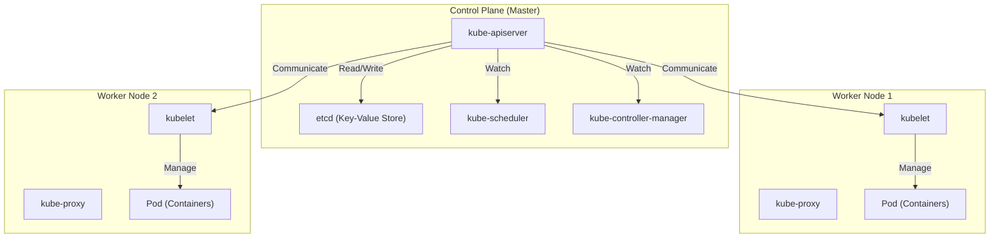

## مقدمة: لماذا لا تكفي "الحاويات" وحدها؟

في تطوير البرمجيات الحديثة، أصبحت تقنية الحاويات التي يمثلها Docker أمرًا لا غنى عنه. من خلال تجميع التطبيق وتبعياته في صورة واحدة، تحل الحاويات المشكلة القديمة المتمثلة في "أنه يعمل في بيئة التطوير ولكن لا يعمل في بيئة الإنتاج"، مما يوفر "قابلية نقل" (Portability) هائلة.

ومع ذلك، مع نمو الأنظمة واعتماد بنية الخدمات المصغرة (Microservices)، تبرز الحاجة إلى تشغيل وإدارة المئات أو الآلاف من الحاويات. هنا نواجه تحديات إدارة المجموعات (Clusters) التالية:

- **الجدولة (Scheduling)**: على أي مضيف (خادم) يجب وضع كل حاوية؟ كيف يتم استيعاب توفر الموارد (وحدة المعالجة المركزية، الذاكرة)؟
- **الإصلاح الذاتي (Self-healing)**: عندما تتعطل حاوية أو مضيف، هل يمكن إعادة تشغيل الحاوية تلقائيًا على مضيف آخر؟
- **التوسع (Scaling)**: هل يمكن زيادة أو تقليل عدد الحاويات على الفور استجابة لتقلبات حركة المرور؟
- **اكتشاف الخدمات وموازنة التحميل (Service Discovery and Load Balancing)**: كيف يتم توزيع حركة المرور بشكل مناسب عبر مجموعة من الحاويات التي تتغير عناوين IP الخاصة بها ديناميكيًا؟
- **إدارة الأسرار والتكوين (Secrets and Configuration Management)**: كيف يمكن تمرير المعلومات الحساسة مثل كلمات المرور ومفاتيح واجهة برمجة التطبيقات (API keys)، وملفات التكوين الخاصة بالبيئة، بأمان ومرونة إلى الحاويات؟

يصعب على Docker وحده (أو docker-compose على مضيف واحد) تلبية هذه المتطلبات المتقدمة التي تمتد عبر مضيفين متعددين. وهنا ظهر مفهوم "تنسيق الحاويات" (Container Orchestration)، وأصبح **Kubernetes (K8s)** هو المعيار الفعلي لذلك.

---

## أصول Kubernetes: نظام "Borg" الداخلي لشركة Google

ينبع الكمال المذهل وقابلية التوسع لـ Kubernetes من نظام Google الداخلي "Borg". لدعم الخدمات مثل محرك البحث، وGmail، وYouTube مع مليارات المستخدمين، كانت Google تطلق وتدير مليارات الحاويات أسبوعيًا. تمت إعادة تصميم Kubernetes من الصفر كمشروع مفتوح المصدر استنادًا إلى فلسفة التصميم والخبرة التشغيلية لـ Borg، الذي كان يمثل القلب النابض لذلك.

أحد أهم النماذج التي جلبها مطورو Borg إلى Kubernetes هي مفاهيم "واجهة برمجة التطبيقات التعريفية (Declarative API)" و "حلقة التسوية (Reconciliation Loop)".

### فلسفة تصميم واجهة برمجة التطبيقات التعريفية (الحالة المرغوبة Desired State)

كانت إدارة البنية التحتية التقليدية (مثل سكربتات الصدفة Shell Scripts) تتبع نهجًا **حتميًا (Imperative)**: "افعل أ، ثم افعل ب، ثم افعل ج". في المقابل، يتبنى Kubernetes نهجًا **تعريفيًا (Declarative)**.

يحدد المسؤولون "كيف ينبغي أن تكون الحالة النهائية (الحالة المرغوبة Desired State)" كملف بيان (Manifest) بتنسيق YAML ويرسلونه إلى Kubernetes. على سبيل المثال، يقومون فقط بالتصريح: "أريد أن تعمل 3 حاويات من خادم الويب هذا في جميع الأوقات".

داخليًا، يراقب Kubernetes باستمرار الحالة الحالية (Current State). إذا كانت تختلف عن الحالة المرغوبة (Desired State)، فإنه يتخذ إجراءات ذاتية لمواءمتهما. هذه هي "حلقة التسوية". على سبيل المثال، إذا توقفت حاوية واحدة بسبب فشل في العقدة (Node)، فسيستنتج Kubernetes تلقائيًا: "هناك 2 حاليًا، والمرغوب هو 3. لذلك سأقوم بتشغيل واحدة جديدة".

---

## نظرة عامة على بنية Kubernetes

يتكون Kubernetes بشكل أساسي من جزأين رئيسيين: **Control Plane (مستوى التحكم)** و **Worker Node (عقدة العامل)**.

### Control Plane: دماغ المجموعة (Cluster)

مستوى التحكم (Control Plane) هو مجموعة من المكونات التي تدير التحكم في المجموعة (Cluster) بأكملها. وعادة ما تتكون من عدة خوادم لضمان التوافر العالي.

#### 1. kube-apiserver
هي نقطة الدخول لجميع اتصالات Kubernetes. تمر جميع أوامر kubectl (طلبات API) من المستخدمين والاتصالات بين المكونات الداخلية عبر خادم API هذا. يقوم بالتوثيق والتفويض، والتحقق من صحة الطلبات، ويقرأ البيانات ويكتبها في etcd الموضح أدناه.

#### 2. etcd
هو مخزن Key-Value موزع وعالي التوافر. إنها قاعدة البيانات الوحيدة التي تخزن باستمرار "كل حالات" (البيانات الوصفية، معلومات التكوين، الحالة التشغيلية) مجموعة Kubernetes. فقدان بيانات etcd يعني موت المجموعة، لذلك فإن النسخ الاحتياطي الصارم ضروري.

#### 3. kube-scheduler
يكتشف الـ Pods المنشأة حديثًا (والتي لم يتم تحديد العقدة التي ستوضع فيها بعد)، ويحسب حالة الموارد (وحدة المعالجة المركزية، الذاكرة، القرص، وما إلى ذلك) لكل Worker Node، والقيود التي يحددها المستخدم (مثل وضع هذا الـ Pod على عقدة مجهزة بوحدة معالجة رسومات GPU، أو وضعه على عقدة مختلفة عن Pod معين)، ويخصص العقدة المثلى.

#### 4. kube-controller-manager
هي مجموعة من وحدات التحكم المختلفة التي تراقب حالة المجموعة وتسد الفجوة (تدير حلقة التسوية) بين الحالة المرغوبة (Desired State) والحالة الحالية (Current State). على سبيل المثال، تتضمن وحدة تحكم العقدة Node Controller (لاكتشاف تعطل العقدة)، ووحدة تحكم ReplicaSet Controller (للحفاظ على تشغيل العدد المحدد من الـ Pods)، ووحدة تحكم Endpoint Controller (لربط الـ Service مع الـ Pods).

### Worker Node: بيئة تنفيذ أعباء العمل

عقد العامل (Worker Nodes) هي الخوادم التي تعمل عليها حاويات التطبيق (Pods) فعليًا.

#### 1. kubelet
هو "الوكيل" الذي يعمل على كل عقدة. يتلقى التعليمات من خادم API ويأمر وقت تشغيل الحاوية (Container Runtime) ببدء تشغيل الحاويات أو إيقافها. كما يقوم بإجراء فحوصات صحة الحاويات (Liveness Probe و Readiness Probe)، ويبلغ خادم API بشكل دوري بحالة عقدته وحالة الـ Pods قيد التشغيل.

#### 2. kube-proxy
هو وكيل شبكة يعمل على كل عقدة، ويدرك المفهوم المجرد لـ "Service" في Kubernetes على مستوى الشبكة. يتعامل مع iptables أو IPVS لتوجيه وموازنة تحميل حركة المرور من داخل وخارج المجموعة إلى الـ Pod المناسب.

#### 3. Container Runtime
هو البرنامج الذي يشغل عمليات الحاوية فعليًا. في الأيام الأولى، تم استخدام Docker (dockershim)، ولكن الآن أصبحت أوقات التشغيل المتوافقة مع CRI (Container Runtime Interface) مثل containerd و CRI-O هي المستخدمة قياسيًا.

---

## أصغر وحدة في Kubernetes: أهمية "Pod"

في Kubernetes، لا يتم نشر الحاويات بشكل مباشر. بدلاً من ذلك، يتم استخدام مفهوم **Pod**. الـ Pod هو أصغر وحدة نشر في Kubernetes.

لماذا تم تقديم مفهوم الـ Pod بدلاً من التعامل مع الحاويات بشكل مباشر؟
السبب هو "تشغيل عمليات متعددة ومترابطة ارتباطًا وثيقًا في نفس البيئة".

يمكن أن يحتوي Pod واحد على حاوية واحدة أو أكثر. تشترك مجموعة الحاويات الموجودة داخل نفس الـ Pod فيما يلي:
- **مساحة اسم الشبكة (Network Namespace)**: نفس عنوان IP ومساحة المنافذ (يمكنها التواصل مع بعضها البعض عبر localhost).
- **وحدات تخزين البيانات (Storage Volumes)**: يتم تحميل نفس وحدة تخزين القرص، مما يسمح بمشاركة الملفات.

### نمط العربة الجانبية (Sidecar Pattern)

أكبر فائدة جلبها مفهوم الـ Pod هي تحقيق أنماط تصميم الحاويات مثل **نمط العربة الجانبية (Sidecar Pattern)**.
بدون إجراء تغييرات على حاوية التطبيق الرئيسية، يمكنك إرفاق "حاوية جانبية" داخل نفس الـ Pod لأداء أدوار مساعدة (مثل إعادة توجيه السجلات، وتشفير حركة المرور أو الوكيل، ومزامنة البيانات).

على سبيل المثال، في شبكة الخدمات (Service Mesh مثل Istio)، يتم حقن وكيل Envoy كعربة جانبية في جميع الـ Pods، مما يتيح التحكم المتقدم في حركة المرور وتشفير TLS المتبادل دون أن يكون التطبيق الرئيسي على علم بذلك.

---

## الخلاصة: تجريد البنية التحتية والنظام البيئي

لقد تجاوز Kubernetes كونه مجرد أداة لإدارة الحاويات وتطور إلى "نظام تشغيل لعصر الكلاود نيتف (Cloud-Native)" الذي يجرد البنية التحتية السحابية بأكملها. يمكن للمطورين معالجة البنية التحتية من خلال واجهة برمجة تطبيقات Kubernetes مشتركة، سواء كانت البنية التحتية الأساسية هي AWS، أو GCP، أو داخل الشركة (On-premises).

تشكل نظام بيئي ضخم حول Kubernetes، بما في ذلك إدارة الحزم عبر Helm، و GitOps باستخدام ArgoCD أو Flux، والمراقبة بواسطة Prometheus.
منحنى التعلم الخاص به ليس سهلاً على الإطلاق، ولكن إذا فهمت بنيته القوية المشتقة من Borg وفلسفة التصميم التعريفية، فسيصبح سلاحًا قويًا للتشغيل المستقر للأنظمة واسعة النطاق والمعقدة.
