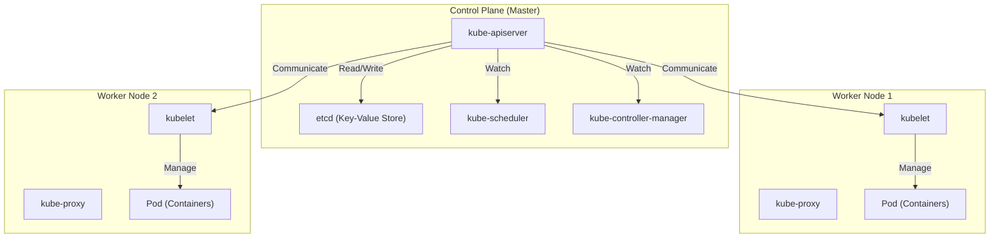

## Einführung: Warum sind 'Container' allein nicht genug?

In der modernen Softwareentwicklung ist die Container-Technologie, vertreten durch Docker, unverzichtbar geworden. Durch das Verpacken einer Anwendung und ihrer Abhängigkeiten in ein einziges Image lösen Container das langjährige Problem 'es funktionierte in der Entwicklungsumgebung, aber nicht in der Produktion' und bieten eine überwältigende 'Portabilität'.

Wenn jedoch ein System wächst und eine Microservices-Architektur übernommen wird, wird es notwendig, Hunderte oder Tausende von Containern zu betreiben und zu verwalten. Hierbei stößt man auf folgende Herausforderungen bei der Cluster-Verwaltung:

- **Scheduling (Planung)**: Auf welchem Host (Server) soll welcher Container platziert werden? Wie behält man den Überblick über die Verfügbarkeit von Ressourcen (CPU, Speicher)?
- **Self-healing (Selbstheilung)**: Wenn ein Container oder Host ausfällt, kann der Container automatisch auf einem anderen Host neu gestartet werden?
- **Scaling (Skalierung)**: Kann die Anzahl der Container je nach Verkehrszunahme oder -abnahme sofort erhöht oder verringert werden?
- **Service Discovery und Load Balancing**: Wie wird der Datenverkehr bei einer Gruppe von Containern mit sich dynamisch ändernden IP-Adressen angemessen verteilt?
- **Secrets- und Konfigurationsmanagement**: Wie können vertrauliche Informationen wie Passwörter und API-Schlüssel sowie umgebungsspezifische Konfigurationsdateien sicher und flexibel an Container übergeben werden?

Mit Docker allein (oder docker-compose auf einem einzelnen Host) ist es schwierig, diese fortschrittlichen Anforderungen über mehrere Hosts hinweg zu erfüllen. Hier kam das Konzept der 'Container-Orchestrierung' ins Spiel, und ihr De-facto-Standard wurde **Kubernetes (K8s)**.

---

## Die Ursprünge von Kubernetes: Googles internes System 'Borg'

Die überwältigende Perfektion und Skalierbarkeit von Kubernetes stammen von 'Borg', dem internen System von Google. Um Dienste wie die Suchmaschine, Gmail und YouTube mit Milliarden von Nutzern zu unterstützen, startete und verwaltete Google wöchentlich Milliarden von Containern. Kubernetes wurde von Grund auf als Open Source neu konzipiert, basierend auf der Designphilosophie und den Betriebserfahrungen von Borg, das das Herzstück dieses Systems bildete.

Eines der wichtigsten Paradigmen, das die Borg-Entwickler in Kubernetes einbrachten, ist das Konzept der 'Declarative API (Deklarative API)' und der 'Reconciliation Loop (Abstimmungsschleife)'.

### Designphilosophie der deklarativen API (Desired State)

Die traditionelle Infrastrukturverwaltung (wie Shell-Skripte) war ein **imperativer** Ansatz: 'Mache A, dann mache B, dann C'. Kubernetes hingegen verfolgt einen **deklarativen** Ansatz.

Der Administrator definiert, 'wie der endgültige Zustand sein soll (Desired State = gewünschter Zustand)', als Manifestdatei im YAML-Format und übermittelt sie an Kubernetes. Zum Beispiel erklärt man einfach: 'Ich möchte, dass immer drei Container dieses Webservers laufen.'

Intern überwacht Kubernetes kontinuierlich den aktuellen Zustand (Current State). Wenn dieser vom gewünschten Zustand (Desired State) abweicht, ergreift es autonom Maßnahmen, um beide in Einklang zu bringen. Dies ist die 'Abstimmungsschleife'. Selbst wenn ein Container aufgrund eines Node-Ausfalls stoppt, entscheidet Kubernetes automatisch: 'Derzeit sind es zwei, gewünscht sind drei. Also starte ich einen neuen.'

---

## Das Gesamtbild der Kubernetes-Architektur

Kubernetes besteht hauptsächlich aus zwei Hauptkomponenten: der **Control Plane** und dem **Worker Node**.

### Control Plane: Das Gehirn des Clusters

Die Control Plane ist eine Gruppe von Komponenten, die den gesamten Cluster steuert. Sie besteht normalerweise aus mehreren Servern, um eine hohe Verfügbarkeit zu gewährleisten.

#### 1. kube-apiserver
Der Einstiegspunkt für die gesamte Kubernetes-Kommunikation. Alle kubectl-Befehle (API-Anfragen) von Benutzern und die Kommunikation zwischen internen Komponenten laufen über diesen API-Server. Er führt Authentifizierung, Autorisierung und Validierung von Anfragen durch und liest und schreibt Daten im unten beschriebenen etcd.

#### 2. etcd
Ein verteilter und hochverfügbarer Key-Value Store. Es ist die einzige Datenbank, die dauerhaft 'alle Zustände (Metadaten, Konfigurationsinformationen, Betriebsstatus)' des Kubernetes-Clusters speichert. Da der Verlust von etcd-Daten den Tod des Clusters bedeutet, sind strenge Backups erforderlich.

#### 3. kube-scheduler
Erkennt neu erstellte Pods (denen noch kein Node zugewiesen wurde), berechnet den Ressourcenstatus (CPU, Speicher, Festplatte usw.) jedes Worker Nodes und die vom Benutzer angegebenen Einschränkungen (z. B. 'Ich möchte diesen Pod auf einem Node mit GPU platzieren' oder 'Ich möchte ihn auf einem anderen Node als einen bestimmten Pod platzieren') und weist den optimalen Node zu.

#### 4. kube-controller-manager
Eine Sammlung verschiedener Controller, die den Zustand innerhalb des Clusters überwachen und die Lücke zwischen Desired State und Current State schließen (die Abstimmungsschleife ausführen). Dazu gehören beispielsweise der Node Controller (Erkennung von Node-Ausfällen), der ReplicaSet Controller (Aufrechterhaltung der angegebenen Anzahl laufender Pods) und der Endpoint Controller (Verknüpfung von Services und Pods).

### Worker Node: Die Ausführungsumgebung der Workloads

Der Worker Node ist der Server, auf dem die Anwendungscontainer (Pods) tatsächlich laufen.

#### 1. kubelet
Ein 'Agent', der auf jedem Node läuft. Er empfängt Anweisungen vom API Server und weist die Container Runtime an, Container zu starten oder zu stoppen. Außerdem führt er Gesundheitsprüfungen für Container durch (Liveness Probe und Readiness Probe) und meldet dem API Server regelmäßig den Status seines eigenen Nodes und den Status der laufenden Pods.

#### 2. kube-proxy
Ein Netzwerk-Proxy, der auf jedem Node läuft und das Kubernetes-Abstraktionskonzept 'Service' auf Netzwerkebene realisiert. Er manipuliert iptables, IPVS usw., um den Datenverkehr von innerhalb und außerhalb des Clusters zu den entsprechenden Pods zu routen und den Lastausgleich (Load Balancing) durchzuführen.

#### 3. Container Runtime
Die Software, die die Containerprozesse tatsächlich ausführt. In der Anfangszeit wurde Docker (dockershim) verwendet, aber heute werden standardmäßig CRI (Container Runtime Interface) kompatible Runtimes wie containerd oder CRI-O eingesetzt.

---

## Die kleinste Kubernetes-Einheit: Die Bedeutung des 'Pod'

In Kubernetes werden Container nie direkt bereitgestellt. Stattdessen wird das Konzept eines **Pod** verwendet. Ein Pod ist die kleinste Bereitstellungseinheit in Kubernetes.

Warum wurde das Konzept eines Pods eingeführt, anstatt Container direkt zu verwalten?
Der Grund ist: 'Um mehrere eng miteinander verbundene Prozesse in derselben Umgebung auszuführen.'

Ein Pod kann einen oder mehrere Container enthalten. Container innerhalb desselben Pods teilen sich Folgendes:
- **Network Namespace**: Gleiche IP-Adresse und Portraum (gegenseitige Kommunikation über localhost möglich)
- **Storage Volumes**: Einbindung desselben Festplatten-Volumes, was die gemeinsame Nutzung von Dateien ermöglicht

### Das Sidecar-Muster (Sidecar Pattern)

Der größte Vorteil, den das Pod-Konzept mit sich brachte, ist die Realisierung von Container-Entwurfsmustern wie dem **Sidecar-Muster**.
Ein 'Sidecar-Container', der eine unterstützende Rolle spielt (z.B. Protokollweiterleitung, Verschlüsselung und Proxying von Datenverkehr, Datensynchronisation), kann im selben Pod platziert werden, ohne den Hauptanwendungscontainer zu verändern.

Beispielsweise wird in einem Service Mesh (wie Istio) jedem Pod ein Envoy-Proxy als Sidecar injiziert, wodurch eine fortschrittliche Verkehrskontrolle und gegenseitige TLS-Verschlüsselung realisiert werden, ohne dass die Anwendung selbst davon Kenntnis hat.

---

## Fazit: Abstraktion der Infrastruktur und das Ökosystem

Kubernetes hat sich über ein bloßes Container-Management-Tool hinaus zu einem 'Betriebssystem für die Cloud-native Ära' entwickelt, das die gesamte Cloud-Infrastruktur abstrahiert. Entwickler können die Infrastruktur über eine gemeinsame Kubernetes-API betreiben, unabhängig davon, ob die Grundlage AWS, GCP oder On-Premises ist.

Rund um Kubernetes hat sich ein riesiges Ökosystem gebildet, darunter Paketverwaltung mit Helm, GitOps mit ArgoCD oder Flux und Überwachung mit Prometheus.
Die Lernkurve ist keineswegs flach, aber wenn man die robuste Architektur und die deklarative Designphilosophie versteht, die von Borg abstammen, sollte es eine mächtige Waffe für den stabilen Betrieb großer und komplexer Systeme werden.
