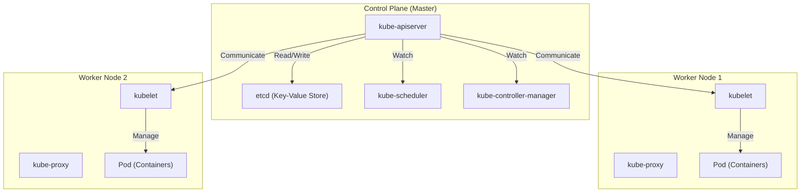

## Introduction: Why are "Containers" alone insufficient?

In modern software development, container technologies represented by Docker have become indispensable. By packaging an application and its dependencies into a single image, containers solved the long-standing problem of "it worked in the development environment but not in production," bringing overwhelming "portability."

However, as systems grow and microservices architectures are adopted, it becomes necessary to operate and manage hundreds or thousands of containers. At this point, we face cluster management challenges such as the following:

- **Scheduling**: Which host (server) should a container be placed on? How do we keep track of available resources (CPU, memory)?
- **Self-healing**: If a container or host goes down, can the container be automatically restarted on another host?
- **Scaling**: Can the number of containers be instantaneously scaled up or down according to traffic fluctuations?
- **Service Discovery and Load Balancing**: How do we properly distribute traffic across a group of containers with dynamically changing IP addresses?
- **Secret and Configuration Management**: How do we safely and flexibly pass sensitive information like passwords and API keys, or environment-specific configuration files, to containers?

Docker alone (or docker-compose on a single host) struggles to meet these advanced requirements spanning multiple hosts. This is where the concept of "Container Orchestration" emerged, and its de facto standard has become **Kubernetes (K8s)**.

---

## The Origins of Kubernetes: Google's Internal System "Borg"

The overwhelming completeness and scalability of Kubernetes stem from Google's internal system, "Borg." To support services with billions of users like its search engine, Gmail, and YouTube, Google was launching and managing billions of containers every week. Kubernetes was redesigned from scratch as open-source software, based on the design philosophy and operational experience of Borg, which was the heart of those operations.

One of the most important paradigms the Borg developers brought to Kubernetes is the concepts of the "Declarative API" and the "Reconciliation Loop."

### The Design Philosophy of the Declarative API (Desired State)

Traditional infrastructure management (such as shell scripts) was an **Imperative** approach: "Do A, then B, then C." In contrast, Kubernetes adopts a **Declarative** approach.

Administrators define "what the final state should look like (Desired State)" as a manifest file in YAML format and submit it to Kubernetes. For example, they simply declare, "I want three containers of this web server to be running at all times."

Internally, Kubernetes continuously monitors the current state (Current State), and if it differs from the desired state (Desired State), it autonomously takes action to reconcile the two. This is the "Reconciliation Loop." Even if one container stops due to a node failure, Kubernetes automatically makes the judgment: "There are currently two, but the desired number is three. Therefore, I will start a new one."

---

## Overall Architecture of Kubernetes

Kubernetes is broadly composed of two main parts: the **Control Plane** and **Worker Nodes**.

### Control Plane: The Brain of the Cluster

The Control Plane is a group of components that governs the control of the entire cluster. It is usually composed of multiple servers to ensure high availability.

#### 1. kube-apiserver
This is the entry point for all communication in Kubernetes. All kubectl commands (API requests) from users and communications between internal components pass through this API Server. It performs authentication, authorization, and validation of requests, and reads/writes data to etcd, which is described below.

#### 2. etcd
A distributed and highly available Key-Value store. It is the only database that permanently stores the "entire state (metadata, configuration information, operational status)" of the Kubernetes cluster. Since the loss of etcd data means the death of the cluster, strict backups are essential.

#### 3. kube-scheduler
Detects newly created Pods (that have not yet been assigned to any node) and assigns the optimal node by calculating the resource status (CPU, memory, disk, etc.) of each Worker Node and the constraints specified by the user (e.g., wanting to place this Pod on a node equipped with a GPU, or wanting to place it on a different node than a specific Pod).

#### 4. kube-controller-manager
A collection of various controllers that monitor the state within the cluster and bridge the gap between the Desired State and Current State (running the reconciliation loop). For example, it includes the Node Controller (detecting node downtime), ReplicaSet Controller (maintaining that the specified number of Pods are running), and Endpoint Controller (linking Services and Pods).

### Worker Node: The Execution Environment for Workloads

A Worker Node is a server where application containers (Pods) actually run.

#### 1. kubelet
An "agent" running on each node. It receives instructions from the API Server and commands the container runtime to start or stop containers. It also performs container health checks (Liveness Probes and Readiness Probes) and periodically reports the status of its own node and the running Pods to the API Server.

#### 2. kube-proxy
A network proxy running on each node that realizes the Kubernetes abstraction concept called "Service" at the network level. It manipulates iptables, IPVS, etc., and routes and load-balances traffic from inside and outside the cluster to the appropriate Pods.

#### 3. Container Runtime
The software that actually runs container processes. Initially, Docker (dockershim) was used, but currently, containerd or CRI-O, which comply with CRI (Container Runtime Interface), are standardly used.

---

## The Minimum Unit of Kubernetes: The Importance of "Pods"

In Kubernetes, you do not deploy containers directly. Instead, the concept of a **Pod** is used. A Pod is the smallest deployment unit in Kubernetes.

Why introduce the concept of a Pod without dealing with containers directly?
It is "to run multiple tightly coupled processes in the same environment."

One or more containers can be included within a single Pod. The group of containers within the same Pod share the following:
- **Network Namespace**: The same IP address and port space (can communicate with each other via localhost).
- **Storage Volumes**: Can mount the same disk volumes and share files.

### Sidecar Pattern

The greatest benefit brought by the concept of the Pod is the realization of container design patterns such as the **Sidecar Pattern**.
Without making any changes to the main application container, a "sidecar container" that performs auxiliary roles (log forwarding, traffic encryption and proxying, data synchronization, etc.) can be attached within the same Pod.

For example, in a service mesh (such as Istio), an Envoy proxy is injected into every Pod as a sidecar, realizing advanced traffic control and mutual TLS encryption without the main application being aware of it.

---

## Conclusion: Infrastructure Abstraction and Ecosystem

Kubernetes has evolved beyond a mere container management tool into the "OS of the cloud-native era" that abstracts the entire cloud infrastructure. Developers can manipulate the infrastructure through a common Kubernetes API, whether the underlying foundation is AWS, GCP, or on-premises.

A massive ecosystem has formed around Kubernetes, including package management with Helm, GitOps with ArgoCD or Flux, and monitoring with Prometheus.
Its learning curve is by no means gentle, but once you understand the robust architecture originating from Borg and its declarative design philosophy, it should become a powerful weapon for stably operating large-scale and complex systems.
