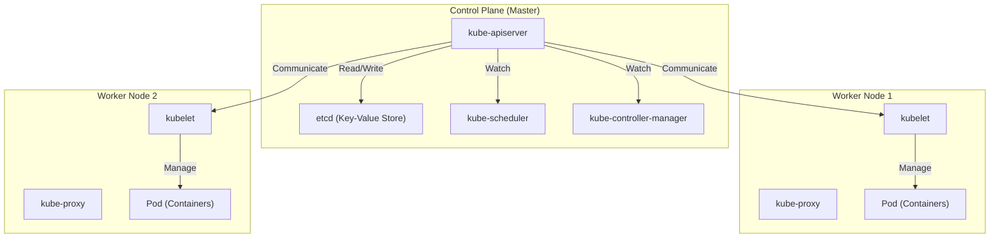

## Introducción: ¿Por qué "solo contenedores" no es suficiente?

En el desarrollo de software moderno, la tecnología de contenedores representada por Docker se ha convertido en una existencia indispensable. Al empaquetar una aplicación y sus dependencias en una única imagen, los contenedores resuelven el antiguo problema de "funcionaba en el entorno de desarrollo pero no en el de producción", aportando una "portabilidad" abrumadora.

Sin embargo, a medida que los sistemas crecen y se adoptan arquitecturas de microservicios, surge la necesidad de operar y gestionar cientos o miles de contenedores. Es aquí donde nos enfrentamos a desafíos de gestión de clústeres como los siguientes:

- **Programación (Scheduling)**: ¿En qué host (servidor) debe colocarse cada contenedor? ¿Cómo rastrear la disponibilidad de recursos (CPU, memoria)?
- **Autocorrección (Self-healing)**: Cuando un contenedor o host se cae, ¿se puede reiniciar automáticamente el contenedor en otro host?
- **Escalado**: ¿Se puede aumentar o disminuir el número de contenedores instantáneamente en respuesta a los cambios en el tráfico?
- **Descubrimiento de servicios y balanceo de carga (Service discovery & Load balancing)**: ¿Cómo se distribuye adecuadamente el tráfico a un grupo de contenedores cuyas direcciones IP cambian dinámicamente?
- **Gestión de secretos y configuración**: ¿Cómo pasar información confidencial como contraseñas o claves API, y archivos de configuración específicos del entorno de forma segura y flexible a los contenedores?

Con Docker por sí solo (o docker-compose en un solo host), es difícil satisfacer estos requisitos avanzados que abarcan múltiples hosts. Así surgió el concepto de "orquestación de contenedores", y **Kubernetes (K8s)** se convirtió en su estándar de facto.

---

## Los orígenes de Kubernetes: el sistema interno de Google "Borg"

La abrumadora madurez y escalabilidad de Kubernetes se derivan del sistema interno de Google, "Borg". Para respaldar servicios como el motor de búsqueda, Gmail y YouTube, que tienen miles de millones de usuarios, Google lanzaba y gestionaba miles de millones de contenedores cada semana. Basándose en la filosofía de diseño y la experiencia operativa de Borg, que era su núcleo, Kubernetes fue rediseñado desde cero como código abierto.

Uno de los paradigmas más importantes que los desarrolladores de Borg introdujeron en Kubernetes es el concepto de "API Declarativa (Declarative API)" y "Bucle de Reconciliación (Reconciliation Loop)".

### Filosofía de diseño de la API Declarativa (Estado Deseado)

La gestión de infraestructura tradicional (como los scripts de shell) era un enfoque **imperativo**, que decía "haz A, luego haz B, y luego haz C". Por el contrario, Kubernetes adopta un enfoque **declarativo**.

El administrador define "cuál debería ser el estado final (Desired State = Estado Deseado)" como un archivo de manifiesto en formato YAML y lo envía a Kubernetes. Por ejemplo, simplemente declara: "Quiero que siempre haya 3 contenedores de este servidor web en funcionamiento".

Internamente, Kubernetes supervisa continuamente el estado actual (Current State) y, si difiere del estado deseado (Desired State), toma medidas de forma autónoma para hacer que ambos coincidan. Este es el "bucle de reconciliación". Incluso si un contenedor se detiene debido a un fallo en el nodo, Kubernetes toma automáticamente la decisión: "Actualmente hay 2, lo deseado son 3. Por lo tanto, iniciaré 1 nuevo".

---

## Visión general de la arquitectura de Kubernetes

Kubernetes se compone principalmente de dos partes principales: el **Control Plane (Plano de control)** y los **Worker Nodes (Nodos de trabajo)**.

### Control Plane: el cerebro del clúster

El Control Plane es un grupo de componentes que rige el control de todo el clúster. Por lo general, se compone de múltiples servidores para garantizar una alta disponibilidad.

#### 1. kube-apiserver
Es el punto de entrada para todas las comunicaciones de Kubernetes. Los comandos `kubectl` (solicitudes de API) de los usuarios y las comunicaciones entre componentes internos pasan a través de este API Server. Realiza autenticación, autorización, validación de solicitudes, y lee/escribe datos en etcd, que se describe a continuación.

#### 2. etcd
Es un almacén clave-valor distribuido y de alta disponibilidad. Es la única base de datos que guarda persistentemente "todos los estados (metadatos, configuraciones, estado de ejecución)" del clúster de Kubernetes. La pérdida de datos de etcd significa la muerte del clúster, por lo que requiere copias de seguridad estrictas.

#### 3. kube-scheduler
Detecta los Pods recién creados (a los que aún no se les ha asignado un nodo) y calcula el estado de los recursos de cada Worker Node (CPU, memoria, disco, etc.) y las restricciones especificadas por el usuario (por ejemplo, querer colocar este Pod en un nodo con GPU, o en un nodo diferente a un Pod específico), para asignar el nodo óptimo.

#### 4. kube-controller-manager
Es una colección de varios controladores que supervisan el estado dentro del clúster y cierran la brecha entre el Estado Deseado (Desired State) y el Estado Actual (Current State) (ejecutando bucles de reconciliación). Por ejemplo, incluye el Node Controller (detección de caída de nodos), ReplicaSet Controller (mantenimiento de un número específico de Pods en ejecución) y Endpoint Controller (vinculación de Services con Pods).

### Worker Node: el entorno de ejecución de las cargas de trabajo

Un Worker Node es un servidor donde realmente se ejecutan los contenedores de las aplicaciones (Pods).

#### 1. kubelet
Es el "agente" que se ejecuta en cada nodo. Recibe instrucciones del API Server y ordena al tiempo de ejecución del contenedor que inicie o detenga los contenedores. Además, realiza comprobaciones de estado de los contenedores (Liveness Probes y Readiness Probes) e informa periódicamente sobre el estado de su nodo y los Pods en ejecución al API Server.

#### 2. kube-proxy
Es un proxy de red que se ejecuta en cada nodo y realiza el concepto abstracto de "Service" de Kubernetes a nivel de red. Manipulando iptables o IPVS, enruta y balancea la carga del tráfico desde dentro y fuera del clúster hacia los Pods apropiados.

#### 3. Container Runtime
Es el software que ejecuta realmente los procesos de los contenedores. Inicialmente se usaba Docker (dockershim), pero hoy en día se utilizan habitualmente opciones compatibles con CRI (Container Runtime Interface) como containerd y CRI-O.

---

## La unidad mínima de Kubernetes: la importancia del "Pod"

En Kubernetes, los contenedores nunca se despliegan directamente. En su lugar, se utiliza el concepto de **Pod**. Un Pod es la unidad de despliegue más pequeña en Kubernetes.

¿Por qué se introdujo el concepto de Pod en lugar de manejar los contenedores directamente?
Es para "ejecutar múltiples procesos fuertemente acoplados en el mismo entorno".

Un solo Pod puede contener uno o más contenedores. Un grupo de contenedores dentro del mismo Pod comparte lo siguiente:
- **Espacio de nombres de red (Network Namespace)**: La misma dirección IP y espacio de puertos (pueden comunicarse entre sí a través de localhost).
- **Volúmenes de almacenamiento (Storage Volumes)**: Montan el mismo volumen de disco, permitiendo compartir archivos.

### Patrón Sidecar

El mayor beneficio que ha traído el concepto de Pod es la realización de patrones de diseño de contenedores como el **Patrón Sidecar**.
Sin modificar el contenedor principal de la aplicación, puedes añadir un "contenedor sidecar" en el mismo Pod para realizar tareas auxiliares (reenvío de registros, cifrado de tráfico o proxies, sincronización de datos, etc.).

Por ejemplo, en una malla de servicios (Service Mesh como Istio), se inyecta un proxy Envoy como sidecar en todos los Pods, logrando un control de tráfico avanzado y cifrado TLS mutuo sin que la aplicación principal se dé cuenta.

---

## Conclusión: abstracción de infraestructura y ecosistema

Kubernetes ha ido más allá de ser una simple herramienta de gestión de contenedores para evolucionar hacia el "sistema operativo de la era nativa de la nube" que abstrae toda la infraestructura en la nube. Los desarrolladores pueden operar la infraestructura a través de una API de Kubernetes común, ya sea que la base sea AWS, GCP o local (on-premise).

Se ha formado un ecosistema gigante en torno a Kubernetes, que incluye gestión de paquetes con Helm, GitOps con ArgoCD o Flux, y monitorización con Prometheus.
Su curva de aprendizaje no es en absoluto suave, pero al comprender su robusta arquitectura derivada de Borg y su filosofía de diseño declarativa, debería convertirse en un arma poderosa para operar de manera estable sistemas grandes y complejos.
