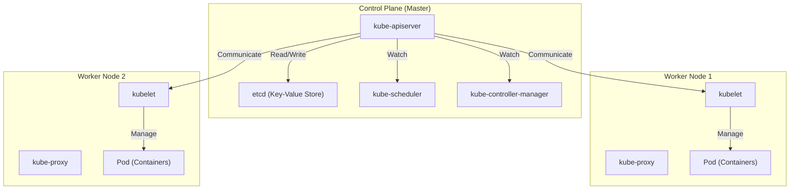

## Introduction : Pourquoi les « conteneurs » seuls ne suffisent-ils pas ?

Dans le développement logiciel moderne, la technologie des conteneurs, représentée par Docker, est devenue indispensable. En empaquetant une application et ses dépendances dans une seule image, les conteneurs ont résolu le problème de longue date du « ça marchait sur l'environnement de développement mais pas en production », offrant une « portabilité » écrasante.

Cependant, à mesure que les systèmes se développent et que l'architecture des microservices est adoptée, il devient nécessaire d'exploiter et de gérer des centaines, voire des milliers de conteneurs. C'est là que l'on se heurte aux défis de gestion de cluster suivants :

- **Ordonnancement (Scheduling)** : Sur quel hôte (serveur) chaque conteneur doit-il être placé ? Comment appréhender la disponibilité des ressources (CPU, mémoire) ?
- **Auto-réparation (Self-healing)** : Lorsqu'un conteneur ou un hôte tombe en panne, le conteneur peut-il être redémarré automatiquement sur un autre hôte ?
- **Mise à l'échelle (Scaling)** : Est-il possible d'augmenter ou de diminuer instantanément le nombre de conteneurs en fonction des fluctuations du trafic ?
- **Découverte de services (Service Discovery) et répartition de charge (Load Balancing)** : Comment répartir correctement le trafic sur un groupe de conteneurs dont les adresses IP changent dynamiquement ?
- **Gestion des secrets et des configurations** : Comment transmettre de manière sécurisée et flexible des informations sensibles comme des mots de passe ou des clés API, ainsi que des fichiers de configuration spécifiques à chaque environnement, aux conteneurs ?

Avec Docker seul (ou docker-compose sur un hôte unique), il est difficile de répondre à ces exigences avancées réparties sur plusieurs hôtes. C'est alors qu'est apparu le concept d'« orchestration de conteneurs », dont **Kubernetes (K8s)** est devenu le standard de facto.

---

## Les origines de Kubernetes : Le système interne de Google, « Borg »

La perfection et l'évolutivité impressionnantes de Kubernetes proviennent de « Borg », le système interne de Google. Pour soutenir des services comme son moteur de recherche, Gmail, ou YouTube, qui comptent des milliards d'utilisateurs, Google lançait et gérait des milliards de conteneurs chaque semaine. Kubernetes a été repensé de zéro en tant que projet open source, en s'appuyant sur la philosophie de conception et l'expérience opérationnelle de Borg, qui en était le cœur.

L'un des paradigmes les plus importants que les développeurs de Borg ont apporté à Kubernetes est le concept d'« API déclarative (Declarative API) » et de « Boucle de réconciliation (Reconciliation Loop) ».

### La philosophie de conception de l'API déclarative (Desired State)

La gestion d'infrastructure traditionnelle (comme les scripts shell) adoptait une approche **impérative (Imperative)** : « Fais A, puis fais B, et enfin C ». En revanche, Kubernetes adopte une approche **déclarative (Declarative)**.

L'administrateur définit « l'état final souhaité (Desired State = l'état désiré) » sous la forme d'un fichier manifeste au format YAML, et le soumet à Kubernetes. Par exemple, il suffit de déclarer : « Je veux que 3 conteneurs de ce serveur Web soient toujours en cours d'exécution ».

En interne, Kubernetes surveille en permanence l'état actuel (Current State) et, s'il diffère de l'état souhaité (Desired State), il prend des mesures de manière autonome pour faire coïncider les deux. C'est ce qu'on appelle la « boucle de réconciliation ». Si un conteneur s'arrête en raison d'une panne de nœud, Kubernetes décide automatiquement : « Actuellement, il y en a 2, mais l'état souhaité est de 3. Donc, j'en démarre un nouveau ».

---

## Vue d'ensemble de l'architecture de Kubernetes

Kubernetes se compose principalement de deux parties : le **Control Plane (Plan de contrôle)** et le **Worker Node (Nœud de travail)**.

### Control Plane : Le cerveau du cluster

Le Control Plane est un ensemble de composants qui supervise le contrôle de l'ensemble du cluster. En général, il est constitué de plusieurs serveurs pour garantir une haute disponibilité.

#### 1. kube-apiserver
C'est le point d'entrée de toutes les communications de Kubernetes. Les commandes kubectl (requêtes API) des utilisateurs, ainsi que les communications entre les composants internes, passent toutes par cet API Server. Il gère l'authentification, l'autorisation, la validation des requêtes, et effectue la lecture/écriture des données dans etcd (décrit ci-dessous).

#### 2. etcd
C'est un magasin clé-valeur (Key-Value Store) distribué et hautement disponible. C'est la seule base de données qui stocke de manière persistante « l'intégralité de l'état (métadonnées, informations de configuration, état de fonctionnement) » du cluster Kubernetes. La perte des données d'etcd signifiant la mort du cluster, des sauvegardes rigoureuses sont indispensables.

#### 3. kube-scheduler
Il détecte les Pods nouvellement créés (qui n'ont pas encore été affectés à un nœud) et calcule le nœud optimal à leur attribuer, en tenant compte de l'état des ressources (CPU, mémoire, disque, etc.) de chaque Worker Node, ainsi que des contraintes spécifiées par l'utilisateur (par exemple, vouloir placer ce Pod sur un nœud équipé d'un GPU, ou sur un nœud différent d'un Pod spécifique).

#### 4. kube-controller-manager
C'est un ensemble de divers contrôleurs qui surveillent l'état au sein du cluster et comblent l'écart entre le Desired State et le Current State (en exécutant la boucle de réconciliation). Cela inclut, par exemple, le Node Controller (qui détecte la chute d'un nœud), le ReplicaSet Controller (qui maintient le nombre spécifié de Pods en cours d'exécution), et l'Endpoint Controller (qui lie les Services et les Pods).

### Worker Node : L'environnement d'exécution des charges de travail

Le Worker Node est le serveur où s'exécutent réellement les conteneurs (Pods) de l'application.

#### 1. kubelet
C'est l'« agent » qui fonctionne sur chaque nœud. Il reçoit les instructions de l'API Server et ordonne au runtime de conteneurs de démarrer ou d'arrêter les conteneurs. De plus, il effectue des vérifications de l'état de santé des conteneurs (Liveness Probe et Readiness Probe) et rapporte régulièrement l'état de son propre nœud et des Pods en cours d'exécution à l'API Server.

#### 2. kube-proxy
C'est un proxy réseau fonctionnant sur chaque nœud, qui implémente le concept d'abstraction « Service » de Kubernetes au niveau réseau. Il manipule des outils tels qu'iptables ou IPVS pour router et répartir la charge du trafic provenant de l'intérieur et de l'extérieur du cluster vers les Pods appropriés.

#### 3. Container Runtime
C'est le logiciel qui fait réellement tourner les processus des conteneurs. Initialement, Docker (dockershim) était utilisé, mais aujourd'hui, des runtimes conformes à la spécification CRI (Container Runtime Interface), tels que containerd ou CRI-O, sont utilisés de manière standard.

---

## L'unité minimale de Kubernetes : L'importance du « Pod »

Dans Kubernetes, on ne déploie jamais directement des conteneurs. À la place, on utilise le concept de **Pod**. Le Pod est la plus petite unité de déploiement dans Kubernetes.

Pourquoi avoir introduit le concept de Pod au lieu de manipuler directement les conteneurs ?
La réponse est : « pour exécuter plusieurs processus fortement couplés dans le même environnement ».

Un Pod peut contenir un ou plusieurs conteneurs. Les conteneurs au sein d'un même Pod partagent les éléments suivants :
- **Espace de noms réseau (Network Namespace)** : Même adresse IP et espace de ports (ils peuvent communiquer entre eux via localhost).
- **Volumes de stockage (Storage Volumes)** : Ils montent les mêmes volumes de disques, ce qui permet le partage de fichiers.

### Le modèle Sidecar (Sidecar Pattern)

Le plus grand avantage apporté par le concept de Pod est la réalisation de modèles de conception de conteneurs tels que le **modèle Sidecar**.
Sans avoir à modifier le conteneur principal de l'application, il est possible d'ajouter dans le même Pod un « conteneur sidecar » qui joue un rôle d'assistance (transfert de logs, chiffrement et proxy du trafic, synchronisation des données, etc.).

Par exemple, dans un Service Mesh (comme Istio), un proxy Envoy est injecté en tant que sidecar dans tous les Pods, ce qui permet un contrôle avancé du trafic et un chiffrement mTLS (mutual TLS) sans que l'application principale n'ait à s'en soucier.

---

## Conclusion : L'abstraction de l'infrastructure et l'écosystème

Kubernetes a dépassé son rôle de simple outil de gestion de conteneurs pour évoluer vers un « système d'exploitation de l'ère Cloud Native » qui abstrait l'ensemble de l'infrastructure cloud. Les développeurs peuvent manipuler l'infrastructure via l'API commune de Kubernetes, que la base soit sur AWS, GCP ou sur site (on-premise).

Un vaste écosystème s'est formé autour de Kubernetes, incluant la gestion de paquets avec Helm, GitOps avec ArgoCD ou Flux, et la surveillance avec Prometheus.
Sa courbe d'apprentissage n'est certes pas douce, mais en comprenant son architecture robuste héritée de Borg et sa philosophie de conception déclarative, il deviendra une arme redoutable pour exploiter de manière stable des systèmes vastes et complexes.
