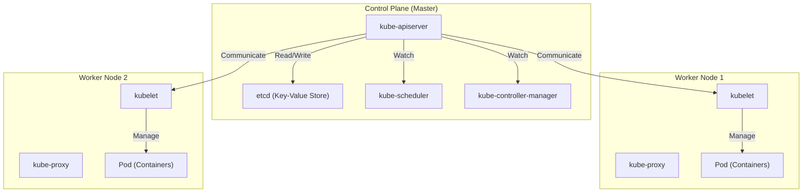

## परिचय: केवल 'कंटेनर' पर्याप्त क्यों नहीं हैं?

आधुनिक सॉफ्टवेयर विकास में, Docker जैसी कंटेनर तकनीकें अनिवार्य हो गई हैं। कंटेनर किसी एप्लिकेशन और उसकी निर्भरताओं (dependencies) को एक इमेज में पैकेज करके 'यह विकास परिवेश (development environment) में काम करता है लेकिन उत्पादन (production) में नहीं' वाली पुरानी समस्या को हल करते हैं और शानदार 'पोर्टेबिलिटी' (portability) प्रदान करते हैं।

हालाँकि, जैसे-जैसे सिस्टम बढ़ते हैं और माइक्रोसर्विसेज आर्किटेक्चर को अपनाया जाता है, सैकड़ों या हजारों कंटेनरों को संचालित और प्रबंधित करने की आवश्यकता उत्पन्न होती है। यहीं हम निम्नलिखित क्लस्टर प्रबंधन चुनौतियों का सामना करते हैं:

- **शेड्यूलिंग (Scheduling)**: कौन सा कंटेनर किस होस्ट (सर्वर) पर रखा जाना चाहिए? संसाधनों (CPU, मेमोरी) की उपलब्धता कैसे ट्रैक करें?
- **स्व-उपचार (Self-healing)**: यदि कोई कंटेनर या होस्ट डाउन हो जाता है, तो क्या कंटेनर स्वचालित रूप से किसी अन्य होस्ट पर पुनरारंभ किया जा सकता है?
- **स्केलिंग (Scaling)**: क्या ट्रैफ़िक में वृद्धि या कमी के अनुसार कंटेनरों की संख्या को तुरंत बढ़ाया या घटाया जा सकता है?
- **सर्विस डिस्कवरी और लोड बैलेंसिंग (Service Discovery and Load Balancing)**: आप उन कंटेनरों के बीच ट्रैफ़िक को ठीक से कैसे वितरित करते हैं जिनके IP पते गतिशील रूप से बदलते हैं?
- **सीक्रेट्स और कॉन्फ़िगरेशन प्रबंधन (Secrets and Configuration Management)**: पासवर्ड और API कुंजियों जैसी संवेदनशील जानकारी, साथ ही पर्यावरण-विशिष्ट कॉन्फ़िगरेशन फ़ाइलों को कंटेनरों में सुरक्षित और लचीले ढंग से कैसे पास करें?

अकेले Docker (या एकल होस्ट पर docker-compose) का उपयोग करके कई होस्ट्स पर फैले इन उन्नत आवश्यकताओं को पूरा करना मुश्किल है। यहीं 'कंटेनर ऑर्केस्ट्रेशन' की अवधारणा सामने आई, और **Kubernetes (K8s)** इसका वास्तविक मानक (de facto standard) बन गया।

---

## Kubernetes की उत्पत्ति: Google का आंतरिक सिस्टम 'Borg'

Kubernetes की अद्भुत पूर्णता और स्केलेबिलिटी की जड़ें Google के आंतरिक सिस्टम, 'Borg' में हैं। अपने सर्च इंजन, Gmail और YouTube जैसी सेवाओं का समर्थन करने के लिए, जिनके अरबों उपयोगकर्ता हैं, Google हर हफ्ते अरबों कंटेनर शुरू और प्रबंधित करता था। Kubernetes को Borg के डिज़ाइन दर्शन और परिचालन अनुभव के आधार पर एक ओपन-सोर्स प्रोजेक्ट के रूप में खरोंच से फिर से डिज़ाइन किया गया था।

Borg के डेवलपर्स द्वारा Kubernetes में लाए गए सबसे महत्वपूर्ण प्रतिमानों में से एक 'डिक्लेरेटिव API' (Declarative API) और 'रेकन्सिलेशन लूप' (Reconciliation Loop) की अवधारणा है।

### डिक्लेरेटिव API (Desired State) की डिज़ाइन फिलॉसफी

पारंपरिक बुनियादी ढांचा प्रबंधन (जैसे शेल स्क्रिप्ट) का दृष्टिकोण **आदेशात्मक (Imperative)** था, जिसमें कहा जाता था 'A करो, फिर B करो, फिर C करो'। दूसरी ओर, Kubernetes एक **घोषणात्मक (Declarative)** दृष्टिकोण अपनाता है।

प्रशासक परिभाषित करते हैं कि 'अंतिम वांछित स्थिति क्या होनी चाहिए (Desired State)' एक YAML प्रारूप मैनिफेस्ट फ़ाइल के रूप में और इसे Kubernetes को सबमिट करते हैं। उदाहरण के लिए, वे बस यह घोषणा करते हैं, 'मैं चाहता हूँ कि इस वेब सर्वर के 3 कंटेनर हमेशा चल रहे हों'।

Kubernetes के अंदर, यह लगातार वर्तमान स्थिति (Current State) की निगरानी करता है, और यदि यह वांछित स्थिति से भिन्न होता है, तो यह स्वायत्तता से दोनों से मेल खाने के लिए कार्रवाई करता है। यही 'रेकन्सिलेशन लूप' है। भले ही नोड विफलता के कारण एक कंटेनर बंद हो जाए, Kubernetes स्वचालित रूप से निर्णय लेगा: 'वर्तमान में 2 हैं, 3 वांछित हैं। इसलिए, मैं एक नया शुरू करूंगा।'

---

## Kubernetes आर्किटेक्चर का अवलोकन

Kubernetes मोटे तौर पर दो मुख्य भागों से बना है: **Control Plane (कंट्रोल प्लेन)** और **Worker Node (वर्कर नोड)**।

### Control Plane: क्लस्टर का मस्तिष्क

Control Plane घटकों का एक समूह है जो संपूर्ण क्लस्टर को नियंत्रित करता है। उच्च उपलब्धता सुनिश्चित करने के लिए इसमें आमतौर पर कई सर्वर होते हैं।

#### 1. kube-apiserver
यह सभी Kubernetes संचार के लिए प्रवेश द्वार है। उपयोगकर्ताओं से kubectl कमांड (API अनुरोध) और आंतरिक घटकों के बीच संचार सभी इस API सर्वर से होकर गुजरते हैं। यह प्रमाणीकरण, प्राधिकरण और अनुरोध सत्यापन करता है, और बाद में वर्णित etcd से डेटा पढ़ता और लिखता है।

#### 2. etcd
यह एक वितरित और अत्यधिक उपलब्ध Key-Value स्टोर है। यह एकमात्र डेटाबेस है जो Kubernetes क्लस्टर की 'सभी स्थितियों (मेटाडेटा, कॉन्फ़िगरेशन जानकारी, परिचालन स्थिति)' को स्थायी रूप से संग्रहीत करता है। चूंकि etcd डेटा खोने का अर्थ क्लस्टर की मृत्यु है, इसलिए सख्त बैकअप आवश्यक है।

#### 3. kube-scheduler
यह नए बनाए गए Pods का पता लगाता है (जिन्हें अभी तक किसी नोड को नहीं सौंपा गया है) और इष्टतम नोड निर्दिष्ट करता है। यह प्रत्येक Worker Node की संसाधन स्थिति (CPU, मेमोरी, डिस्क, आदि) और उपयोगकर्ता द्वारा निर्दिष्ट बाधाओं (जैसे, 'इस Pod को GPU से लैस नोड पर रखा जाना चाहिए' या 'इसे विशिष्ट Pod से अलग नोड पर रखा जाना चाहिए') की गणना करके ऐसा करता है।

#### 4. kube-controller-manager
यह विभिन्न नियंत्रकों का एक संग्रह है जो क्लस्टर की स्थिति की निगरानी करते हैं और Desired State और Current State के बीच के अंतर को पाटने के लिए कार्य करते हैं (रेकन्सिलेशन लूप चलाते हैं)। उदाहरणों में Node Controller (नोड डाउन होने का पता लगाना), ReplicaSet Controller (यह सुनिश्चित करना कि निर्दिष्ट संख्या में Pods चल रहे हैं), और Endpoint Controller (Service और Pods को जोड़ना) शामिल हैं।

### Worker Node: वर्कलोड निष्पादन का वातावरण

Worker Node वह सर्वर है जहां वास्तविक एप्लिकेशन के कंटेनर (Pods) चलते हैं।

#### 1. kubelet
यह एक 'एजेंट' है जो प्रत्येक नोड पर चलता है। यह API Server से निर्देश प्राप्त करता है और कंटेनर रनटाइम को कंटेनर शुरू या बंद करने का आदेश देता है। यह कंटेनर स्वास्थ्य जांच (Liveness Probe और Readiness Probe) भी करता है और नियमित रूप से API सर्वर को अपने नोड और चल रहे Pods की स्थिति की रिपोर्ट करता है।

#### 2. kube-proxy
यह प्रत्येक नोड पर चलने वाला एक नेटवर्क प्रॉक्सी है, जो नेटवर्क स्तर पर Kubernetes की 'Service' अमूर्तता को लागू करता है। यह iptables या IPVS में हेरफेर करके क्लस्टर के अंदर और बाहर से उपयुक्त Pods तक ट्रैफ़िक को रूट और लोड बैलेंस करता है।

#### 3. Container Runtime
यह वह सॉफ्टवेयर है जो वास्तव में कंटेनर प्रक्रियाओं को चलाता है। प्रारंभ में, Docker (dockershim) का उपयोग किया जाता था, लेकिन अब containerd या CRI-O, जो CRI (Container Runtime Interface) के अनुरूप हैं, आमतौर पर मानक के रूप में उपयोग किए जाते हैं।

---

## Kubernetes की सबसे छोटी इकाई: 'Pod' का महत्व

Kubernetes में, कंटेनरों को सीधे तैनात नहीं किया जाता है। इसके बजाय, **Pod (पॉड)** की अवधारणा का उपयोग किया जाता है। Pod, Kubernetes में तैनाती की सबसे छोटी इकाई है।

कंटेनरों को सीधे संभालने के बजाय Pod की अवधारणा क्यों पेश की गई?
ऐसा इसलिए है ताकि 'मजबूती से जुड़ी कई प्रक्रियाओं को एक ही वातावरण में चलाया जा सके'।

एक Pod में एक या अधिक कंटेनर हो सकते हैं। एक ही Pod के भीतर के कंटेनर निम्नलिखित साझा करते हैं:
- **Network Namespace**: समान IP पता और पोर्ट स्पेस (localhost का उपयोग करके एक दूसरे के साथ संवाद कर सकते हैं)
- **Storage Volumes**: एक ही डिस्क वॉल्यूम को माउंट कर सकते हैं और फ़ाइलें साझा कर सकते हैं

### साइडकार पैटर्न (Sidecar Pattern)

Pod की अवधारणा द्वारा लाया गया सबसे बड़ा लाभ कंटेनर डिज़ाइन पैटर्न, जैसे **साइडकार पैटर्न** की प्राप्ति है।
आप मुख्य एप्लिकेशन कंटेनर को बदले बिना एक ही Pod में सहायक भूमिका (जैसे लॉग फ़ॉरवर्डिंग, ट्रैफ़िक एन्क्रिप्शन या प्रॉक्सींग, डेटा सिंक्रोनाइज़ेशन) करने वाले 'साइडकार कंटेनर' संलग्न कर सकते हैं।

उदाहरण के लिए, सर्विस मेश (जैसे Istio) में, एक Envoy प्रॉक्सी को सभी Pods में साइडकार के रूप में इंजेक्ट किया जाता है, जिससे मुख्य एप्लिकेशन को इसके बारे में पता हुए बिना उन्नत ट्रैफ़िक नियंत्रण और पारस्परिक TLS एन्क्रिप्शन सक्षम हो जाता है।

---

## निष्कर्ष: इन्फ्रास्ट्रक्चर एब्स्ट्रैक्शन और इकोसिस्टम

Kubernetes केवल एक कंटेनर प्रबंधन उपकरण होने से आगे बढ़कर एक 'क्लाउड-नेटिव युग के लिए OS' के रूप में विकसित हो गया है जो संपूर्ण क्लाउड इंफ्रास्ट्रक्चर को अमूर्त (abstracts) करता है। डेवलपर एक सामान्य Kubernetes API के माध्यम से बुनियादी ढांचे में हेरफेर कर सकते हैं, चाहे वह AWS, GCP, या ऑन-प्रिमाइसेस हो।

Kubernetes के इर्द-गिर्द एक विशाल इकोसिस्टम बन गया है, जिसमें Helm के साथ पैकेज प्रबंधन, ArgoCD या Flux के साथ GitOps, और Prometheus के साथ निगरानी शामिल है।
इसकी सीखने की अवस्था आसान नहीं है, लेकिन एक बार जब आप Borg-व्युत्पन्न मजबूत वास्तुकला और घोषणात्मक डिजाइन दर्शन को समझ लेते हैं, तो यह बड़े पैमाने पर और जटिल प्रणालियों को स्थिर रूप से संचालित करने के लिए एक शक्तिशाली हथियार बन जाएगा।
