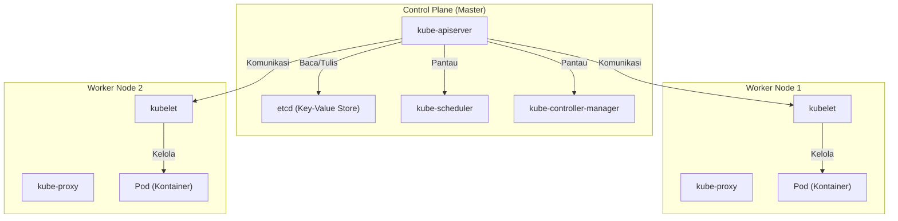

## Pengantar: Mengapa "Kontainer" Saja Tidak Cukup?

Dalam pengembangan perangkat lunak modern, teknologi kontainer yang diwakili oleh Docker telah menjadi sesuatu yang sangat diperlukan. Dengan mempaketkan aplikasi dan dependensinya ke dalam satu image, kontainer memecahkan masalah klasik "berjalan di lingkungan pengembangan tetapi tidak di lingkungan produksi", dan memberikan "portabilitas" (kemampuan untuk dipindahkan) yang luar biasa.

Namun, seiring dengan berkembangnya sistem dan diadopsinya arsitektur microservices, muncul kebutuhan untuk mengoperasikan dan mengelola ratusan bahkan ribuan kontainer. Di sinilah kita menghadapi tantangan manajemen klaster berikut:

- **Penjadwalan (Scheduling)**: Di host (server) mana kontainer harus ditempatkan? Bagaimana cara mengetahui ketersediaan sumber daya (CPU, memori)?
- **Pemulihan Otomatis (Self-healing)**: Saat kontainer atau host mati, dapatkah kontainer secara otomatis dimulai ulang di host lain?
- **Penskalaan (Scaling)**: Dapatkah jumlah kontainer ditambah atau dikurangi secara instan sesuai dengan fluktuasi lalu lintas (traffic)?
- **Penemuan Layanan (Service Discovery) dan Penyeimbangan Beban (Load Balancing)**: Bagaimana cara mendistribusikan lalu lintas secara tepat ke sekelompok kontainer yang alamat IP-nya berubah secara dinamis?
- **Manajemen Rahasia (Secrets) dan Konfigurasi**: Bagaimana cara menyampaikan informasi rahasia seperti kata sandi atau kunci API, serta file konfigurasi untuk setiap lingkungan secara aman dan fleksibel ke kontainer?

Sulit untuk memenuhi persyaratan tingkat lanjut yang mencakup banyak host ini hanya dengan Docker (atau docker-compose di host tunggal). Oleh karena itu, muncul konsep "orkestrasi kontainer", dan yang menjadi standar de facto adalah **Kubernetes (K8s)**.

---

## Asal Usul Kubernetes: Sistem Internal Google "Borg"

Tingkat kesempurnaan dan skalabilitas luar biasa dari Kubernetes berasal dari "Borg", sistem internal Google. Untuk mendukung layanan yang memiliki miliaran pengguna seperti mesin pencari, Gmail, dan YouTube, Google menjalankan dan mengelola miliaran kontainer setiap minggunya. Berdasarkan filosofi desain dan pengalaman operasional dari Borg yang merupakan inti sistem tersebut, Kubernetes didesain ulang dari awal sebagai proyek open source.

Salah satu paradigma terpenting yang dibawa oleh para pengembang Borg ke dalam Kubernetes adalah konsep "API Deklaratif (Declarative API)" dan "Putaran Rekonsiliasi (Reconciliation Loop)".

### Filosofi Desain API Deklaratif (Desired State)

Manajemen infrastruktur tradisional (seperti shell script) menggunakan pendekatan **Imperatif (Imperative)** yaitu "lakukan A, lalu B, lalu C". Sebaliknya, Kubernetes mengadopsi pendekatan **Deklaratif (Declarative)**.

Administrator cukup mendefinisikan "keadaan akhir seperti apa yang diinginkan (Desired State)" dalam file manifes berformat YAML dan mengirimkannya ke Kubernetes. Contohnya, Anda hanya perlu mendeklarasikan "Tolong pastikan ada 3 kontainer server web ini yang selalu berjalan".

Di dalam Kubernetes, ia terus memantau keadaan saat ini (Current State), dan jika berbeda dari keadaan yang diinginkan (Desired State), ia akan secara otonom mengambil tindakan untuk menyelaraskan keduanya. Inilah yang disebut "Putaran Rekonsiliasi (Reconciliation Loop)". Meskipun satu kontainer berhenti karena kegagalan node, Kubernetes secara otomatis akan membuat keputusan: "Saat ini ada 2, yang diinginkan adalah 3. Jadi, jalankan 1 yang baru".

---

## Gambaran Umum Arsitektur Kubernetes

Kubernetes secara garis besar terdiri dari dua bagian utama: **Control Plane** dan **Worker Node**.

### Control Plane: Otak dari Klaster

Control Plane adalah sekumpulan komponen yang bertanggung jawab mengendalikan seluruh klaster. Biasanya, ia terdiri dari beberapa server untuk memastikan ketersediaan tinggi (high availability).

#### 1. kube-apiserver
Ini adalah pintu masuk bagi semua komunikasi di Kubernetes. Perintah kubectl (permintaan API) dari pengguna dan komunikasi antar komponen internal semuanya melewati API Server ini. Ia melakukan otentikasi, otorisasi, validasi permintaan, serta membaca dan menulis data ke etcd (dijelaskan di bawah).

#### 2. etcd
Ini adalah penyimpan Key-Value yang terdistribusi dan memiliki ketersediaan tinggi. Ia merupakan satu-satunya database yang secara persisten menyimpan "semua status (metadata, informasi konfigurasi, status operasional)" dari klaster Kubernetes. Karena hilangnya data etcd berarti kematian bagi klaster, pencadangan (backup) yang ketat sangatlah penting.

#### 3. kube-scheduler
Ia mendeteksi Pod baru yang dibuat (yang belum ditentukan di node mana akan ditempatkan), menghitung status sumber daya (CPU, memori, disk, dll.) dari setiap Worker Node dan batasan yang ditentukan pengguna (seperti ingin menempatkan Pod ini di node dengan GPU, atau di node yang berbeda dari Pod tertentu), lalu mengalokasikan node yang optimal.

#### 4. kube-controller-manager
Ini adalah kumpulan berbagai pengontrol yang memantau status dalam klaster dan menjembatani perbedaan antara Desired State dan Current State (menjalankan putaran rekonsiliasi). Misalnya, ini termasuk Node Controller (mendeteksi kegagalan node), ReplicaSet Controller (mempertahankan jumlah Pod yang berjalan sesuai yang ditentukan), Endpoint Controller (menghubungkan Service dan Pod), dan lain-lain.

### Worker Node: Lingkungan Eksekusi Beban Kerja

Worker Node adalah server tempat kontainer aplikasi (Pod) benar-benar berjalan.

#### 1. kubelet
Ini adalah "agen" yang berjalan di setiap node. Ia menerima instruksi dari API Server dan memerintahkan runtime kontainer untuk memulai atau menghentikan kontainer. Ia juga melakukan pemeriksaan kesehatan kontainer (Liveness Probe dan Readiness Probe), dan secara berkala melaporkan status nodenya sendiri serta status Pod yang berjalan ke API Server.

#### 2. kube-proxy
Ini adalah proxy jaringan yang berjalan di setiap node dan mengimplementasikan konsep abstraksi "Service" Kubernetes di tingkat jaringan. Ia memanipulasi iptables atau IPVS, dan merutekan serta menyeimbangkan beban lalu lintas dari dalam dan luar klaster ke Pod yang sesuai.

#### 3. Container Runtime
Ini adalah perangkat lunak yang benar-benar menjalankan proses kontainer. Pada awalnya, Docker (dockershim) yang digunakan, tetapi saat ini containerd atau CRI-O yang sesuai dengan standar CRI (Container Runtime Interface) umum digunakan.

---

## Unit Terkecil Kubernetes: Pentingnya "Pod"

Di Kubernetes, Anda tidak pernah mendeploy kontainer secara langsung. Sebagai gantinya, konsep **Pod** yang digunakan. Pod adalah unit deployment terkecil di Kubernetes.

Mengapa memperkenalkan konsep Pod alih-alih menangani kontainer secara langsung?
Alasannya adalah "untuk menjalankan beberapa proses yang sangat terkait dalam lingkungan yang sama".

Di dalam satu Pod, Anda dapat menyertakan satu atau lebih kontainer. Kelompok kontainer dalam Pod yang sama akan berbagi hal-hal berikut:
- **Network Namespace**: Alamat IP dan ruang port yang sama (dapat berkomunikasi satu sama lain melalui localhost).
- **Storage Volumes**: Memasang volume disk yang sama, memungkinkan berbagi file.

### Pola Sidecar (Sidecar Pattern)

Manfaat terbesar yang dibawa oleh konsep Pod adalah realisasi pola desain kontainer seperti **pola sidecar**.
Tanpa perlu memodifikasi kontainer aplikasi utama, "kontainer sidecar" yang menjalankan peran tambahan (seperti penerusan log, enkripsi atau proksi lalu lintas, sinkronisasi data, dll.) dapat dilampirkan dalam Pod yang sama.

Contohnya, dalam service mesh (seperti Istio), proksi Envoy disuntikkan ke semua Pod sebagai sidecar, sehingga kontrol lalu lintas tingkat lanjut dan enkripsi TLS mutual dapat dicapai tanpa aplikasi utama menyadarinya.

---

## Kesimpulan: Abstraksi Infrastruktur dan Ekosistem

Kubernetes telah melampaui sekadar alat manajemen kontainer, berevolusi menjadi "Sistem Operasi era Cloud-Native" yang mengabstraksi seluruh infrastruktur cloud. Pengembang dapat mengoperasikan infrastruktur melalui Kubernetes API yang seragam, terlepas dari apakah dasarnya menggunakan AWS, GCP, atau on-premise.

Ekosistem besar telah terbentuk di sekitar Kubernetes, termasuk manajemen paket dengan Helm, GitOps dengan ArgoCD atau Flux, dan pemantauan dengan Prometheus.
Kurva pembelajarannya memang tidak landai, tetapi jika Anda memahami arsitektur yang kuat dan filosofi desain deklaratif yang berasal dari Borg, Kubernetes akan menjadi senjata yang ampuh untuk mengoperasikan sistem berskala besar dan kompleks secara stabil.
