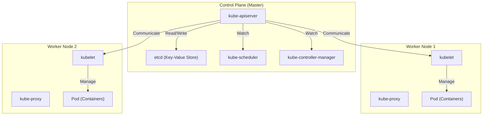

## 시작하며: 왜 '컨테이너'만으로는 불충분한가?

현대 소프트웨어 개발에 있어 Docker로 대표되는 컨테이너 기술은 필수 불가결한 존재가 되었습니다. 컨테이너는 애플리케이션과 그 의존성을 하나의 이미지로 패키징함으로써, '개발 환경에서는 작동했지만 운영 환경에서는 작동하지 않는다'는 오랜 과제를 해결하고 압도적인 '이식성(Portability)'을 가져다주었습니다.

그러나 시스템이 성장하고 마이크로서비스 아키텍처가 도입되면서, 수백 수천 개의 컨테이너를 운영하고 관리할 필요가 생깁니다. 여기서 직면하게 되는 것이 다음과 같은 클러스터 관리의 과제입니다.

- **스케줄링**: 어떤 호스트(서버)에 어떤 컨테이너를 배치해야 할까? 리소스(CPU, 메모리)의 여유 상황을 어떻게 파악할 것인가?
- **자가 치유(Self-healing)**: 컨테이너나 호스트가 다운되었을 때, 자동으로 다른 호스트에서 컨테이너를 재시작할 수 있을까?
- **스케일링**: 트래픽의 증감에 따라 순식간에 컨테이너의 수를 늘리거나 줄일 수 있을까?
- **서비스 디스커버리와 로드 밸런싱**: 동적으로 IP 주소가 변경되는 컨테이너 그룹에 대해, 어떻게 트래픽을 적절하게 분산시킬 것인가?
- **시크릿 및 구성 관리**: 비밀번호나 API 키 같은 기밀 정보, 환경별 설정 파일을 안전하고 유연하게 컨테이너에 전달하려면?

Docker 단독(또는 단일 호스트 상의 docker-compose)으로는 이러한 여러 호스트에 걸친 고도화된 요구사항을 충족하기 어렵습니다. 그래서 등장한 것이 '컨테이너 오케스트레이션'이라는 개념이며, 그 사실상의 표준(De facto standard)이 된 것이 바로 **Kubernetes(K8s)** 입니다.

---

## Kubernetes의 기원: Google의 내부 시스템 'Borg'

Kubernetes의 압도적인 완성도와 확장성은 Google의 사내 시스템인 'Borg'에서 유래했습니다. Google은 수십억 명의 사용자를 보유한 검색 엔진이나 Gmail, YouTube 등의 서비스를 지탱하기 위해 매주 수십억 개의 컨테이너를 시작하고 관리해 왔습니다. 그 심장부였던 Borg의 설계 사상과 운영 경험을 바탕으로, 오픈 소스로 처음부터 재설계된 것이 Kubernetes입니다.

Borg의 개발자들이 Kubernetes에 도입한 가장 중요한 패러다임 중 하나가 '선언적 API(Declarative API)'와 '조정 루프(Reconciliation Loop)'라는 개념입니다.

### 선언적 API(Desired State)의 설계 사상

기존의 인프라 관리(쉘 스크립트 등)는 'A를 하고, 다음으로 B를 하고, C를 해라'라는 **명령적(Imperative)** 인 접근 방식이었습니다. 반면, Kubernetes는 **선언적(Declarative)** 인 접근 방식을 채택하고 있습니다.

관리자는 '최종적으로 어떤 상태가 되었으면 좋겠는지(Desired State = 바라는 상태)'를 YAML 형식의 매니페스트 파일로 정의하여 Kubernetes에 제출합니다. 예를 들어, '이 웹 서버 컨테이너를 항상 3개 가동해 두었으면 좋겠다'고 선언하기만 하면 됩니다.

Kubernetes 내부에서는 현재 상태(Current State)를 계속해서 모니터링하며, 이것이 바라는 상태(Desired State)와 다를 경우 자율적으로 양쪽을 일치시키기 위한 조치를 취합니다. 이것이 '조정 루프'입니다. 만약 노드 장애로 1개의 컨테이너가 정지하더라도, Kubernetes가 '현재는 2개, 바라는 것은 3개. 따라서 새로 1개를 시작한다'는 판단을 자동으로 내립니다.

---

## Kubernetes 아키텍처의 전체 구조

Kubernetes는 크게 **Control Plane(컨트롤 플레인)** 과 **Worker Node(워커 노드)** 의 두 가지 주요 부분으로 구성됩니다.

### Control Plane: 클러스터의 두뇌

Control Plane은 클러스터 전체의 제어를 담당하는 컴포넌트들입니다. 일반적으로 고가용성을 보장하기 위해 여러 대의 서버로 구성됩니다.

#### 1. kube-apiserver
Kubernetes의 모든 통신의 관문입니다. 사용자의 kubectl 명령(API 요청)이나 내부 컴포넌트 간의 통신은 모두 이 API Server를 거칩니다. 인증·인가, 요청의 유효성 검증을 수행하며, 후술할 etcd에 대해 데이터를 읽고 씁니다.

#### 2. etcd
분산형이자 고가용성을 지닌 Key-Value 스토어입니다. Kubernetes 클러스터의 '모든 상태(메타데이터, 설정 정보, 가동 상황)'를 영구적으로 저장하는 유일한 데이터베이스입니다. etcd의 데이터가 손실되는 것은 클러스터의 죽음을 의미하므로 엄중한 백업이 필요합니다.

#### 3. kube-scheduler
새롭게 생성된 (아직 어떤 노드에 배치될지 결정되지 않은) Pod를 감지하고, 각 Worker Node의 리소스 상황(CPU, 메모리, 디스크 등)이나 사용자가 지정한 제약 조건(이 Pod는 GPU 탑재 노드에 배치하고 싶다, 특정 Pod와는 다른 노드에 배치하고 싶다 등)을 계산하여 최적의 노드를 할당합니다.

#### 4. kube-controller-manager
클러스터 내의 상태를 모니터링하고, Desired State와 Current State의 차이를 메우는(조정 루프를 도는) 각종 컨트롤러의 집합체입니다. 예를 들어, Node Controller(노드의 다운 감지), ReplicaSet Controller(지정된 수의 Pod가 기동되어 있는지 유지), Endpoint Controller(Service와 Pod를 연결) 등이 포함됩니다.

### Worker Node: 워크로드의 실행 환경

Worker Node는 실제로 애플리케이션 컨테이너(Pod)가 가동되는 서버입니다.

#### 1. kubelet
각 노드에서 가동되는 '에이전트'입니다. API Server로부터 지시를 받아 컨테이너 런타임에 컨테이너의 시작이나 정지를 명령합니다. 또한, 컨테이너의 상태 검사(Liveness Probe나 Readiness Probe)를 수행하고, 자신의 노드 상태와 가동 중인 Pod의 상태를 API Server에 정기적으로 보고합니다.

#### 2. kube-proxy
각 노드 상에서 동작하는 네트워크 프록시이며, Kubernetes의 'Service'라는 추상화 개념을 네트워크 수준에서 실현합니다. iptables나 IPVS 등을 조작하여 클러스터 안팎에서의 트래픽을 적절한 Pod로 라우팅 및 로드 밸런싱합니다.

#### 3. Container Runtime
실제로 컨테이너 프로세스를 실행하는 소프트웨어입니다. 초기에는 Docker(dockershim)가 사용되었지만, 현재는 CRI(Container Runtime Interface)를 준수하는 containerd나 CRI-O 등이 표준으로 사용되고 있습니다.

---

## Kubernetes의 최소 단위: 'Pod'의 중요성

Kubernetes에서는 컨테이너를 직접 배포하는 일이 없습니다. 대신 **Pod(파드)** 라는 개념을 사용합니다. Pod는 Kubernetes에 있어 최소 배포 단위입니다.

왜 컨테이너를 직접 다루지 않고 Pod라는 개념을 도입했을까요?
그것은 '강하게 결합된 여러 프로세스를 동일한 환경에서 실행하기 위해서'입니다.

하나의 Pod 안에는 하나 이상의 컨테이너를 포함할 수 있습니다. 동일한 Pod 내의 컨테이너들은 다음을 공유합니다:
- **Network Namespace**: 같은 IP 주소와 포트 공간(localhost로 상호 통신 가능)
- **Storage Volumes**: 동일한 디스크 볼륨을 마운트하여 파일 공유 가능

### 사이드카 패턴(Sidecar Pattern)

Pod 개념이 가져다준 가장 큰 혜택이 **사이드카 패턴** 등의 컨테이너 디자인 패턴의 실현입니다.
메인 애플리케이션 컨테이너에 변경을 가하지 않고, 보조적인 역할(로그 전송, 트래픽 암호화나 프록시, 데이터 동기화 등)을 수행하는 '사이드카 컨테이너'를 같은 Pod 내에 추가할 수 있습니다.

예를 들어 서비스 메시(Istio 등)에서는 모든 Pod에 Envoy 프록시가 사이드카로 주입되어, 애플리케이션 본체가 의식하지 않고도 고도화된 트래픽 제어나 상호 TLS 암호화가 실현됩니다.

---

## 요약: 인프라의 추상화와 에코시스템

Kubernetes는 단순한 컨테이너 관리 도구를 넘어, 클라우드 인프라스트럭처 전체를 추상화하는 '클라우드 네이티브 시대의 OS'로 진화했습니다. 개발자는 기반이 AWS이든, GCP이든, 온프레미스이든, 공통의 Kubernetes API를 통해 인프라를 조작할 수 있습니다.

Helm을 통한 패키지 관리, ArgoCD나 Flux를 통한 GitOps, Prometheus를 통한 모니터링 등, Kubernetes를 중심으로 거대한 에코시스템이 형성되어 있습니다.
그 학습 곡선은 결코 완만하지 않지만, Borg에서 유래한 견고한 아키텍처와 선언적인 설계 사상을 이해한다면, 대규모의 복잡한 시스템을 안정적으로 운영하기 위한 강력한 무기가 될 것입니다.
