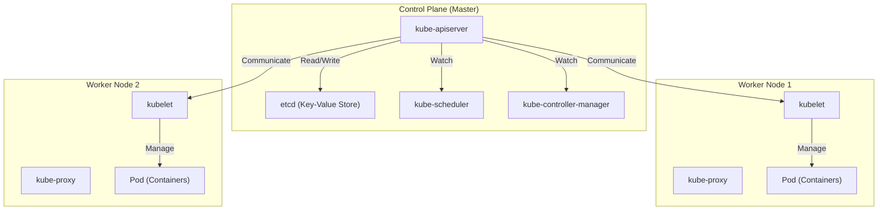

## はじめに：なぜ「コンテナ」だけでは不十分なのか？

現代のソフトウェア開発において、Dockerに代表されるコンテナ技術は不可欠な存在となりました。コンテナはアプリケーションとその依存関係を一つのイメージにパッケージ化することで、「開発環境では動いたが本番環境では動かない」という長年の課題を解決し、圧倒的な「ポータビリティ（可搬性）」をもたらしました。

しかし、システムが成長し、マイクロサービスアーキテクチャが採用されるようになると、数百、数千のコンテナを運用・管理する必要が出てきます。ここで直面するのが、以下のようなクラスタ管理の課題です。

- **スケジューリング**: どのホスト（サーバー）にどのコンテナを配置すべきか？リソース（CPU、メモリ）の空き状況をどう把握するのか？
- **自己修復（Self-healing）**: コンテナやホストがダウンした際、自動的に別のホストでコンテナを再起動できるか？
- **スケーリング**: トラフィックの増減に応じて、瞬時にコンテナの数を増減させることができるか？
- **サービスディスカバリとロードバランシング**: 動的にIPアドレスが変わるコンテナ群に対し、どうやってトラフィックを適切に分散させるのか？
- **シークレットと構成管理**: パスワードやAPIキーなどの機密情報、環境ごとの設定ファイルを安全かつ柔軟にコンテナに渡すには？

Docker単体（あるいは単一ホスト上のdocker-compose）では、これら複数ホストにまたがる高度な要件を満たすことは困難です。そこで登場したのが、「コンテナオーケストレーション」という概念であり、そのデファクトスタンダードとなったのが **Kubernetes（K8s）** です。

---

## Kubernetesの起源：Googleの内部システム「Borg」

Kubernetesの圧倒的な完成度とスケーラビリティは、Googleの社内システムである「Borg」に由来しています。Googleは何十億ものユーザーを抱える検索エンジンやGmail、YouTubeなどのサービスを支えるため、毎週数十億個ものコンテナを起動・管理していました。その心臓部であったBorgの設計思想と運用経験を元に、オープンソースとしてゼロから再設計されたのがKubernetesです。

Borgの開発者たちがKubernetesに持ち込んだ最も重要なパラダイムの一つが、「宣言的API（Declarative API）」と「調整ループ（Reconciliation Loop）」の概念です。

### 宣言的API（Desired State）の設計思想

従来のインフラ管理（シェルスクリプトなど）は、「Aをして、次にBをして、Cをして」という**命令的（Imperative）**なアプローチでした。一方、Kubernetesは**宣言的（Declarative）**なアプローチを採用しています。

管理者は、「最終的にどのような状態になっていてほしいか（Desired State = 望ましい状態）」をYAML形式のマニフェストファイルとして定義し、Kubernetesに提出します。例えば、「このWebサーバーのコンテナを常に3つ稼働させておいてほしい」と宣言するだけです。

Kubernetesの内部では、現在の状態（Current State）を監視し続け、それが望ましい状態（Desired State）と異なる場合、自律的に両者を一致させるためのアクションを起こします。これが「調整ループ」です。仮にノード障害で1つのコンテナが停止しても、Kubernetesが「現在は2つ、望ましいのは3つ。だから新しく1つ起動する」という判断を自動的に下します。

---

## Kubernetesアーキテクチャの全体像

Kubernetesは大きく分けて **Control Plane（コントロールプレーン）** と **Worker Node（ワーカーノード）** の2つの主要部分から構成されます。

### Control Plane：クラスタの頭脳

Control Planeは、クラスタ全体の制御を司るコンポーネント群です。通常、高可用性を担保するために複数台のサーバーで構成されます。

#### 1. kube-apiserver
Kubernetesのすべての通信の入り口です。ユーザーからのkubectlコマンド（APIリクエスト）や、内部コンポーネント間の通信はすべてこのAPI Serverを経由します。認証・認可、リクエストの妥当性検証を行い、後述するetcdに対してデータの読み書きを行います。

#### 2. etcd
分散型かつ高可用なKey-Valueストアです。Kubernetesクラスタの「すべての状態（メタデータ、設定情報、稼働状況）」を永続的に保存する唯一のデータベースです。etcdのデータが失われることはクラスタの死を意味するため、厳重なバックアップが必要です。

#### 3. kube-scheduler
新たに作成された（まだどのノードに配置されるか決まっていない）Podを検知し、各Worker Nodeのリソース状況（CPU、メモリ、ディスクなど）や、ユーザーが指定した制約条件（このPodはGPU搭載ノードに配置したい、特定のPodとは別のノードに配置したい等）を計算し、最適なノードを割り当てます。

#### 4. kube-controller-manager
クラスタ内の状態を監視し、Desired StateとCurrent Stateの差分を埋める（調整ループを回す）各種コントローラの集合体です。例えば、Node Controller（ノードのダウン検知）、ReplicaSet Controller（指定された数のPodが起動しているかの維持）、Endpoint Controller（ServiceとPodを紐づける）などが含まれます。

### Worker Node：ワークロードの実行環境

Worker Nodeは、実際にアプリケーションのコンテナ（Pod）が稼働するサーバーです。

#### 1. kubelet
各ノードで稼働する「エージェント」です。API Serverから指示を受け取り、コンテナランタイムにコンテナの起動や停止を命じます。また、コンテナのヘルスチェック（Liveness ProbeやReadiness Probe）を行い、自身のノードの状態と稼働中のPodの状態をAPI Serverに定期的に報告します。

#### 2. kube-proxy
各ノード上で動作するネットワークプロキシであり、Kubernetesの「Service」という抽象化概念をネットワークレベルで実現します。iptablesやIPVSなどを操作し、クラスター内外からのトラフィックを適切なPodへとルーティング・ロードバランシングします。

#### 3. Container Runtime
実際にコンテナプロセスを動かすソフトウェアです。初期はDocker（dockershim）が使われていましたが、現在はCRI（Container Runtime Interface）に準拠した containerd や CRI-O などが標準的に利用されています。

---

## Kubernetesの最小単位：「Pod」の重要性

Kubernetesでは、コンテナを直接デプロイすることはありません。代わりに **Pod（ポッド）** という概念を使用します。PodはKubernetesにおける最小のデプロイメント単位です。

なぜコンテナを直接扱わずにPodという概念を導入したのでしょうか？
それは、「強く結びついた複数のプロセスを同一環境で動かすため」です。

一つのPod内には、一つ以上のコンテナを含めることができます。同一Pod内のコンテナ群は、以下のものを共有します：
- **Network Namespace**: 同じIPアドレスとポート空間（localhostで相互通信可能）
- **Storage Volumes**: 同じディスクボリュームをマウントし、ファイル共有が可能

### サイドカーパターン（Sidecar Pattern）

Podの概念がもたらした最大の恩恵が、**サイドカーパターン**などのコンテナデザインパターンの実現です。
メインのアプリケーションコンテナに変更を加えることなく、補助的な役割（ログの転送、トラフィックの暗号化やプロキシ、データの同期など）を行う「サイドカーコンテナ」を同じPod内に添えることができます。

例えば、サービスメッシュ（Istioなど）では、すべてのPodにEnvoyプロキシがサイドカーとして注入され、アプリケーション本体が意識することなく高度なトラフィック制御や相互TLS暗号化が実現されます。

---

## まとめ：インフラの抽象化とエコシステム

Kubernetesは単なるコンテナの管理ツールを超え、クラウドインフラストラクチャ全体を抽象化する「クラウドネイティブ時代のOS」へと進化しました。開発者は基盤がAWSであろうと、GCPであろうと、オンプレミスであろうと、共通のKubernetes APIを通してインフラを操作できます。

Helmによるパッケージ管理、ArgoCDやFluxによるGitOps、Prometheusによる監視など、Kubernetesを中心に巨大なエコシステムが形成されています。
その学習曲線は決して緩やかではありませんが、Borg由来の堅牢なアーキテクチャと宣言的な設計思想を理解すれば、大規模かつ複雑なシステムを安定して運用するための強力な武器となるはずです。
