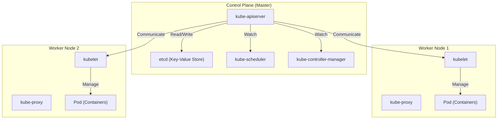

## Introdução: Por que apenas "contêineres" não são suficientes?

No desenvolvimento de software moderno, a tecnologia de contêineres, representada pelo Docker, tornou-se indispensável. Ao empacotar uma aplicação e suas dependências em uma única imagem, os contêineres resolveram o problema de longa data de "funcionou no meu ambiente de desenvolvimento, mas não funciona em produção", trazendo uma "portabilidade" incomparável.

No entanto, à medida que os sistemas crescem e arquiteturas de microsserviços são adotadas, surge a necessidade de operar e gerenciar centenas ou até milhares de contêineres. É aqui que enfrentamos os seguintes desafios no gerenciamento de clusters:

- **Agendamento (Scheduling)**: Em qual host (servidor) cada contêiner deve ser colocado? Como monitorar a disponibilidade de recursos (CPU, memória)?
- **Auto-recuperação (Self-healing)**: Quando um contêiner ou host falha, os contêineres podem ser reiniciados automaticamente em outro host?
- **Escalonamento (Scaling)**: É possível aumentar ou diminuir instantaneamente o número de contêineres em resposta às flutuações de tráfego?
- **Descoberta de Serviço e Balanceamento de Carga (Service Discovery e Load Balancing)**: Como distribuir o tráfego adequadamente para um grupo de contêineres cujos endereços IP mudam dinamicamente?
- **Gerenciamento de Segredos e Configurações**: Como passar informações confidenciais, como senhas e chaves de API, além de arquivos de configuração específicos do ambiente, de forma segura e flexível para os contêineres?

É difícil atender a esses requisitos avançados em vários hosts apenas com o Docker (ou `docker-compose` em um único host). Foi aí que surgiu o conceito de "orquestração de contêineres", sendo o **Kubernetes (K8s)** o seu padrão de fato.

---

## A Origem do Kubernetes: O Sistema Interno do Google, "Borg"

A esmagadora completude e escalabilidade do Kubernetes derivam do "Borg", o sistema interno do Google. Para suportar serviços com bilhões de usuários, como o motor de busca, Gmail e YouTube, o Google iniciava e gerenciava bilhões de contêineres a cada semana. O Kubernetes foi redesenhado do zero como código aberto, baseado na filosofia de design e na experiência operacional do Borg, que era o núcleo desse sistema.

Um dos paradigmas mais importantes que os desenvolvedores do Borg trouxeram para o Kubernetes é o conceito de "API Declarativa (Declarative API)" e "Loop de Reconciliação (Reconciliation Loop)".

### A Filosofia de Design da API Declarativa (Desired State)

O gerenciamento tradicional de infraestrutura (como scripts shell) era uma abordagem **Imperativa**, que dizia: "Faça A, depois faça B, depois faça C". Em contraste, o Kubernetes adota uma abordagem **Declarativa**.

Os administradores definem "qual estado eles desejam no final (Desired State = Estado Desejado)" como um arquivo de manifesto no formato YAML e o enviam ao Kubernetes. Por exemplo, eles simplesmente declaram: "Quero que 3 contêineres deste servidor web estejam sempre em execução".

Internamente, o Kubernetes monitora continuamente o estado atual (Current State) e, se ele diferir do estado desejado (Desired State), ele age de forma autônoma para reconciliá-los. Esse é o "Loop de Reconciliação". Se um contêiner parar devido a uma falha no nó, o Kubernetes tomará automaticamente a decisão: "Atualmente existem 2, mas o desejado são 3. Portanto, iniciarei um novo".

---

## A Visão Geral da Arquitetura do Kubernetes

O Kubernetes é composto principalmente por duas grandes partes: o **Control Plane** e o **Worker Node**.

### Control Plane: O Cérebro do Cluster

O Control Plane é um conjunto de componentes que controla todo o cluster. Geralmente, é composto por vários servidores para garantir a alta disponibilidade.

#### 1. kube-apiserver
É a porta de entrada para todas as comunicações no Kubernetes. Os comandos `kubectl` (solicitações de API) dos usuários e a comunicação entre componentes internos passam todos por este API Server. Ele realiza a autenticação, autorização, validação de solicitações e lê/escreve dados no `etcd`, descrito abaixo.

#### 2. etcd
É um armazenamento chave-valor (Key-Value Store) distribuído e altamente disponível. É o único banco de dados que salva persistentemente "todo o estado (metadados, informações de configuração, status operacional)" do cluster Kubernetes. A perda de dados no `etcd` significa a morte do cluster, portanto, backups rigorosos são necessários.

#### 3. kube-scheduler
Ele detecta Pods recém-criados (que ainda não foram atribuídos a nenhum nó) e calcula o status de recursos (CPU, memória, disco, etc.) de cada Worker Node, além das restrições especificadas pelo usuário (como colocar este Pod em um nó com GPU, ou em um nó diferente de um determinado Pod, etc.), para atribuí-los ao nó ideal.

#### 4. kube-controller-manager
É uma coleção de vários controladores que monitoram o estado do cluster e preenchem a lacuna entre o Desired State e o Current State (executando o Loop de Reconciliação). Por exemplo, inclui o Node Controller (que detecta nós inativos), o ReplicaSet Controller (que mantém o número especificado de Pods em execução) e o Endpoint Controller (que vincula Services a Pods).

### Worker Node: O Ambiente de Execução da Carga de Trabalho

Os Worker Nodes são os servidores onde os contêineres da aplicação (Pods) são executados.

#### 1. kubelet
É o "agente" executado em cada nó. Ele recebe instruções do API Server e ordena que o runtime do contêiner inicie ou pare os contêineres. Além disso, ele realiza verificações de integridade dos contêineres (Liveness Probe e Readiness Probe) e relata periodicamente o estado de seu próprio nó e o estado dos Pods em execução ao API Server.

#### 2. kube-proxy
É um proxy de rede executado em cada nó, e que implementa o conceito de abstração "Service" do Kubernetes em nível de rede. Ele manipula o `iptables` ou `IPVS` para rotear e balancear a carga do tráfego interno e externo do cluster para o Pod apropriado.

#### 3. Container Runtime
É o software que executa os processos dos contêineres de fato. Nos primórdios, o Docker (`dockershim`) era usado, mas atualmente `containerd` ou `CRI-O`, compatíveis com CRI (Container Runtime Interface), são usados por padrão.

---

## A Unidade Mínima do Kubernetes: A Importância do "Pod"

No Kubernetes, os contêineres não são implantados diretamente. Em vez disso, é utilizado o conceito de **Pod**. O Pod é a menor unidade de implantação no Kubernetes.

Por que não lidar diretamente com contêineres e introduzir o conceito de Pod?
Isso acontece "para executar vários processos fortemente acoplados no mesmo ambiente".

Dentro de um Pod, é possível incluir um ou mais contêineres. O grupo de contêineres no mesmo Pod compartilha o seguinte:
- **Network Namespace**: O mesmo endereço IP e espaço de portas (podem se comunicar via `localhost`).
- **Storage Volumes**: Montam os mesmos volumes de disco, permitindo o compartilhamento de arquivos.

### Padrão Sidecar (Sidecar Pattern)

O maior benefício trazido pelo conceito de Pod é a realização de padrões de design de contêineres, como o **Padrão Sidecar**.
Um "contêiner sidecar", que desempenha uma função auxiliar (como encaminhamento de logs, criptografia ou proxy de tráfego, sincronização de dados, etc.), pode ser adicionado no mesmo Pod sem fazer alterações no contêiner da aplicação principal.

Por exemplo, em uma Service Mesh (como Istio), um proxy Envoy é injetado como um sidecar em todos os Pods, alcançando o controle avançado de tráfego e criptografia mTLS sem que o aplicativo em si esteja ciente disso.

---

## Conclusão: Abstração de Infraestrutura e Ecossistema

O Kubernetes evoluiu além de ser apenas uma ferramenta de gerenciamento de contêineres, tornando-se o "Sistema Operacional da Era Cloud Native", que abstrai toda a infraestrutura em nuvem. Os desenvolvedores podem operar a infraestrutura através da API comum do Kubernetes, seja a base subjacente AWS, GCP ou on-premises.

Um enorme ecossistema se formou em torno do Kubernetes, incluindo gerenciamento de pacotes com Helm, GitOps com ArgoCD ou Flux e monitoramento com Prometheus.
Sua curva de aprendizado não é de forma alguma leve, mas se você compreender a arquitetura robusta e a filosofia de design declarativa derivadas do Borg, ele certamente se tornará uma arma poderosa para operar de forma estável sistemas de grande escala e complexos.
