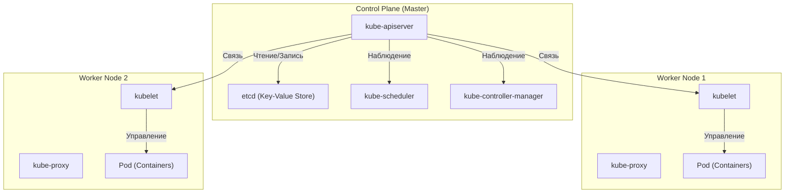

## Введение: Почему одних "контейнеров" недостаточно?

В современной разработке программного обеспечения контейнерные технологии, такие как Docker, стали незаменимыми. Упаковывая приложение и его зависимости в один образ, контейнеры решили давнюю проблему «работает в среде разработки, но не работает в продакшене», обеспечив невероятную «портативность» (переносимость).

Однако по мере роста систем и внедрения микросервисной архитектуры возникает необходимость эксплуатации и управления сотнями или тысячами контейнеров. Здесь мы сталкиваемся со следующими проблемами управления кластером:

- **Планирование (Scheduling)**: На каком хосте (сервере) следует разместить тот или иной контейнер? Как отслеживать доступность ресурсов (процессор, память)?
- **Самовосстановление (Self-healing)**: Если контейнер или хост падает, может ли контейнер автоматически перезапуститься на другом хосте?
- **Масштабирование (Scaling)**: Можно ли мгновенно увеличивать или уменьшать количество контейнеров в зависимости от колебаний трафика?
- **Обнаружение сервисов и балансировка нагрузки (Service discovery & Load balancing)**: Как правильно распределять трафик между группой контейнеров с динамически меняющимися IP-адресами?
- **Управление секретами и конфигурацией**: Как безопасно и гибко передавать контейнерам конфиденциальную информацию, такую как пароли и ключи API, а также конфигурационные файлы для разных сред?

Используя только Docker (или docker-compose на одном хосте), сложно удовлетворить эти сложные требования, охватывающие множество хостов. Так появилась концепция «оркестрации контейнеров», де-факто стандартом которой стал **Kubernetes (K8s)**.

---

## Происхождение Kubernetes: Внутренняя система Google "Borg"

Потрясающее совершенство и масштабируемость Kubernetes происходят от внутренней системы Google "Borg". Чтобы поддерживать работу таких сервисов, как поисковая система, Gmail и YouTube, которыми пользуются миллиарды пользователей, Google еженедельно запускал и управлял миллиардами контейнеров. Kubernetes был перепроектирован с нуля как проект с открытым исходным кодом на основе философии дизайна и опыта эксплуатации Borg, который был сердцем этой системы.

Одни из самых важных парадигм, которые разработчики Borg привнесли в Kubernetes, — это концепции «Декларативного API (Declarative API)» и «Цикла согласования (Reconciliation Loop)».

### Философия дизайна Декларативного API (Desired State)

Традиционное управление инфраструктурой (например, shell-скрипты) использовало **императивный (Imperative)** подход: «сделай А, затем сделай Б, затем сделай В». В свою очередь, Kubernetes использует **декларативный (Declarative)** подход.

Администраторы определяют, «каким должно быть конечное состояние (Desired State = Желаемое состояние)» в виде манифеста формата YAML и отправляют его в Kubernetes. Например, вы просто заявляете: «Я хочу, чтобы постоянно работало 3 контейнера этого веб-сервера».

Внутри Kubernetes постоянно отслеживает текущее состояние (Current State), и если оно отличается от желаемого состояния (Desired State), он автономно предпринимает действия для их синхронизации. Это и есть «Цикл согласования». Даже если один контейнер останавливается из-за сбоя узла, Kubernetes автоматически решает: «Сейчас их два, а желательно три. Значит, я запущу еще один новый».

---

## Общая архитектура Kubernetes

Kubernetes в основном состоит из двух главных частей: **Control Plane (Панель управления)** и **Worker Node (Рабочий узел)**.

### Control Plane: Мозг кластера

Control Plane — это набор компонентов, отвечающих за управление всем кластером. Обычно для обеспечения высокой доступности он состоит из нескольких серверов.

#### 1. kube-apiserver
Это точка входа для всех коммуникаций в Kubernetes. Команды kubectl (API-запросы) от пользователей и внутренние коммуникации между компонентами проходят через этот API Server. Он выполняет аутентификацию, авторизацию, проверку правильности запросов и читает/пишет данные в etcd, который описан ниже.

#### 2. etcd
Это распределенное и высокодоступное хранилище "ключ-значение" (Key-Value Store). Это единственная база данных, в которой постоянно хранится «все состояние (метаданные, настройки, статус работы)» кластера Kubernetes. Потеря данных etcd означает смерть кластера, поэтому необходимо тщательное резервное копирование.

#### 3. kube-scheduler
Он обнаруживает новые созданные Pod'ы (для которых еще не определено, на каком узле они будут размещены) и назначает им оптимальный узел. При этом учитывается состояние ресурсов (CPU, память, диск и т.д.) каждого Worker Node, а также ограничения, заданные пользователем (например, желание разместить этот Pod на узле с GPU или на узле, отличном от определенного Pod'а).

#### 4. kube-controller-manager
Это набор различных контроллеров, которые отслеживают состояние кластера и устраняют разницу между Desired State и Current State (запускают цикл согласования). Например, сюда входят Node Controller (обнаружение падения узлов), ReplicaSet Controller (поддержание заданного количества работающих Pod'ов) и Endpoint Controller (связывание Service и Pod).

### Worker Node: Среда выполнения рабочих нагрузок

Worker Node — это серверы, на которых фактически работают контейнеры (Pod'ы) приложений.

#### 1. kubelet
Это «агент», работающий на каждом узле. Он получает инструкции от API Server и отдает команды среде выполнения контейнеров на их запуск или остановку. Он также выполняет проверки работоспособности контейнеров (Liveness Probe и Readiness Probe) и регулярно сообщает API Server о состоянии собственного узла и запущенных Pod'ов.

#### 2. kube-proxy
Это сетевой прокси, работающий на каждом узле, который реализует абстрактную концепцию Kubernetes под названием «Service» на сетевом уровне. Управляя iptables или IPVS, он маршрутизирует и балансирует трафик внутри и снаружи кластера к соответствующим Pod'ам.

#### 3. Container Runtime
Это программное обеспечение, которое фактически запускает процессы контейнеров. Раньше использовался Docker (dockershim), но теперь стандартом является использование containerd или CRI-O, соответствующих стандарту CRI (Container Runtime Interface).

---

## Минимальная единица Kubernetes: Важность "Pod"

В Kubernetes контейнеры не развертываются напрямую. Вместо этого используется концепция **Pod (Под)**. Pod — это минимальная единица развертывания в Kubernetes.

Почему была введена концепция Pod'а, а не прямое управление контейнерами?
Это сделано «для запуска тесно связанных процессов в одной среде».

Внутри одного Pod'а может находиться один или несколько контейнеров. Группа контейнеров в одном Pod'е разделяет следующее:
- **Network Namespace**: Одно и то же пространство IP-адресов и портов (могут взаимодействовать друг с другом через localhost).
- **Storage Volumes**: Монтирование общих дисковых томов, что позволяет обмениваться файлами.

### Паттерн "Sidecar" (Sidecar Pattern)

Наибольшее преимущество, которое принесла концепция Pod'а, — это реализация паттернов проектирования контейнеров, таких как **паттерн Sidecar**.
Без внесения изменений в основной контейнер приложения вы можете добавить в тот же Pod «sidecar-контейнер», который выполняет вспомогательные функции (пересылка логов, шифрование трафика или проксирование, синхронизация данных и т.д.).

Например, в service mesh (таких как Istio) прокси Envoy внедряется во все Pod'ы в качестве sidecar'а, обеспечивая расширенное управление трафиком и взаимное TLS-шифрование без необходимости изменять само приложение.

---

## Заключение: Абстракция инфраструктуры и экосистема

Kubernetes вышел за рамки простого инструмента для управления контейнерами и превратился в «операционную систему эпохи cloud-native», которая абстрагирует всю облачную инфраструктуру. Независимо от того, является ли базовой инфраструктурой AWS, GCP или локальные серверы, разработчики могут управлять ею через единый Kubernetes API.

Вокруг Kubernetes сформировалась огромная экосистема: управление пакетами с помощью Helm, GitOps с помощью ArgoCD или Flux, мониторинг с помощью Prometheus.
Хотя кривая обучения ни в коем случае не является пологой, как только вы поймете надежную архитектуру и декларативную философию дизайна, унаследованные от Borg, Kubernetes станет мощным оружием для стабильной эксплуатации крупномасштабных и сложных систем.
