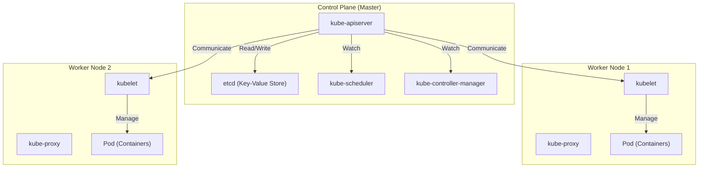

## 引言：为什么仅仅依靠“容器”是不够的？

在现代软件开发中，以Docker为代表的容器技术已成为不可或缺的存在。容器通过将应用程序及其依赖项打包到一个镜像中，解决了长期存在的“在开发环境中能运行但在生产环境中无法运行”的难题，并带来了压倒性的“可移植性”。

然而，随着系统的发展并开始采用微服务架构，就需要运营和管理成百上千的容器。此时面临的是如下所示的集群管理挑战：

- **调度 (Scheduling)**：应该将哪个容器部署到哪个主机（服务器）上？如何掌握资源（CPU、内存）的空闲状况？
- **自我修复 (Self-healing)**：当容器或主机宕机时，能否自动在另一台主机上重启容器？
- **弹性伸缩 (Scaling)**：能否根据流量的增减，瞬间增加或减少容器的数量？
- **服务发现和负载均衡 (Service Discovery and Load Balancing)**：对于IP地址动态变化的容器群，如何将流量适当地进行分配？
- **密钥与配置管理 (Secret and Configuration Management)**：如何安全且灵活地将密码、API密钥等机密信息以及各环境的配置文件传递给容器？

仅靠Docker（或单机上的docker-compose），很难满足这些跨越多台主机的高级需求。因此，“容器编排”这一概念应运而生，而成为其事实标准的便是 **Kubernetes (K8s)**。

---

## Kubernetes的起源：Google内部系统“Borg”

Kubernetes压倒性的成熟度和可扩展性源于Google的内部系统“Borg”。为了支撑拥有数十亿用户的搜索引擎、Gmail、YouTube等服务，Google每周都会启动并管理数十亿个容器。Kubernetes正是基于其核心Borg的设计思想和运营经验，作为开源项目从零开始重新设计的产物。

Borg的开发者们带入Kubernetes的最重要的范式之一，就是“声明式API (Declarative API)”和“协调循环 (Reconciliation Loop)”的概念。

### 声明式API (Desired State) 的设计理念

传统的底层基础设施管理（如Shell脚本）是一种“先做A，接着做B，最后做C”的**命令式 (Imperative)**方法。相反，Kubernetes采用了**声明式 (Declarative)**方法。

管理员将“最终希望达到什么样的状态 (Desired State = 期望状态)”定义为YAML格式的清单文件，并将其提交给Kubernetes。例如，只需声明“我希望始终保持运行3个此Web服务器的容器”即可。

在Kubernetes内部，它会持续监控当前状态 (Current State)，如果当前状态与期望状态 (Desired State) 不同，它会自主采取行动使两者一致。这就是“协调循环”。假设由于节点故障导致一个容器停止运行，Kubernetes会自动做出判断：“现在有2个，期望是3个。所以需要新启动1个。”

---

## Kubernetes架构全貌

Kubernetes主要由两个核心部分构成：**控制平面 (Control Plane)** 和 **工作节点 (Worker Node)**。

### 控制平面 (Control Plane)：集群的大脑

控制平面是负责控制整个集群的组件群。通常，为了保证高可用性，它会由多台服务器组成。

#### 1. kube-apiserver
它是Kubernetes所有通信的入口。来自用户的kubectl命令（API请求）以及内部组件之间的通信，都将经过此API Server。它负责身份验证、授权、验证请求的有效性，并对后面提到的etcd进行数据的读写操作。

#### 2. etcd
它是一个分布式且高可用的键值存储。它是唯一一个持久保存Kubernetes集群“所有状态（元数据、配置信息、运行状态）”的数据库。etcd数据的丢失意味着集群的死亡，因此需要进行严格的备份。

#### 3. kube-scheduler
它负责检测新创建的（尚未决定分配到哪个节点上的）Pod，并根据各工作节点的资源状况（CPU、内存、磁盘等）以及用户指定的约束条件（例如希望将该Pod分配到配备GPU的节点，或与特定的Pod分配到不同的节点等）进行计算，为其分配最合适的节点。

#### 4. kube-controller-manager
它是监视集群内状态并填补期望状态与当前状态之间差异（运行协调循环）的各类控制器的集合体。例如，它包括Node Controller（检测节点宕机）、ReplicaSet Controller（维持指定数量的Pod处于运行状态）、Endpoint Controller（关联Service与Pod）等。

### 工作节点 (Worker Node)：工作负载的执行环境

工作节点是实际运行应用程序容器 (Pod) 的服务器。

#### 1. kubelet
它是在各节点上运行的“代理”。它从API Server接收指令，并命令容器运行时启动或停止容器。此外，它还执行容器的健康检查（Liveness Probe和Readiness Probe），并定期向API Server报告其自身节点的状态以及正在运行的Pod的状态。

#### 2. kube-proxy
它是在各节点上运行的网络代理，在网络层面上实现了Kubernetes中“Service”这一抽象概念。它通过操作iptables或IPVS等，将来自集群内外的流量路由并负载均衡到合适的Pod。

#### 3. Container Runtime
它是实际运行容器进程的软件。早期使用的是Docker (dockershim)，但现在标准使用符合CRI (Container Runtime Interface) 规范的 containerd 或 CRI-O 等。

---

## Kubernetes的最小单位：“Pod”的重要性

在Kubernetes中，不会直接部署容器，而是使用**Pod**这一概念。Pod是Kubernetes中最小的部署单位。

为什么不直接操作容器，而是引入了Pod这一概念呢？
这是因为“为了将紧密耦合的多个进程在同一个环境中运行”。

一个Pod内可以包含一个或多个容器。同一个Pod内的容器群共享以下内容：
- **网络命名空间 (Network Namespace)**：相同的IP地址和端口空间（可以通过localhost相互通信）
- **存储卷 (Storage Volumes)**：挂载相同的磁盘卷，实现文件共享

### Sidecar 模式 (Sidecar Pattern)

Pod概念带来的最大好处之一，就是实现了**Sidecar模式**等容器设计模式。
在不修改主要应用程序容器的情况下，可以将执行辅助作用（如日志转发、流量加密及代理、数据同步等）的“Sidecar容器”附加到同一个Pod中。

例如，在服务网格（如Istio）中，Envoy代理作为Sidecar被注入到所有的Pod中，应用程序本身无需感知，即可实现高级流量控制和双向TLS加密。

---

## 总结：基础设施的抽象与生态系统

Kubernetes已经超越了单纯的容器管理工具，演变成为抽象了整个云基础设施的“云原生时代的操作系统”。无论底层基础架构是AWS、GCP还是本地部署 (On-premises)，开发者都可以通过通用的Kubernetes API来操作基础设施。

以Kubernetes为中心，已经形成了一个庞大的生态系统，例如使用Helm进行包管理，使用ArgoCD或Flux实现GitOps，以及使用Prometheus进行监控等。
虽然它的学习曲线绝对不算平缓，但只要理解了源于Borg的稳健架构和声明式的设计理念，它必将成为稳定运营大规模复杂系统的强有力武器。
