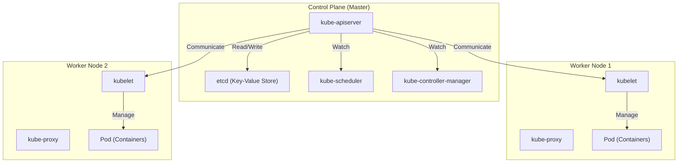

## 前言：為什麼只有「容器」是不夠的？

在現代軟體開發中，以 Docker 為代表的容器技術已成為不可或缺的存在。容器透過將應用程式及其相依性打包成單一映像檔，解決了長久以來「在開發環境能執行，但在正式環境卻無法執行」的問題，並帶來了壓倒性的「可攜性 (Portability)」。

然而，隨著系統成長並開始採用微服務架構，我們需要維運和管理數百、數千個容器。此時我們面臨的叢集管理挑戰如下：

- **排程 (Scheduling)**: 應該將哪個容器部署在哪台主機 (伺服器) 上？如何掌握資源 (CPU、記憶體) 的可用狀況？
- **自我修復 (Self-healing)**: 當容器或主機發生故障時，能否自動在另一台主機上重新啟動容器？
- **擴展 (Scaling)**: 能否根據流量的增減，瞬間增加或減少容器的數量？
- **服務發現與負載平衡 (Service Discovery and Load Balancing)**: 面對 IP 位址動態變化的容器群，如何適當地分配流量？
- **機密與設定管理 (Secrets and Configuration Management)**: 如何安全且靈活地將密碼或 API 金鑰等機密資訊，以及不同環境的設定檔傳遞給容器？

僅靠 Docker 本身 (或是單一主機上的 docker-compose)，很難滿足這些橫跨多台主機的高階需求。因此出現了「容器編排 (Container Orchestration)」的概念，而 **Kubernetes (K8s)** 便成為了該領域的業界標準。

---

## Kubernetes 的起源：Google 內部系統「Borg」

Kubernetes 壓倒性的完成度與擴展性，源自於 Google 的內部系統「Borg」。為了支撐擁有數十億使用者的搜尋引擎、Gmail、YouTube 等服務，Google 每週都要啟動並管理數十億個容器。Kubernetes 便是以其核心系統 Borg 的設計理念與維運經驗為基礎，作為開源專案從零開始重新設計而成。

Borg 開發者們帶入 Kubernetes 中最重要的典範之一，就是「宣告式 API (Declarative API)」與「協調迴圈 (Reconciliation Loop)」的概念。

### 宣告式 API (Desired State) 的設計理念

傳統的基礎設施管理 (如 Shell Script) 是「先做 A，再做 B，接著做 C」的**指令式 (Imperative)** 方法。而 Kubernetes 則採用了**宣告式 (Declarative)** 的方法。

管理員將「最終希望達到什麼樣的狀態 (Desired State = 期望狀態)」定義為 YAML 格式的 Manifest 檔案，並提交給 Kubernetes。舉例來說，只需宣告「我希望隨時有 3 個這個 Web 伺服器的容器正在執行」即可。

在 Kubernetes 內部會持續監控當前狀態 (Current State)，如果它與期望狀態 (Desired State) 不同，就會自主採取行動讓兩者一致。這就是「協調迴圈」。假設因為節點故障導致 1 個容器停止運作，Kubernetes 就會自動做出判斷：「現在有 2 個，期望是 3 個。因此要再啟動 1 個新的」。

---

## Kubernetes 架構全貌

Kubernetes 大致可分為 **Control Plane (控制平面)** 與 **Worker Node (工作節點)** 兩個主要部分。

### Control Plane：叢集的大腦

Control Plane 是負責控制整個叢集的元件群。通常為了確保高可用性，會由多台伺服器組成。

#### 1. kube-apiserver
這是 Kubernetes 所有通訊的入口。使用者發出的 kubectl 指令 (API 請求) 或內部元件間的通訊，全都會經過這個 API Server。它會進行身分驗證、授權、驗證請求的妥當性，並對稍後提到的 etcd 進行資料的讀寫。

#### 2. etcd
這是一個分散式且具備高可用性的 Key-Value 儲存系統。它是唯一一個會永久保存 Kubernetes 叢集「所有狀態 (元資料、設定資訊、運作狀況)」的資料庫。如果 etcd 的資料遺失，就意味著叢集死亡，因此需要嚴格的備份機制。

#### 3. kube-scheduler
它會偵測新建立 (尚未決定部署在哪個節點) 的 Pod，並計算各 Worker Node 的資源狀況 (CPU、記憶體、磁碟等) 以及使用者指定的限制條件 (例如希望這個 Pod 部署在配備 GPU 的節點上、希望部署在與某個特定 Pod 不同的節點上等)，進而分配最合適的節點。

#### 4. kube-controller-manager
它是各種控制器的集合體，負責監控叢集內的狀態，並填補期望狀態 (Desired State) 與當前狀態 (Current State) 之間的差異 (執行協調迴圈)。例如包含 Node Controller (偵測節點故障)、ReplicaSet Controller (維持指定數量的 Pod 正在執行)、Endpoint Controller (將 Service 與 Pod 關聯起來) 等。

### Worker Node：工作負載的執行環境

Worker Node 是實際執行應用程式容器 (Pod) 的伺服器。

#### 1. kubelet
這是在各節點上執行的「代理程式 (Agent)」。它會接收來自 API Server 的指示，並命令容器執行環境 (Container Runtime) 啟動或停止容器。此外，它也會進行容器的健康檢查 (Liveness Probe 與 Readiness Probe)，並定期向 API Server 回報自身節點與執行中 Pod 的狀態。

#### 2. kube-proxy
這是在各節點上運作的網路代理程式，能在網路層級實現 Kubernetes 的「Service」抽象概念。它會操作 iptables 或 IPVS 等，將來自叢集內外的流量路由並進行負載平衡到合適的 Pod。

#### 3. Container Runtime
這是實際執行容器處理程序的軟體。初期使用的是 Docker (dockershim)，但現在標準使用的是符合 CRI (Container Runtime Interface) 規範的 containerd 或 CRI-O 等。

---

## Kubernetes 的最小單位：「Pod」的重要性

在 Kubernetes 中，我們不會直接部署容器。取而代之的是使用 **Pod** 這個概念。Pod 是 Kubernetes 中最小的部署單位。

為什麼不直接處理容器，而是要引入 Pod 的概念呢？
這是因為「為了讓緊密關聯的多個處理程序能在同一個環境下運作」。

在一個 Pod 內，可以包含一個以上的容器。同一個 Pod 內的容器群會共享以下資源：
- **Network Namespace**: 相同的 IP 位址與連接埠空間 (可透過 localhost 互相通訊)
- **Storage Volumes**: 掛載相同的磁碟區，可進行檔案共享

### 邊車模式 (Sidecar Pattern)

Pod 概念帶來的最大好處，就是實現了**邊車模式 (Sidecar Pattern)** 等容器設計模式。
我們可以在不修改主要應用程式容器的情況下，將執行輔助任務 (如日誌傳輸、流量加密與代理、資料同步等) 的「邊車容器」附加在同一個 Pod 中。

例如在服務網格 (Service Mesh，如 Istio) 中，Envoy 代理程式會作為邊車被注入到所有 Pod 內，在應用程式本身不知情的情況下，實現高階的流量控制與雙向 TLS 加密。

---

## 總結：基礎設施的抽象化與生態系

Kubernetes 已超越了單純的容器管理工具，進化為將整體雲端基礎設施抽象化的「雲端原生時代作業系統」。無論底層基礎設施是 AWS、GCP 還是地端環境，開發者都能透過共通的 Kubernetes API 來操作基礎設施。

從 Helm 的套件管理、ArgoCD 與 Flux 的 GitOps，到 Prometheus 的監控，以 Kubernetes 為中心已形成了一個龐大的生態系。
雖然它的學習曲線絕不算平緩，但只要理解源自 Borg 的堅固架構與宣告式設計理念，它必定會成為穩定維運大規模且複雜系統的強大武器。
