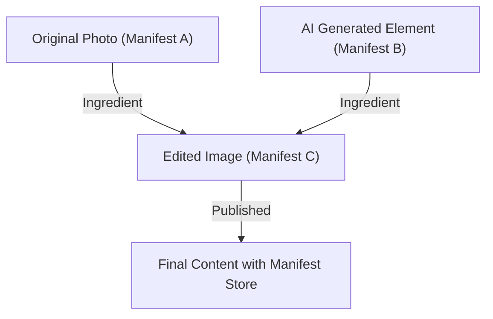

## 1. خلفية مبادرة مصادقة المحتوى (CAI) و C2PA

في السنوات الأخيرة، شهدت تقنية تركيب الصور والصوت والفيديو باستخدام الذكاء الاصطناعي التوليدي تطوراً هائلاً. في حين أن هذا الابتكار التكنولوجي يجلب للمبدعين طرقاً جديدة للتعبير، فإنه يسهل أيضاً توليد تزييف عميق متقن للغاية، مما أصبح مشكلة اجتماعية تهدد سلامة فضاء المعلومات. مع تزايد المخاوف بشأن انتشار الأخبار المزيفة واستخدامها في الاحتيال والتلاعب بالرأي العام، أصبحت مسألة كيفية ضمان موثوقية المحتوى الرقمي أمراً ملحاً.

لمعالجة هذه المشكلة، أسست ثلاث شركات هي Adobe و Twitter (الآن X) و The New York Times "مبادرة مصادقة المحتوى (CAI)" في عام 2019. التركيز الرئيسي لـ CAI ليس الحكم على "صحة" الوسائط، بل تتبع وإثبات "مصدر" أو "سجل (Provenance)" المحتوى. كقاعدة تقنية لتجسيد هذه الرؤية، انضمت شركات مثل Microsoft و Intel و Arm و Truepic وغيرها، وفي عام 2021 تم تأسيس منظمة التقييس المشتركة "C2PA (التحالف من أجل مصدر المحتوى وموثوقيته)". تقوم C2PA بوضع مواصفات فنية مفتوحة وقابلة للتشغيل البيني (مواصفات C2PA) تمتد من الأجهزة إلى البرمجيات.

## 2. الكشف (Detection) مقابل السجل (Provenance)

في مكافحة التزييف العميق، تنقسم الأساليب عموماً إلى فئتين: "الكشف" و "إثبات السجل".

**الكشف (Detection)** هو أسلوب يستخدم تقنية تحليل الصور ونماذج الذكاء الاصطناعي لتحليل ما إذا كان المحتوى يحتوي على آثار تلاعب مصطنعة (مثل حدود البكسل غير الطبيعية، أو انعكاسات الضوء التي تتعارض مع قوانين الفيزياء) بعد وقوعها. ومع ذلك، فإن تطور تقنية التوليد يتفوق دائماً على تقنية الكشف، مما يخلق وضعاً أشبه بـ "لعبة القط والفأر"، ويعتبر من الصعب رياضياً اكتشاف التزييف المولد بخوارزميات غير معروفة بنسبة 100٪.

من ناحية أخرى، فإن **إثبات السجل (Provenance)** الذي تتبناه C2PA هو نهج يسجل بشكل مشفر "العملية" من إنشاء المحتوى إلى تحريره ونشره، ويرفقه بشكل قابل للتحقق. يختلف هذا عن "العلامات المائية (Watermarking)"، حيث لا يتم تعديل بيانات الصورة نفسها بشكل لا رجعة فيه، ولكن يتم إرفاق (أو ربط) معلومات السجل الموقعة تشفيرياً كبيانات وصفية. يتيح ذلك للمستخدمين التحقق بأنفسهم "من، متى، وما هي الأدوات التي استخدمت لإنشاء وتحرير هذا المحتوى" والحكم على موثوقيته.

## 3. بنية بيانات C2PA: مخزن البيان (Manifest Store)، المكونات (Ingredients)، والتأكيدات (Assertions)

في مواصفات C2PA، يتم تغليف معلومات سجل المحتوى في بنية بيانات تسمى "البيان (Manifest)". في حالة وجود سجلات تحرير متعددة، يتم تجميعها كـ "مخزن البيان (Manifest Store)".

- **مخزن البيان (Manifest Store)**: حاوية تخزن جميع البيانات (Manifests) المتعلقة بالمحتوى المعني. يتم التعامل مع البيان الأحدث على أنه الحالة النشطة، ويحتوي على البيان الأصل الذي يشير إلى سجلات التحرير السابقة.
- **البيان (Manifest)**: مجموعة من المعلومات المتعلقة بحدث إنشاء أو تحرير واحد.
- **التأكيدات (Assertions)**: وحدة معلومات الإعلان المحددة التي يتكون منها البيان. تتضمن معلومات المنشئ، والأدوات المستخدمة (البرامج أو الكاميرات)، ومعلومات GPS وبيانات EXIF في وقت الالتقاط، وعلامات تشير إلى ما إذا كان قد تم إنشاؤه بواسطة الذكاء الاصطناعي أم لا، وسجل الإجراءات الذي يوضح عمليات التحرير التي تم إجراؤها (مثل القص وتصحيح الألوان).
- **المكونات (Ingredients)**: معلومات السجل للمواد (مثل الصور الأصلية) المستخدمة أثناء التحرير. عند دمج صور متعددة، يتم تسجيل كل صورة كمكون (Ingredient) في البيان، مما يشكل شجرة أنساب معقدة.

لضمان قابلية التوسع، تتم كتابة هذه البيانات الوصفية بتنسيق **JSON-LD** (JavaScript Object Notation for Linked Data) وهو معيار الويب الدلالي. يتيح ذلك إمكانية القراءة آلياً بينما يسمح بتبادل البيانات المرن وتعريف الأنطولوجيا بين الأنظمة المختلفة.

## 4. الربط التشفيري: التجزئة (Hash) وشجرة ميركل (Merkle Tree)

أكبر ميزة في C2PA هي أن بيانات البكسل للمحتوى ومعلومات البيان (Manifest) "مرتبطة تشفيريًا". في حين أنه يمكن تعديل البيانات الوصفية بسهولة، تستخدم C2PA وظائف التجزئة (مثل SHA-256 و SHA-384) لمنع التلاعب.

بشكل ملموس، يتم حساب قيمة التجزئة لبيانات الصورة نفسها وقيمة التجزئة لكل تأكيد (Assertion). يتم تجميع قيم التجزئة هذه في تأكيد معين داخل البيان، وتؤول جميع المعلومات في النهاية إلى قيمة تجزئة واحدة. عندما يوجد سجل تحرير معقد (مكونات Ingredients)، يتم استخدام بنية **شجرة ميركل (Merkle Tree)**.

باستخدام شجرة ميركل، يمكن التحقق بكفاءة مما إذا كان عنصر معين (مثل وجود مكون Ingredient معين) قد تم التلاعب به دون إعادة حساب البيانات بأكملها. إذا قام شخص ضار بتغيير حتى بت واحد من بكسلات الصورة أو تعديل اسم المؤلف في البيان، فإن قيمة التجزئة المحسوبة ستتغير بشكل جذري وستفشل في التحقق مع التوقيع الرقمي الموضح أدناه، مما يكشف عن التلاعب على الفور.

## 5. البنية التحتية للمفتاح العام (PKI) والتوقيع الرقمي

بالإضافة إلى ضمان اتساق البيانات باستخدام قيم التجزئة، يتم استخدام التوقيعات الرقمية لإثبات أن البيان قد تم إنشاؤه بواسطة "كيان موثوق (مثل برنامج أو كاميرا أو خدمة توقيع)".

تعتمد C2PA على البنية التحتية للمفتاح العام (PKI) استنادًا إلى **شهادات X.509**. تشمل خوارزميات التوقيع المستخدمة RSA (للتوافق مع الإصدارات السابقة) و **ECDSA** (خوارزمية التوقيع الرقمي للمنحنى الإهليلجي) وحتى تشفير المنحنى الإهليلجي الأسرع والأكثر أمانًا مثل **Ed25519**.

1. **توليد التوقيع**: تقوم برامج التحرير (مثل Photoshop) أو أجهزة الكاميرا بتشفير (توقيع) قيمة التجزئة للبيان باستخدام مفتاحها الخاص.
2. **سلسلة الثقة (Chain of Trust)**: يُرفق بالتوقيع شهادة X.509 تحتوي على المفتاح العام المقابل. تشكل هذه الشهادة "سلسلة ثقة (Chain of Trust)" تمتد من المرجع المصدق الوسيط (ICA) إلى المرجع المصدق الجذري (Root CA).
3. **التحقق (Validation)**: يقوم المتصفح أو العارض الذي يعرض المحتوى بالتحقق من صحة الشهادة بناءً على المفتاح العام للمرجع المصدق الجذري (قائمة الثقة)، ويفك تشفير التوقيع باستخدام المفتاح العام للتأكد من تطابقه مع قيمة التجزئة المحسوبة.

يؤدي هذا إلى إثبات حقيقة رياضية بأنه "تم توقيعه على خادم Adobe" أو "تم التقاطه بكاميرا Nikon من طراز معين".

## 6. تكامل الأجهزة: الجيب الآمن داخل الكاميرا (Secure Enclave)

لا يقتصر الأمر على التوقيعات على مستوى البرمجيات (على سبيل المثال، عند التصدير من برنامج تحرير الصور)، بل يتم التركيز بشكل كبير على تطبيقات C2PA على مستوى الأجهزة في أجهزة التصوير، وهي "المنبع" للمعلومات.

تتقدم شركات الكاميرات مثل Leica و Sony و Nikon بجهود لدمج **الجيب الآمن (Secure Enclave) / بيئة التنفيذ الموثوقة (TEE)** داخل محرك معالجة الصور للكاميرا.
في اللحظة التي يضرب فيها الضوء مستشعر الكاميرا ويتحول إلى بيانات رقمية (RAW)، يتم إجراء توقيع باستخدام مفتاح خاص مخزن في منطقة محمية على مستوى الأجهزة. لا يمكن استخراج هذا المفتاح الخاص أبدًا من الكاميرا، وهو محمي أيضًا من التلاعب بالبرامج الثابتة.

من خلال "التوقيع في وقت الالتقاط (Capture-time signing)"، يصبح من الممكن إثبات أنها صورة أصلية التقطت للعالم الحقيقي من أكثر نقطة موثوقية.

## 7. طريقة التضمين: JUMBF (JPEG Universal Metadata Box Format)

كيف يتم تخزين مخزن البيان (Manifest Store) والتوقيع التشفيري الذي تم إنشاؤه في الملف؟ للتعامل مع تنسيقات الملفات المتنوعة (مثل JPEG و PNG و WebP و MP4)، تستخدم C2PA تنسيق الحاوية القياسي **JUMBF (ISO/IEC 19566-5)**.

JUMBF هو معيار يحدد صناديق البيانات الوصفية (Boxes) الهرمية والقابلة للتوسيع داخل البيانات الثنائية.
على سبيل المثال، في حالة ملف JPEG، يتم تخزين بيانات C2PA كصندوق JUMBF داخل مقطع العلامة `APP11`. تكمن ميزة هذه الطريقة في أنه حتى عند فتح الصورة في عارض صور تقليدي (برنامج لا يدعم C2PA)، يتم تجاهل صندوق JUMBF، لذلك لا يؤثر على عرض الصورة نفسها (مما يضمن التوافق مع الإصدارات السابقة).

## 8. التبني في العالم الحقيقي والتحديات (Real-world Adoption)

دخل معيار C2PA مرحلة الانتشار السريع. قامت Adobe بدمج وظائف C2PA كـ "Content Credentials" في Photoshop و Firefly (الذكاء الاصطناعي التوليدي)، وتقوم بإرفاق معلومات السجل تلقائياً لصور الذكاء الاصطناعي التي تولدها. كما أعلنت ونفذت كل من Bing Image Creator من Microsoft و DALL-E 3 من OpenAI دعمها لـ C2PA.
بالإضافة إلى ذلك، على جانب المنصة، بدأت YouTube و TikTok مبادرات لاكتشاف بيانات C2PA الوصفية وعرض تسمية على واجهة المستخدم تشير إلى أنه "محتوى تم إنشاؤه بواسطة الذكاء الاصطناعي".

ومع ذلك، هناك أيضًا العديد من التحديات. المشكلة الأكبر هي "تجريد البيانات الوصفية (Metadata Stripping)". تقوم العديد من منصات التواصل الاجتماعي (مثل X و Facebook) بإعادة ضغط الصور المحملة تلقائيًا بهدف توفير مساحة تخزين الخادم وحماية الخصوصية (إزالة EXIF). في هذه العملية، يتم حذف بيانات C2PA الوصفية، بما في ذلك JUMBF، عن غير قصد. في الوقت الحاضر، تحث C2PA بقوة منصات التواصل الاجتماعي على الاحتفاظ بالبيانات الوصفية.

## 9. نقاط الضعف وطرق التخفيف (Vulnerabilities and Mitigations)

في حين أن تقنية التشفير لـ C2PA قوية، يُفترض وجود العديد من نواقل الهجوم على النظام بأكمله.

1. **الثغرة التناظرية (Analog Hole)**: فعل عرض صورة ملتقطة بكاميرا متوافقة مع C2PA على شاشة ثم إعادة تصويرها بكاميرا أخرى. أو فعل أخذ لقطة شاشة (Screenshot) لصورة موقعة بـ C2PA. هذا يؤدي إلى انقطاع السجل.
   * **طرق التخفيف**: الاستخدام المشترك مع تقنية العلامات المائية (Watermarking) أو العلامات المائية الرقمية (Digital Watermarking). يتم التقدم في نهج يتم فيه دمج معرّف غير مرئي في بكسلات الصورة نفسها، بحيث يمكن استعادة السجل من خلال مطابقته مع قاعدة بيانات سحابية (C2PA Cloud المذكورة لاحقًا) حتى لو تمت إزالة البيانات الوصفية.
2. **اختراق الشهادة**: إذا تم تسريب المفتاح الخاص المستخدم للتوقيع، فيمكن لمهاجم خبيث التظاهر بأنه أداة شرعية وإرفاق معلومات سجل مزيفة.
   * **طرق التخفيف**: إدارة الإلغاء باستخدام آليات PKI القياسية مثل **CRL (قائمة إبطال الشهادات)** أو **OCSP (بروتوكول حالة الشهادة عبر الإنترنت)**. بالإضافة إلى ذلك، اعتماد شهادات قصيرة الأجل (Short-lived Certificates).
3. **إساءة استخدام UI/UX**: استغلال ثقة المستخدمين العمياء في علامة الاختيار الخضراء (أيقونة Content Credentials) لإرفاق بيان يبدو صحيحًا ولكنه فارغ المضمون.
   * **طرق التخفيف**: التطبيق الصارم لإرشادات تنفيذ المتصفحات والعارضين. العرض الواضح لفئات حالة التحقق (صالح، غير صالح، صالح جزئيًا، إلخ).

## 10. المواصفات المستقبلية والآفاق (Future Specs)

تواصل C2PA تحديث مواصفاتها حاليًا وهي تتجه نحو الجيل التالي من التقييس.

- **الربط المرن (Soft Binding)**: تقنية لربط الصورة بالبيان الأصلي حتى لو تم تعديل البكسلات بشكل طفيف بسبب إعادة الضغط أو تغيير الحجم، وذلك باستخدام البحث عن الصور المتشابهة القائم على الذكاء الاصطناعي أو التجزئة الإدراكية (Perceptual Hash). هذا يعالج مشكلة تجريد البيانات الوصفية على وسائل التواصل الاجتماعي من جذورها.
- **بث الفيديو والصوت (Video and Audio Streaming)**: على الرغم من أن الدعم الحالي يقتصر بشكل أساسي على الملفات الثابتة، يجري العمل على صياغة مواصفات للتوقيع الفوري على مستوى الإطار في البث المباشر باستخدام C2PA (تضمين في تدفقات البتات H.264 / H.265 / AV1).
- **الخصوصية والتنقيح (Privacy and Redaction)**: توسيع القدرة على إثبات السجل مع "تنقيح (Redact)" آمن من الناحية التشفيرية لمعلومات مصور أو معلومات موقع محددة فقط، وذلك لحماية مصادر المؤسسات الإخبارية.

## الخلاصة

بيانات اعتماد المحتوى (Content Credentials) و C2PA ليسا مجرد "أدوات للكشف عن التزييف العميق"، بل هما بنية تحتية ضخمة لبناء "شفافية المعلومات" في العالم الرقمي. من خلال الجمع بين تقنيات الأمان المثبتة مثل التجزئة التشفيرية، وشجرة ميركل، و PKI، والتكامل مع الأجهزة، أصبح بإمكاننا الآن التحقق من "أصل" المحتوى كحقيقة قبل مناقشة "صحته".
بهدف الوصول إلى مستقبل تمتلك فيه جميع الوسائط على الإنترنت معلومات سجلية، من المتوقع أن تتسارع المبادرات التي توحد التكنولوجيا والمنصات واللوائح القانونية في المستقبل.
