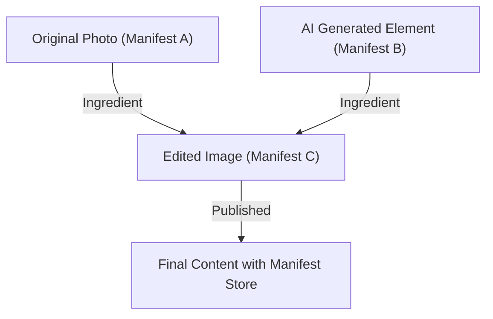

## 1. Hintergrund der Content Authenticity Initiative (CAI) und C2PA

In den letzten Jahren haben Synthesetechnologien für Bilder, Audio und Video durch generative KI rasante Fortschritte gemacht. Während diese technologische Innovation Schöpfern neue Ausdrucksmittel bietet, erleichtert sie auch die Generierung extrem ausgeklügelter Deepfakes, was zu einem gesellschaftlichen Problem geworden ist, das die Integrität des Informationsraums bedroht. Angesichts der Bedenken hinsichtlich der Verbreitung von Fake News, Betrug und der Manipulation der öffentlichen Meinung ist es zu einer dringenden Aufgabe geworden, die Zuverlässigkeit digitaler Inhalte zu gewährleisten.

Um diesem Problem zu begegnen, gründeten die drei Unternehmen Adobe, Twitter (jetzt X) und The New York Times im Jahr 2019 die "Content Authenticity Initiative (CAI)". Das Hauptziel der CAI besteht nicht darin, den "Wahrheitsgehalt" von Medien zu beurteilen, sondern die "Herkunft (Provenance)" von Inhalten zu verfolgen und zu beweisen. Als technologische Grundlage zur Verwirklichung dieser Vision traten Microsoft, Intel, Arm, Truepic und andere bei, und 2021 wurde die Standardisierungsorganisation "C2PA (Coalition for Content Provenance and Authenticity)" mitgegründet. C2PA entwickelt offene, interoperable technische Spezifikationen (C2PA-Spezifikationen) von der Hardware bis zur Software.

## 2. Erkennung (Detection) vs. Herkunft (Provenance)

Bei den Maßnahmen gegen Deepfakes werden Ansätze im Allgemeinen in zwei Kategorien unterteilt: "Erkennung" und "Herkunftsnachweis".

**Erkennung (Detection)** ist eine Methode, bei der Bildanalysetechnologien und KI-Modelle verwendet werden, um im Nachhinein zu analysieren, ob Inhalte Spuren künstlicher Manipulation (unnatürliche Pixelgrenzen, Lichtreflexionen, die den Gesetzen der Physik widersprechen, usw.) aufweisen. Die Entwicklung der Generierungstechnologien hat jedoch die Form eines "Katz-und-Maus-Spiels" angenommen, das die Erkennungstechnologien ständig übertrifft, und es gilt als mathematisch schwierig, Fakes, die mit unbekannten Algorithmen generiert wurden, zu 100 % zu erkennen.

Andererseits ist der von C2PA übernommene **Herkunftsnachweis (Provenance)** ein Ansatz, bei dem der "Prozess" von der Erstellung des Inhalts bis zur Bearbeitung und Veröffentlichung kryptographisch aufgezeichnet und in überprüfbarer Form angehängt wird. Anders als beim "Wasserzeichen (Watermarking)" werden die Bilddaten selbst nicht irreversibel verändert, sondern Herkunftsinformationen mit kryptographischer Signatur als Metadaten hinzugefügt (oder verknüpft). Dadurch können Nutzer selbst überprüfen, "wer diesen Inhalt wann und mit welchen Werkzeugen erstellt und bearbeitet hat", und dessen Zuverlässigkeit beurteilen.

## 3. C2PA-Datenstruktur: Manifest Store, Ingredients, Assertions

In den C2PA-Spezifikationen werden die Herkunftsinformationen von Inhalten in einer Datenstruktur namens "Manifest" gekapselt. Wenn mehrere Bearbeitungsverläufe vorliegen, werden diese als "Manifest Store" zusammengefasst.

- **Manifest Store**: Ein Container, der alle Manifeste speichert, die mit dem Zielinhalt verknüpft sind. Das neueste Manifest wird als aktiv behandelt und enthält übergeordnete Manifeste, die den vergangenen Bearbeitungsverlauf anzeigen.
- **Manifest**: Eine Sammlung von Informationen über ein einzelnes Erstellungs- oder Bearbeitungsereignis.
- **Assertions**: Die spezifische Einheit an deklarativen Informationen, aus denen ein Manifest besteht. Sie enthalten Erstellerinformationen, verwendete Werkzeuge (Software und Kameras), GPS-Informationen und EXIF-Daten zum Zeitpunkt der Aufnahme, ein Flag, das angibt, ob etwas durch KI generiert wurde, sowie einen Aktionsverlauf, der anzeigt, welche Bearbeitungen (Zuschneiden, Farbkorrektur usw.) vorgenommen wurden.
- **Ingredients**: Herkunftsinformationen der während der Bearbeitung verwendeten Materialien (wie z.B. das übergeordnete Bild). Wenn mehrere Bilder kombiniert werden, wird jedes Bild als Ingredient im Manifest aufgezeichnet und bildet einen komplexen Abstammungsbaum.

Um die Erweiterbarkeit zu gewährleisten, werden diese Metadaten im **JSON-LD** (JavaScript Object Notation for Linked Data)-Format beschrieben, einem Standard des Semantic Web. Dies ermöglicht es, sie maschinenlesbar zu machen und gleichzeitig einen flexiblen Datenaustausch und die Definition von Ontologien zwischen verschiedenen Systemen zu ermöglichen.

## 4. Kryptographische Bindung: Hashes und Merkle-Bäume

Das wichtigste Merkmal von C2PA ist, dass die Pixeldaten des Inhalts und die Manifest-Informationen "kryptographisch gebunden" sind. Obwohl Metadaten leicht umgeschrieben werden können, verwendet C2PA Hash-Funktionen (wie SHA-256 und SHA-384), um Manipulationen zu verhindern.

Konkret wird der Hash-Wert der Bilddaten selbst und der Hash-Wert jeder Assertion berechnet. Diese Hash-Werte werden in bestimmten Assertions innerhalb des Manifests gesammelt, und letztendlich laufen alle Informationen in einem einzigen Hash-Wert zusammen. Wenn komplexe Bearbeitungsverläufe (Ingredients) vorhanden sind, wird eine **Merkle-Baum (Merkle Tree)**-Struktur verwendet.

Durch die Verwendung eines Merkle-Baums ist es möglich, effizient zu überprüfen, ob bestimmte Elemente (z. B. das Vorhandensein eines bestimmten Ingredients) manipuliert wurden, ohne die gesamten Daten neu berechnen zu müssen. Wenn eine böswillige Person auch nur ein Bit der Pixel des Bildes ändert oder den Namen des Autors im Manifest umschreibt, ändert sich der berechnete Hash-Wert von Grund auf, und die Überprüfung mit der später beschriebenen digitalen Signatur schlägt fehl, sodass Manipulationen sofort aufgedeckt werden.

## 5. Public-Key-Infrastruktur (PKI) und digitale Signaturen

Zusätzlich zur Gewährleistung der Datenkonsistenz durch Hash-Werte werden digitale Signaturen verwendet, um zu beweisen, dass das Manifest von einer "vertrauenswürdigen Entität (Software, Kameragerät oder Signaturdienst)" erstellt wurde.

C2PA verwendet eine Public Key Infrastructure (PKI) basierend auf **X.509-Zertifikaten**. Zu den Signaturalgorithmen gehören RSA (für Abwärtskompatibilität), **ECDSA** (Elliptic Curve Digital Signature Algorithm) und sogar die schnellere und sicherere Elliptische-Kurven-Kryptografie wie **Ed25519**.

1. **Generierung der Signatur**: Bearbeitungssoftware (z. B. Photoshop) und Kamerageräte verschlüsseln (signieren) den Hash-Wert des Manifests mit ihrem eigenen privaten Schlüssel.
2. **Chain of Trust**: Der Signatur wird ein X.509-Zertifikat mit dem entsprechenden öffentlichen Schlüssel beigefügt. Dieses Zertifikat bildet eine "Vertrauenskette (Chain of Trust)", die sich von einer Zwischenzertifizierungsstelle (ICA) bis zu einer Stammzertifizierungsstelle (Root CA) erstreckt.
3. **Überprüfung (Validation)**: Der Browser oder Viewer, der den Inhalt anzeigt, überprüft die Gültigkeit des Zertifikats anhand des öffentlichen Schlüssels (Trust List) der Root CA, entschlüsselt die Signatur mit dem öffentlichen Schlüssel und prüft, ob sie mit dem berechneten Hash-Wert übereinstimmt.

Dadurch wird mathematisch bewiesen, dass "es auf einem Adobe-Server signiert wurde" oder "es mit einem bestimmten Nikon-Kameramodell aufgenommen wurde".

## 6. Hardware-Integration: Secure Enclave in Kameras

Nicht nur Signaturen auf Softwareebene (z. B. beim Exportieren aus einer Bildbearbeitungssoftware), sondern auch Implementierungen von C2PA auf Hardwareebene am Erfassungsgerät, dem "Ursprung" der Informationen, werden als wichtig erachtet.

Kamerahersteller wie Leica, Sony und Nikon treiben Initiativen voran, um **Secure Enclave / TEE (Trusted Execution Environment)** in die Bildverarbeitungs-Engines ihrer Kameras zu integrieren.
In dem Moment, in dem Licht auf den Sensor der Kamera trifft und in digitale Daten (RAW) umgewandelt wird, wird mit einem privaten Schlüssel, der in einem hardwaregeschützten Bereich gespeichert ist, eine Signatur vorgenommen. Dieser private Schlüssel kann niemals aus der Kamera extrahiert werden und ist auch vor Manipulationen an der Firmware geschützt.

Dieses "Capture-time signing" ermöglicht es, ab dem zuverlässigsten Punkt zu beweisen, dass es sich um ein authentisches Foto handelt, das die reale Welt einfängt.

## 7. Einbettungsmethode: JUMBF (JPEG Universal Metadata Box Format)

Wie werden der generierte Manifest Store und die kryptographische Signatur in der Datei gespeichert? Um eine Vielzahl von Dateiformaten (JPEG, PNG, WebP, MP4 usw.) zu unterstützen, verwendet C2PA **JUMBF (ISO/IEC 19566-5)**, ein standardisiertes Containerformat.

JUMBF ist ein Standard, der hierarchische und erweiterbare Metadaten-Boxen (Boxes) in Binärdaten definiert.
Beispielsweise werden bei einer JPEG-Datei die C2PA-Daten als JUMBF-Box im `APP11`-Marker-Segment gespeichert. Der Vorteil dieser Methode besteht darin, dass selbst wenn das Bild mit einem herkömmlichen Bildbetrachter (Software, die C2PA nicht unterstützt) geöffnet wird, die JUMBF-Box ignoriert wird und die Anzeige des Bildes selbst nicht beeinträchtigt wird (Gewährleistung der Abwärtskompatibilität).

## 8. Reale Akzeptanz und Herausforderungen (Real-world Adoption)

Der C2PA-Standard befindet sich in einer Phase der schnellen Verbreitung. Adobe hat die C2PA-Funktionen als "Content Credentials" in Photoshop und Firefly (generative KI) integriert und fügt generierten KI-Bildern automatisch Herkunftsinformationen hinzu. Auch der Bing Image Creator von Microsoft und DALL-E 3 von OpenAI haben C2PA-Unterstützung angekündigt und implementiert.
Auf Seiten der Plattformen haben YouTube und TikTok zudem Initiativen gestartet, um C2PA-Metadaten zu erkennen und auf der Benutzeroberfläche Kennzeichnungen anzuzeigen, die darauf hinweisen, dass der Inhalt "von KI generiert" wurde.

Es gibt jedoch auch viele Herausforderungen. Das größte Problem ist "Metadata Stripping" (Verlust von Metadaten). Viele soziale Netzwerke (wie X und Facebook) komprimieren hochgeladene Bilder automatisch neu, um Speicherplatz auf den Servern zu sparen und die Privatsphäre zu schützen (Löschen von EXIF-Daten). Bei diesem Vorgang werden C2PA-Metadaten, einschließlich JUMBF, unbeabsichtigt gelöscht. Derzeit drängt C2PA die Social-Media-Plattformen nachdrücklich dazu, Metadaten beizubehalten.

## 9. Schwachstellen und Abhilfemaßnahmen (Vulnerabilities and Mitigations)

Obwohl C2PA als kryptographische Technologie robust ist, sind für das Gesamtsystem mehrere Angriffsvektoren vorstellbar.

1. **Analoges Loch (Analog Hole)**: Der Akt des Anzeigens eines Bildes, das mit einer C2PA-kompatiblen Kamera aufgenommen wurde, auf einem Monitor und das erneute Abfotografieren mit einer anderen Kamera. Oder der Akt des Aufnehmens eines Screenshots eines Bildes mit einer C2PA-Signatur. Dadurch wird die Herkunft unterbrochen.
   * **Abhilfemaßnahme**: Die kombinierte Verwendung von Wasserzeichen-Technologie (Watermarking) und digitalen Wasserzeichen (Digital Watermarking). Selbst wenn Metadaten entfernt werden, wird der Ansatz verfolgt, die Herkunft wiederherzustellen, indem eine unsichtbare ID in die Pixel des Bildes selbst eingebettet wird und diese mit einer Cloud-Datenbank (die später beschriebene C2PA Cloud) abgeglichen wird.
2. **Kompromittierung von Zertifikaten**: Wenn der zum Signieren verwendete private Schlüssel durchsickert, kann ein böswilliger Akteur gefälschte Herkunftsinformationen hinzufügen, indem er sich als legitimes Tool ausgibt.
   * **Abhilfemaßnahme**: Sperrverwaltung mithilfe von **CRL (Certificate Revocation List)** oder **OCSP (Online Certificate Status Protocol)**, den Standardmechanismen von PKI. Auch die Einführung von kurzlebigen Zertifikaten (Short-lived Certificates).
3. **Missbrauch der UI/UX**: Die Ausnutzung der Tatsache, dass Benutzer dem grünen Häkchen (dem Content-Credentials-Symbol) bedingungslos vertrauen, um ein scheinbar korrektes, aber inhaltlich leeres Manifest anzuhängen.
   * **Abhilfemaßnahme**: Strikte Durchsetzung von Implementierungsrichtlinien für Browser und Viewer. Klare Unterscheidung des Validierungsstatus (gültig, ungültig, teilweise gültig usw.) anzeigen.

## 10. Zukünftige Spezifikationen und Ausblick (Future Specs)

C2PA aktualisiert die Spezifikationen weiterhin und bewegt sich auf die Standardisierung der nächsten Generation zu.

- **Soft Binding**: Eine Technologie, die KI-basierte Ähnlichkeitsbildsuche oder Perceptual Hashing verwendet, um Bilder auch bei geringfügigen Änderungen durch Neukompression oder Größenänderung mit dem ursprünglichen Manifest zu verknüpfen. Dies adressiert das Problem des Metadatenverlusts in sozialen Netzwerken grundlegend.
- **Video and Audio Streaming**: Derzeit werden hauptsächlich statische Dateien unterstützt, aber die Spezifikationsentwicklung für Echtzeit-C2PA-Signaturen auf Frame-Ebene beim Live-Streaming (Einbettung in H.264 / H.265 / AV1-Bitstreams) ist im Gange.
- **Privacy and Redaction**: Die Erweiterung von Funktionen zur "kryptographisch sicheren Schwärzung (Redact)" nur bestimmter Fotografen- oder Standortinformationen, um Nachrichtenorganisationen den Schutz ihrer Quellen zu ermöglichen und gleichzeitig die Herkunft nachzuweisen.

## Zusammenfassung

Content Credentials und C2PA sind nicht einfach nur "Deepfake-Erkennungstools", sondern eine groß angelegte Infrastruktur zum Aufbau von "Informationstransparenz" in der digitalen Welt. Durch die Kombination bewährter Sicherheitstechnologien wie kryptographischer Hashes, Merkle-Bäume, PKI und Hardware-Integration sind wir nun in der Lage, die "Herkunft" von Inhalten als Fakten zu überprüfen, bevor wir über deren "Wahrheitsgehalt" diskutieren.
Mit dem Ziel einer Zukunft, in der alle Medien im Internet Herkunftsinformationen besitzen, werden sich die gemeinsamen Bemühungen von Technologie, Plattformen und rechtlichen Vorschriften in Zukunft wahrscheinlich noch weiter beschleunigen.
