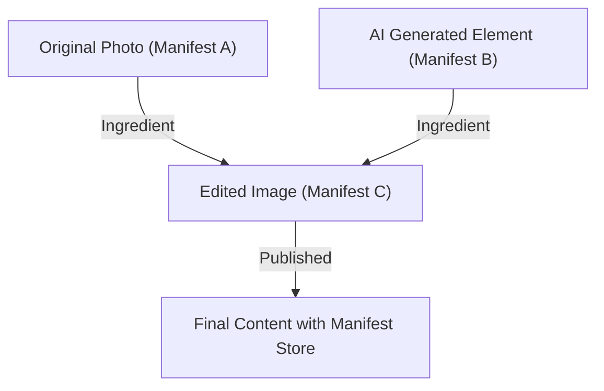

## 1. Background of the Content Authenticity Initiative (CAI) and C2PA

In recent years, synthetic generation technologies for images, audio, and video using generative AI have made dramatic leaps forward. While this technological innovation brings new methods of expression to creators, it also makes it easy to generate highly sophisticated deepfakes, becoming a social issue that threatens the integrity of the information space. Amid concerns about the spread of fake news, fraud, and malicious use for manipulating public opinion, establishing a way to guarantee the reliability of digital content has become an urgent task.

To address this challenge, Adobe, Twitter (now X), and The New York Times established the "Content Authenticity Initiative (CAI)" in 2019. The primary focus of CAI is not to determine the "authenticity" of media, but to track and prove the "provenance" of content. As a technological foundation to realize this vision, Microsoft, Intel, Arm, Truepic, and others joined to co-found the standardization organization "C2PA (Coalition for Content Provenance and Authenticity)" in 2021. C2PA formulates open, interoperable technical specifications (C2PA specifications) ranging from hardware to software.

## 2. Detection vs. Provenance

In countermeasures against deepfakes, approaches are generally divided into two categories: "detection" and "provenance proof."

**Detection** is a method of analyzing after the fact whether the content contains artificially manipulated traces (such as unnatural pixel boundaries or light reflections that defy physical laws) using image analysis techniques or AI models. However, the evolution of generation technologies constantly outpaces detection technologies in a "cat-and-mouse" game, and mathematically, it is considered difficult to detect fakes generated by unknown algorithms with 100% accuracy.

On the other hand, the **Provenance** approach adopted by C2PA cryptographically records the "process" from content creation to editing and publication, attaching it in a verifiable manner. Unlike "Watermarking," this does not irreversibly alter the image data itself, but rather attaches (or associates) provenance information with cryptographic signatures as metadata. This allows users to confirm for themselves "who created or edited this content, when, and using what tools," and judge its reliability.

## 3. C2PA Data Structure: Manifest Store, Ingredients, Assertions

In the C2PA specification, content provenance information is encapsulated in a data structure called a "Manifest." When there are multiple editing histories, these are bundled together as a "Manifest Store."

- **Manifest Store**: A container that stores all Manifests related to the target content. The most recent Manifest is treated as the active state, and it contains parent Manifests indicating past editing histories.
- **Manifest**: A collection of information regarding a single creation or editing event.
- **Assertions**: The specific units of declaration information that make up a Manifest. This includes creator information, tools used (software or cameras), GPS information or EXIF data at the time of shooting, a flag indicating whether it was generated by AI, and an action history showing what edits were made (cropping, color correction, etc.).
- **Ingredients**: Provenance information of the materials (such as parent images) used during editing. When multiple images are composited, each image is recorded in the Manifest as an Ingredient, forming a complex lineage tree.

To ensure extensibility, these metadata are described in the **JSON-LD** (JavaScript Object Notation for Linked Data) format, which is a Semantic Web standard. This allows for flexible data exchange and ontology definition across different systems while remaining machine-readable.

## 4. Cryptographic Binding: Hashes and Merkle Trees

The most prominent feature of C2PA is that the content's pixel data and Manifest information are "cryptographically bound." While metadata can be easily rewritten, C2PA prevents tampering by using hash functions (such as SHA-256 or SHA-384).

Specifically, the hash value of the image data itself and the hash values of each Assertion are calculated. These hash values are aggregated into a specific Assertion within the Manifest, and ultimately all information is reduced to a single hash value. When complex editing histories (Ingredients) exist, a **Merkle Tree** structure is used.

By utilizing a Merkle Tree, it is possible to efficiently verify whether a specific element (for example, the existence of a specific Ingredient) has been tampered with, without having to recalculate the entire data. If a malicious actor changes even 1 bit of the image's pixels or rewrites the author's name in the Manifest, the calculated hash value will fundamentally change, causing the verification with the digital signature (described later) to fail, thereby immediately exposing the tampering.

## 5. Public Key Infrastructure (PKI) and Digital Signatures

In addition to ensuring data consistency through hash values, digital signatures are used to prove that a Manifest was created by a "trusted entity" (such as software, a camera device, or a signing service).

C2PA adopts a Public Key Infrastructure (PKI) based on **X.509 certificates**. For signing algorithms, RSA (for backward compatibility), **ECDSA** (Elliptic Curve Digital Signature Algorithm), and even faster and more secure elliptic curve cryptography like **Ed25519** are utilized.

1. **Signature Generation**: Editing software (e.g., Photoshop) or camera devices use their private keys to encrypt (sign) the hash value of the Manifest.
2. **Chain of Trust**: An X.509 certificate containing the corresponding public key is attached to the signature. This certificate forms a "Chain of Trust" connecting from the Intermediate Certificate Authority (ICA) to the Root Certificate Authority (Root CA).
3. **Validation**: The browser or viewer viewing the content verifies the validity of the certificate based on the Root CA's public key (Trust List), decrypts the signature using the public key, and checks whether it matches the calculated hash value.

This mathematically proves facts such as "signed by Adobe's server" or "taken with a specific Nikon camera model."

## 6. Hardware Integration: In-Camera Secure Enclave

In addition to signing at the software level (for instance, when exporting from image editing software), hardware-level C2PA implementation in capturing devices, which are the "source" of information, is highly emphasized.

Camera manufacturers like Leica, Sony, and Nikon are advancing initiatives to embed a **Secure Enclave / TEE (Trusted Execution Environment)** within the camera's image processing engine.
The moment light hits the camera's sensor and is converted into digital data (RAW), it is signed using a private key stored in a hardware-protected area. This private key can never be extracted from the camera and is also protected against firmware tampering.

Through this "Capture-time signing," it becomes possible to prove that an authentic photograph captures the real world from the most trustworthy point.

## 7. Embedding Method: JUMBF (JPEG Universal Metadata Box Format)

How are the generated Manifest Store and cryptographic signatures stored in the file? To support a variety of file formats (JPEG, PNG, WebP, MP4, etc.), C2PA utilizes **JUMBF (ISO/IEC 19566-5)**, a standardized container format.

JUMBF is a standard that defines hierarchical and extensible metadata boxes within binary data.
For example, in the case of a JPEG file, C2PA data is stored as a JUMBF box within the `APP11` marker segment. The advantage of this method is that even when the image is opened in a traditional image viewer (software that does not support C2PA), the JUMBF box is ignored, meaning it does not affect the display of the image itself (ensuring backward compatibility).

## 8. Real-world Adoption and Challenges

The C2PA standard is rapidly entering the phase of widespread adoption. Adobe has integrated C2PA functionality as "Content Credentials" into Photoshop and Firefly (generative AI), automatically attaching provenance information to generated AI images. Microsoft's Bing Image Creator and OpenAI's DALL-E 3 have also announced and implemented C2PA support.
Furthermore, on the platform side, YouTube and TikTok have begun initiatives to detect C2PA metadata and display a label on the user interface indicating that the content is "AI-generated."

However, there are also many challenges. The biggest issue is "Metadata Stripping." Many social networking sites (such as X and Facebook) automatically recompress uploaded images for the purposes of saving server storage and protecting privacy (deleting EXIF). In this process, C2PA metadata including JUMBF is unintentionally deleted. Currently, C2PA is strongly urging SNS platforms to preserve metadata.

## 9. Vulnerabilities and Mitigations

Although C2PA is robust as a cryptographic technology, several attack vectors are envisioned for the system as a whole.

1. **Analog Hole**: The act of displaying an image taken with a C2PA-compatible camera on a monitor and re-photographing it with another camera. Or, the act of taking a screenshot of an image with a C2PA signature. This breaks the provenance.
   * **Mitigation**: Using Watermarking or Digital Watermarking in combination. Even if the metadata is stripped away, approaches are being advanced to restore provenance by embedding an invisible ID into the pixels of the image itself and matching it against a cloud database (such as the C2PA Cloud mentioned below).
2. **Compromised Certificates**: If the private key used for signing is leaked, a malicious actor can disguise themselves as a legitimate tool and attach fake provenance information.
   * **Mitigation**: Revocation management using **CRL (Certificate Revocation List)** or **OCSP (Online Certificate Status Protocol)**, which are standard PKI mechanisms. Also, the adoption of Short-lived Certificates.
3. **Exploitation of UI/UX**: Taking advantage of users unconditionally trusting the green checkmark (Content Credentials icon) to attach a Manifest that appears correct but is empty inside.
   * **Mitigation**: Enforcing implementation guidelines for browsers and viewers. Displaying clear distinctions of verification status (valid, invalid, partially valid, etc.).

## 10. Future Specs and Outlook

C2PA continues to update its specifications and is moving toward next-generation standardization.

- **Soft Binding**: A technology that links the original Manifest and the image using AI-based similar image search or perceptual hashes, even when pixels have been slightly altered by recompression or resizing. This fundamentally addresses the metadata stripping issue on social networks.
- **Video and Audio Streaming**: While currently supporting mainly static files, specifications are being formulated for real-time, frame-by-frame C2PA signing in live streaming (embedding into H.264 / H.265 / AV1 bitstreams).
- **Privacy and Redaction**: Expanding functions to "cryptographically securely redact" specific photographer or location information so news organizations can protect their sources while proving provenance.

## Conclusion

Content Credentials and C2PA are not merely "deepfake detection tools," but a grand infrastructure for establishing "transparency of information" in the digital world. By combining proven security technologies such as cryptographic hashes, Merkle Trees, PKI, and hardware integration, we can now verify the "origin" of content as a fact before debating its "authenticity."
Aiming for a future where all media on the internet possesses provenance information, initiatives that integrate technology, platforms, and legal regulations will likely accelerate further.
