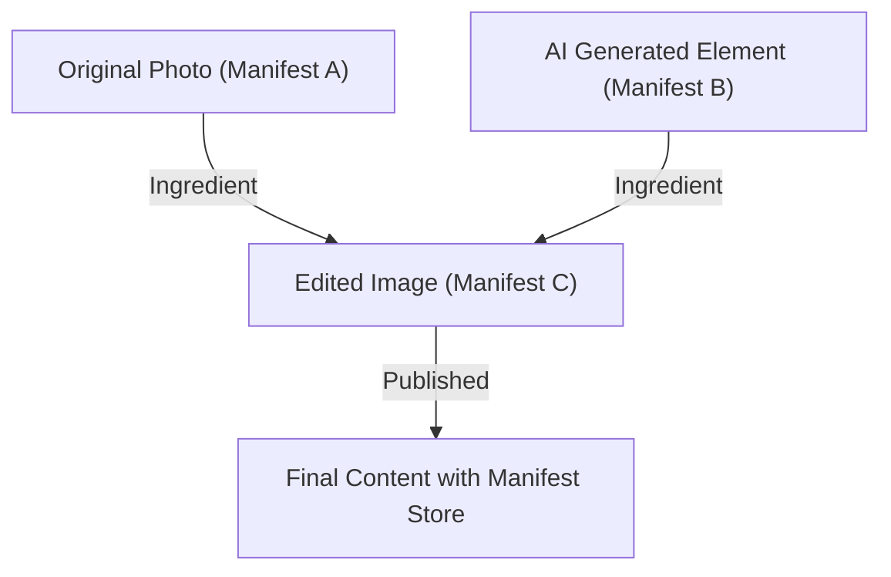

## 1. Antecedentes de la Iniciativa de Autenticidad de Contenido (CAI) y C2PA

En los últimos años, la tecnología de síntesis de imágenes, audio y video mediante IA generativa ha experimentado una evolución espectacular. Si bien esta innovación tecnológica brinda nuevos métodos de expresión a los creadores, también facilita la generación de deepfakes extremadamente elaborados, convirtiéndose en un problema social que amenaza la integridad del espacio informativo. Con la preocupación por la propagación de noticias falsas, el fraude y su uso malicioso para manipular la opinión pública, garantizar la fiabilidad del contenido digital se ha vuelto una tarea urgente.

Para abordar este desafío, Adobe, Twitter (actualmente X) y The New York Times establecieron la "Iniciativa de Autenticidad de Contenido (CAI)" en 2019. El objetivo principal de la CAI no es determinar la "autenticidad" de los medios, sino rastrear y probar la "procedencia" (Provenance) del contenido. Como base técnica para materializar esta visión, Microsoft, Intel, Arm, Truepic y otros se unieron en 2021 para cofundar la organización de estandarización "C2PA (Coalición para la Procedencia y Autenticidad del Contenido)". La C2PA está formulando especificaciones técnicas abiertas e interoperables (especificaciones C2PA) que abarcan desde el hardware hasta el software.

## 2. Detección (Detection) frente a Procedencia (Provenance)

En las contramedidas contra deepfakes, los enfoques generalmente se dividen en dos categorías: "detección" y "prueba de procedencia".

La **detección (Detection)** es un método que utiliza tecnología de análisis de imágenes o modelos de IA para analizar a posteriori si el contenido contiene rastros de manipulación artificial (límites de píxeles poco naturales, reflejos de luz que violan las leyes de la física, etc.). Sin embargo, la evolución de las tecnologías generativas siempre supera a las tecnologías de detección, presentando una situación del "gato y el ratón", y se considera matemáticamente difícil detectar el 100% de las falsificaciones generadas por algoritmos desconocidos.

Por otro lado, la **prueba de procedencia (Provenance)** adoptada por C2PA es un enfoque que registra criptográficamente el "proceso" desde la creación del contenido hasta su edición y publicación, y lo adjunta de forma verificable. A diferencia de las "marcas de agua" (Watermarking), esto no altera irreversiblemente los datos de la imagen en sí, sino que añade (o asocia) información de procedencia con firmas criptográficas como metadatos. Esto permite a los usuarios verificar por sí mismos "quién, cuándo y con qué herramientas se creó y editó este contenido", y juzgar su fiabilidad.

## 3. Estructura de Datos C2PA: Manifest Store, Ingredients, Assertions

En las especificaciones de C2PA, la información de procedencia del contenido se encapsula en una estructura de datos llamada "Manifest" (Manifiesto). Si hay múltiples historiales de edición, estos se agrupan como un "Manifest Store".

- **Manifest Store**: Un contenedor que almacena todos los Manifest asociados al contenido objetivo. El Manifest más reciente se trata como el estado activo y engloba los Manifest principales (padres) que muestran el historial de ediciones pasadas.
- **Manifest**: Una colección de información sobre un único evento de creación o edición.
- **Assertions**: Unidades específicas de información declarativa que componen el Manifest. Incluyen información del creador, herramientas utilizadas (software o cámara), información GPS y datos EXIF en el momento de la captura, una bandera que indica si fue generado por IA o no, y un historial de acciones que muestra qué tipo de edición se realizó (recorte, corrección de color, etc.).
- **Ingredients**: Información de procedencia de los materiales utilizados durante la edición (como la imagen original). Cuando se combinan varias imágenes, cada imagen se registra en el Manifest como un Ingredient, formando un árbol genealógico complejo.

Estos metadatos están descritos en el formato **JSON-LD** (JavaScript Object Notation for Linked Data), un estándar de la Web Semántica, para garantizar la extensibilidad. Esto permite el intercambio de datos flexible y la definición de ontologías entre diferentes sistemas, al mismo tiempo que es legible por máquinas (machine-readable).

## 4. Vinculación Criptográfica: Hashes y Árboles de Merkle

La característica principal de C2PA es que los datos de píxeles del contenido y la información del Manifest están "vinculados criptográficamente". Si bien los metadatos se pueden sobrescribir fácilmente, C2PA utiliza funciones hash (como SHA-256 o SHA-384) para evitar la manipulación.

Específicamente, calcula el valor hash de los datos de la imagen en sí y el valor hash de cada Assertion. Estos valores hash se consolidan en una Assertion particular dentro del Manifest, y finalmente toda la información se reduce a un solo valor hash. Cuando existe un historial de edición complejo (Ingredients), se utiliza la estructura del **Árbol de Merkle (Merkle Tree)**.

Al utilizar el Árbol de Merkle, es posible verificar eficientemente si un elemento específico (por ejemplo, la existencia de un Ingredient específico) ha sido manipulado, sin tener que recalcular todos los datos. Si un actor malicioso altera incluso un bit de los píxeles de la imagen o reescribe el nombre del autor en el Manifest, el valor hash calculado cambiará desde la base, y la verificación con la firma digital descrita a continuación fallará, revelando inmediatamente la manipulación.

## 5. Infraestructura de Clave Pública (PKI) y Firmas Digitales

Además de la garantía de consistencia de los datos mediante valores hash, se utilizan firmas digitales para probar que el Manifest fue creado por una "entidad de confianza (software, dispositivo de cámara, servicio de firma)".

C2PA adopta una Infraestructura de Clave Pública (PKI) basada en **certificados X.509**. Los algoritmos de firma utilizados incluyen RSA (por compatibilidad con el pasado), **ECDSA** (Algoritmo de Firma Digital de Curva Elíptica) y también criptografía de curva elíptica más rápida y segura como **Ed25519**.

1. **Generación de la firma**: El software de edición (ej. Photoshop) o dispositivo de cámara cifra (firma) el valor hash del Manifest utilizando su propia clave privada.
2. **Cadena de confianza (Chain of Trust)**: A la firma se adjunta un certificado X.509 que contiene la clave pública correspondiente. Este certificado forma una "cadena de confianza" desde la Autoridad de Certificación Intermedia (ICA) hasta la Autoridad de Certificación Raíz (Root CA).
3. **Verificación (Validation)**: El navegador o visor que visualiza el contenido verifica la validez del certificado basándose en la clave pública de la CA raíz (Lista de Confianza), descifra la firma con la clave pública y comprueba si coincide con el valor hash calculado.

Con esto, se demuestra matemáticamente el hecho de que "fue firmado en los servidores de Adobe" o "fue capturado por un modelo de cámara específico de Nikon".

## 6. Integración de Hardware: Enclave Seguro Integrado en la Cámara

Se hace hincapié no solo en las firmas a nivel de software (por ejemplo, al exportar desde un software de edición de imágenes), sino también en la implementación de C2PA a nivel de hardware en el dispositivo de captura, que es la "fuente" de la información.

Fabricantes de cámaras como Leica, Sony y Nikon están avanzando en la iniciativa de incorporar un **Enclave Seguro (Secure Enclave) / TEE (Entorno de Ejecución Confiable)** dentro del motor de procesamiento de imágenes de la cámara.
En el instante en que la luz incide en el sensor de la cámara y se convierte en datos digitales (RAW), se realiza una firma utilizando una clave privada almacenada en una zona protegida por hardware. Esta clave privada nunca puede ser extraída de la cámara y está protegida incluso contra manipulaciones del firmware.

Esta "Firma en el momento de la captura" (Capture-time signing) hace posible demostrar desde el punto más fiable que se trata de una fotografía real que ha capturado el mundo real.

## 7. Método de Incrustación: JUMBF (JPEG Universal Metadata Box Format)

¿Cómo se almacenan el Manifest Store generado y las firmas criptográficas en el archivo? Para soportar una variedad de formatos de archivo (JPEG, PNG, WebP, MP4, etc.), C2PA utiliza **JUMBF (ISO/IEC 19566-5)**, un formato de contenedor estandarizado.

JUMBF es un estándar que define cajas de metadatos (Boxes) jerárquicas y extensibles dentro de datos binarios.
Por ejemplo, en el caso de un archivo JPEG, los datos C2PA se almacenan como una caja JUMBF dentro del segmento del marcador `APP11`. La ventaja de este método es que incluso cuando la imagen se abre con visores de imágenes tradicionales (software que no admite C2PA), la caja JUMBF se ignora, por lo que no afecta a la visualización de la imagen en sí (garantizando la compatibilidad con versiones anteriores).

## 8. Adopción en el Mundo Real y Desafíos (Real-world Adoption)

El estándar C2PA está entrando en una fase de rápida adopción. Adobe ha integrado las funcionalidades de C2PA como "Credenciales de Contenido" (Content Credentials) en Photoshop y Firefly (IA generativa), y añade automáticamente información de procedencia a las imágenes de IA generadas. Bing Image Creator de Microsoft y DALL-E 3 de OpenAI también han anunciado e implementado la compatibilidad con C2PA.
Además, en el lado de las plataformas, YouTube y TikTok han comenzado a detectar metadatos C2PA y mostrar etiquetas en la interfaz de usuario indicando que es "contenido generado por IA".

Sin embargo, también hay muchos desafíos. El mayor problema es la "eliminación de metadatos" (Metadata Stripping). Muchas redes sociales (como X y Facebook) recomprimen automáticamente las imágenes subidas para ahorrar almacenamiento en el servidor y proteger la privacidad (eliminando el EXIF). En este proceso, los metadatos C2PA, incluido JUMBF, se eliminan involuntariamente. Actualmente, C2PA está instando fuertemente a las plataformas de redes sociales a mantener los metadatos.

## 9. Vulnerabilidades y Mitigaciones (Vulnerabilities and Mitigations)

Aunque C2PA es criptográficamente robusto, se anticipan varios vectores de ataque para el sistema en su conjunto.

1. **Agujero Analógico (Analog Hole)**: El acto de mostrar una imagen capturada con una cámara compatible con C2PA en un monitor y fotografiarla nuevamente con otra cámara. O, tomar una captura de pantalla de una imagen firmada por C2PA. Esto rompe la procedencia.
   * **Mitigación**: Uso combinado de tecnologías de marcas de agua (Watermarking) y marcas de agua digitales (Digital Watermarking). Incluso si se eliminan los metadatos, se incrusta un ID invisible en los píxeles de la imagen misma, y al cotejarlo con una base de datos en la nube (C2PA Cloud), se está avanzando en un enfoque para restaurar la procedencia.
2. **Compromiso del Certificado**: Si se filtra la clave privada utilizada para la firma, un actor malicioso podría fingir usar herramientas legítimas y adjuntar información de procedencia falsa.
   * **Mitigación**: Gestión de revocación utilizando mecanismos estándar de PKI como **CRL (Certificate Revocation List)** y **OCSP (Online Certificate Status Protocol)**. Además, la adopción de certificados de corta duración (Short-lived Certificates).
3. **Abuso de la interfaz de usuario/UX**: Aprovechando el hecho de que los usuarios confían incondicionalmente en la marca de verificación verde (el icono de Credenciales de Contenido), se adjunta un manifiesto que parece correcto pero que en realidad está vacío.
   * **Mitigación**: Aplicación estricta de las directrices de implementación para navegadores y visores. Visualización clara y diferenciada del estado de validación (válido, inválido, parcialmente válido, etc.).

## 10. Especificaciones Futuras y Perspectivas (Future Specs)

C2PA continúa actualizando sus especificaciones y se encamina hacia la estandarización de próxima generación.

- **Soft Binding (Vinculación Suave)**: Tecnología que vincula el Manifest original a la imagen incluso si los píxeles se modifican levemente por recompresión o redimensionamiento, utilizando búsqueda de imágenes similares basada en IA o hash perceptual (perceptual hash). Esto aborda de raíz el problema de la pérdida de metadatos en las redes sociales.
- **Streaming de Video y Audio (Video and Audio Streaming)**: Actualmente, el soporte se centra en archivos estáticos, pero se están elaborando especificaciones para la firma C2PA en tiempo real a nivel de fotogramas (incrustada en flujos de bits H.264 / H.265 / AV1) en transmisiones en vivo (live streaming).
- **Privacidad y Censura (Privacy and Redaction)**: Ampliación de las funciones para "censurar criptográficamente de forma segura" (Redact) solo información específica sobre el fotógrafo o la ubicación, con el fin de proteger las fuentes de las organizaciones de noticias mientras se prueba la procedencia.

## Resumen

Las Credenciales de Contenido y C2PA no son meras "herramientas de detección de deepfakes", sino una gran infraestructura para construir la "transparencia de la información" en el mundo digital. Al combinar tecnologías de seguridad probadas como hashes criptográficos, el Árbol de Merkle, PKI e integración de hardware, ahora podemos verificar el "origen" del contenido como un hecho antes de debatir su "autenticidad".
Apuntando hacia un futuro en el que todos los medios en Internet tengan información de procedencia, es probable que los esfuerzos conjuntos de tecnología, plataformas y regulación legal se aceleren aún más.
