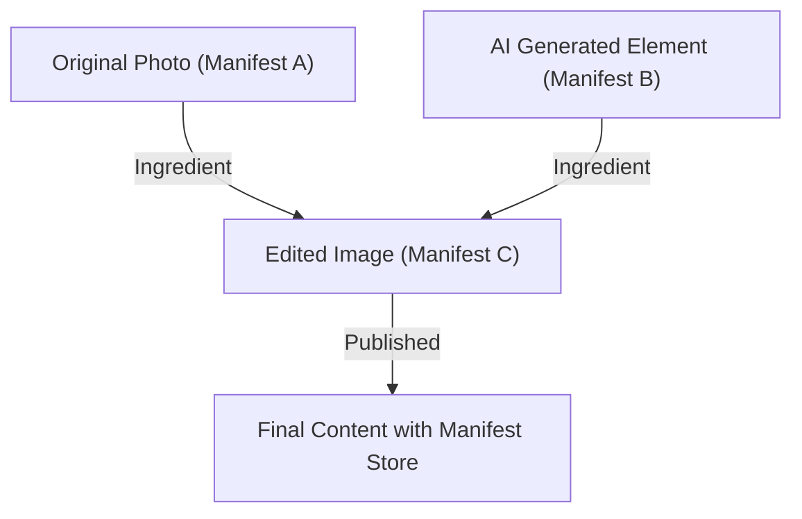

## 1. Contexte de la Content Authenticity Initiative (CAI) et de la C2PA

Ces dernières années, la technologie de synthèse d'images, de voix et de vidéos par l'IA générative a connu une évolution fulgurante. Si cette innovation technologique offre aux créateurs de nouveaux moyens d'expression, elle facilite également la création de deepfakes extrêmement sophistiqués, devenant un problème de société qui menace l'intégrité de l'espace informationnel. Face aux craintes de propagation de fausses nouvelles, de fraudes et de manipulation de l'opinion publique, garantir la fiabilité des contenus numériques est devenu une urgence.

Pour relever ce défi, Adobe, Twitter (maintenant X) et The New York Times ont fondé en 2019 la "Content Authenticity Initiative (CAI)". L'objectif principal de la CAI n'est pas de juger de la "véracité" des médias, mais de tracer et de prouver la "provenance (Provenance)" du contenu. En 2021, la "Coalition for Content Provenance and Authenticity (C2PA)" a été co-fondée en tant qu'organisme de normalisation pour concrétiser cette vision, rejointe par Microsoft, Intel, Arm, Truepic, etc. La C2PA élabore des spécifications techniques ouvertes et interopérables (spécifications C2PA), du matériel jusqu'aux logiciels.

## 2. Détection (Detection) vs Provenance (Provenance)

Dans la lutte contre les deepfakes, les approches se divisent généralement en deux catégories : la "détection" et la "preuve de provenance".

**La détection (Detection)** est une méthode d'analyse a posteriori utilisant des technologies d'analyse d'images ou des modèles d'IA pour vérifier si le contenu contient des traces de manipulation artificielle (frontières de pixels non naturelles, reflets de lumière contraires aux lois de la physique, etc.). Cependant, l'évolution des technologies de génération dépasse toujours les technologies de détection, créant un jeu du chat et de la souris. Il est mathématiquement difficile de détecter à 100% les fakes générés par des algorithmes inconnus.

En revanche, **la preuve de provenance (Provenance)** adoptée par la C2PA est une approche qui enregistre cryptographiquement le "processus" allant de la création à l'édition et à la publication du contenu, en l'associant de manière vérifiable. Contrairement au "filigrane (Watermarking)", cela ne modifie pas de manière irréversible les données d'image elles-mêmes, mais ajoute (ou associe) des informations de provenance signées cryptographiquement en tant que métadonnées. Ainsi, les utilisateurs peuvent vérifier eux-mêmes "qui, quand, et avec quels outils ce contenu a été créé ou édité" et juger de sa fiabilité.

## 3. Structure des données C2PA : Manifest Store, Ingredients, Assertions

Dans la spécification C2PA, les informations de provenance du contenu sont encapsulées dans une structure de données appelée "Manifest (Manifeste)". En cas d'historique de modifications multiples, ceux-ci sont regroupés dans un "Manifest Store".

- **Manifest Store** : Conteneur stockant tous les manifestes liés au contenu cible. Le manifeste le plus récent est considéré comme actif et inclut les manifestes parents indiquant l'historique des modifications passées.
- **Manifest** : Ensemble d'informations concernant un événement de création ou d'édition unique.
- **Assertions** : Unités d'informations déclaratives spécifiques composant le manifeste. Elles incluent les informations sur le créateur, les outils utilisés (logiciel ou appareil photo), les informations GPS et données EXIF au moment de la capture, un indicateur précisant si le contenu a été généré par l'IA, et l'historique des actions d'édition (recadrage, correction des couleurs, etc.).
- **Ingredients** : Informations de provenance des éléments utilisés lors de l'édition (images parentes, etc.). Si plusieurs images sont combinées, chaque image est enregistrée en tant qu'ingrédient dans le manifeste, formant un arbre généalogique complexe.

Ces métadonnées sont décrites au format **JSON-LD** (JavaScript Object Notation for Linked Data), un standard du Web sémantique, pour garantir l'extensibilité. Cela les rend lisibles par machine tout en permettant un échange de données flexible et la définition d'ontologies entre différents systèmes.

## 4. Liaison cryptographique : Hachage et arbres de Merkle

La caractéristique majeure de la C2PA est que les données de pixels du contenu et les informations du manifeste sont "liées cryptographiquement (bound)". Bien que les métadonnées soient facilement modifiables, la C2PA utilise des fonctions de hachage (comme SHA-256 ou SHA-384) pour empêcher les falsifications.

Concrètement, la valeur de hachage des données d'image elles-mêmes et celle de chaque Assertion sont calculées. Ces valeurs de hachage sont agrégées dans une Assertion spécifique au sein du manifeste, réduisant finalement toutes les informations à une valeur de hachage unique. Lorsqu'un historique de modifications complexe (Ingredients) existe, une structure en **Arbre de Merkle (Merkle Tree)** est utilisée.

En utilisant un arbre de Merkle, il est possible de vérifier efficacement si un élément spécifique (par exemple, l'existence d'un ingrédient particulier) a été falsifié sans recalculer l'ensemble des données. Si une personne malveillante modifie ne serait-ce qu'un bit des pixels de l'image ou modifie le nom de l'auteur dans le manifeste, la valeur de hachage calculée changera radicalement et la vérification avec la signature électronique (décrite ci-dessous) échouera, révélant immédiatement la falsification.

## 5. Infrastructure à clés publiques (PKI) et signatures électroniques

En plus de garantir la cohérence des données via les valeurs de hachage, des signatures électroniques sont utilisées pour prouver que le manifeste a été créé par une "entité de confiance (logiciel, appareil photo ou service de signature)".

La C2PA adopte une infrastructure à clés publiques (PKI) basée sur les **certificats X.509**. Les algorithmes de signature incluent le RSA (pour la compatibilité avec le passé), l'**ECDSA** (Elliptic Curve Digital Signature Algorithm) et la cryptographie sur les courbes elliptiques plus rapide et plus sûre telle que l'**Ed25519**.

1. **Génération de la signature** : Les logiciels d'édition (ex : Photoshop) ou les appareils photo chiffrent (signent) la valeur de hachage du manifeste à l'aide de leur propre clé privée.
2. **Chaîne de confiance (Chain of Trust)** : Un certificat X.509 contenant la clé publique correspondante est joint à la signature. Ce certificat forme une "chaîne de confiance" allant de l'autorité de certification intermédiaire (ICA) à l'autorité de certification racine (Root CA).
3. **Validation (Validation)** : Le navigateur ou le visualiseur qui consulte le contenu vérifie la validité du certificat à partir de la clé publique de l'autorité de certification racine (Trust List), déchiffre la signature à l'aide de la clé publique et vérifie si elle correspond à la valeur de hachage calculée.

Cela prouve mathématiquement des faits tels que "signé sur les serveurs d'Adobe" ou "capturé avec un modèle de caméra Nikon spécifique".

## 6. Intégration matérielle : Secure Enclave au sein de l'appareil photo

Outre la signature au niveau logiciel (par exemple, lors de l'exportation depuis un logiciel d'édition d'images), la mise en œuvre de la C2PA au niveau matériel sur l'appareil de capture, source de l'information, est considérée comme essentielle.

Les fabricants d'appareils photo comme Leica, Sony et Nikon intègrent des **Secure Enclaves (Secure Enclave) / TEE (Trusted Execution Environment)** au sein du moteur de traitement d'images de leurs appareils.
Dès que la lumière frappe le capteur de l'appareil et est convertie en données numériques (RAW), une signature est effectuée de manière matérielle en utilisant une clé privée stockée dans une zone protégée. Cette clé privée ne peut jamais être extraite de l'appareil et est protégée contre la falsification du firmware.

Cette signature au moment de la capture ("Capture-time signing") permet de prouver qu'il s'agit d'une photo authentique capturant le monde réel, depuis le point le plus fiable.

## 7. Méthode d'intégration : JUMBF (JPEG Universal Metadata Box Format)

Comment le Manifest Store généré et la signature cryptographique sont-ils stockés dans le fichier ? La C2PA utilise **JUMBF (ISO/IEC 19566-5)**, un format de conteneur standardisé, pour prendre en charge divers formats de fichiers (JPEG, PNG, WebP, MP4, etc.).

JUMBF est une norme qui définit des boîtes de métadonnées (Box) hiérarchiques et extensibles au sein des données binaires.
Par exemple, pour un fichier JPEG, les données C2PA sont stockées en tant que boîte JUMBF dans le segment de marqueur `APP11`. L'avantage de cette méthode est que même si l'image est ouverte avec un visualiseur d'images traditionnel (logiciel non compatible C2PA), la boîte JUMBF est ignorée, n'affectant pas l'affichage de l'image (assurant ainsi la rétrocompatibilité).

## 8. Adoption dans le monde réel et défis (Real-world Adoption)

La norme C2PA entre dans une phase d'adoption rapide. Adobe a intégré les fonctionnalités C2PA en tant que "Content Credentials" dans Photoshop et Firefly (IA générative), ajoutant automatiquement des informations de provenance aux images IA générées. Bing Image Creator de Microsoft et DALL-E 3 d'OpenAI ont également annoncé et mis en œuvre la prise en charge de la C2PA.
Du côté des plateformes, YouTube et TikTok ont commencé à détecter les métadonnées C2PA et à étiqueter le contenu sur l'interface utilisateur comme "Généré par l'IA".

Cependant, les défis sont nombreux. Le problème majeur est le "dépouillement des métadonnées (Metadata Stripping)". La plupart des réseaux sociaux (comme X ou Facebook) recompressent automatiquement les images téléchargées dans le but d'économiser de l'espace de stockage sur les serveurs ou de protéger la vie privée (suppression EXIF). Au cours de ce processus, les métadonnées C2PA, y compris JUMBF, sont supprimées par inadvertance. Actuellement, la C2PA fait pression sur les plateformes de réseaux sociaux pour qu'elles conservent les métadonnées.

## 9. Vulnérabilités et mesures d'atténuation (Vulnerabilities and Mitigations)

Bien que la C2PA soit robuste d'un point de vue cryptographique, plusieurs vecteurs d'attaque sont envisageables pour l'ensemble du système.

1. **La faille analogique (Analog Hole)** : Le fait d'afficher une image prise avec un appareil compatible C2PA sur un moniteur et de la rephotographier avec un autre appareil. Ou encore, le fait de faire une capture d'écran d'une image signée C2PA. Cela rompt la provenance.
   * **Mesure d'atténuation** : Utilisation conjointe avec des technologies de filigrane (Watermarking) ou de tatouage numérique (Digital Watermarking). Même si les métadonnées sont supprimées, en intégrant un identifiant invisible dans les pixels de l'image elle-même, une approche est en cours pour récupérer la provenance en la comparant avec une base de données cloud (C2PA Cloud décrit ci-dessous).
2. **Compromission de certificat** : Si la clé privée utilisée pour la signature est divulguée, une personne malveillante peut se faire passer pour un outil légitime et attribuer de fausses informations de provenance.
   * **Mesure d'atténuation** : Gestion des révocations utilisant les mécanismes standards de la PKI tels que **CRL (Certificate Revocation List)** et **OCSP (Online Certificate Status Protocol)**. Également, l'adoption de certificats à courte durée de vie (Short-lived Certificates).
3. **Abus de l'UI/UX** : Profiter du fait que les utilisateurs font aveuglément confiance à la coche verte (l'icône des Content Credentials) pour attribuer un manifeste apparemment correct mais au contenu vide.
   * **Mesure d'atténuation** : Application stricte des directives d'implémentation pour les navigateurs et les visualiseurs. Affichage clair de la distinction des statuts de vérification (valide, invalide, partiellement valide, etc.).

## 10. Spécifications futures et perspectives (Future Specs)

La C2PA continue de mettre à jour ses spécifications et se dirige vers une normalisation de nouvelle génération.

- **Soft Binding (Liaison douce)** : Technologie permettant de lier l'image au manifeste d'origine, même si les pixels sont légèrement modifiés par recompression ou redimensionnement, en utilisant la recherche d'images similaires basée sur l'IA ou le hachage perceptuel. Cela résout fondamentalement le problème de suppression des métadonnées sur les réseaux sociaux.
- **Streaming vidéo et audio (Video and Audio Streaming)** : Actuellement, la prise en charge concerne principalement les fichiers statiques, mais l'élaboration de spécifications pour la signature C2PA en temps réel au niveau des trames dans le streaming en direct (intégration dans les flux de bits H.264 / H.265 / AV1) est en cours.
- **Confidentialité et caviardage (Privacy and Redaction)** : Expansion des fonctions permettant de "caviarder en toute sécurité cryptographique" uniquement certaines informations sur le photographe ou la localisation pour protéger les sources des médias tout en prouvant la provenance.

## Conclusion

Les Content Credentials et la C2PA ne sont pas de simples "outils de détection de deepfakes", mais une vaste infrastructure visant à établir la "transparence de l'information" dans le monde numérique. En combinant des technologies de sécurité éprouvées telles que le hachage cryptographique, les arbres de Merkle, la PKI et l'intégration matérielle, nous sommes désormais en mesure de vérifier la "provenance" en tant que fait avant même de débattre de la "véracité" du contenu.
Visant un avenir où tous les médias sur Internet posséderont des informations de provenance, les efforts conjoints des technologies, des plateformes et des réglementations juridiques s'accéléreront encore davantage.
