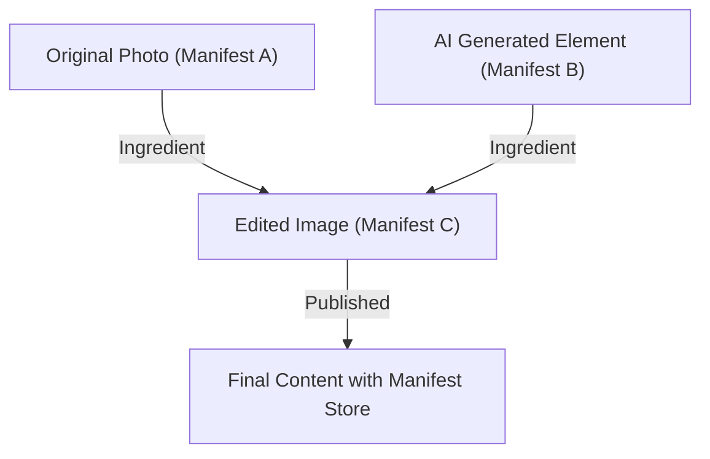

## 1. कंटेंट ऑथेंटिसिटी इनिशिएटिव (CAI) और C2PA की पृष्ठभूमि

हाल के वर्षों में, जनरेटिव AI का उपयोग करके चित्र, ऑडियो और वीडियो को संश्लेषित करने की तकनीक में नाटकीय रूप से विकास हुआ है। जहाँ यह तकनीकी नवाचार रचनाकारों के लिए अभिव्यक्ति के नए तरीके लाता है, वहीं यह अत्यधिक परिष्कृत डीपफेक बनाना भी आसान बनाता है, जो सूचना स्थान की अखंडता को खतरे में डालते हुए एक सामाजिक समस्या बन गया है। फर्जी खबरों के प्रसार, धोखाधड़ी और जनमत में हेरफेर के लिए इसके दुरुपयोग की चिंताओं के बीच, डिजिटल सामग्री की विश्वसनीयता सुनिश्चित करना एक तत्काल मुद्दा बन गया है।

इस चुनौती का समाधान करने के लिए, एडोब (Adobe), ट्विटर (Twitter - अब X) और द न्यूयॉर्क टाइम्स (The New York Times) ने 2019 में "कंटेंट ऑथेंटिसिटी इनिशिएटिव (CAI: Content Authenticity Initiative)" की स्थापना की। CAI का मुख्य उद्देश्य मीडिया की "प्रामाणिकता" (सच या झूठ) का न्याय करना नहीं है, बल्कि सामग्री की "उत्पत्ति" (Provenance) को ट्रैक और प्रमाणित करना है। इस दृष्टिकोण को साकार करने के लिए एक तकनीकी आधार के रूप में, Microsoft, Intel, Arm और Truepic जैसी कंपनियाँ इसमें शामिल हुईं और 2021 में "C2PA (Coalition for Content Provenance and Authenticity)" नामक एक मानकीकरण संगठन की सह-स्थापना की। C2PA हार्डवेयर से लेकर सॉफ्टवेयर तक, खुले और इंटरऑपरेबल तकनीकी विनिर्देश (C2PA विनिर्देश) विकसित कर रहा है।

## 2. पहचान (Detection) बनाम उत्पत्ति (Provenance)

डीपफेक के खिलाफ उपायों में, आमतौर पर दृष्टिकोण को दो श्रेणियों में बांटा जाता है: "पहचान" और "उत्पत्ति का प्रमाण"।

**पहचान (Detection)** एक ऐसी विधि है जो यह विश्लेषण करने के लिए छवि विश्लेषण तकनीक या AI मॉडल का उपयोग करती है कि क्या सामग्री में कृत्रिम रूप से हेरफेर किए गए निशान हैं (अस्वाभाविक पिक्सेल सीमाएं, प्रकाश का परावर्तन जो भौतिकी के नियमों का उल्लंघन करता है, आदि)। हालाँकि, जनरेटिव तकनीक का विकास हमेशा डिटेक्शन तकनीक से आगे रहता है, जो "चूहे और बिल्ली" के खेल जैसा है, और गणितीय रूप से भी यह माना जाता है कि अज्ञात एल्गोरिदम द्वारा उत्पन्न 100% फर्जी सामग्री का पता लगाना मुश्किल है।

दूसरी ओर, C2PA द्वारा अपनाई गई **उत्पत्ति (Provenance)** एक ऐसा दृष्टिकोण है जो क्रिप्टोग्राफ़िक रूप से सामग्री के निर्माण से लेकर संपादन और प्रकाशन तक की "प्रक्रिया" को रिकॉर्ड करता है, और इसे एक सत्यापन योग्य रूप में जोड़ता है। यह "वॉटरमार्किंग (Watermarking)" से अलग है; यह छवि डेटा को ही अपरिवर्तनीय रूप से नहीं बदलता है, बल्कि मेटाडेटा के रूप में क्रिप्टोग्राफ़िक रूप से हस्ताक्षरित उत्पत्ति की जानकारी जोड़ता है (या संबद्ध करता है)। इसके साथ, उपयोगकर्ता स्वयं यह जांच सकते हैं कि "इस सामग्री को किसने, कब और किस टूल का उपयोग करके बनाया या संपादित किया" और इसकी विश्वसनीयता का आकलन कर सकते हैं।

## 3. C2PA डेटा संरचना: Manifest Store, Ingredients, Assertions

C2PA विनिर्देश में, सामग्री की उत्पत्ति की जानकारी को "Manifest (मेनिफेस्ट)" नामक डेटा संरचना में एन्कैप्सुलेट किया जाता है। यदि कई संपादन इतिहास हैं, तो इन्हें "Manifest Store" के रूप में एक साथ समूहीकृत किया जाता है।

- **Manifest Store**: एक कंटेनर जो लक्षित सामग्री से संबंधित सभी मेनिफेस्ट को संग्रहीत करता है। नवीनतम मेनिफेस्ट को सक्रिय स्थिति के रूप में माना जाता है, और इसमें पिछले संपादन इतिहास को दर्शाने वाले पैरेंट मेनिफेस्ट शामिल होते हैं।
- **Manifest**: एकल निर्माण या संपादन ईवेंट से संबंधित जानकारी का एक संग्रह।
- **Assertions**: मेनिफेस्ट को बनाने वाली विशिष्ट घोषणा जानकारी की इकाइयाँ। इसमें निर्माता की जानकारी, उपयोग किए गए उपकरण (सॉफ्टवेयर या कैमरा), शूटिंग के समय जीपीएस जानकारी या EXIF डेटा, AI द्वारा उत्पन्न किया गया था या नहीं इसका फ्लैग, और क्या संपादन किए गए थे (क्रॉपिंग, रंग सुधार, आदि) दिखाने वाला एक्शन इतिहास शामिल है।
- **Ingredients**: संपादन के दौरान उपयोग की गई सामग्री (जैसे कि पैरेंट इमेज) की उत्पत्ति की जानकारी। यदि कई छवियों को संश्लेषित किया जाता है, तो प्रत्येक छवि को मेनिफेस्ट में एक Ingredient के रूप में रिकॉर्ड किया जाता है, जिससे एक जटिल वंशावली ट्री बनता है।

एक्सटेंसिबिलिटी सुनिश्चित करने के लिए, इन मेटाडेटा को सिमेंटिक वेब स्टैंडर्ड **JSON-LD** (JavaScript Object Notation for Linked Data) प्रारूप में लिखा जाता है। यह मशीन-पठनीय (machine-readable) होने के साथ-साथ विभिन्न प्रणालियों के बीच लचीले डेटा विनिमय और ऑन्टोलॉजी की परिभाषा को सक्षम बनाता है।

## 4. क्रिप्टोग्राफिक बाइंडिंग: हैश और मर्कल ट्री

C2PA की सबसे बड़ी विशेषता यह है कि सामग्री का पिक्सेल डेटा और मेनिफेस्ट जानकारी "क्रिप्टोग्राफ़िक रूप से बाध्य (bound)" हैं। जबकि मेटाडेटा को आसानी से फिर से लिखा जा सकता है, C2PA छेड़छाड़ को रोकने के लिए हैश फ़ंक्शंस (जैसे SHA-256 या SHA-384) का उपयोग करता है।

विशेष रूप से, छवि डेटा के स्वयं के हैश मान और प्रत्येक Assertion के हैश मान की गणना की जाती है। इन हैश मानों को मेनिफेस्ट के भीतर एक विशिष्ट Assertion में एकत्र किया जाता है, और अंततः सभी जानकारी एक एकल हैश मान में समाहित हो जाती है। जब जटिल संपादन इतिहास (Ingredients) मौजूद होते हैं, तो **Merkle Tree (मर्कल ट्री)** संरचना का उपयोग किया जाता है।

मर्कल ट्री का उपयोग करके, आप संपूर्ण डेटा की पुनर्गणना किए बिना कुशलतापूर्वक सत्यापित कर सकते हैं कि किसी विशिष्ट तत्व (उदाहरण के लिए, किसी विशिष्ट Ingredient की उपस्थिति) के साथ छेड़छाड़ नहीं की गई है। यदि कोई दुर्भावनापूर्ण व्यक्ति छवि पिक्सेल का 1 बिट भी बदलता है, या मेनिफेस्ट में लेखक का नाम फिर से लिखता है, तो गणना किया गया हैश मान मौलिक रूप से बदल जाएगा, और बाद में वर्णित डिजिटल हस्ताक्षर का सत्यापन विफल हो जाएगा, जिससे छेड़छाड़ का तुरंत पता चल जाता है।

## 5. पब्लिक की इंफ्रास्ट्रक्चर (PKI) और डिजिटल सिग्नेचर

हैश मानों द्वारा डेटा की स्थिरता सुनिश्चित करने के अलावा, यह साबित करने के लिए डिजिटल हस्ताक्षरों का उपयोग किया जाता है कि मेनिफेस्ट एक "विश्वसनीय इकाई (सॉफ्टवेयर, कैमरा डिवाइस, या हस्ताक्षर सेवा)" द्वारा बनाया गया था।

C2PA **X.509 प्रमाणपत्रों** पर आधारित पब्लिक की इंफ्रास्ट्रक्चर (PKI: Public Key Infrastructure) को अपनाता है। हस्ताक्षर एल्गोरिदम के लिए, RSA (पिछली अनुकूलता के लिए), **ECDSA** (Elliptic Curve Digital Signature Algorithm), और यहाँ तक कि तेज़ और अधिक सुरक्षित **Ed25519** जैसी एलिप्टिक कर्व क्रिप्टोग्राफी का उपयोग किया जाता है।

1. **हस्ताक्षर निर्माण**: संपादन सॉफ्टवेयर (उदा: Photoshop) या कैमरा डिवाइस अपनी निजी कुंजी (Private Key) का उपयोग करके मेनिफेस्ट के हैश मान को एन्क्रिप्ट (हस्ताक्षर) करते हैं।
2. **Chain of Trust**: हस्ताक्षर के साथ एक X.509 प्रमाणपत्र जुड़ा होता है जिसमें संबंधित सार्वजनिक कुंजी (Public Key) होती है। यह प्रमाणपत्र मध्यवर्ती प्रमाणन प्राधिकरण (ICA) से लेकर रूट प्रमाणन प्राधिकरण (Root CA) तक "विश्वास की एक श्रृंखला (Chain of Trust)" बनाता है।
3. **सत्यापन (Validation)**: सामग्री देखने वाला ब्राउज़र या व्यूअर रूट CA की सार्वजनिक कुंजी (Trust List) के आधार पर प्रमाणपत्र की वैधता की पुष्टि करता है, सार्वजनिक कुंजी का उपयोग करके हस्ताक्षर को डिक्रिप्ट करता है, और जांचता है कि क्या यह गणना किए गए हैश मान से मेल खाता है।

इससे गणितीय रूप से यह साबित होता है कि "इसे Adobe के सर्वर पर हस्ताक्षरित किया गया था" या "इसे एक विशिष्ट Nikon कैमरा मॉडल के साथ शूट किया गया था।"

## 6. हार्डवेयर इंटीग्रेशन: इन-कैमरा सिक्योर एन्क्लेव

सॉफ्टवेयर स्तर पर हस्ताक्षर (जैसे कि छवि संपादन सॉफ्टवेयर में निर्यात करते समय) के अलावा, शूटिंग डिवाइस में हार्डवेयर स्तर पर C2PA का कार्यान्वयन, जो सूचना का "स्रोत" है, महत्वपूर्ण माना जाता है।

Leica, Sony और Nikon जैसे कैमरा निर्माता कैमरे के इमेज प्रोसेसिंग इंजन के भीतर **सिक्योर एन्क्लेव (Secure Enclave) / TEE (Trusted Execution Environment)** को शामिल करने के लिए पहल कर रहे हैं।
जिस क्षण प्रकाश कैमरे के सेंसर से टकराता है और डिजिटल डेटा (RAW) में परिवर्तित हो जाता है, हार्डवेयर द्वारा संरक्षित क्षेत्र में संग्रहीत निजी कुंजी का उपयोग करके एक हस्ताक्षर किया जाता है। इस निजी कुंजी को कभी भी कैमरे से नहीं निकाला जा सकता है, और यह फर्मवेयर की छेड़छाड़ से भी सुरक्षित है।

यह "Capture-time signing" सबसे विश्वसनीय बिंदु से यह साबित करना संभव बनाता है कि यह वास्तविक दुनिया की एक वास्तविक तस्वीर है।

## 7. एम्बेडिंग विधि: JUMBF (JPEG Universal Metadata Box Format)

जनरेट किए गए Manifest Store और क्रिप्टोग्राफिक हस्ताक्षर फ़ाइल में कैसे संग्रहीत किए जाते हैं? C2PA विभिन्न फ़ाइल स्वरूपों (JPEG, PNG, WebP, MP4, आदि) का समर्थन करने के लिए एक मानकीकृत कंटेनर प्रारूप **JUMBF (ISO/IEC 19566-5)** का उपयोग करता है।

JUMBF एक ऐसा मानक है जो बाइनरी डेटा के भीतर पदानुक्रमित और एक्स्टेंसिबल मेटाडेटा बॉक्स (Box) को परिभाषित करता है।
उदाहरण के लिए, JPEG फ़ाइल के मामले में, C2PA डेटा `APP11` मार्कर सेगमेंट के भीतर JUMBF बॉक्स के रूप में संग्रहीत किया जाता है। इस पद्धति का लाभ यह है कि यदि छवि को पारंपरिक छवि व्यूअर (ऐसा सॉफ़्टवेयर जो C2PA का समर्थन नहीं करता है) में खोला जाता है, तो JUMBF बॉक्स को अनदेखा कर दिया जाता है, इसलिए छवि का प्रदर्शन स्वयं प्रभावित नहीं होता है (बैकवर्ड कम्पैटिबिलिटी सुनिश्चित करना)।

## 8. वास्तविक दुनिया में अपनाना और चुनौतियाँ (Real-world Adoption)

C2PA मानक तेजी से अपनाने के चरण में प्रवेश कर रहा है। एडोब ने "Content Credentials" के रूप में फोटोशॉप और फायरफ्लाई (जेनरेटिव AI) में C2PA कार्यों को एकीकृत किया है, और स्वचालित रूप से जेनरेट की गई AI छवियों में उत्पत्ति की जानकारी जोड़ रहा है। Microsoft के Bing Image Creator और OpenAI के DALL-E 3 ने भी C2PA के लिए समर्थन की घोषणा की है और इसे लागू किया है।
इसके अलावा, प्लेटफ़ॉर्म की ओर, YouTube और TikTok ने C2PA मेटाडेटा का पता लगाने और उपयोगकर्ता इंटरफ़ेस पर लेबल प्रदर्शित करने के प्रयास शुरू किए हैं जो दर्शाते हैं कि "सामग्री AI द्वारा उत्पन्न की गई है"।

हालाँकि, अभी भी कई चुनौतियाँ हैं। सबसे बड़ी समस्या "मेटाडेटा का हटना (Metadata Stripping)" है। कई SNS (जैसे X या Facebook) सर्वर स्टोरेज को बचाने या गोपनीयता (EXIF को हटाना) की रक्षा के उद्देश्य से अपलोड की गई छवियों को स्वचालित रूप से फिर से कंप्रेस करते हैं। इस प्रक्रिया में, JUMBF सहित C2PA मेटाडेटा अनजाने में हटा दिया जाता है। वर्तमान में, C2PA SNS प्लेटफॉर्म से मेटाडेटा बनाए रखने का पुरजोर आग्रह कर रहा है।

## 9. कमजोरियां और शमन रणनीतियाँ (Vulnerabilities and Mitigations)

यद्यपि C2PA एक क्रिप्टोग्राफ़िक तकनीक के रूप में मजबूत है, फिर भी समग्र प्रणाली के लिए कई अटैक वेक्टर (attack vectors) माने जाते हैं।

1. **एनालॉग होल (Analog Hole)**: C2PA-संगत कैमरे के साथ ली गई छवि को मॉनिटर पर प्रदर्शित करने और उसे दूसरे कैमरे से फिर से शूट करने का कार्य। या C2PA हस्ताक्षर वाली छवि का स्क्रीनशॉट लेने का कार्य। इससे उत्पत्ति का सिलसिला टूट जाता है।
   * **शमन उपाय**: वॉटरमार्किंग तकनीक (Watermarking) या डिजिटल वॉटरमार्किंग के साथ संयोजन। भले ही मेटाडेटा छील जाए, छवि के पिक्सेल में एक अदृश्य आईडी को एम्बेड करके, क्लाउड डेटाबेस (बाद में वर्णित C2PA Cloud) के साथ जांच करके उत्पत्ति को बहाल करने के लिए दृष्टिकोण विकसित किए जा रहे हैं।
2. **प्रमाणपत्र से समझौता (Compromise of Certificates)**: यदि हस्ताक्षर के लिए उपयोग की जाने वाली निजी कुंजी लीक हो जाती है, तो एक दुर्भावनापूर्ण व्यक्ति वैध टूल होने का दिखावा कर सकता है और झूठी उत्पत्ति जानकारी संलग्न कर सकता है।
   * **शमन उपाय**: PKI के मानक तंत्र जैसे **CRL (Certificate Revocation List)** या **OCSP (Online Certificate Status Protocol)** का उपयोग करके निरसन प्रबंधन (revocation management)। इसके अलावा, अल्पावधि प्रमाणपत्र (Short-lived Certificates) को अपनाना।
3. **UI/UX का दुरुपयोग**: इस तथ्य का फायदा उठाते हुए कि उपयोगकर्ता हरे रंग के चेकमार्क (Content Credentials आइकन) पर आँख बंद करके विश्वास करते हैं, एक ऐसा मेनिफेस्ट संलग्न करना जो सही लगता है लेकिन अंदर से खाली है।
   * **शमन उपाय**: ब्राउज़र और व्यूअर कार्यान्वयन दिशानिर्देशों का कड़ाई से अनुपालन। सत्यापन स्थिति का स्पष्ट वर्गीकरण प्रदर्शित करना (वैध, अमान्य, आंशिक रूप से मान्य, आदि)।

## 10. भविष्य के विनिर्देश और दृष्टिकोण (Future Specs)

C2PA अभी भी अपने विनिर्देशों को अपडेट कर रहा है और अगली पीढ़ी के मानकीकरण की दिशा में बढ़ रहा है।

- **सॉफ्ट बाइंडिंग (Soft Binding)**: यहां तक कि अगर पिक्सल को रीकंप्रेशन या आकार बदलने से थोड़ा बदल दिया जाता है, तो यह तकनीक मूल मेनिफेस्ट और छवि को एआई-आधारित समान छवि खोज या अवधारणात्मक हैश (परसेप्चुअल हैश) का उपयोग करके जोड़ती है। यह एसएनएस (SNS) पर मेटाडेटा हानि की समस्या का मौलिक रूप से समाधान करता है।
- **वीडियो और ऑडियो स्ट्रीमिंग**: वर्तमान में, स्थिर फाइलों के लिए समर्थन मुख्य है, लेकिन लाइव स्ट्रीमिंग में वास्तविक समय के फ्रेम-दर-फ्रेम C2PA हस्ताक्षर (H.264 / H.265 / AV1 बिटस्ट्रीम में एम्बेडिंग) के लिए विनिर्देश विकसित किए जा रहे हैं।
- **गोपनीयता और रेडैक्शन (Privacy and Redaction)**: उत्पत्ति साबित करते हुए, समाचार संगठनों के लिए सूचना के स्रोतों की रक्षा करने के लिए केवल विशिष्ट फोटोग्राफर जानकारी या स्थान की जानकारी को "क्रिप्टोग्राफिक रूप से सुरक्षित रूप से ब्लैक आउट (Redact)" करने के कार्यों का विस्तार।

## निष्कर्ष

Content Credentials और C2PA केवल "डीपफेक डिटेक्शन टूल" नहीं हैं, बल्कि डिजिटल दुनिया में "सूचना पारदर्शिता" के निर्माण के लिए एक भव्य बुनियादी ढांचा हैं। क्रिप्टोग्राफिक हैश, मर्कल ट्री, PKI और हार्डवेयर एकीकरण जैसी सिद्ध सुरक्षा तकनीकों को जोड़कर, हम अब सामग्री की "प्रामाणिकता" पर चर्चा करने से पहले उसकी "उत्पत्ति" को एक तथ्य के रूप में सत्यापित कर सकते हैं।
उस भविष्य के लक्ष्य के साथ जहां इंटरनेट पर सभी मीडिया में उत्पत्ति की जानकारी हो, प्रौद्योगिकी, प्लेटफॉर्म और कानूनी नियमों को एकीकृत करने वाले प्रयासों में भविष्य में और तेजी आएगी।
