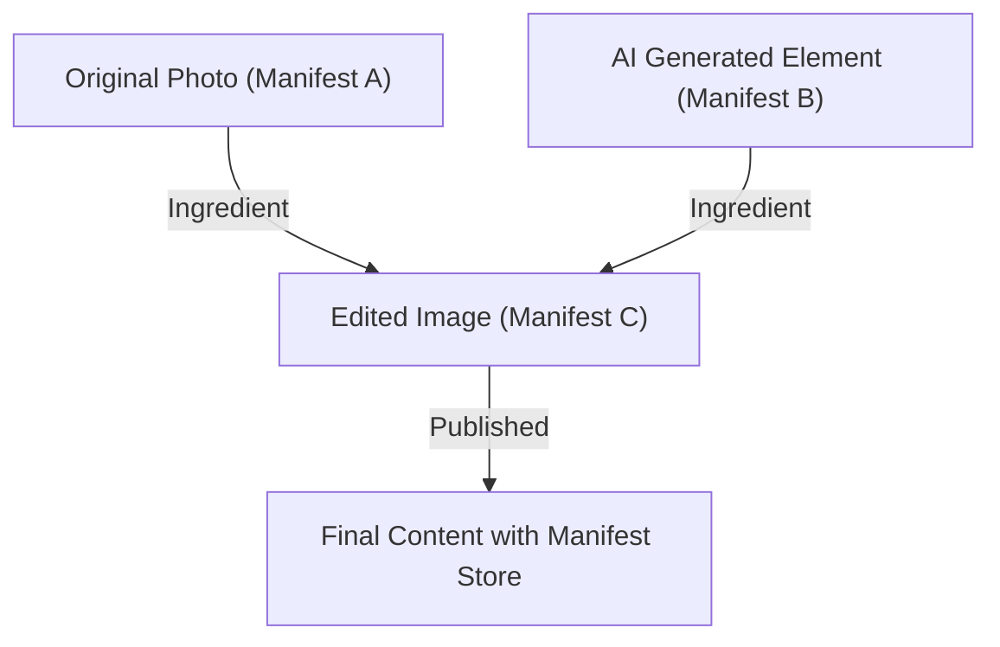

## 1. Latar Belakang Content Authenticity Initiative (CAI) dan C2PA

Dalam beberapa tahun terakhir, teknologi sintesis gambar, suara, dan video oleh AI generatif telah mencapai kemajuan pesat. Inovasi teknologi ini memberikan metode ekspresi baru bagi para kreator, tetapi di sisi lain juga memudahkan pembuatan deepfake yang sangat canggih, yang telah menjadi masalah sosial karena mengancam integritas ruang informasi. Dengan adanya kekhawatiran penyalahgunaan untuk penyebaran berita palsu, penipuan, dan manipulasi opini publik, mengamankan keandalan konten digital telah menjadi masalah yang mendesak.

Untuk mengatasi masalah ini, Adobe, Twitter (sekarang X), dan The New York Times mendirikan "Content Authenticity Initiative (CAI)" pada tahun 2019. Fokus utama CAI bukanlah untuk menentukan "kebenaran" media, melainkan untuk melacak dan membuktikan "asal usul (Provenance)" dari sebuah konten. Sebagai dasar teknologi untuk mewujudkan visi ini, Microsoft, Intel, Arm, Truepic, dan lainnya bergabung, yang kemudian bersama-sama mendirikan organisasi standardisasi "C2PA (Coalition for Content Provenance and Authenticity)" pada tahun 2021. C2PA merumuskan spesifikasi teknis yang terbuka dan dapat saling dioperasikan (spesifikasi C2PA), mulai dari perangkat keras hingga perangkat lunak.

## 2. Deteksi (Detection) vs Asal Usul (Provenance)

Dalam langkah-langkah melawan deepfake, pendekatan umumnya dibagi menjadi dua: "Deteksi" dan "Bukti Asal Usul".

**Deteksi (Detection)** adalah metode yang menggunakan teknologi analisis gambar dan model AI untuk menganalisis secara retrospektif apakah konten tersebut mengandung jejak manipulasi buatan (misalnya, batas piksel yang tidak alami, pantulan cahaya yang bertentangan dengan hukum fisika, dll.). Namun, evolusi teknologi generatif selalu melampaui teknologi deteksi, menciptakan situasi "kucing dan tikus", dan secara matematis dianggap sulit untuk 100% mendeteksi kepalsuan yang dihasilkan oleh algoritma yang tidak diketahui.

Di sisi lain, **Bukti Asal Usul (Provenance)** yang diadopsi oleh C2PA adalah pendekatan yang merekam "proses" dari pembuatan, pengeditan, hingga publikasi konten secara kriptografis, dan memberikannya dalam bentuk yang dapat diverifikasi. Berbeda dengan "Tanda Air (Watermarking)", ini tidak mengubah data gambar itu sendiri secara tidak dapat diubah, tetapi menambahkan (atau mengaitkan) informasi asal usul dengan tanda tangan kriptografi sebagai metadata. Hal ini memungkinkan pengguna untuk memverifikasi sendiri "siapa, kapan, dan alat apa yang digunakan untuk membuat atau mengedit konten ini", sehingga mereka dapat menilai keandalannya.

## 3. Struktur Data C2PA: Manifest Store, Ingredients, Assertions

Dalam spesifikasi C2PA, informasi asal usul konten dienkapsulasi dalam struktur data yang disebut "Manifest". Jika terdapat beberapa riwayat pengeditan, ini akan dikumpulkan sebagai "Manifest Store".

- **Manifest Store**: Wadah yang menyimpan semua Manifest yang terkait dengan konten target. Manifest terbaru diperlakukan sebagai status aktif, yang mencakup Manifest induk yang menunjukkan riwayat pengeditan sebelumnya.
- **Manifest**: Kumpulan informasi tentang satu acara pembuatan atau pengeditan.
- **Assertions**: Unit informasi deklarasi spesifik yang membentuk Manifest. Ini mencakup informasi kreator, alat (perangkat lunak atau kamera) yang digunakan, informasi GPS dan data EXIF saat pemotretan, tanda apakah dihasilkan oleh AI atau tidak, serta riwayat tindakan yang menunjukkan pengeditan apa yang telah dilakukan (pemotongan, koreksi warna, dll.).
- **Ingredients**: Informasi asal usul materi (gambar induk, dll.) yang digunakan saat mengedit. Jika beberapa gambar digabungkan, masing-masing gambar dicatat di dalam Manifest sebagai Ingredient, membentuk pohon silsilah yang kompleks.

Untuk memastikan ekstensibilitas, metadata ini dideskripsikan dalam format **JSON-LD** (JavaScript Object Notation for Linked Data), standar Semantic Web. Ini memungkinkan pertukaran data yang fleksibel antar sistem dan pendefinisian ontologi, sekaligus dapat dibaca oleh mesin.

## 4. Pengikatan Kriptografis: Hash dan Merkle Tree

Fitur terbesar dari C2PA adalah data piksel dari konten dan informasi Manifest "diikat (dijilid) secara kriptografis". Metadata dapat dengan mudah ditulis ulang, namun C2PA menggunakan fungsi hash (seperti SHA-256 dan SHA-384) untuk mencegah gangguan (tampering).

Secara khusus, nilai hash dari data gambar itu sendiri dan nilai hash dari setiap Assertion dihitung. Nilai-nilai hash ini dikumpulkan pada Assertion tertentu di dalam Manifest, dan pada akhirnya semua informasi diringkas menjadi satu nilai hash. Jika terdapat riwayat pengeditan yang kompleks (Ingredients), struktur **Merkle Tree** digunakan.

Dengan menggunakan Merkle Tree, seseorang dapat secara efisien memverifikasi apakah suatu elemen (seperti keberadaan Ingredient tertentu) telah diubah atau belum, tanpa perlu menghitung ulang keseluruhan data. Jika peretas mengubah bahkan 1 bit piksel gambar, atau menulis ulang nama penulis di Manifest, nilai hash yang dihitung akan berubah secara mendasar. Verifikasi terhadap tanda tangan digital yang dijelaskan selanjutnya akan gagal, sehingga gangguan dapat segera terdeteksi.

## 5. Infrastruktur Kunci Publik (PKI) dan Tanda Tangan Digital

Selain menjamin konsistensi data melalui nilai hash, tanda tangan digital digunakan untuk membuktikan bahwa Manifest dibuat oleh "entitas tepercaya" (seperti perangkat lunak, perangkat kamera, layanan tanda tangan).

C2PA mengadopsi Infrastruktur Kunci Publik (PKI: Public Key Infrastructure) berdasarkan **sertifikat X.509**. Algoritma tanda tangan menggunakan RSA (untuk kompatibilitas masa lalu), **ECDSA** (Elliptic Curve Digital Signature Algorithm), dan bahkan kriptografi kurva eliptik yang lebih cepat dan lebih aman seperti **Ed25519**.

1. **Pembuatan Tanda Tangan**: Perangkat lunak pengeditan (mis. Photoshop) atau perangkat kamera melakukan enkripsi (tanda tangan) pada nilai hash dari Manifest menggunakan kunci privat mereka sendiri.
2. **Chain of Trust**: Tanda tangan dilampirkan dengan sertifikat X.509 yang berisi kunci publik yang sesuai. Sertifikat ini membentuk "Rantai Kepercayaan (Chain of Trust)" yang berlanjut dari Otoritas Sertifikat Menengah (ICA) ke Otoritas Sertifikat Akar (Root CA).
3. **Verifikasi (Validation)**: Peramban atau penampil konten memverifikasi validitas sertifikat berdasarkan kunci publik Root CA (Trust List), mendekripsi tanda tangan dengan kunci publik, dan memeriksa apakah nilai hash cocok dengan yang dihitung.

Hal ini membuktikan secara matematis fakta bahwa konten "ditandatangani oleh server Adobe" atau "dipotret menggunakan model kamera tertentu dari Nikon".

## 6. Integrasi Perangkat Keras: Secure Enclave di dalam Kamera

Tidak hanya tanda tangan di tingkat perangkat lunak (seperti saat mengekspor pada perangkat lunak pengedit gambar), tetapi implementasi C2PA tingkat perangkat keras pada perangkat pemotretan yang menjadi "sumber" informasi juga sangat dipentingkan.

Produsen kamera seperti Leica, Sony, dan Nikon mendorong inisiatif untuk menggabungkan **Secure Enclave / TEE (Trusted Execution Environment)** ke dalam mesin pemrosesan gambar kamera mereka.
Saat cahaya mengenai sensor kamera dan diubah menjadi data digital (RAW), tanda tangan langsung dibuat menggunakan kunci privat yang disimpan dalam area yang dilindungi perangkat keras. Kunci privat ini tidak akan pernah dapat dikeluarkan dari kamera dan juga terlindungi dari peretasan firmware.

"Capture-time signing" ini memungkinkan pembuktian dari titik yang paling dapat dipercaya bahwa itu adalah foto asli yang menangkap dunia nyata.

## 7. Metode Penyematan: JUMBF (JPEG Universal Metadata Box Format)

Bagaimana Manifest Store yang dihasilkan dan tanda tangan kriptografis disimpan di dalam file? C2PA menggunakan **JUMBF (ISO/IEC 19566-5)**, format kontainer yang distandardisasi, untuk mendukung beragam format file (JPEG, PNG, WebP, MP4, dll.).

JUMBF adalah standar yang mendefinisikan kotak metadata (Box) yang bersifat hierarkis dan dapat diperluas dalam data biner.
Sebagai contoh pada file JPEG, data C2PA disimpan sebagai kotak JUMBF di dalam segmen penanda `APP11`. Keuntungan metode ini adalah, bahkan jika gambar dibuka pada penampil gambar konvensional (perangkat lunak yang tidak mendukung C2PA), kotak JUMBF akan diabaikan sehingga tidak memengaruhi tampilan gambar itu sendiri (memastikan kompatibilitas mundur).

## 8. Adopsi Dunia Nyata dan Tantangan (Real-world Adoption)

Standar C2PA dengan cepat memasuki fase adopsi. Adobe telah mengintegrasikan fungsi C2PA ke dalam Photoshop dan Firefly (AI Generatif) sebagai "Content Credentials", yang secara otomatis menambahkan informasi asal usul pada gambar AI yang dihasilkan. Bing Image Creator dari Microsoft dan DALL-E 3 dari OpenAI juga telah mengumumkan dan mengimplementasikan dukungan C2PA.
Selain itu, dari sisi platform, YouTube dan TikTok mulai mendeteksi metadata C2PA dan menerapkan label antarmuka pengguna yang menunjukkan bahwa itu adalah "konten yang dihasilkan oleh AI".

Namun, masih banyak tantangan. Masalah terbesar adalah "Hilangnya Metadata (Metadata Stripping)". Banyak platform media sosial (seperti X dan Facebook) secara otomatis mengompresi ulang gambar yang diunggah untuk menghemat ruang penyimpanan server atau untuk melindungi privasi (seperti penghapusan EXIF). Dalam proses ini, metadata C2PA termasuk JUMBF sering kali terhapus secara tidak sengaja. Saat ini, C2PA sangat mendesak platform media sosial untuk mempertahankan metadata tersebut.

## 9. Kerentanan dan Langkah Mitigasi (Vulnerabilities and Mitigations)

Meskipun C2PA kuat sebagai teknologi kriptografi, beberapa vektor serangan dapat diasumsikan untuk sistem secara keseluruhan.

1. **Analog Hole**: Tindakan menampilkan gambar yang dipotret dengan kamera yang mendukung C2PA di monitor, kemudian memotretnya kembali dengan kamera lain. Atau, mengambil tangkapan layar (screenshot) dari gambar yang memiliki tanda tangan C2PA. Hal ini akan memutus riwayat asal usul.
   * **Mitigasi**: Penggunaan bersama dengan teknologi Watermarking atau Digital Watermarking. Jika metadata terlepas, ID tak terlihat tertanam dalam piksel gambar itu sendiri, sehingga dapat dicocokkan dengan basis data cloud (C2PA Cloud yang akan dibahas nanti) untuk memulihkan asal usulnya. Pendekatan ini sedang dikembangkan.
2. **Kompromi Sertifikat**: Jika kunci privat yang digunakan untuk tanda tangan bocor, entitas jahat dapat berpura-pura menggunakan alat yang sah untuk melampirkan informasi asal usul palsu.
   * **Mitigasi**: Manajemen pencabutan (revocation) menggunakan mekanisme PKI standar seperti **CRL (Certificate Revocation List)** atau **OCSP (Online Certificate Status Protocol)**. Serta adopsi sertifikat yang berlaku singkat (Short-lived Certificates).
3. **Penyalahgunaan UI/UX**: Memanfaatkan kepercayaan tanpa syarat pengguna terhadap tanda centang hijau (ikon Content Credentials) untuk melampirkan manifes yang tampak benar di luar tetapi isinya kosong.
   * **Mitigasi**: Penegakan pedoman implementasi untuk peramban atau penampil. Menampilkan status verifikasi (valid, tidak valid, valid sebagian, dll.) dengan klasifikasi yang jelas.

## 10. Spesifikasi Masa Depan dan Prospek (Future Specs)

C2PA saat ini terus memperbarui spesifikasinya dan bergerak menuju standardisasi generasi berikutnya.

- **Soft Binding (Pengikatan Lunak)**: Sebuah teknologi yang menggunakan pencarian gambar serupa berbasis AI dan perceptual hashing (hash perseptual) untuk menautkan manifes asli dan gambar, bahkan jika piksel sedikit diubah karena kompresi ulang atau pengubahan ukuran. Ini akan mengatasi masalah hilangnya metadata di media sosial secara mendasar.
- **Video and Audio Streaming**: Saat ini dukungan utamanya adalah untuk file statis, tetapi perumusan spesifikasi untuk tanda tangan C2PA waktu nyata tingkat frame pada live streaming (penyematan pada bitstream H.264 / H.265 / AV1) sedang berlangsung.
- **Privacy and Redaction**: Perluasan fungsi untuk "menyensor secara aman secara kriptografis (Redact)" hanya pada informasi fotografer tertentu atau informasi lokasi, guna membuktikan asal usul sembari melindungi sumber bagi organisasi berita.

## Kesimpulan

Content Credentials dan C2PA bukan sekadar "alat pendeteksi deepfake", melainkan infrastruktur luar biasa untuk membangun "transparansi informasi" di dunia digital. Dengan menggabungkan teknologi keamanan yang sudah terbukti seperti hash kriptografis, Merkle Tree, PKI, dan kolaborasi perangkat keras, kita sekarang dapat memverifikasi "asal usul" sebagai fakta sebelum memperdebatkan "kebenaran" sebuah konten.
Mencapai masa depan di mana semua media di internet memiliki informasi asal usul, upaya terpadu dari teknologi, platform, dan kerangka peraturan niscaya akan semakin cepat.
