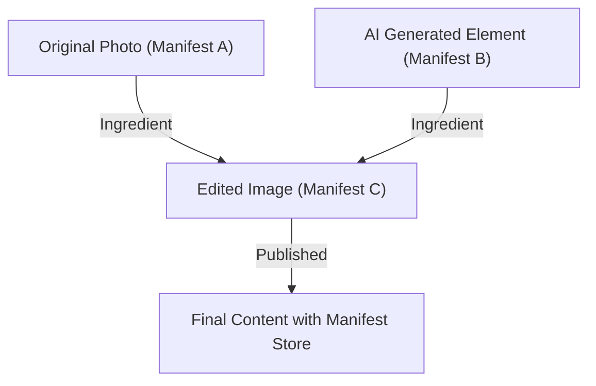

## 1. 콘텐츠 인증 이니셔티브(CAI)와 C2PA의 배경

최근 생성 AI에 의한 이미지, 음성, 동영상 합성 기술은 비약적인 진화를 이루었다. 이러한 기술 혁신은 크리에이터에게 새로운 표현 수단을 제공하는 한편, 극히 정교한 딥페이크 생성을 용이하게 하여 정보 공간의 건전성을 위협하는 사회 문제가 되고 있다. 가짜 뉴스의 확산이나 사기, 여론 조작에 악용될 우려가 커지는 가운데, 디지털 콘텐츠의 신뢰성을 어떻게 담보할 것인가가 시급한 과제가 되었다.

이러한 과제에 대처하기 위해, Adobe, Twitter(현 X), The New York Times 3사는 2019년에 '콘텐츠 인증 이니셔티브(CAI: Content Authenticity Initiative)'를 설립했다. CAI의 주된 목적은 미디어의 '진위'를 판정하는 것이 아니라, 콘텐츠의 '내력(Provenance)'을 추적하고 증명하는 데 있다. 이 비전을 구현하기 위한 기술적 기반으로서 Microsoft, Intel, Arm, Truepic 등이 합류하여 2021년에 공동 설립된 표준화 단체가 'C2PA(Coalition for Content Provenance and Authenticity)'이다. C2PA는 하드웨어에서 소프트웨어에 이르기까지 개방적이고 상호 운용 가능한 기술 사양(C2PA 사양)을 제정하고 있다.

## 2. 탐지(Detection) 대 내력(Provenance)

딥페이크 대책에 있어서 일반적으로 접근 방식은 '탐지'와 '내력 증명'의 두 가지로 크게 나뉜다.

<strong>탐지(Detection)</strong>는 이미지 분석 기술이나 AI 모델을 사용하여 콘텐츠에 인위적으로 조작된 흔적(부자연스러운 픽셀의 경계, 물리 법칙에 어긋나는 빛의 반사 등)이 포함되어 있지 않은지를 사후적으로 분석하는 수단이다. 그러나 생성 기술의 진화는 항상 탐지 기술을 웃도는 '숨바꼭질' 양상을 띠고 있으며, 미지의 알고리즘으로 생성된 가짜를 100% 간파하는 것은 수학적으로도 어렵다고 여겨진다.

반면, C2PA가 채택하는 <strong>내력 증명(Provenance)</strong>은 콘텐츠의 생성부터 편집, 공개에 이르기까지의 '과정'을 암호학적으로 기록하고, 검증 가능한 형태로 부여하는 접근 방식이다. 이는 '워터마크(Watermarking)'와는 달리, 이미지 데이터 자체를 비가역적으로 개조하는 것이 아니라 메타데이터로서 암호 서명이 포함된 내력 정보를 추가(혹은 연결)한다. 이를 통해 사용자는 '누가, 언제, 어떤 도구를 사용하여 이 콘텐츠를 생성 및 편집했는지'를 스스로 확인하고 그 신뢰성을 판단할 수 있다.

## 3. C2PA 데이터 구조: Manifest Store, Ingredients, Assertions

C2PA 사양에서 콘텐츠의 내력 정보는 '매니페스트(Manifest)'라고 불리는 데이터 구조로 캡슐화된다. 여러 번의 편집 이력이 있는 경우, 이들은 'Manifest Store'로 묶이게 된다.

- **Manifest Store**: 대상 콘텐츠와 관련된 모든 Manifest를 저장하는 컨테이너. 최신 Manifest가 활성 상태로 취급되며, 과거의 편집 이력을 나타내는 상위(parent) Manifest를 포함한다.
- **Manifest**: 1회의 생성 또는 편집 이벤트에 관한 정보의 집합체.
- **Assertions**: Manifest를 구성하는 구체적인 선언 정보의 단위. 작성자 정보, 사용된 도구(소프트웨어 및 카메라), 촬영 시의 GPS 정보 및 EXIF 데이터, AI에 의해 생성되었는지 여부를 나타내는 플래그, 그리고 어떤 편집이 이루어졌는지(크롭, 색조 보정 등)를 나타내는 작업 이력이 포함된다.
- **Ingredients**: 편집 시에 사용된 소재(원본 이미지 등)의 내력 정보. 여러 이미지를 합성한 경우, 각각의 이미지가 Ingredient로서 Manifest에 기록되어 복잡한 계보 트리를 형성한다.

이러한 메타데이터는 확장성을 확보하기 위해 시맨틱 웹 표준인 **JSON-LD**(JavaScript Object Notation for Linked Data) 형식으로 기술된다. 이로 인해 기계가 읽을 수 있으면서도 다른 시스템 간의 유연한 데이터 교환 및 온톨로지 정의가 가능해졌다.

## 4. 암호학적 바인딩: 해시와 머클 트리

C2PA의 가장 큰 특징은 콘텐츠의 픽셀 데이터와 Manifest 정보가 '암호학적으로 바인딩(결합)'되어 있다는 것이다. 메타데이터는 쉽게 덮어쓸 수 있지만, C2PA에서는 해시 함수(SHA-256이나 SHA-384 등)를 사용하여 위조를 방지한다.

구체적으로는, 이미지 데이터 자체의 해시 값과 각 Assertion의 해시 값을 계산한다. 이 해시 값들은 Manifest 내의 특정 Assertion에 집약되고, 최종적으로 모든 정보가 단일 해시 값으로 귀결된다. 복잡한 편집 이력(Ingredients)이 존재하는 경우, **Merkle Tree(머클 트리)** 구조가 사용된다.

Merkle Tree를 이용함으로써, 데이터 전체를 재계산할 필요 없이 특정 요소(예를 들어 특정 Ingredient의 존재)가 위조되지 않았는지를 효율적으로 검증할 수 있다. 만약 악의적인 자가 이미지의 픽셀을 1비트라도 변경하거나 Manifest 내의 작성자 이름을 덮어쓸 경우, 계산되는 해시 값이 근본적으로 달라져 후술할 전자 서명 검증에 실패하게 되므로, 위조가 즉각적으로 발각되는 구조이다.

## 5. 공개키 기반 구조(PKI)와 전자 서명

해시 값에 의한 데이터 일관성 보장에 더해, Manifest가 '신뢰할 수 있는 엔터티(소프트웨어, 카메라 장치, 서명 서비스)'에 의해 생성되었음을 증명하기 위해 전자 서명이 이용된다.

C2PA는 **X.509 인증서**에 기반한 공개키 기반 구조(PKI: Public Key Infrastructure)를 채택하고 있다. 서명 알고리즘으로는 RSA(과거 호환성), **ECDSA**(Elliptic Curve Digital Signature Algorithm), 나아가 더 빠르고 안전한 **Ed25519** 등의 타원곡선 암호가 이용된다.

1. **서명 생성**: 편집 소프트웨어(예: Photoshop)나 카메라 장치는 Manifest의 해시 값에 대해 자신의 개인키를 사용하여 암호화(서명)를 수행한다.
2. **Chain of Trust**: 서명에는 해당하는 공개키를 포함한 X.509 인증서가 첨부된다. 이 인증서는 중간 인증기관(ICA)에서 루트 인증기관(Root CA)으로 이어지는 '신뢰의 사슬(Chain of Trust)'을 형성하고 있다.
3. **검증(Validation)**: 콘텐츠를 열람하는 브라우저나 뷰어는 루트 CA의 공개키(Trust List)를 바탕으로 인증서의 유효성을 검증하고, 공개키를 사용하여 서명을 복호화하여 계산한 해시 값과 일치하는지 확인한다.

이로 인해, 'Adobe의 서버에서 서명되었다', 'Nikon의 특정 카메라 기종으로 촬영되었다'는 사실이 수학적으로 증명된다.

## 6. 하드웨어 통합: 카메라 내 보안 엔클레이브

소프트웨어 수준에서의 서명(예: 이미지 편집 소프트웨어의 내보내기 시)뿐만 아니라, 정보의 '수원지'인 촬영 장치에서의 하드웨어 수준 C2PA 구현이 중요시되고 있다.

라이카나 소니, 니콘과 같은 카메라 제조사들은 카메라의 이미지 처리 엔진 내에 <strong>보안 엔클레이브(Secure Enclave) / TEE(Trusted Execution Environment)</strong>를 통합하는 노력을 진행하고 있다.
빛이 카메라의 센서에 닿아 디지털 데이터(RAW)로 변환되는 순간에, 하드웨어적으로 보호되는 영역에 저장된 개인키를 사용하여 서명이 이루어진다. 이 개인키는 카메라에서 절대 꺼낼 수 없으며, 펌웨어의 위조로부터도 보호된다.

이러한 'Capture-time signing'을 통해, 현실 세계를 포착한 진짜 사진임을 가장 신뢰할 수 있는 지점에서 증명할 수 있게 된다.

## 7. 임베딩 기법: JUMBF (JPEG Universal Metadata Box Format)

생성된 Manifest Store와 암호 서명은 어떻게 파일에 저장될까? C2PA는 다양한 파일 포맷(JPEG, PNG, WebP, MP4 등)에 대응하기 위해 표준화된 컨테이너 포맷인 <strong>JUMBF(ISO/IEC 19566-5)</strong>를 이용한다.

JUMBF는 바이너리 데이터 내에 계층적이고 확장 가능한 메타데이터 박스(Box)를 정의하는 규격이다.
예를 들어 JPEG 파일의 경우, `APP11` 마커 세그먼트 내에 JUMBF 박스로서 C2PA 데이터가 저장된다. 이 기법의 장점은 기존 이미지 뷰어(C2PA를 지원하지 않는 소프트웨어)에서 이미지를 열 경우에도 JUMBF 박스는 무시되므로, 이미지 표시 자체에는 영향을 주지 않는다(하위 호환성 확보)는 점에 있다.

## 8. 실사회 보급과 과제 (Real-world Adoption)

C2PA 규격은 급속히 보급되는 단계에 들어섰다. Adobe는 Photoshop이나 Firefly(생성 AI)에 'Content Credentials'로서 C2PA 기능을 통합하여, 생성한 AI 이미지에 자동으로 내력 정보를 부여하고 있다. Microsoft의 Bing Image Creator나 OpenAI의 DALL-E 3도 C2PA 지원을 발표 및 구현했다.
또한 플랫폼 측에서도 YouTube나 TikTok이 C2PA 메타데이터를 감지하여, 'AI에 의해 생성된 콘텐츠'임을 사용자 인터페이스 상에 라벨로 표시하는 노력을 시작했다.

그러나 과제도 많다. 가장 큰 문제는 '메타데이터 누락(Metadata Stripping)'이다. SNS(X나 Facebook 등)의 대부분은 서버의 스토리지 절약이나 개인정보 보호(EXIF 삭제)를 목적으로, 업로드된 이미지를 자동으로 재압축한다. 이 과정에서 JUMBF를 포함한 C2PA 메타데이터가 의도치 않게 삭제되어 버리는 것이다. 현재 C2PA는 SNS 플랫폼에 메타데이터를 유지하도록 강력하게 촉구하고 있다.

## 9. 취약성과 완화책 (Vulnerabilities and Mitigations)

암호 기술로서는 견고한 C2PA이지만, 시스템 전체로서는 몇 가지 공격 벡터가 예상된다.

1. **아날로그 홀(Analog Hole)**: C2PA 지원 카메라로 촬영된 이미지를 모니터에 표시하고, 그것을 다른 카메라로 재촬영하는 행위. 혹은 C2PA 서명이 포함된 이미지를 스크린샷 하는 행위. 이로 인해 내력은 단절된다.
   * **완화책**: 워터마크 기술(Watermarking)이나 디지털 워터마크(Digital Watermarking)와의 병용. 메타데이터가 벗겨져도, 이미지 자체의 픽셀에 보이지 않는 ID를 임베딩해 둠으로써, 클라우드 데이터베이스(후술할 C2PA Cloud)와 대조하여 내력을 복원하는 접근이 진행되고 있다.
2. **인증서 손상**: 서명에 사용된 개인키가 유출될 경우, 악의적인 자가 정규 도구를 가장하여 가짜 내력 정보를 부여할 수 있다.
   * **완화책**: PKI의 표준적인 구조인 <strong>CRL(Certificate Revocation List)</strong>이나 <strong>OCSP(Online Certificate Status Protocol)</strong>를 이용한 해지 관리. 또한, 단기 유효 인증서(Short-lived Certificates)의 채택.
3. **UI/UX의 악용**: 사용자가 녹색 체크마크(Content Credentials의 아이콘)를 무조건적으로 믿는 것을 이용하여, 언뜻 보기에 올바르지만 내용이 비어 있는 매니페스트를 부여한다.
   * **완화책**: 브라우저나 뷰어의 구현 가이드라인 철저. 검증 상태의 명확한 구분(유효, 무효, 부분적으로 유효 등) 표시.

## 10. 미래의 사양과 전망 (Future Specs)

C2PA는 현재도 사양 업데이트를 계속하고 있으며, 차세대 표준화를 향해 움직이고 있다.

- **소프트 바인딩 (Soft Binding)**: 픽셀이 재압축이나 리사이즈로 경미하게 변경된 경우라도, AI 기반의 유사 이미지 검색이나 지각 해시(Perceptual Hash)를 사용하여 원래의 Manifest와 이미지를 연결하는 기술. 이를 통해 SNS에서의 메타데이터 누락 문제에 근본적으로 대응한다.
- **Video and Audio Streaming**: 현재는 정적 파일에 대한 대응이 주를 이루지만, 라이브 스트리밍에서의 실시간 프레임 단위 C2PA 서명(H.264 / H.265 / AV1 비트스트림에 임베딩)의 사양 제정이 진행되고 있다.
- **Privacy and Redaction**: 내력을 증명하면서도 언론 기관이 정보원을 보호하기 위해 특정 촬영자 정보나 위치 정보만을 '암호학적으로 안전하게 삭제(Redact)'하는 기능의 확충.

## 요약

Content Credentials와 C2PA는 단순한 '딥페이크 탐지 도구'가 아니라, 디지털 세계에서의 '정보의 투명성'을 구축하기 위한 장대한 인프라스트럭처이다. 암호 해시, Merkle Tree, PKI, 하드웨어 연동과 같은 검증된 보안 기술을 조합함으로써, 우리는 콘텐츠의 '진위'를 논의하기 전에 그 '출처'를 팩트로서 검증할 수 있게 되었다.
인터넷 상의 모든 미디어가 내력 정보를 가지는 미래를 목표로, 기술, 플랫폼, 그리고 법적 규제가 일체가 된 노력이 앞으로 더욱 가속화될 것이다.
