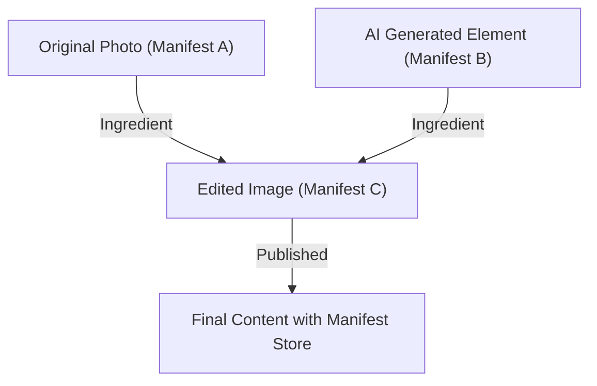

## 1. コンテンツ認証イニシアチブ (CAI) と C2PA の背景

近年、生成AIによる画像や音声、動画の合成技術は飛躍的な進化を遂げた。この技術革新はクリエイターに新たな表現手法をもたらす一方で、極めて精巧なディープフェイクの生成を容易にし、情報空間の健全性を脅かす社会問題となっている。フェイクニュースの拡散や詐欺、世論誘導への悪用が懸念される中、デジタルコンテンツの信頼性をいかに担保するかが急務となった。

この課題に対処するため、Adobe、Twitter（現X）、The New York Timesの3社は2019年に「コンテンツ認証イニシアチブ（CAI: Content Authenticity Initiative）」を設立した。CAIの主眼は、メディアの「真偽」を判定することではなく、コンテンツの「来歴（Provenance）」を追跡・証明することにある。このビジョンを具現化するための技術的基盤として、Microsoft、Intel、Arm、Truepicなどが加わり、2021年に共同設立された標準化団体が「C2PA（Coalition for Content Provenance and Authenticity）」である。C2PAは、ハードウェアからソフトウェアに至るまで、オープンで相互運用可能な技術仕様（C2PA仕様）を策定している。

## 2. 検出 (Detection) 対 来歴 (Provenance)

ディープフェイク対策において、一般的にアプローチは「検出」と「来歴証明」の2つに大別される。

**検出（Detection）** は、画像解析技術やAIモデルを用いて、コンテンツに人工的に操作された痕跡（不自然なピクセルの境界、物理法則に反する光の反射など）が含まれていないかを事後的に分析する手法である。しかし、生成技術の進化は常に検出技術を上回る「いたちごっこ」の様相を呈しており、未知のアルゴリズムで生成されたフェイクを100%見破ることは数学的にも困難とされている。

一方、C2PAが採用する **来歴証明（Provenance）** は、コンテンツの作成から編集、公開に至るまでの「過程」を暗号学的に記録し、検証可能な形で付与するアプローチである。これは「透かし（Watermarking）」とは異なり、画像データそのものを不可逆的に改変するのではなく、メタデータとして暗号署名付きの来歴情報を付加する（あるいは関連付ける）。これにより、ユーザーは「誰が、いつ、どのようなツールを用いてこのコンテンツを作成・編集したか」を自ら確認し、その信頼性を判断することができる。

## 3. C2PAデータ構造: Manifest Store, Ingredients, Assertions

C2PA仕様では、コンテンツの来歴情報は「Manifest（マニフェスト）」と呼ばれるデータ構造にカプセル化される。複数の編集履歴がある場合、これらは「Manifest Store」としてまとめられる。

- **Manifest Store**: 対象コンテンツに関連するすべてのManifestを格納するコンテナ。最新のManifestがアクティブな状態として扱われ、過去の編集履歴を示す親Manifestを包含する。
- **Manifest**: 1回の作成または編集イベントに関する情報の集合体。
- **Assertions**: Manifestを構成する具体的な宣言情報の単位。作成者情報、使用されたツール（ソフトウェアやカメラ）、撮影時のGPS情報やEXIFデータ、AIによって生成されたか否かのフラグ、そしてどのような編集が行われたか（クロップ、色調補正など）を示すアクション履歴が含まれる。
- **Ingredients**: 編集時に使用された素材（親画像など）の来歴情報。複数の画像を合成した場合、それぞれの画像がIngredientとしてManifestに記録され、複雑な系譜ツリーを形成する。

これらのメタデータは、拡張性を確保するため、セマンティックウェブ標準の **JSON-LD** (JavaScript Object Notation for Linked Data) 形式で記述される。これにより、マシンリーダブルでありながら、異なるシステム間での柔軟なデータ交換とオントロジーの定義が可能になっている。

## 4. 暗号学的バインディング: ハッシュとマークルツリー

C2PAの最大の特徴は、コンテンツのピクセルデータとManifest情報が「暗号学的にバインド（結合）」されていることだ。メタデータは容易に書き換え可能だが、C2PAではハッシュ関数（SHA-256やSHA-384など）を用いて改ざんを防止する。

具体的には、画像データそのもののハッシュ値と、各Assertionのハッシュ値を計算する。これらのハッシュ値はManifest内の特定のAssertionに集約され、最終的にすべての情報が単一のハッシュ値へと帰着する。複雑な編集履歴（Ingredients）が存在する場合、**Merkle Tree（マークルツリー）** 構造が用いられる。

Merkle Treeを利用することで、データ全体を再計算することなく、特定の要素（例えば特定のIngredientの存在）が改ざんされていないかを効率的に検証できる。もし悪意のある者が画像のピクセルを1ビットでも変更したり、Manifest内の作者名を書き換えたりした場合、計算されるハッシュ値が根本から変わり、後述する電子署名との検証に失敗するため、改ざんが即座に露見する仕組みである。

## 5. 公開鍵基盤 (PKI) と電子署名

ハッシュ値によるデータの一貫性保証に加え、Manifestが「信頼できるエンティティ（ソフトウェアやカメラデバイス、署名サービス）」によって作成されたことを証明するために、電子署名が利用される。

C2PAは **X.509証明書** に基づく公開鍵基盤 (PKI: Public Key Infrastructure) を採用している。署名アルゴリズムには、RSA（過去の互換性）、**ECDSA** (Elliptic Curve Digital Signature Algorithm)、さらにはより高速で安全な **Ed25519** などの楕円曲線暗号が利用される。

1. **署名の生成**: 編集ソフト（例: Photoshop）やカメラデバイスは、Manifestのハッシュ値に対して自身の秘密鍵を用いて暗号化（署名）を行う。
2. **Chain of Trust**: 署名には、対応する公開鍵を含むX.509証明書が添付される。この証明書は、中間認証局（ICA）からルート認証局（Root CA）へと連なる「信頼のチェーン（Chain of Trust）」を形成している。
3. **検証 (Validation)**: コンテンツを閲覧するブラウザやビューアは、ルートCAの公開鍵（Trust List）を基に証明書の有効性を検証し、公開鍵を用いて署名を復号、計算したハッシュ値と一致するかを確認する。

これにより、「Adobeのサーバーで署名された」「Nikonの特定のカメラ機種で撮影された」という事実が数学的に証明される。

## 6. ハードウェア・インテグレーション：カメラ内セキュアエンクレーブ

ソフトウェアレベルでの署名（例えば画像編集ソフトのエクスポート時）だけでなく、情報の「源流」である撮影デバイスにおけるハードウェアレベルのC2PA実装が重要視されている。

ライカやソニー、ニコンといったカメラメーカーは、カメラの画像処理エンジン内に **セキュアエンクレーブ (Secure Enclave) / TEE (Trusted Execution Environment)** を組み込む取り組みを進めている。
光がカメラのセンサーに当たり、デジタルデータ（RAW）に変換された瞬間に、ハードウェア的に保護された領域に格納された秘密鍵を用いて署名が行われる。この秘密鍵はカメラから決して取り出すことができず、ファームウェアの改ざんからも保護されている。

この「Capture-time signing」により、現実世界を捉えた本物の写真であることを、最も信頼できる地点から証明することが可能になる。

## 7. 埋め込み手法：JUMBF (JPEG Universal Metadata Box Format)

生成されたManifest Storeと暗号署名は、どのようにファイルに格納されるのか。C2PAは、多様なファイルフォーマット（JPEG、PNG、WebP、MP4など）に対応するため、標準化されたコンテナフォーマットである **JUMBF (ISO/IEC 19566-5)** を利用する。

JUMBFは、バイナリデータ内に階層的で拡張可能なメタデータボックス（Box）を定義する規格である。
例えばJPEGファイルの場合、`APP11` マーカーセグメント内にJUMBFボックスとしてC2PAデータが格納される。この手法の利点は、従来の画像ビューア（C2PAに非対応のソフトウェア）で画像を開いた場合でも、JUMBFボックスは無視されるため、画像の表示そのものには影響を与えない（後方互換性の確保）点にある。

## 8. 実社会への普及と課題 (Real-world Adoption)

C2PA規格は急速に普及のフェーズに入っている。AdobeはPhotoshopやFirefly（生成AI）に「Content Credentials」としてC2PA機能を統合し、生成したAI画像に自動で来歴情報を付与している。MicrosoftのBing Image CreatorやOpenAIのDALL-E 3もC2PAへの対応を発表・実装している。
また、プラットフォーム側でも、YouTubeやTikTokがC2PAメタデータを検知し、「AIによって生成されたコンテンツ」であることをユーザーインターフェース上にラベル表示する取り組みを開始している。

しかし、課題も多い。最大の問題は「メタデータの欠落（Metadata Stripping）」である。SNS（XやFacebookなど）の多くは、サーバーのストレージ節約やプライバシー保護（EXIF削除）を目的として、アップロードされた画像を自動的に再圧縮する。この過程でJUMBFを含むC2PAメタデータが意図せず削除されてしまうのだ。現在、C2PAはSNSプラットフォームに対してメタデータを保持するよう強く働きかけている。

## 9. 脆弱性と緩和策 (Vulnerabilities and Mitigations)

暗号技術としては堅牢なC2PAであるが、システム全体としてはいくつかの攻撃ベクターが想定される。

1. **アナログホール（Analog Hole）**: C2PA対応カメラで撮影された画像をモニターに表示し、それを別のカメラで再撮影する行為。あるいは、C2PA署名付きの画像をスクリーンショットする行為。これにより、来歴は断絶する。
   * **緩和策**: 透かし技術（Watermarking）や電子透かし（Digital Watermarking）との併用。メタデータが剥がれても、画像自体のピクセルに不可視のIDを埋め込んでおくことで、クラウドデータベース（後述のC2PA Cloud）と照合し、来歴を復元するアプローチが進められている。
2. **証明書の危殆化**: 署名に用いられた秘密鍵が流出した場合、悪意のある者が正規のツールを騙って偽の来歴情報を付与できる。
   * **緩和策**: PKIの標準的な仕組みである **CRL (Certificate Revocation List)** や **OCSP (Online Certificate Status Protocol)** を用いた失効管理。また、短期有効証明書（Short-lived Certificates）の採用。
3. **UI/UXの悪用**: ユーザーが緑色のチェックマーク（Content Credentialsのアイコン）を無条件に信じ込むことを利用し、一見正しいが中身が空虚なマニフェストを付与する。
   * **緩和策**: ブラウザやビューアの実装ガイドラインの徹底。検証ステータスの明確な区分（有効、無効、部分的に有効など）の表示。

## 10. 将来の仕様と展望 (Future Specs)

C2PAは現在も仕様アップデートを続けており、次世代の標準化に向けて動いている。

- **Soft Binding (ソフトバインディング)**: ピクセルが再圧縮やリサイズで軽微に変更された場合でも、AIベースの類似画像検索やパーセプチュアルハッシュ（知覚ハッシュ）を用いて、元のManifestと画像を結びつける技術。これにより、SNSでのメタデータ欠落問題に根本から対応する。
- **Video and Audio Streaming**: 現在は静的ファイルへの対応が主だが、ライブストリーミングにおけるリアルタイムなフレーム単位でのC2PA署名（H.264 / H.265 / AV1ビットストリームへの埋め込み）の仕様策定が進んでいる。
- **Privacy and Redaction**: 来歴を証明しつつ、報道機関が情報源を保護するために特定の撮影者情報や位置情報のみを「暗号学的に安全に墨塗り（Redact）」する機能の拡充。

## まとめ

Content CredentialsとC2PAは、単なる「ディープフェイク検出ツール」ではなく、デジタル世界における「情報の透明性」を構築するための壮大なインフラストラクチャである。暗号ハッシュ、Merkle Tree、PKI、ハードウェア連携といった実績あるセキュリティ技術を組み合わせることで、私たちはコンテンツの「真偽」を議論する前に、その「出自」をファクトとして検証できるようになった。
インターネット上のすべてのメディアが来歴情報を持つ未来を目指し、技術、プラットフォーム、そして法規制が一体となった取り組みが今後さらに加速していくだろう。
