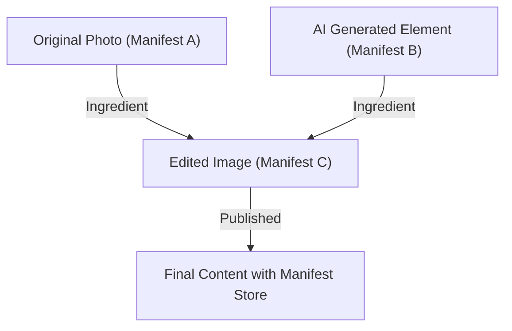

## 1. O Contexto da Content Authenticity Initiative (CAI) e C2PA

Nos últimos anos, a tecnologia de síntese de imagens, áudio e vídeo por IA generativa evoluiu drasticamente. Embora essa inovação tecnológica traga novos métodos de expressão para os criadores, ela também facilita a geração de deepfakes extremamente sofisticados, tornando-se um problema social que ameaça a integridade do espaço de informações. Com o receio de disseminação de fake news, fraudes e manipulação da opinião pública, garantir a confiabilidade dos conteúdos digitais tornou-se uma tarefa urgente.

Para enfrentar esse desafio, Adobe, Twitter (atualmente X) e The New York Times fundaram a "Content Authenticity Initiative (CAI)" em 2019. O foco principal da CAI não é julgar a "autenticidade" da mídia, mas rastrear e comprovar a "proveniência" (Provenance) do conteúdo. Como base técnica para concretizar essa visão, Microsoft, Intel, Arm, Truepic, entre outras, juntaram-se e formaram a "C2PA (Coalition for Content Provenance and Authenticity)", uma organização de padronização co-fundada em 2021. A C2PA formula especificações técnicas abertas e interoperáveis (especificação C2PA), desde o hardware até o software.

## 2. Detecção (Detection) vs Proveniência (Provenance)

Nas contramedidas contra deepfakes, as abordagens geralmente se dividem em duas categorias: "detecção" e "comprovação de proveniência".

A **Detecção (Detection)** é uma técnica que analisa a posteriori, usando modelos de IA e tecnologias de análise de imagem, se o conteúdo contém vestígios de manipulação artificial (como bordas de pixels não naturais ou reflexos de luz que contrariam as leis da física). No entanto, a evolução da tecnologia de geração sempre parece superar a tecnologia de detecção em um jogo de "gato e rato", e considera-se matematicamente difícil detectar com 100% de certeza fakes gerados por algoritmos desconhecidos.

Por outro lado, a **Proveniência (Provenance)** adotada pela C2PA é uma abordagem que registra criptograficamente o "processo" desde a criação até a edição e publicação do conteúdo, anexando-o de forma verificável. Diferentemente das "marcas d'água" (Watermarking), não altera irreversivelmente os próprios dados da imagem, mas adiciona (ou associa) informações de proveniência com assinaturas criptográficas como metadados. Isso permite que os usuários verifiquem por si mesmos "quem, quando e com quais ferramentas este conteúdo foi criado ou editado" e julguem sua confiabilidade.

## 3. Estrutura de Dados C2PA: Manifest Store, Ingredients, Assertions

Na especificação C2PA, as informações de proveniência do conteúdo são encapsuladas em uma estrutura de dados chamada "Manifest" (Manifesto). Se houver vários históricos de edição, eles são agrupados como um "Manifest Store".

- **Manifest Store**: Um contêiner que armazena todos os Manifests relacionados ao conteúdo em questão. O Manifest mais recente é tratado como o estado ativo e abrange os Manifests pais que mostram o histórico de edição passado.
- **Manifest**: Um conjunto de informações referentes a um único evento de criação ou edição.
- **Assertions**: A unidade de informações declarativas específicas que compõem o Manifest. Inclui informações do autor, ferramentas usadas (software ou câmera), informações de GPS e dados EXIF no momento da captura, um sinalizador indicando se foi gerado por IA e o histórico de ações mostrando quais edições foram feitas (recorte, correção de cores, etc.).
- **Ingredients**: Informações de proveniência dos materiais (como imagens originais) usadas durante a edição. Quando várias imagens são compostas, cada imagem é registrada no Manifest como um Ingredient, formando uma complexa árvore genealógica.

Esses metadados, para garantir a extensibilidade, são descritos no formato **JSON-LD** (JavaScript Object Notation for Linked Data), o padrão da web semântica. Isso permite a definição de ontologias e a troca flexível de dados entre diferentes sistemas, mantendo a legibilidade por máquina.

## 4. Ligação Criptográfica: Hashes e Árvore de Merkle

A principal característica da C2PA é que os dados de pixel do conteúdo e as informações do Manifest são "ligados criptograficamente" (binded). Enquanto os metadados podem ser facilmente reescritos, a C2PA usa funções hash (como SHA-256 e SHA-384) para evitar a adulteração.

Especificamente, ela calcula o valor de hash dos próprios dados da imagem e os valores de hash de cada Assertion. Esses valores de hash são agregados a um Assertion específico dentro do Manifest e, finalmente, todas as informações são reduzidas a um único valor de hash. Quando existem históricos de edição complexos (Ingredients), usa-se a estrutura **Merkle Tree (Árvore de Merkle)**.

Ao usar a Merkle Tree, é possível verificar eficientemente se um elemento específico (por exemplo, a presença de um Ingredient específico) foi adulterado, sem recalcular todos os dados. Se um indivíduo mal-intencionado alterar até mesmo 1 bit dos pixels da imagem ou reescrever o nome do autor no Manifest, o valor de hash calculado mudará fundamentalmente e a verificação com a assinatura digital, descrita a seguir, falhará, expondo a adulteração instantaneamente.

## 5. Infraestrutura de Chave Pública (PKI) e Assinaturas Digitais

Além de garantir a consistência dos dados com valores de hash, assinaturas digitais são usadas para provar que o Manifest foi criado por uma "entidade confiável" (software, dispositivo de câmera ou serviço de assinatura).

A C2PA adota uma Infraestrutura de Chave Pública (PKI: Public Key Infrastructure) baseada em **certificados X.509**. Os algoritmos de assinatura incluem RSA (para compatibilidade legada), **ECDSA** (Elliptic Curve Digital Signature Algorithm) e criptografia de curva elíptica ainda mais rápida e segura, como **Ed25519**.

1. **Geração da Assinatura**: O software de edição (por exemplo, Photoshop) ou o dispositivo de câmera usa sua própria chave privada para criptografar (assinar) o valor de hash do Manifest.
2. **Chain of Trust**: Um certificado X.509 contendo a chave pública correspondente é anexado à assinatura. Este certificado forma uma "Cadeia de Confiança" (Chain of Trust) que vai de uma Autoridade de Certificação Intermediária (ICA) até a Autoridade de Certificação Raiz (Root CA).
3. **Verificação (Validation)**: O navegador ou visualizador que acessa o conteúdo verifica a validade do certificado com base na chave pública da CA Raiz (Trust List), descriptografa a assinatura usando a chave pública e verifica se ela corresponde ao valor de hash calculado.

Com isso, prova-se matematicamente o fato de que "foi assinado pelos servidores da Adobe" ou "foi capturado por um modelo de câmera específico da Nikon".

## 6. Integração de Hardware: Secure Enclave na Câmera

Além da assinatura no nível do software (por exemplo, ao exportar um software de edição de imagem), é dada grande importância à implementação C2PA no nível do hardware no dispositivo de captura, que é a "fonte" da informação.

Fabricantes de câmeras como Leica, Sony e Nikon estão trabalhando para incorporar um **Secure Enclave (Enclave Seguro) / TEE (Trusted Execution Environment)** dentro do mecanismo de processamento de imagens da câmera.
No momento em que a luz atinge o sensor da câmera e é convertida em dados digitais (RAW), uma assinatura é realizada usando uma chave privada armazenada em uma área protegida por hardware. Essa chave privada nunca pode ser extraída da câmera e também é protegida contra adulteração do firmware.

Com esta "Capture-time signing" (assinatura no momento da captura), torna-se possível provar a partir do ponto mais confiável que se trata de uma foto genuína que capturou o mundo real.

## 7. Método de Incorporação: JUMBF (JPEG Universal Metadata Box Format)

Como o Manifest Store gerado e a assinatura criptográfica são armazenados no arquivo? Para suportar vários formatos de arquivo (JPEG, PNG, WebP, MP4, etc.), a C2PA utiliza um formato de contêiner padronizado, o **JUMBF (ISO/IEC 19566-5)**.

O JUMBF é um padrão que define caixas de metadados hierárquicas e extensíveis (Box) em dados binários.
Por exemplo, no caso de um arquivo JPEG, os dados C2PA são armazenados como uma caixa JUMBF dentro do segmento do marcador `APP11`. A vantagem deste método é que mesmo se a imagem for aberta em um visualizador de imagens convencional (software não compatível com C2PA), a caixa JUMBF é ignorada, de modo que não afeta a exibição da própria imagem (garantindo compatibilidade com versões anteriores).

## 8. Adoção no Mundo Real e Desafios (Real-world Adoption)

A especificação C2PA está entrando rapidamente em uma fase de ampla adoção. A Adobe integrou as funcionalidades C2PA como "Content Credentials" no Photoshop e no Firefly (IA generativa), adicionando automaticamente informações de proveniência às imagens geradas por IA. O Bing Image Creator da Microsoft e o DALL-E 3 da OpenAI também anunciaram e implementaram o suporte para C2PA.
Além disso, no lado das plataformas, o YouTube e o TikTok começaram a detectar os metadados C2PA e exibir um rótulo na interface do usuário indicando que o conteúdo é "gerado por IA".

No entanto, também existem muitos desafios. O maior problema é a "remoção de metadados" (Metadata Stripping). A maioria das redes sociais (como X e Facebook) recompacta automaticamente as imagens enviadas com o objetivo de economizar armazenamento no servidor ou proteger a privacidade (removendo EXIF). Nesse processo, os metadados C2PA, incluindo o JUMBF, são excluídos não intencionalmente. Atualmente, a C2PA está instando fortemente as plataformas de redes sociais a preservarem os metadados.

## 9. Vulnerabilidades e Mitigações (Vulnerabilities and Mitigations)

Embora seja criptograficamente robusto, o C2PA apresenta vários vetores de ataque possíveis como um sistema completo.

1. **Buraco Analógico (Analog Hole)**: O ato de exibir uma imagem capturada por uma câmera compatível com C2PA em um monitor e fotografá-la novamente com outra câmera. Ou, tirar uma captura de tela de uma imagem com uma assinatura C2PA. Isso corta a proveniência.
   * **Mitigação**: O uso combinado com tecnologia de marca d'água (Watermarking) ou marca d'água digital (Digital Watermarking). Abordagens estão sendo desenvolvidas para restaurar a proveniência verificando com um banco de dados em nuvem (o C2PA Cloud, mencionado abaixo) ao incorporar um ID invisível nos próprios pixels da imagem, mesmo se os metadados forem removidos.
2. **Comprometimento do Certificado**: Se a chave privada usada para a assinatura vazar, um indivíduo mal-intencionado poderá falsificar uma ferramenta legítima e adicionar informações falsas de proveniência.
   * **Mitigação**: Gerenciamento de revogação usando os mecanismos padrão da PKI, **CRL (Certificate Revocation List)** e **OCSP (Online Certificate Status Protocol)**. Além disso, a adoção de certificados de curta duração (Short-lived Certificates).
3. **Abuso de UI/UX**: Explorar o fato de os usuários acreditarem incondicionalmente na marca de seleção verde (o ícone de Content Credentials) para adicionar um manifesto que parece correto, mas é vazio de conteúdo.
   * **Mitigação**: Aplicação rigorosa das diretrizes de implementação em navegadores e visualizadores. Exibição de uma classificação clara do status de verificação (válido, inválido, parcialmente válido, etc.).

## 10. Especificações Futuras e Perspectivas (Future Specs)

A C2PA continua a atualizar suas especificações e está trabalhando na padronização de próxima geração.

- **Soft Binding (Soft Binding)**: Uma tecnologia que vincula a imagem ao seu Manifest original usando pesquisa de imagens semelhantes com base em IA ou hash perceptivo (Perceptual Hash), mesmo se os pixels forem ligeiramente modificados devido a recompressão ou redimensionamento. Isso aborda fundamentalmente o problema da perda de metadados nas redes sociais.
- **Transmissão de Vídeo e Áudio (Video and Audio Streaming)**: Atualmente o foco principal é o suporte para arquivos estáticos, mas estão avançando as especificações para assinatura C2PA (incorporação no fluxo de bits H.264 / H.265 / AV1) por quadro em tempo real na transmissão ao vivo.
- **Privacidade e Omissão (Privacy and Redaction)**: Expansão da capacidade de "ocultar criptograficamente de forma segura (Redact)" apenas informações específicas do fotógrafo ou de localização para que as agências de notícias protejam as fontes, ao mesmo tempo que comprovam a proveniência.

## Conclusão

Content Credentials e C2PA não são apenas "ferramentas de detecção de deepfake", mas uma vasta infraestrutura para construir a "transparência de informações" no mundo digital. Ao combinar tecnologias de segurança comprovadas, como hashes criptográficos, Merkle Tree, PKI e integração de hardware, agora podemos verificar a "origem" de um conteúdo como um fato antes mesmo de discutir sua "autenticidade".
Com o objetivo de um futuro no qual toda a mídia na internet possua informações de proveniência, os esforços conjuntos de tecnologia, plataformas e regulamentações legais deverão acelerar ainda mais.
