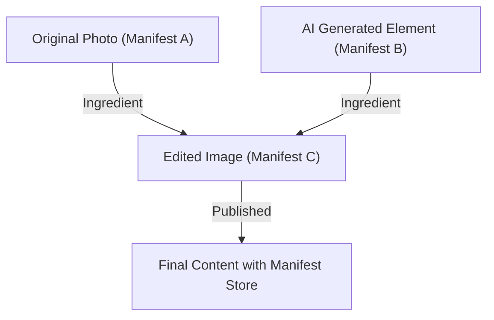

## 1. Фон инициативы по аутентификации контента (CAI) и C2PA

В последние годы технологии синтеза изображений, аудио и видео с помощью генеративного ИИ совершили огромный скачок. Эта технологическая революция, с одной стороны, предоставила создателям новые методы самовыражения, но, с другой стороны, значительно упростила создание чрезвычайно сложных дипфейков, что стало социальной проблемой, угрожающей целостности информационного пространства. На фоне опасений по поводу распространения фейковых новостей, мошенничества и манипулирования общественным мнением, обеспечение достоверности цифрового контента стало неотложной задачей.

Для решения этой проблемы компании Adobe, Twitter (ныне X) и The New York Times в 2019 году основали «Инициативу по аутентификации контента (CAI: Content Authenticity Initiative)». Основная цель CAI — не определение «истинности» медиа, а отслеживание и подтверждение «происхождения (Provenance)» контента. В качестве технологической базы для реализации этого видения, к инициативе присоединились Microsoft, Intel, Arm, Truepic и другие компании, совместно основав в 2021 году организацию по стандартизации «C2PA (Coalition for Content Provenance and Authenticity)». C2PA разрабатывает открытые и интероперабельные технические спецификации (спецификации C2PA), охватывающие всё, начиная от аппаратного обеспечения и заканчивая программным.

## 2. Обнаружение (Detection) против Происхождения (Provenance)

В контексте мер по борьбе с дипфейками, подходы в целом делятся на две основные категории: «обнаружение» и «подтверждение происхождения».

**Обнаружение (Detection)** — это метод апостериорного анализа, использующий технологии анализа изображений и модели ИИ для проверки контента на наличие следов искусственного вмешательства (неестественные границы пикселей, отражения света, противоречащие законам физики и т.д.). Однако эволюция генеративных технологий всегда опережает технологии обнаружения, создавая ситуацию «игры в кошки-мышки», и считается математически сложным на 100% распознать фейк, сгенерированный с использованием неизвестного алгоритма.

С другой стороны, **Подтверждение происхождения (Provenance)**, принятое в C2PA, — это подход, при котором «процесс» от создания контента до его редактирования и публикации записывается криптографически и прикрепляется в проверяемой форме. В отличие от «водяных знаков (Watermarking)», это не необратимое изменение самих данных изображения, а добавление (или связывание) информации о происхождении с криптографической подписью в виде метаданных. Благодаря этому пользователи могут сами проверить, «кто, когда и с помощью каких инструментов создал или отредактировал этот контент», и на основании этого судить о его достоверности.

## 3. Структура данных C2PA: Manifest Store, Ingredients, Assertions

В спецификации C2PA информация о происхождении контента инкапсулируется в структуру данных, называемую «Manifest (Манифест)». Если существует несколько историй редактирования, они объединяются в «Manifest Store».

- **Manifest Store**: Контейнер, хранящий все манифесты, связанные с целевым контентом. Самый новый манифест считается активным и включает родительские манифесты, показывающие историю предыдущих редактирований.
- **Manifest**: Набор информации об одном событии создания или редактирования.
- **Assertions**: Конкретные единицы декларативной информации, составляющие манифест. Они включают информацию об авторе, используемых инструментах (программном обеспечении или камере), данные GPS и EXIF на момент съемки, флаг того, был ли контент сгенерирован ИИ или нет, а также историю действий, показывающую, какое редактирование было выполнено (кадрирование, цветокоррекция и т.д.).
- **Ingredients**: Информация о происхождении материалов (например, родительских изображений), использованных во время редактирования. Если объединяются несколько изображений, каждое из них записывается в манифест как Ingredient, образуя сложное генеалогическое дерево.

Для обеспечения расширяемости эти метаданные описываются в формате **JSON-LD** (JavaScript Object Notation for Linked Data), который является стандартом семантической паутины. Это позволяет осуществлять гибкий обмен данными и определять онтологии между различными системами, сохраняя при этом машиночитаемость.

## 4. Криптографическая привязка: Хеширование и дерево Меркла

Главной особенностью C2PA является то, что пиксельные данные контента и информация манифеста «криптографически привязаны (связаны)». Метаданные можно легко перезаписать, но C2PA использует хеш-функции (такие как SHA-256 или SHA-384) для предотвращения подделки.

В частности, вычисляется значение хеша самих данных изображения и хеш-значение каждого Assertion. Эти хеш-значения объединяются в конкретном Assertion внутри манифеста, и в конечном итоге вся информация сводится к единственному хеш-значению. Когда существует сложная история редактирования (Ingredients), используется структура **Дерева Меркла (Merkle Tree)**.

Используя дерево Меркла, можно эффективно проверить, не был ли подделан конкретный элемент (например, наличие определенного Ingredient), без необходимости пересчитывать все данные. Если злоумышленник изменит хотя бы один бит пикселей изображения или перезапишет имя автора в манифесте, вычисленное хеш-значение в корне изменится, и последующая проверка с помощью цифровой подписи (описанная ниже) завершится неудачей, что приведет к немедленному обнаружению подделки.

## 5. Инфраструктура открытых ключей (PKI) и цифровые подписи

В дополнение к обеспечению целостности данных с помощью хеш-значений, цифровые подписи используются для доказательства того, что манифест был создан «доверенной сущностью (программным обеспечением, камерой или службой подписи)».

C2PA использует инфраструктуру открытых ключей (PKI: Public Key Infrastructure), основанную на **сертификатах X.509**. В качестве алгоритмов подписи используются RSA (для обратной совместимости), **ECDSA** (Elliptic Curve Digital Signature Algorithm), а также более быстрые и безопасные алгоритмы эллиптических кривых, такие как **Ed25519**.

1. **Генерация подписи**: Программное обеспечение для редактирования (например, Photoshop) или камера выполняет шифрование (подпись) хеш-значения манифеста, используя свой закрытый ключ.
2. **Chain of Trust**: К подписи прилагается сертификат X.509, содержащий соответствующий открытый ключ. Этот сертификат формирует «цепочку доверия (Chain of Trust)», которая тянется от промежуточного центра сертификации (ICA) до корневого центра сертификации (Root CA).
3. **Проверка (Validation)**: Браузер или программа для просмотра, отображающая контент, проверяет действительность сертификата на основе открытого ключа корневого центра сертификации (Trust List), расшифровывает подпись с помощью открытого ключа и проверяет, совпадает ли она с вычисленным хеш-значением.

Это позволяет математически доказать такие факты, как «подписано на серверах Adobe» или «снято на определенную модель камеры Nikon».

## 6. Аппаратная интеграция: Безопасный анклав в камере

Важное значение придается аппаратной реализации C2PA не только на уровне программного обеспечения (например, при экспорте в графическом редакторе), но и в устройстве захвата, которое является «источником» информации.

Такие производители камер, как Leica, Sony и Nikon, продвигают инициативы по встраиванию **безопасного анклава (Secure Enclave) / TEE (Trusted Execution Environment)** в процессор обработки изображений камеры.
В тот момент, когда свет попадает на матрицу камеры и преобразуется в цифровые данные (RAW), с использованием закрытого ключа, хранящегося в защищенной на аппаратном уровне области, создается подпись. Этот закрытый ключ никогда не может быть извлечен из камеры и защищен от подделки прошивки.

Такая «подпись во время захвата (Capture-time signing)» позволяет подтвердить, что это настоящая фотография, запечатлевшая реальный мир, из самой надежной точки.

## 7. Метод встраивания: JUMBF (JPEG Universal Metadata Box Format)

Как сгенерированный Manifest Store и криптографическая подпись сохраняются в файле? C2PA использует **JUMBF (ISO/IEC 19566-5)**, стандартизированный формат контейнера, для поддержки различных форматов файлов (JPEG, PNG, WebP, MP4 и т.д.).

JUMBF — это стандарт, который определяет иерархические и расширяемые блоки метаданных (Box) внутри двоичных данных.
Например, в случае файла JPEG данные C2PA хранятся как JUMBF-блок внутри маркерного сегмента `APP11`. Преимущество этого метода заключается в том, что даже если изображение открыто в традиционной программе для просмотра изображений (программном обеспечении, не поддерживающем C2PA), JUMBF-блок игнорируется, поэтому он не влияет на само отображение изображения (обеспечивая обратную совместимость).

## 8. Внедрение в реальном мире и проблемы (Real-world Adoption)

Стандарт C2PA вступил в фазу быстрого внедрения. Adobe интегрировала функциональность C2PA в Photoshop и Firefly (генеративный ИИ) как «Content Credentials», автоматически добавляя информацию о происхождении к генерируемым ИИ-изображениям. Bing Image Creator от Microsoft и DALL-E 3 от OpenAI также объявили и реализовали поддержку C2PA.
Со стороны платформ, YouTube и TikTok начали попытки обнаружения метаданных C2PA и отображения ярлыков в пользовательском интерфейсе, указывающих на то, что это «контент, сгенерированный ИИ».

Однако остается много проблем. Самая большая проблема — это «удаление метаданных (Metadata Stripping)». Большинство социальных сетей (таких как X и Facebook) автоматически пересжимают загруженные изображения для экономии места на сервере и защиты конфиденциальности (удаление EXIF). В процессе этого метаданные C2PA, включая JUMBF, удаляются непреднамеренно. В настоящее время C2PA активно призывает платформы социальных сетей сохранять метаданные.

## 9. Уязвимости и меры по их смягчению (Vulnerabilities and Mitigations)

Хотя C2PA является надежной криптографической технологией, для системы в целом предполагаются несколько векторов атак.

1. **Аналоговая дыра (Analog Hole)**: Процесс отображения изображения, снятого камерой, совместимой с C2PA, на мониторе и его повторной съемки другой камерой. Или процесс создания скриншота изображения с подписью C2PA. Это разрывает историю происхождения.
   * **Меры смягчения**: Совместное использование технологий водяных знаков (Watermarking) и цифровых водяных знаков (Digital Watermarking). Продвигается подход, при котором, даже если метаданные удалены, в сами пиксели изображения внедряется невидимый идентификатор (ID), который сопоставляется с облачной базой данных (C2PA Cloud, описанной ниже) для восстановления истории происхождения.
2. **Компрометация сертификата**: Если закрытый ключ, используемый для подписи, будет скомпрометирован, злоумышленник может выдать себя за законный инструмент и добавить поддельную информацию о происхождении.
   * **Меры смягчения**: Управление отзывом с использованием стандартных механизмов PKI, таких как **CRL (Certificate Revocation List)** и **OCSP (Online Certificate Status Protocol)**. А также принятие краткосрочных сертификатов (Short-lived Certificates).
3. **Злоупотребление UI/UX**: Злоумышленник может воспользоваться тем, что пользователи безоговорочно верят зеленой галочке (иконке Content Credentials), и добавить манифест, который на первый взгляд выглядит правильным, но на самом деле пуст.
   * **Меры смягчения**: Строгое соблюдение руководящих принципов внедрения для браузеров и программ для просмотра. Отображение четких категорий статуса проверки (действителен, недействителен, частично действителен и т.д.).

## 10. Будущие спецификации и перспективы (Future Specs)

C2PA продолжает обновлять свои спецификации и движется в направлении стандартизации следующего поколения.

- **Мягкая привязка (Soft Binding)**: Технология, которая связывает исходный манифест с изображением, используя поиск похожих изображений на основе ИИ или перцептивный хеш (перцептивное хеширование), даже если пиксели были незначительно изменены в результате пересжатия или изменения размера. Это в корне решит проблему потери метаданных в социальных сетях.
- **Потоковое видео и аудио (Video and Audio Streaming)**: В настоящее время поддержка в основном касается статических файлов, но идет разработка спецификаций для подписи C2PA в реальном времени на покадровом уровне в прямых трансляциях (встраивание в битовые потоки H.264 / H.265 / AV1).
- **Конфиденциальность и редактирование (Privacy and Redaction)**: Расширение функций, позволяющих новостным организациям «криптографически безопасно скрывать (Redact)» только информацию о конкретном фотографе или местоположении для защиты источников, сохраняя при этом доказательства происхождения.

## Заключение

Content Credentials и C2PA — это не просто «инструменты обнаружения дипфейков», это масштабная инфраструктура для построения «информационной прозрачности» в цифровом мире. Комбинируя проверенные технологии безопасности, такие как криптографические хеши, Дерево Меркла, PKI и аппаратную интеграцию, мы теперь можем проверять «происхождение» контента как факт, прежде чем обсуждать его «истинность».
Ожидается, что совместные усилия, объединяющие технологии, платформы и нормативно-правовое регулирование, будут ускоряться в будущем, стремясь к будущему, где все медиа в Интернете будут иметь информацию о происхождении.
