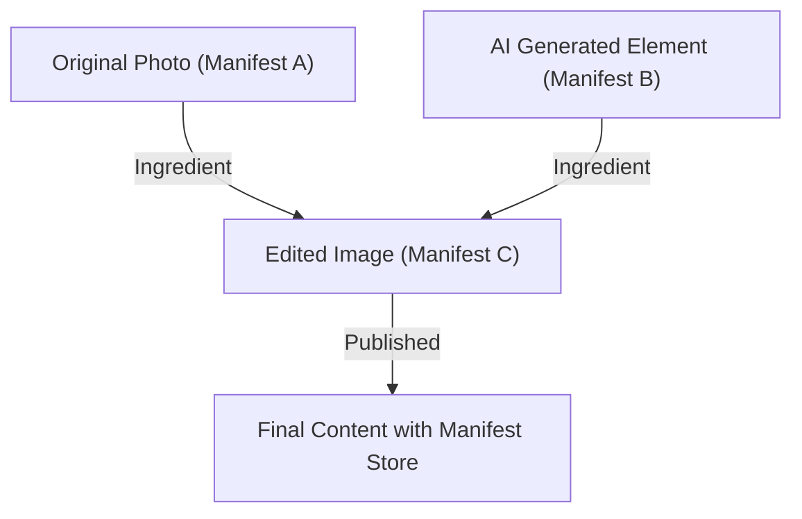

## 1. 内容真实性倡议 (CAI) 与 C2PA 的背景

近年来，利用生成式AI合成图像、声音和视频的技术取得了飞跃性的进展。这项技术创新一方面为创作者带来了全新的表达方式，另一方面也使得生成极其精细的深度伪造变得轻而易举，成为了威胁信息空间健康的社会问题。在人们对虚假新闻扩散、欺诈及操纵舆论的担忧日益加剧的背景下，如何保障数字内容的可靠性已成为当务之急。

为了应对这一挑战，Adobe、Twitter（现为X）和纽约时报（The New York Times）三家公司于2019年成立了“内容真实性倡议（CAI: Content Authenticity Initiative）”。CAI的主要目的不是判断媒体的“真伪”，而是追踪和证明内容的“出处（Provenance）”。为了将这一愿景转化为具体的技术基础，微软（Microsoft）、英特尔（Intel）、Arm、Truepic等公司加入，于2021年共同成立了标准化组织“C2PA（Coalition for Content Provenance and Authenticity）”。C2PA正在制定从硬件到软件、开放且可互操作的技术规范（C2PA规范）。

## 2. 检测 (Detection) 与 出处 (Provenance)

在应对深度伪造的对策中，通常可以将方法大致分为“检测”和“出处证明”两种。

**检测（Detection）** 是一种事后分析的方法，利用图像分析技术或AI模型，检查内容中是否包含被人工操作过的痕迹（例如不自然的像素边界、违反物理规律的光线反射等）。然而，生成技术的进化总是领先于检测技术，呈现出“猫鼠游戏”的局面，在数学上，要100%识破由未知算法生成的伪造内容被认为是极其困难的。

另一方面，C2PA采用的 **出处证明（Provenance）** 则是一种通过密码学记录从内容创建、编辑到发布的整个“过程”，并以可验证的形式附加的方法。这与“水印（Watermarking）”不同，它并不是不可逆地篡改图像数据本身，而是作为元数据附加（或关联）带有密码签名的出处信息。由此，用户可以亲自确认“谁在什么时候使用了什么工具创建和编辑了该内容”，从而判断其可靠性。

## 3. C2PA数据结构: Manifest Store, Ingredients, Assertions

在C2PA规范中，内容的来源信息被封装在称为“Manifest（清单）”的数据结构中。如果存在多个编辑历史，它们将被汇总为“Manifest Store”。

- **Manifest Store**: 存储与目标内容相关的所有Manifest的容器。最新的Manifest被视为活动状态，并包含表示过去编辑历史的父Manifest。
- **Manifest**: 关于一次创建或编辑事件的信息集合体。
- **Assertions**: 构成Manifest的具体声明信息的单位。包含创作者信息、使用的工具（软件或相机）、拍摄时的GPS信息和EXIF数据、是否由AI生成的标志，以及显示进行了何种编辑（如裁剪、色调校正等）的操作历史。
- **Ingredients**: 编辑时使用的素材（如父图像等）的出处信息。当合成多张图像时，每张图像都会作为Ingredient记录在Manifest中，形成复杂的谱系树。

为了确保可扩展性，这些元数据使用语义网标准 **JSON-LD** (JavaScript Object Notation for Linked Data) 格式编写。这使得数据既是机器可读的，又能在不同系统之间实现灵活的数据交换和本体定义。

## 4. 密码学绑定: 哈希与默克尔树

C2PA最大的特点是内容的像素数据和Manifest信息被“密码学绑定（结合）”。元数据很容易被重写，但C2PA通过使用哈希函数（如SHA-256、SHA-384等）来防止篡改。

具体来说，会计算图像数据本身的哈希值和每个Assertion的哈希值。这些哈希值被汇集到Manifest中的特定Assertion里，最终所有信息归结为一个单一的哈希值。当存在复杂的编辑历史（Ingredients）时，会使用 **Merkle Tree（默克尔树）** 结构。

通过利用Merkle Tree，无需重新计算整个数据，就能高效地验证特定元素（例如特定Ingredient的存在）是否被篡改。如果恶意分子改变了图像像素的哪怕1个比特，或者重写了Manifest中的作者名字，计算出的哈希值就会从根本上发生改变，从而导致后续的数字签名验证失败，篡改行为就会立刻败露。

## 5. 公钥基础设施 (PKI) 与数字签名

除了通过哈希值保证数据的一致性外，为了证明Manifest是由“可信实体（软件、相机设备或签名服务）”创建的，还使用了数字签名。

C2PA采用了基于 **X.509证书** 的公钥基础设施 (PKI: Public Key Infrastructure)。签名算法使用了RSA（为了过去的兼容性）、**ECDSA** (Elliptic Curve Digital Signature Algorithm)，甚至是更快更安全的 **Ed25519** 等椭圆曲线密码。

1. **签名的生成**: 编辑软件（如Photoshop）或相机设备使用自己的私钥对Manifest的哈希值进行加密（签名）。
2. **信任链 (Chain of Trust)**: 签名会附带包含对应公钥的X.509证书。该证书形成了一条从中间证书颁发机构（ICA）延伸到根证书颁发机构（Root CA）的“信任链”。
3. **验证 (Validation)**: 浏览内容的浏览器或查看器会基于根CA的公钥（Trust List）验证证书的有效性，并使用公钥解密签名，确认其是否与计算出的哈希值一致。

通过这种方式，可以从数学上证明“由Adobe的服务器签名”、“使用Nikon的特定相机型号拍摄”等事实。

## 6. 硬件集成：相机内安全飞地

除了软件层面的签名（例如图像编辑软件导出时），信息的“源头”——拍摄设备在硬件层面的C2PA实现也备受重视。

徕卡（Leica）、索尼（Sony）、尼康（Nikon）等相机制造商正在推进将 **安全飞地 (Secure Enclave) / TEE (Trusted Execution Environment)** 嵌入相机图像处理引擎的举措。
当光线照射到相机的传感器并转换为数字数据（RAW）的瞬间，就会使用存储在受硬件保护的区域中的私钥进行签名。该私钥绝对无法从相机中取出，同时也受到保护，防止固件被篡改。

通过这种“拍摄时签名 (Capture-time signing)”，能够从最可靠的节点证明这是一张捕捉了真实世界的真实照片。

## 7. 嵌入方法：JUMBF (JPEG Universal Metadata Box Format)

生成的Manifest Store和加密签名是如何存储在文件中的呢？为了支持多种文件格式（如JPEG、PNG、WebP、MP4等），C2PA使用了标准化的容器格式 **JUMBF (ISO/IEC 19566-5)**。

JUMBF是一种在二进制数据内定义分层且可扩展的元数据框（Box）的规范。
例如，在JPEG文件的情况下，C2PA数据作为JUMBF框存储在`APP11`标记段内。这种方法的优点在于，即使在传统的图像查看器（不支持C2PA的软件）中打开图像，JUMBF框也会被忽略，从而不会影响图像本身的显示（确保向后兼容性）。

## 8. 现实世界中的采用与挑战 (Real-world Adoption)

C2PA规范已迅速进入普及阶段。Adobe已将C2PA功能作为“内容凭证 (Content Credentials)”整合到了Photoshop和Firefly（生成式AI）中，自动为生成的AI图像附加出处信息。微软的Bing Image Creator和OpenAI的DALL-E 3也已宣布并实现了对C2PA的支持。
此外，在平台方面，YouTube和TikTok也开始检测C2PA元数据，并在用户界面上将其标记为“由AI生成的内容”。

然而，挑战依然很多。最大的问题是“元数据剥离（Metadata Stripping）”。许多社交网络服务（如X或Facebook等）出于节省服务器存储空间和保护隐私（删除EXIF）的目的，会自动重新压缩上传的图像。在这个过程中，包括JUMBF在内的C2PA元数据会被无意中删除。目前，C2PA正在强烈敦促社交平台保留元数据。

## 9. 漏洞与缓解措施 (Vulnerabilities and Mitigations)

尽管C2PA在密码学上非常坚固，但从整体系统来看，仍存在一些设想的攻击向量。

1. **模拟漏洞（Analog Hole）**: 将C2PA兼容相机拍摄的图像显示在显示器上，然后再用另一台相机重新拍摄的行为。或者，对带有C2PA签名的图像进行截屏的行为。这会导致出处断裂。
   * **缓解措施**: 结合使用水印技术（Watermarking）或数字水印（Digital Watermarking）。即使元数据被剥离，通过在图像本身的像素中嵌入不可见的ID，并与云端数据库（后文提到的C2PA Cloud）进行比对，可以恢复出处。这种方法正在推进中。
2. **证书妥协**: 如果用于签名的私钥泄露，恶意分子就可以伪装成正规工具，附加虚假的出处信息。
   * **缓解措施**: 使用PKI的标准机制 **CRL (Certificate Revocation List)** 或 **OCSP (Online Certificate Status Protocol)** 进行吊销管理。此外，采用短期证书（Short-lived Certificates）。
3. **滥用 UI/UX**: 利用用户无条件信任绿色勾号（Content Credentials图标）的心理，附加看似正确但内容空洞的清单。
   * **缓解措施**: 贯彻浏览器和查看器的实施指南。显示明确区分的验证状态（如有效、无效、部分有效等）。

## 10. 未来的规范与展望 (Future Specs)

C2PA目前仍在不断更新规范，朝着下一代标准化的方向迈进。

- **软绑定 (Soft Binding)**: 即使像素因重新压缩或调整大小而发生轻微改变，也能利用基于AI的相似图像搜索或感知哈希（Perceptual Hash）技术，将原始Manifest与图像联系起来。这将从根本上解决社交网络上元数据剥离的问题。
- **视频与音频流 (Video and Audio Streaming)**: 目前主要支持静态文件，但在实时流媒体中进行逐帧C2PA签名（嵌入到H.264 / H.265 / AV1比特流中）的规范制定工作正在推进中。
- **隐私与编辑 (Privacy and Redaction)**: 为了在证明出处的同时保护新闻机构的信息来源，正在扩展“以密码学安全的方式涂黑（Redact）”特定摄影师信息或位置信息的功能。

## 总结

内容凭证和C2PA不仅仅是“深度伪造检测工具”，它们是为了构建数字世界中“信息透明度”的宏大基础设施。通过结合密码散列、Merkle Tree、PKI、硬件集成等经过验证的安全技术，使我们能够在讨论内容的“真伪”之前，将其“出处”作为事实进行验证。
目标是实现互联网上所有媒体都拥有出处信息的未来，技术、平台和法律法规一体化的努力将在未来进一步加速。
