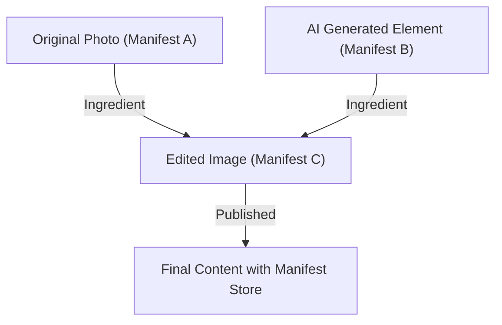

## 1. 內容真實性倡議 (CAI) 與 C2PA 的背景

近年來，利用生成式 AI 合成圖片、聲音與影片的技術取得了飛躍性的進展。這項技術革新雖然為創作者帶來了全新的表現手法，但另一方面，也使得生成極度精緻的深度偽造 (Deepfake) 變得容易，成為威脅資訊空間健全性的社會問題。在各界擔憂其被惡用於散佈假新聞、詐欺與操縱輿論之際，如何確保數位內容的可靠性已成為當務之急。

為了解決這個課題，Adobe、Twitter（現為 X）與 The New York Times 等三家公司於 2019 年成立了「內容真實性倡議 (CAI: Content Authenticity Initiative)」。CAI 的主要目的並非判定媒體的「真偽」，而是追蹤並證明內容的「來源 (Provenance)」。為了將此願景具體化，Microsoft、Intel、Arm、Truepic 等公司也加入了技術基礎的開發，並於 2021 年共同成立了標準化組織「C2PA (Coalition for Content Provenance and Authenticity)」。C2PA 正在制定從硬體到軟體皆可通用、具備開放性與互通性的技術規範 (C2PA 規範)。

## 2. 檢測 (Detection) 與 來源 (Provenance)

在對抗深度偽造的對策中，一般可將方法大致分為「檢測」與「來源證明」兩種。

**檢測 (Detection)** 是一種事後分析的手法，利用影像分析技術或 AI 模型，來檢查內容中是否包含被人工操作過的痕跡（例如不自然的像素邊界、違反物理法則的光線反射等）。然而，生成技術的進化總是快於檢測技術，呈現出「貓捉老鼠」的局面，在數學上也被認為難以 100% 識破由未知演算法生成的偽造內容。

另一方面，C2PA 所採用的**來源證明 (Provenance)**，則是一種將內容從建立、編輯到發布的「過程」，以密碼學方式記錄下來，並以可驗證的形式附加於內容之中的方法。這與「浮水印 (Watermarking)」不同，它不會不可逆地竄改圖片資料本身，而是將帶有加密簽章的來源資訊作為中繼資料 (Metadata) 附加（或關聯）上去。如此一來，使用者便能自行確認「是誰、在何時、使用了什麼工具來建立或編輯這個內容」，並以此判斷其可靠性。

## 3. C2PA 資料結構：Manifest Store, Ingredients, Assertions

在 C2PA 規範中，內容的來源資訊被封裝在稱為「Manifest（清單）」的資料結構中。當存在多筆編輯歷史時，這些資訊會被彙整為一個「Manifest Store」。

- **Manifest Store**：儲存與目標內容相關之所有 Manifest 的容器。最新的 Manifest 會被視為啟用狀態，並包含顯示過去編輯歷史的父 Manifest。
- **Manifest**：關於單次建立或編輯事件之資訊的集合體。
- **Assertions**：構成 Manifest 的具體宣告資訊單位。包含建立者資訊、使用的工具（軟體或相機）、拍攝時的 GPS 資訊或 EXIF 資料、是否由 AI 生成的標籤，以及顯示執行了何種編輯（如裁切、色彩校正等）的動作歷史。
- **Ingredients**：編輯時所使用之素材（如原始圖片等）的來源資訊。如果合成了多張圖片，每一張圖片都會作為 Ingredient 記錄在 Manifest 中，形成複雜的系譜樹。

為了確保擴充性，這些中繼資料採用語意網標準的 **JSON-LD** (JavaScript Object Notation for Linked Data) 格式進行撰寫。這使得資料不僅具備機器可讀性，還能在不同系統之間進行靈活的資料交換與本體論 (Ontology) 定義。

## 4. 密碼學綁定：雜湊與默克爾樹

C2PA 最大的特色在於，內容的像素資料與 Manifest 資訊被「密碼學地綁定 (Binding)」在一起。雖然中繼資料很容易被竄改，但 C2PA 使用雜湊函數（如 SHA-256 或 SHA-384）來防止竄改。

具體來說，它會計算圖片資料本身的雜湊值以及各個 Assertion 的雜湊值。這些雜湊值會被彙整到 Manifest 內的特定 Assertion 中，最終所有資訊都會歸結為單一的雜湊值。當存在複雜的編輯歷史 (Ingredients) 時，則會採用 **Merkle Tree（默克爾樹）** 結構。

透過使用 Merkle Tree，無需重新計算整體資料，就能有效率地驗證特定元素（例如特定 Ingredient 的存在）是否遭到竄改。如果惡意人士更改了圖片中哪怕只有 1 bit 的像素，或是竄改了 Manifest 內的作者名稱，計算出來的雜湊值就會發生根本性的改變，進而導致後述的數位簽章驗證失敗，使竄改行為立刻曝光。

## 5. 公開金鑰基礎建設 (PKI) 與數位簽章

除了透過雜湊值保證資料一致性外，為了證明 Manifest 是由「可信的實體（如軟體、相機設備或簽署服務）」所建立，C2PA 還利用了數位簽章。

C2PA 採用了基於 **X.509 憑證** 的公開金鑰基礎建設 (PKI: Public Key Infrastructure)。簽署演算法可使用 RSA（為求向後相容）、**ECDSA** (Elliptic Curve Digital Signature Algorithm)，甚至是更快速、更安全的 **Ed25519** 等橢圓曲線密碼學技術。

1. **簽章生成**：編輯軟體（如 Photoshop）或相機設備，會使用自身的私鑰對 Manifest 的雜湊值進行加密（簽署）。
2. **Chain of Trust**：簽章會附帶包含對應公鑰的 X.509 憑證。此憑證形成了一條從中介憑證授權中心 (ICA) 連接至根憑證授權中心 (Root CA) 的「信任鏈 (Chain of Trust)」。
3. **驗證 (Validation)**：供使用者瀏覽內容的瀏覽器或檢視器，會根據根 CA 的公鑰 (Trust List) 來驗證憑證的有效性，並使用公鑰對簽章進行解密，確認其是否與計算出的雜湊值一致。

透過這樣的機制，就能以數學方式證明「這是由 Adobe 伺服器簽署的」或「這是由特定的 Nikon 相機型號拍攝的」等事實。

## 6. 硬體整合：相機內的安全隔離區

除了軟體層級的簽署（例如從影像編輯軟體匯出時）之外，在作為資訊「源頭」的拍攝設備中進行硬體層級的 C2PA 實作也備受重視。

包含 Leica、Sony 與 Nikon 等相機製造商，正積極推進將 **安全隔離區 (Secure Enclave) / TEE (Trusted Execution Environment)** 整合進相機的影像處理引擎中。
當光線照射到相機感光元件並轉換為數位資料 (RAW) 的那一刻，系統便會使用儲存於硬體保護區域內的私鑰進行簽署。這個私鑰絕對無法從相機中取出，也受到保護而不受韌體竄改的影響。

這種「Capture-time signing (拍攝時簽署)」技術，能夠從最可靠的地點證明這是一張捕捉真實世界的真實照片。

## 7. 嵌入方法：JUMBF (JPEG Universal Metadata Box Format)

生成的 Manifest Store 與加密簽章，是如何儲存在檔案中的呢？為了支援多樣化的檔案格式（如 JPEG、PNG、WebP、MP4 等），C2PA 利用了標準化的容器格式 **JUMBF (ISO/IEC 19566-5)**。

JUMBF 是一種在二進位資料內定義階層式、可擴充之中繼資料區塊 (Box) 的標準。
舉例來說，在 JPEG 檔案中，C2PA 資料會作為 JUMBF 區塊儲存在 `APP11` 標記區段 (Marker Segment) 內。這種方法的優點在於，即使使用傳統的圖片檢視器（不支援 C2PA 的軟體）開啟圖片，JUMBF 區塊也會被忽略，因此完全不會影響圖片的顯示（確保向後相容性）。

## 8. 實際應用與挑戰 (Real-world Adoption)

C2PA 規範正快速進入普及階段。Adobe 已將 C2PA 功能作為「Content Credentials」整合至 Photoshop 與 Firefly (生成式 AI) 中，自動為生成的 AI 圖片加上來源資訊。Microsoft 的 Bing Image Creator 與 OpenAI 的 DALL-E 3 也已宣布並實作了對 C2PA 的支援。
此外，在平台端，YouTube 與 TikTok 也已開始偵測 C2PA 中繼資料，並在使用者介面上加上「由 AI 生成之內容」的標籤。

然而，挑戰依然存在。最大的問題在於「中繼資料遺失 (Metadata Stripping)」。許多社群網路服務 (如 X 或 Facebook)，為了節省伺服器儲存空間或保護隱私（刪除 EXIF），會自動將上傳的圖片重新壓縮。在這個過程中，包含 JUMBF 在內的 C2PA 中繼資料往往會被意外刪除。目前，C2PA 正強烈呼籲各大社群平台保留這些中繼資料。

## 9. 漏洞與緩解措施 (Vulnerabilities and Mitigations)

雖然 C2PA 在密碼學技術上非常堅固，但從整體系統來看，仍有一些可預期的攻擊向量。

1. **類比漏洞 (Analog Hole)**：將使用支援 C2PA 相機拍攝的圖片顯示在螢幕上，再用另一台相機重新拍攝；或是對帶有 C2PA 簽章的圖片進行螢幕截圖。這些行為都會導致來源資訊中斷。
   * **緩解措施**：與浮水印 (Watermarking) 或數位浮水印 (Digital Watermarking) 技術併用。即使中繼資料被剝離，只要在圖片本身的像素中嵌入不可視的 ID，就能透過比對雲端資料庫（即後述的 C2PA Cloud）來還原來源資訊，目前正積極開發此類方法。
2. **憑證外洩**：如果用於簽署的私鑰外洩，惡意人士就能偽裝成合法的工具，賦予偽造的來源資訊。
   * **緩解措施**：使用 PKI 標準機制的 **CRL (Certificate Revocation List，憑證廢止清單)** 或 **OCSP (Online Certificate Status Protocol)** 進行憑證撤銷管理。此外，也可採用短期有效憑證 (Short-lived Certificates)。
3. **UI/UX 的濫用**：利用使用者無條件相信綠色勾勾（Content Credentials 的圖示）的心態，賦予看似正確但內容空洞的 Manifest。
   * **緩解措施**：徹底落實瀏覽器與檢視器的實作指南。明確區分並顯示驗證狀態（如有效、無效、部分有效等）。

## 10. 未來規範與展望 (Future Specs)

C2PA 目前仍在持續更新規範，並朝著次世代標準化邁進。

- **軟綁定 (Soft Binding)**：即使像素因重新壓縮或調整大小而發生輕微改變，也能利用基於 AI 的相似圖片搜尋或感知雜湊 (Perceptual Hash) 技術，將圖片與原始 Manifest 連結起來。此技術將從根本上解決社群網路服務上的中繼資料遺失問題。
- **Video and Audio Streaming**：目前主要支援靜態檔案，但針對直播串流 (Live Streaming)，以影格為單位的即時 C2PA 簽署（嵌入至 H.264 / H.265 / AV1 位元串流）規範正在制定中。
- **Privacy and Redaction**：為了在證明來源的同時，讓新聞機構能夠保護消息來源，正致力於擴充針對特定拍攝者資訊或位置資訊進行「密碼學安全塗黑 (Redact)」的功能。

## 總結

Content Credentials 與 C2PA 並非單純的「深度偽造檢測工具」，而是為了在數位世界建立「資訊透明度」所打造的宏大基礎建設。透過結合加密雜湊、Merkle Tree、PKI 與硬體整合等實證安全技術，我們現在能在爭論內容的「真偽」之前，先將其「來源」作為事實來進行驗證。
朝著網際網路上所有媒體都具備來源資訊的未來邁進，結合技術、平台與法律規範的共同努力，預期將會在未來進一步加速。
