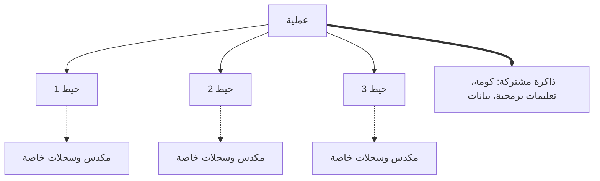
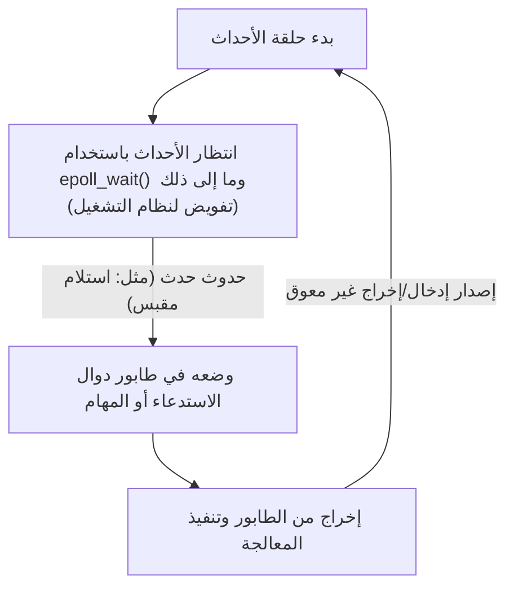

في تطوير البرمجيات الحديثة، يعتبر الأداء وقابلية التوسع موضوعين مهمين لا يمكن فصلهما. خاصة في الأنظمة التي تتعامل مع خوادم الويب ذات حركة المرور العالية أو الاتصالات في الوقت الفعلي، فإن "كيفية معالجة الطلبات بكفاءة" هي التي تحدد حياة أو موت النظام.

للتعامل مع هذه المشكلة، توفر العديد من لغات البرمجة الحديثة بنيات معالجة غير متزامنة مثل `async` / `await`. ولكن لماذا نحتاج إلى المعالجة غير المتزامنة؟ ولماذا يوجد حد للنموذج البسيط المتمثل في "تخصيص خيط واحد لطلب واحد" كما كان الحال في الماضي؟

تكمن الإجابة في آلية "تبديل السياق" على مستوى نواة نظام التشغيل (OS) وتكلفتها، وهي متجذرة بعمق في قيود بنية الأجهزة. في هذا المقال، سنغوص بعمق لنشرح بدءًا من آلية إدارة العمليات والخيوط في نظام التشغيل، والتكلفة العتادية لتبديل السياق، ومشكلة C10K، وبنية قيادة الأحداث (epoll/kqueue)، وحتى آلية الروتين المساعد (coroutine) و `async/await` في مساحة المستخدم.

## 1. أساسيات إدارة العمليات والخيوط في نظام التشغيل

### 1.1 ما هي العملية؟
العملية هي مثيل لبرنامج قيد التشغيل وهي الوحدة الأساسية التي يخصص لها نظام التشغيل الموارد. تمتلك العملية مساحة ذاكرة مستقلة (مساحة عناوين افتراضية) ومعزولة عن العمليات الأخرى. لإدارة العمليات، يحتفظ نظام التشغيل بهيكل بيانات يسمى **PCB (Process Control Block)** في مساحة النواة. يسجل PCB معرف العملية، حالة السجلات، معلومات إدارة الذاكرة (مثل المؤشرات إلى جداول الصفحات)، وواصفات الملفات المفتوحة، وغيرها.

### 1.2 ظهور الخيوط وتخفيف الوزن
في أنظمة التشغيل المبكرة، كان من الضروري إنشاء (`fork`) عمليات متعددة لإجراء المعالجة المتزامنة. ومع ذلك، نظرًا لأن العمليات لها مساحات ذاكرة مستقلة تمامًا، كانت هناك مشكلة تتمثل في التكلفة العالية للإنشاء والتكلفة الإضافية للاتصال بين العمليات (IPC).

وهنا ظهرت **الخيوط (Threads)**. تُعرف الخيوط أيضًا باسم "العمليات خفيفة الوزن (Lightweight Processes)"، وهي تشارك مساحة الذاكرة (الكومة، مقطع البيانات، مقطع التعليمات البرمجية) مع الخيوط الأخرى داخل نفس العملية. ومع ذلك، يمتلك كل خيط سياق التنفيذ الخاص به، أي **المكدس الخاص بالخيط** و **مجموعة السجلات (مثل عداد البرنامج)**. يتم الاحتفاظ بمعلومات إدارة الخيط في النواة كـ **TCB (Thread Control Block)**.



من خلال مشاركة الذاكرة، انخفضت تكلفة إنشاء الخيوط والاتصال بها بشكل كبير مقارنة بالعمليات، ولكن العبء الأساسي المتمثل في "الجدولة والتبديل من قبل النواة" لا يزال موجودًا.

## 2. الثمن الحقيقي لتبديل السياق

في أنظمة التشغيل متعددة المهام، من أجل جعل الأمر يبدو وكأن العديد من الخيوط تعمل في وقت واحد على نوى وحدة معالجة مركزية (CPU) محدودة، يتم التبديل السريع بين الخيوط المنفذة عن طريق تقسيم الوقت (time slicing). بالإضافة إلى ذلك، عندما ينتظر الخيط (يتوقف) لاكتمال إدخال/إخراج القرص أو اتصال الشبكة، يقوم نظام التشغيل بتبديله لمنح وحدة المعالجة المركزية لخيط آخر. تسمى عملية التبديل هذه **تبديل السياق (Context Switch)**.

تبديل السياق ليس مجانيًا على الإطلاق. يتجاوز ثمنه مجرد العبء البرمجي الإضافي ويؤثر بشكل كبير على بنية التخزين المؤقت (cache) للأجهزة.

### 2.1 حفظ واستعادة السجلات والحالة
عند حدوث تبديل السياق، تقوم وحدة المعالجة المركزية بحفظ (تخزين) حالة سجل الخيط قيد التنفيذ حاليًا (عداد البرنامج، مؤشر المكدس، السجلات العامة، إلخ) في TCB الخاص بذلك الخيط أو في مكدس النواة. ثم تقوم بقراءة (استعادة) حالة السجل من TCB الخاص بالخيط الذي سيتم تنفيذه بعد ذلك. هذا وحده يكلف عشرات إلى مئات الدورات.

### 2.2 مسح TLB (Translation Lookaside Buffer)
في حالة التبديل السياقي بين العمليات، تحدث تكلفة أعلى بكثير. إنها **مسح TLB**. TLB هي ذاكرة فائقة السرعة داخل وحدة المعالجة المركزية تخزن نتائج تحويل العناوين الافتراضية إلى عناوين مادية.
عندما تتبدل العملية، تتغير مساحة العناوين الافتراضية، مما يبطل إدخالات TLB الخاصة بالعملية السابقة. لذلك، يجب على نظام التشغيل مسح (تفريغ) TLB، ومباشرة بعد أن تستأنف العملية الجديدة التنفيذ، يتعين عليها الرجوع إلى جدول الصفحات في الذاكرة (تجول الصفحة) في كل مرة لترجمة العنوان، مما يؤدي إلى انخفاض حاد في الأداء.

### 2.3 تلوث وإبطال التخزين المؤقت لوحدة المعالجة المركزية (L1/L2/L3)
حتى إذا كان تبديل السياق بين الخيوط (حتى داخل نفس العملية)، يحدث **تلوث التخزين المؤقت (Cache Pollution)**. يقوم الخيط المجدول حديثًا بطرد البيانات التي تركها الخيط السابق في ذاكرة التخزين المؤقت، ويبدأ في قراءة بياناته الخاصة إلى ذاكرة التخزين المؤقت. يؤدي هذا إلى حدوث أخطاء متكررة في ذاكرة التخزين المؤقت (cache misses) ويزيد من زمن انتقال الوصول إلى الذاكرة.

وبهذه الطريقة، فإن التكلفة الأكبر لتبديل السياق ليست "وقت معالجة الحفظ والاستعادة"، بل هي "تدهور الأداء غير المباشر الناجم عن إعادة تعيين آليات تحسين خطوط الأنابيب مثل ذاكرة التخزين المؤقت لوحدة المعالجة المركزية و TLB".

## 3. مشكلة C10K وحدود "خيط لكل اتصال"

في الأيام الأولى لانتشار الإنترنت، اعتمدت خوادم الويب (مثل Apache في بداياته) نموذج **"تخصيص خيط واحد في نظام التشغيل (أو عملية) لاتصال شبكة واحد"** (Thread-per-connection).

كان لهذا النموذج ميزة أن الكود يصبح بسيطًا جدًا. عند استدعاء دالة وقراءة البيانات من الشبكة، فإن كل ما يحتاجه الخيط هو أن يتوقف (ينام) ببساطة حتى تصل البيانات.

```c
// كود زائف لنموذج Thread-per-connection
void handle_connection(int socket) {
    char buffer[1024];
    // يتم إيقاف هذا الخيط (حظره) بواسطة النواة حتى وصول البيانات
    int bytes = read(socket, buffer, 1024); 
    process_data(buffer, bytes);
    write(socket, response);
}
```

ومع ذلك، بدخول الألفية الثانية، عندما وصل عدد الاتصالات المتزامنة إلى 10,000 (10K)، انهار هذا النموذج. هذه هي المشكلة الشهيرة **C10K Problem (10,000 Client Problem)**.

### سبب الانهيار 1: استنفاد الذاكرة
عند إنشاء خيط في نظام التشغيل، يتم تخصيص مساحة مكدس خاصة به لكل خيط (عادةً افتراضيًا بضعة ميغابايت في نظام Linux). لإنشاء 10,000 خيط للتعامل مع 10,000 اتصال، ستحتاج إلى عشرات الجيجابايت من الذاكرة للمكدسات وحدها. كان هذا حجمًا غير واقعي للأجهزة في ذلك الوقت.

### سبب الانهيار 2: عاصفة تبديل السياق
ماذا يحدث عندما يكون هناك آلاف أو عشرات الآلاف من الخيوط، وتستمر في التوقف والاستيقاظ في انتظار اكتمال إدخال/إخراج الشبكة؟ يزداد العبء الإضافي لجدولة النواة للبحث عن الخيط التالي الذي يجب تشغيله، وتتكرر أخطاء ذاكرة التخزين المؤقت بسبب تبديل السياق المذكور أعلاه. ونتيجة لذلك، يتم إهدار معظم وقت وحدة المعالجة المركزية في "تبديل الخيوط (معالجة النواة)" بدلاً من "المعالجة الفعلية".

## 4. البنية الموجهة بالأحداث والإدخال/الإخراج غير المعوق (Non-blocking I/O)

لحل مشكلة C10K، ظهر النموذج الذي يجمع بين **البنية الموجهة بالأحداث (Event-Driven Architecture)** و **الإدخال/الإخراج غير المعوق (Non-blocking I/O)**. حققت Nginx و Node.js و Redis وما إلى ذلك أداءً هائلاً من خلال اعتماد هذه البنية.

### 4.1 الإدخال/الإخراج غير المعوق
عند التعامل مع المقابس في وضع غير معوق، حتى إذا لم تصل البيانات بعد، لا تقوم النواة بحظر الخيط، بل تعيد خطأ فوريًا (`EAGAIN` أو `EWOULDBLOCK`). يتيح ذلك للخيط الواحد عدم الدخول في حالة انتظار والاستمرار في المعالجات الأخرى.

### 4.2 آلية الإشعار بالأحداث على مستوى النواة (epoll / kqueue)
ومع ذلك، من غير الفعال للغاية أن تستمر في طرح السؤال "هل وصلت البيانات؟" (الاستطلاع/polling) بالتتابع لعشرات الآلاف من المقابس غير المعوقة.

لذلك، قدمت نواة نظام التشغيل استدعاءات نظام متقدمة لـ **تعدد إرسال الإدخال/الإخراج (I/O Multiplexing)**.
- نظام Linux: **`epoll`**
- أنظمة BSD/macOS: **`kqueue`**
- نظام Windows: **IOCP (I/O Completion Ports)**

في وقت مبكر، كانت `select` و `poll` تعمل عن طريق تمرير قائمة بجميع واصفات الملفات (FDs) المراقبة إلى النواة في كل مرة، وتقوم النواة بمسحها في O(N).
في المقابل، يحتفظ `epoll` بجدول أحداث داخل النواة، ويعيد فقط قائمة بواصفات الملفات التي حدثت فيها أحداث الإدخال/الإخراج للتطبيق، لذلك يعمل في وقت O(1) (بشكل أكثر دقة، يتناسب مع عدد الأحداث التي حدثت).

### 4.3 ولادة حلقة الأحداث (Event Loop)
نتيجة لذلك، أصبح من الممكن معالجة عشرات الآلاف من الاتصالات بكفاءة باستخدام خيط واحد (أو عدد قليل من الخيوط يعادل عدد نوى وحدة المعالجة المركزية). هذه هي **حلقة الأحداث (Event Loop)**.



تستمر حلقة الأحداث ببساطة في تدوير دورة: "اسأل نظام التشغيل عن الأحداث" -> "قم بتنفيذ المعالجة (دالة الاستدعاء) المقابلة للحدث الذي وقع". من خلال القيام بذلك، تم التخلص من عبء تبديل السياق الثقيل على مستوى نظام التشغيل، وأصبح من الممكن استغلال موارد وحدة المعالجة المركزية إلى أقصى حد.

## 5. الروتين المساعد في مساحة المستخدم و async/await

بينما كانت البنية الموجهة بالأحداث حلاً مثاليًا من حيث الأداء، إلا أنها تسببت في ألم كبير للمبرمجين. وهذا ما يسمى بـ **جحيم دوال الاستدعاء (Callback Hell)**.

كان يجب تسجيل دالة استدعاء لكل عملية إدخال/إخراج، مما أدى إلى تجزئة تدفق تنفيذ التعليمات البرمجية، وصعوبة معالجة الأخطاء وإدارة الحالة المعقدة.

### 5.1 الروتين المساعد ونقل تبديل السياق إلى مساحة المستخدم
لحل هذا التعقيد مع الحفاظ على الأداء، انتشر مفهوم "**الروتين المساعد (Coroutine)**" أو "**الخيط الأخضر (Green Thread)**". يعد Goroutine في لغة Go مثالاً نموذجيًا.

هذه هي "خيوط خفيفة الوزن تدار في مساحة المستخدم (جانب البرنامج)" والتي تعمل فوق خيوط نواة نظام التشغيل.
عندما ينتظر روتين مساعد معين للإدخال/الإخراج، بدلاً من إعادة التحكم إلى النواة (الحظر)، يقوم **مجدول مساحة المستخدم (وقت التشغيل)** بحفظ حالة تنفيذ هذا الروتين المساعد والتبديل إلى روتين مساعد آخر.

هذا التبديل في مساحة المستخدم لا يتضمن تبديل سياق نظام التشغيل، ولا توجد انتقالات إلى الوضع المميز (استدعاء النظام) أو مسح TLB، لذلك يكتمل بتكلفة منخفضة للغاية تتراوح من بضع نانو ثانية إلى عشرات النانو ثانية.

### 5.2 سحر async/await: التحويل إلى آلة حالة بواسطة المترجم
علاوة على ذلك، قدمت العديد من اللغات الحديثة (C#، JavaScript/TypeScript، Python، Rust، وما إلى ذلك) `async` و `await`، والتي تدمج هذه المعالجة غير المتزامنة كبنية في اللغة.

تكمن القوة الحقيقية لـ `async/await` في أنه **"بالنسبة للبشر، يقوم المترجم في الخلفية بتحويل الكود المكتوب بشكل متزامن (من أعلى إلى أسفل) إلى آلة حالة (آلة انتقال الحالة) ودمجه مع حلقة الأحداث"**.

عندما تظهر الكلمة الأساسية `await`، فهذا لا يعني أن الخيط سيتوقف فعليًا هناك.
1. يتم حفظ حالة الدالة الحالية (المتغيرات المحلية، إلخ) في كائن على الكومة (مثل Future أو Promise).
2. يتم تسجيل عملية الإدخال/الإخراج في حلقة الأحداث (أو epoll).
3. يتم مقاطعة تنفيذ الدالة مؤقتًا (`yield`)، ويعود التحكم إلى حلقة الأحداث أو المستدعي.
4. عند اكتمال الإدخال/الإخراج، تكتشف حلقة الأحداث ذلك وتستأنف (`resume`) تنفيذ الدالة من الحالة المحفوظة.

```rust
// تصور للمعالجة غير المتزامنة في Rust
async fn fetch_data() -> Result<Data, Error> {
    // بدء اتصال شبكة بشكل غير متزامن
    let mut stream = TcpStream::connect("example.com").await?; 
    // في .await أعلاه، تتوقف الدالة فعليًا وتعود إلى حلقة الأحداث.
    // بمجرد إنشاء الاتصال، يتم استئناف التنفيذ من هنا.
    
    let mut buffer = Vec::new();
    // قراءة البيانات. هذا أيضًا غير متزامن ولا يعوق.
    stream.read_to_end(&mut buffer).await?;
    
    Ok(parse(buffer))
}
```

في لغات مثل Rust التي تروج للتجريد بدون تكلفة (zero-cost abstraction)، يتم تحويل وظائف `async` في وقت الترجمة بالكامل إلى آلات حالة مبنية على `enum` تحمل الحالة. يتم تقليل حتى تخصيص الذاكرة الديناميكية إلى الحد الأدنى، مما يحقق أقصى أداء.

## 6. تحديات المعالجة غير المتزامنة: "وظائف ملونة (What Color is Your Function?)"

`async/await` قوية، لكنها ليست الرصاصة الفضية. التحدي المعماري الأكثر شهرة هو "مشكلة تلوين الدالة".

من أجل استخدام `await` داخل دالة غير متزامنة (لنسميها دالة حمراء)، يجب أن تكون دالة الاستدعاء أيضًا غير متزامنة (حمراء). لا يمكنك استدعاء دالة غير متزامنة مباشرة من دالة متزامنة (دالة زرقاء) وانتظار النتيجة.
وهذا يؤدي إلى مشكلة تقسيم قاعدة التعليمات البرمجية بأكملها إلى "عالم متزامن" و "عالم غير متزامن".

علاوة على ذلك، إذا تم تشغيل معالجة مقيدة بوحدة المعالجة المركزية (حساب مكثف) لفترة طويلة داخل دالة `async`، فسوف تحظر حلقة الأحداث نفسها، وهناك خطر التسبب في خطأ جسيم يتمثل في توقف جميع المهام غير المتزامنة الأخرى (المجاعة / Starvation). في العالم غير المتزامن، يُسمح بـ "التوقف في انتظار الإدخال/الإخراج"، ولكن من المحظور تمامًا "احتكار حلقة للحساب على وحدة المعالجة المركزية".

## 7. الخاتمة

وراء البنية البسيطة `async` / `await` التي نستخدمها بشكل عرضي، يكمن تاريخ من التحسين على مدى عقود في علوم الكمبيوتر.

- لتجنب **تبديل السياق العتادي عالي التكلفة** (مسح TLB، أخطاء التخزين المؤقت).
- لتوفير **موارد الذاكرة (مكدس الخيوط)** التي تستنفد.
- لإخراج قوة **epoll/kqueue** الخاصة بالنواة.
- و **لتحرير المطورين** من تعقيد دوال الاستدعاء غير المتزامنة.

ولدت من قيود إدارة عمليات وخيوط نظام التشغيل، وتطورت إلى بنية موجهة بالأحداث، وتم تجريدها بقوة المترجم، والنتيجة هي `async/await` الحديثة. من خلال فهم هذه الآلية العميقة، ستتمكن من تصميم أنظمة أكثر أداءً وأمانًا وقابلية للتوسع.
