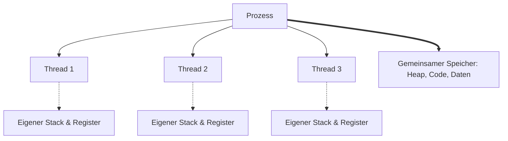
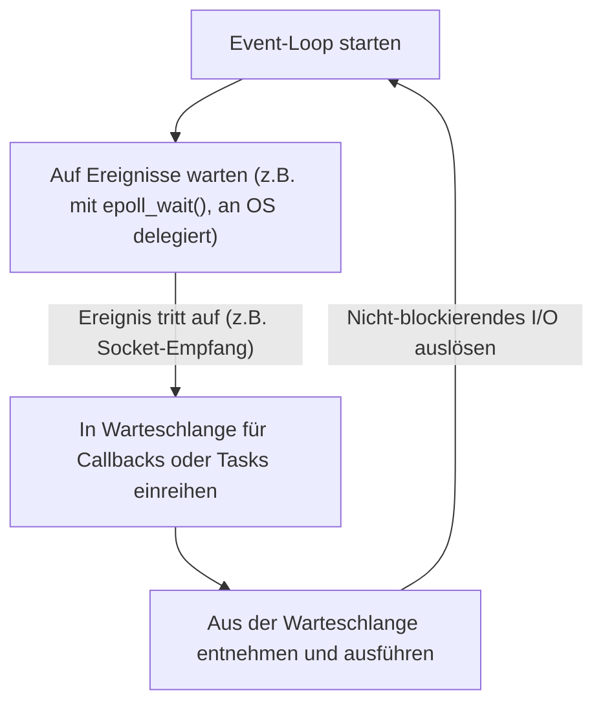

In der modernen Softwareentwicklung sind Leistung und Skalierbarkeit zwei untrennbare, wichtige Themen. Insbesondere bei Systemen mit hohem Web-Traffic oder Echtzeitkommunikation entscheidet die Frage „Wie effizient können Anfragen verarbeitet werden?“ über Leben und Tod des Systems.

Um diesem Problem zu begegnen, bieten viele moderne Programmiersprachen Konstrukte für die asynchrone Verarbeitung wie `async` / `await` an. Aber warum ist asynchrone Verarbeitung überhaupt notwendig? Warum stößt das herkömmliche, einfache Modell, bei dem „ein Thread pro Anfrage zugewiesen wird“, an seine Grenzen?

Die Antwort liegt tief in der Funktionsweise und den Kosten des „Kontextwechsels“ auf Kernel-Ebene des OS (Betriebssystems) sowie in den Einschränkungen der Hardware-Architektur verwurzelt. In diesem Artikel tauchen wir tief in die Mechanismen der Prozess- und Thread-Verwaltung des Betriebssystems ein, über die Hardwarekosten von Kontextwechseln, das C10K-Problem, ereignisgesteuerte Architekturen (epoll/kqueue) bis hin zu Coroutinen im User-Space und der Funktionsweise von `async/await`.

## 1. Grundlagen der Prozess- und Thread-Verwaltung des Betriebssystems

### 1.1 Was ist ein Prozess?
Ein Prozess ist die Instanz eines in Ausführung befindlichen Programms und die grundlegende Einheit, der das Betriebssystem Ressourcen zuweist. Ein Prozess verfügt über einen unabhängigen Speicherbereich (virtuellen Adressraum) und ist von anderen Prozessen isoliert. Zur Verwaltung der Prozesse hält das Betriebssystem eine Datenstruktur namens **PCB (Process Control Block)** im Kernel-Space (Kernelraum) bereit. Der PCB speichert Informationen wie die Prozess-ID, den Zustand der Register, Speicherverwaltungsinformationen (z. B. Zeiger auf die Seitentabelle) und geöffnete Dateideskriptoren.

### 1.2 Die Einführung und Gewichtsreduzierung von Threads
In frühen Betriebssystemen mussten zur parallelen Verarbeitung mehrere Prozesse erzeugt (`fork`) werden. Da Prozesse jedoch über vollständig isolierte Speicherbereiche verfügen, gab es das Problem der hohen Erzeugungskosten und des Overheads bei der Interprozesskommunikation (IPC).

Hier kamen **Threads** ins Spiel. Threads werden auch als „Lightweight Processes“ (leichtgewichtige Prozesse) bezeichnet und teilen sich den Speicherbereich (Heap, Datensegment, Codesegment) mit anderen Threads innerhalb desselben Prozesses. Jeder Thread hat jedoch seinen eigenen Ausführungskontext, d. h. einen **Thread-spezifischen Stack** und einen **Registersatz (wie z.B. den Programmzähler)**. Die Verwaltungsinformationen für Threads werden als **TCB (Thread Control Block)** im Kernel gespeichert.



Durch die gemeinsame Nutzung des Speichers wurden die Kosten für die Thread-Erzeugung und -Kommunikation im Vergleich zu Prozessen erheblich gesenkt. Dennoch bleibt der grundlegende Overhead der „Planung (Scheduling) und des Umschaltens durch den Kernel“ bestehen.

## 2. Der wahre Preis des Kontextwechsels

In Multitasking-Betriebssystemen werden die auszuführenden Threads im Zeitmultiplexverfahren (Time Slicing) extrem schnell gewechselt, um den Anschein zu erwecken, dass mehrere Threads auf einer begrenzten Anzahl von CPU-Kernen gleichzeitig ausgeführt werden. Darüber hinaus führt das Betriebssystem auch dann einen Wechsel durch und überlässt die CPU einem anderen Thread, wenn ein Thread darauf wartet (blockiert), dass Festplatten-I/O-Operationen oder Netzwerkkommunikationen abgeschlossen werden. Dieser Umschaltvorgang wird als **Kontextwechsel (Context Switch)** bezeichnet.

Kontextwechsel sind keineswegs kostenlos. Der Preis dafür geht über den bloßen Software-Overhead hinaus und hat massive Auswirkungen auf die Cache-Architektur der Hardware.

### 2.1 Sichern und Wiederherstellen von Registern und Zuständen
Wenn ein Kontextwechsel auftritt, speichert (sichert) die CPU den aktuellen Registerstatus des ausgeführten Threads (Programmzähler, Stackpointer, allgemeine Register usw.) im TCB des Threads oder im Kernel-Stack. Anschließend lädt (stellt wieder her) sie den Registerstatus aus dem TCB des nächsten auszuführenden Threads. Allein dies kostet zig bis Hunderte von Taktzyklen.

### 2.2 Flushen des TLB (Translation Lookaside Buffer)
Bei Kontextwechseln zwischen Prozessen fallen noch weitaus höhere Kosten an. Dabei handelt es sich um das **Leeren (Flushen) des TLB**. Der TLB ist ein ultraschneller Cache in der CPU, der die Ergebnisse der Adressübersetzung von virtuellen in physische Adressen zwischenspeichert.
Wenn der Prozess wechselt, ändert sich der virtuelle Adressraum, wodurch die TLB-Einträge des vorherigen Prozesses ungültig werden. Aus diesem Grund muss das Betriebssystem den TLB flushen (leeren), und direkt nach der Wiederaufnahme der Ausführung des neuen Prozesses muss für die Adressübersetzung jedes Mal die Seitentabelle im Speicher herangezogen werden (Page Walk), was zu einem gravierenden Leistungsabfall führt.

### 2.3 Verschmutzung und Invalidierung der CPU-Caches (L1/L2/L3)
Auch bei Kontextwechseln zwischen Threads (sogar innerhalb desselben Prozesses) kommt es zur **Cache-Verschmutzung (Cache Pollution)**. Der neu eingeplante Thread verdrängt die vom vorherigen Thread im Cache hinterlassenen Daten und beginnt, seine eigenen Daten in den Cache zu laden. Dies führt zu häufigen Cache-Misses (Cache-Fehlgriffen) und einer Erhöhung der Latenz bei Speicherzugriffen.

Der größte Preis eines Kontextwechsels liegt also nicht in der „Zeit, die für das Sichern und Wiederherstellen aufgewendet wird“, sondern in den „indirekten Leistungseinbußen, die durch das Zurücksetzen von Pipeline-Optimierungsmechanismen wie CPU-Caches und TLBs entstehen“.

## 3. Das C10K-Problem und die Grenzen von „Thread-per-Connection“

In der Anfangszeit der Verbreitung des Internets verwendeten Webserver (wie z. B. der frühe Apache) ein Modell namens **Thread-per-Connection**, bei dem **„für jede Netzwerkverbindung ein OS-Thread (oder Prozess) zugewiesen wurde“**.

Dieses Modell hatte den Vorteil, dass der Code sehr einfach war. Wenn eine Funktion aufgerufen wurde, um Daten aus dem Netzwerk zu lesen, blockierte (schlief) der Thread einfach so lange, bis die Daten eintrafen.

```c
// Pseudocode des Thread-per-Connection-Modells
void handle_connection(int socket) {
    char buffer[1024];
    // Dieser Thread wird vom Kernel blockiert (angehalten), bis Daten eintreffen
    int bytes = read(socket, buffer, 1024); 
    process_data(buffer, bytes);
    write(socket, response);
}
```

Als jedoch die Anzahl der gleichzeitigen Verbindungen in den 2000er Jahren 10.000 (10K) erreichte, brach dieses Modell zusammen. Dies ist das berühmte **C10K-Problem (10.000 Client Problem)**.

### Grund für die Grenze 1: Speichererschöpfung
Wenn ein OS-Thread erstellt wird, wird jedem Thread ein eigener Stack-Bereich zugewiesen (unter Linux standardmäßig normalerweise einige MB). Wenn 10.000 Threads erstellt werden, um 10.000 Verbindungen zu verarbeiten, werden allein für den Stack zig GB an Speicherplatz benötigt. Für die damalige Hardware war das eine unrealistische Größenordnung.

### Grund für die Grenze 2: Ein Sturm von Kontextwechseln
Was passiert, wenn Tausende bis Zehntausende von Threads existieren, die ständig blockieren und wieder aufwachen, um auf den Abschluss von Netzwerk-I/O zu warten? Der Overhead des Kernel-Schedulers bei der Suche nach dem nächsten auszuführenden Thread steigt, und zudem kommt es, wie zuvor erwähnt, zu häufigen Cache-Misses aufgrund von Kontextwechseln. Infolgedessen wird ein Großteil der CPU-Zeit nicht für „tatsächliche Berechnungen“, sondern für „Thread-Wechsel (Kernel-Verarbeitung)“ verschwendet.

## 4. Ereignisgesteuerte Architektur und nicht-blockierendes I/O

Um das C10K-Problem zu lösen, tauchte ein Modell auf, das **ereignisgesteuerte Architektur (Event-Driven Architecture)** mit **nicht-blockierendem I/O** kombinierte. Nginx, Node.js, Redis und andere haben durch die Einführung dieser Architektur eine überragende Performance erzielt.

### 4.1 Nicht-blockierendes I/O
Wenn ein Socket im nicht-blockierenden Modus betrieben wird und die Daten noch nicht angekommen sind, blockiert der Kernel den Thread nicht, sondern gibt sofort einen Fehler (`EAGAIN` oder `EWOULDBLOCK`) zurück. Dadurch verbleibt der Thread nicht in einem Wartezustand und kann mit anderen Verarbeitungen fortfahren.

### 4.2 Ereignisbenachrichtigungsmechanismen auf Kernel-Ebene (epoll / kqueue)
Bei Zehntausenden von nicht-blockierenden Sockets der Reihe nach immer wieder zu fragen „Sind Daten angekommen?“ (Polling), ist jedoch äußerst ineffizient.

Daher stellten OS-Kernel fortschrittliche Systemaufrufe für das **I/O-Multiplexing** zur Verfügung.
- Linux: **`epoll`**
- BSD/macOS: **`kqueue`**
- Windows: **IOCP (I/O Completion Ports)**

Die frühen Funktionen `select` und `poll` übergaben bei jedem Aufruf die gesamte Liste aller zu überwachenden Dateideskriptoren (FDs) an den Kernel, der sie in einer O(N)-Komplexität abscannte.
Im Gegensatz dazu hält `epoll` eine Ereignistabelle im Kernel und gibt nur die Liste der FDs an die Anwendung zurück, bei denen I/O-Ereignisse aufgetreten sind. Dadurch arbeitet es in O(1) (genauer gesagt, proportional zur Anzahl der aufgetretenen Ereignisse).

### 4.3 Die Geburt der Event-Loop
Dadurch wurde es möglich, mit einem einzigen Thread (oder einer geringen Anzahl von Threads, die der Anzahl der CPU-Kerne entspricht) effizient Zehntausende von Verbindungen zu bewältigen. Das ist die **Event-Loop (Ereignisschleife)**.



Die Event-Loop durchläuft unaufhörlich den Zyklus: „Betriebssystem nach Ereignissen fragen“ → „Die dem aufgetretenen Ereignis entsprechende Verarbeitung (Callback) ausführen“. Durch die Eliminierung der schweren Kontextwechsel auf OS-Ebene war es nun möglich, die CPU-Ressourcen bis ans Limit auszureizen.

## 5. User-Space Coroutinen und async/await

Obwohl die ereignisgesteuerte Architektur in Bezug auf Performance die perfekte Lösung war, brachte sie den Programmierern großes Leid. Das ist die sogenannte **Callback Hell (Callback-Hölle)**.

Für jede I/O-Operation musste eine Callback-Funktion registriert werden, was den Ausführungsfluss des Codes zersplitterte und die Fehlerbehandlung sowie das komplexe Zustandsmanagement erheblich erschwerte.

### 5.1 Coroutinen und die Verlagerung des Kontextwechsels in den User-Space
Um diese Komplexität zu lösen und gleichzeitig die Leistung zu erhalten, verbreitete sich das Konzept der „**Coroutinen (Coroutines)**“ oder „**Green Threads**“. Goroutines in der Programmiersprache Go sind ein prominentes Beispiel dafür.

Diese sind „leichtgewichtige, im Userland (Programmseite) verwaltete Threads“, die auf den Kernel-Threads des Betriebssystems laufen.
Wenn eine Coroutine in einen I/O-Wartezustand gerät, gibt sie die Kontrolle nicht an den Kernel zurück (blockiert nicht), sondern der **Scheduler im User-Space (die Runtime)** sichert den Ausführungszustand dieser Coroutine und wechselt zu einer anderen Coroutine.

Da dieses Umschalten im User-Space nicht mit einem Kontextwechsel des OS einhergeht und somit auch keine Wechsel in den privilegierten Modus (Systemaufrufe) oder TLB-Flushes auftreten, kann es in extrem geringer Zeit – von wenigen bis zu mehreren Dutzend Nanosekunden – abgeschlossen werden.

### 5.2 Die Magie von async/await: Zustandsmaschinen-Transformation durch den Compiler
Zusätzlich haben viele moderne Sprachen (wie C#, JavaScript/TypeScript, Python, Rust usw.) `async` und `await` eingeführt, die diese asynchrone Verarbeitung als Sprachkonstrukte integrieren.

Die wahre Kraft von `async/await` liegt in der Tatsache, dass **„Code, der für den Menschen synchron (von oben nach unten) geschrieben ist, vom Compiler im Hintergrund in eine State Machine (Zustandsmaschine) umgewandelt und in die Event-Loop integriert wird“**.

Wenn das Schlüsselwort `await` erscheint, bedeutet das nicht, dass der Thread dort tatsächlich angehalten wird.
1. Der Zustand der aktuellen Funktion (lokale Variablen usw.) wird in einem Objekt auf dem Heap gespeichert (z.B. als Future oder Promise).
2. Der I/O-Vorgang wird bei der Event-Loop (oder epoll) registriert.
3. Die Ausführung der Funktion wird vorübergehend unterbrochen (`yield`) und die Kontrolle kehrt zur Event-Loop oder zum Aufrufer zurück.
4. Sobald das I/O abgeschlossen ist, erkennt die Event-Loop dies und setzt die Ausführung der Funktion unter Verwendung des gespeicherten Zustands wieder fort (`resume`).

```rust
// Eine Darstellung der asynchronen Verarbeitung in Rust
async fn fetch_data() -> Result<Data, Error> {
    // Asynchrones Starten der Netzwerkverbindung
    let mut stream = TcpStream::connect("example.com").await?; 
    // Beim obigen .await wird die Funktion tatsächlich unterbrochen und kehrt zur Event-Loop zurück.
    // Sobald die Verbindung hergestellt ist, wird die Ausführung von hier aus fortgesetzt.
    
    let mut buffer = Vec::new();
    // Daten lesen. Auch dies ist asynchron und blockiert nicht.
    stream.read_to_end(&mut buffer).await?;
    
    Ok(parse(buffer))
}
```

In Sprachen wie Rust, die für „Zero-Cost Abstractions“ (Abstraktionen ohne Laufzeitkosten) stehen, werden `async`-Funktionen zur Kompilierzeit vollständig in Status-behaftete, auf `enum` basierende Zustandsmaschinen umgewandelt. Selbst dynamische Speicherzuweisungen werden auf ein Minimum reduziert, was zu maximaler Performance führt.

## 6. Herausforderungen asynchroner Verarbeitung: „Welche Farbe hat deine Funktion?“ (What Color is Your Function?)

`async/await` ist mächtig, aber kein Wundermittel. Das bekannteste architektonische Problem ist das sogenannte Problem der "eingefärbten Funktionen" (Function Coloring Problem).

Um innerhalb einer asynchronen Funktion (nennen wir sie rote Funktion) `await` verwenden zu können, muss auch die aufrufende Funktion asynchron (rot) sein. Es ist nicht möglich, eine asynchrone Funktion direkt aus einer synchronen Funktion (blaue Funktion) aufzurufen und auf das Ergebnis zu warten.
Dies führt zu dem Problem, dass die gesamte Codebasis in eine "synchrone Welt" und eine "asynchrone Welt" zersplittert.

Wenn außerdem CPU-gebundene (rechenintensive) Verarbeitungen für längere Zeit innerhalb einer `async`-Funktion ausgeführt werden, blockieren sie die Event-Loop selbst. Dies kann zu dem gravierenden Fehler führen, dass alle anderen asynchronen Tasks angehalten werden (Starvation). In der asynchronen Welt ist das "Blockieren durch Warten auf I/O" zulässig, aber das "Monopolisieren der Schleife durch CPU-Berechnungen" ist streng verboten.

## 7. Fazit

Hinter der simplen Syntax von `async` / `await`, die wir heute ganz selbstverständlich nutzen, verbergen sich Jahrzehnte an Optimierungsgeschichte der Informatik.

- Um **teure hardwareseitige Kontextwechsel** (TLB-Flushes, Cache-Misses) zu vermeiden.
- Um schwindende **Speicherressourcen (Thread-Stacks)** zu schonen.
- Um das volle Potenzial von **epoll/kqueue** im Kernel auszuschöpfen.
- Und um **Entwickler von der Komplexität** asynchroner Callbacks zu befreien.

Das moderne `async/await` ist das Ergebnis, das aus den Beschränkungen der OS-Prozess- und Thread-Verwaltung entstanden ist, sich zur ereignisgesteuerten Architektur weiterentwickelt hat und schließlich durch die Kraft der Compiler abstrahiert wurde. Das Verständnis dieser tiefen Mechanismen ermöglicht es, leistungsfähigere, sicherere und skalierbarere Systeme zu entwerfen.
