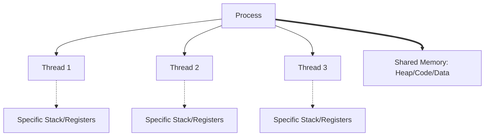
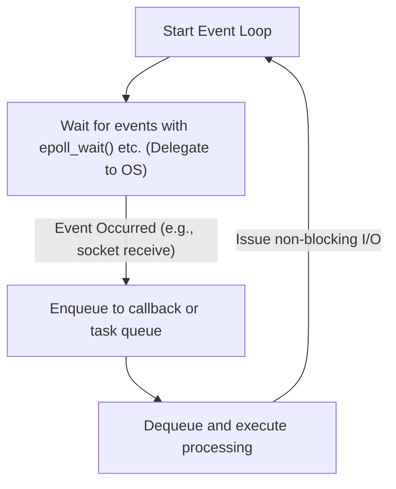

In modern software development, performance and scalability are inseparable and crucial themes. Especially in systems handling high-traffic web servers or real-time communication, "how efficiently requests are processed" determines the life or death of the system.

To address this problem, many modern programming languages provide asynchronous processing syntax such as `async` / `await`. However, why is asynchronous processing necessary? Why is the simple model of "assigning one thread per request" as in the past reaching its limits?

The answer is deeply rooted in the mechanism and cost of "context switching" at the OS (Operating System) kernel level, as well as the constraints of hardware architecture. In this article, we will deeply explore and explain everything from the OS process and thread management mechanisms, the hardware costs of context switching, the C10K problem, event-driven architecture (epoll/kqueue), to the mechanics of user-space coroutines and `async/await`.

## 1. Basics of OS Process and Thread Management

### 1.1 What is a Process
A process is an instance of a running program and the basic unit to which the OS allocates resources. A process has an independent memory space (virtual address space) and is isolated from other processes. To manage processes, the OS maintains a data structure called the **PCB (Process Control Block)** in kernel space. The PCB records the process ID, register states, memory management information (such as pointers to page tables), open file descriptors, and so on.

### 1.2 The Emergence of Threads and Lightweighting
In early OSs, it was necessary to create (`fork`) multiple processes to perform concurrent processing. However, because processes have completely independent memory spaces, there were issues with the high creation costs and the overhead of inter-process communication (IPC).

Thus, **threads** were introduced. A thread is also called a "Lightweight Process" and shares the memory space (heap, data segment, code segment) with other threads within the same process. However, each thread has its own execution context, meaning a **thread-specific stack** and a **register set (such as the program counter)**. Thread management information is maintained in the kernel as a **TCB (Thread Control Block)**.



By sharing memory, the cost of thread creation and communication has significantly dropped compared to processes, but the fundamental overhead of "scheduling and switching by the kernel" continues to exist.

## 2. The True Cost of Context Switching

In a multitasking OS, to make it appear as though multiple threads are being executed simultaneously on limited CPU cores, the OS rapidly switches the threads executing via time-slicing. Also, when a thread waits (blocks) for the completion of disk I/O or network communication, the OS switches to yield the CPU to another thread. This switching operation is called a **Context Switch**.

Context switching is by no means free. Its cost goes beyond mere software processing overhead and significantly impacts the hardware cache architecture.

### 2.1 Saving and Restoring Registers and States
When a context switch occurs, the CPU saves (backs up) the register state (program counter, stack pointer, general-purpose registers, etc.) of the currently executing thread into that thread's TCB or the kernel stack. Then, it loads (restores) the register state from the TCB of the next thread to be executed. This alone costs tens to hundreds of cycles.

### 2.2 TLB (Translation Lookaside Buffer) Flushing
In the case of a context switch between processes, an even heavier cost occurs. This is the **TLB flush**. The TLB is an ultra-fast memory within the CPU that caches the results of translating virtual addresses to physical addresses.
When processes switch, the virtual address space changes, rendering the TLB entries of the previous process invalid. Therefore, the OS must flush (clear) the TLB, and immediately after the new process resumes execution, it must consult the page tables in memory (page walk) for address translation every time, leading to severe performance degradation.

### 2.3 CPU Cache (L1/L2/L3) Pollution and Invalidation
Even with a context switch between threads (even within the same process), **cache pollution** occurs. The newly scheduled thread evicts the data left in the cache by the previous thread and begins loading its own data into the cache. As a result, cache misses occur frequently, increasing memory access latency.

Thus, the greatest cost of context switching is not the "processing time of saving and restoring," but rather the "indirect performance degradation caused by the resetting of pipeline optimization mechanisms like the CPU cache and TLB."

## 3. The C10K Problem and the Limits of "Thread-per-Connection"

In the early days of the widespread use of the Internet, web servers (for example, early Apache) adopted a model of **"allocating one OS thread (or process) per network connection"** (Thread-per-connection).

This model had the advantage of extremely simple code. When calling a function to read data from the network, the thread simply had to block (sleep) until the data arrived.

```c
// Pseudocode for the Thread-per-connection model
void handle_connection(int socket) {
    char buffer[1024];
    // This thread is blocked (stopped) by the kernel until data arrives
    int bytes = read(socket, buffer, 1024); 
    process_data(buffer, bytes);
    write(socket, response);
}
```

However, as we entered the 2000s and the number of concurrent connections reached 10,000 (10K), this model collapsed. This is the famous **C10K problem (10,000 Client Problem)**.

### Limit Reason 1: Memory Exhaustion
When an OS thread is created, a specific stack area (typically several MBs by default on Linux) is allocated to each thread. Creating 10,000 threads to handle 10,000 connections would require tens of GB of memory just for the stacks. This was an unrealistic size for the hardware at the time.

### Limit Reason 2: Context Switch Storm
What happens when thousands to tens of thousands of threads exist and repeatedly block and wake up waiting for the completion of network I/O? The overhead for the kernel's scheduler to find the next thread to execute increases, and furthermore, the aforementioned cache misses due to context switching occur frequently. As a result, most of the CPU time is wasted on "thread switching (kernel processing)" rather than "actual processing".

## 4. Event-Driven Architecture and Non-blocking I/O

To solve the C10K problem, a model combining **Event-Driven Architecture** and **Non-blocking I/O** emerged. Nginx, Node.js, Redis, and others adopted this architecture to achieve overwhelming performance.

### 4.1 Non-blocking I/O
When operating a socket in non-blocking mode, even if the data has not yet arrived, the kernel does not block the thread and immediately returns an error (`EAGAIN` or `EWOULDBLOCK`). This allows a single thread to continue with other processing without entering a waiting state.

### 4.2 Kernel-level Event Notification Mechanisms (epoll / kqueue)
However, sequentially asking "has the data arrived?" (polling) thousands of non-blocking sockets is the height of inefficiency.

Therefore, the OS kernel provided advanced system calls for **I/O Multiplexing**.
- Linux: **`epoll`**
- BSD/macOS: **`kqueue`**
- Windows: **IOCP (I/O Completion Ports)**

Early `select` and `poll` worked by passing a list of all monitored file descriptors (FDs) to the kernel every time, and the kernel would scan it in O(N) time.
In contrast, `epoll` maintains an event table within the kernel and returns to the application only a list of FDs where an I/O event has occurred, thus operating in O(1) (more precisely, proportional to the number of events that occurred).

### 4.3 The Birth of the Event Loop
This made it possible to efficiently handle tens of thousands of connections with a single thread (or a small number of threads equal to the number of CPU cores). This is the **Event Loop**.



The event loop continues to endlessly cycle through "asking the OS for events" -> "executing the processing (callback) corresponding to the event that occurred." This made it possible to eliminate heavy OS-level context switches and utilize CPU resources to their absolute limit.

## 5. User-Space Coroutines and async/await

While the event-driven architecture was a perfect solution in terms of performance, it brought great pain to programmers. This was **Callback Hell**.

Having to register a callback function for every I/O operation fragmented the execution flow of the code, making error handling and complex state management difficult.

### 5.1 Coroutines and Moving Context Switches to User Space
To solve this complexity while maintaining performance, concepts like "**Coroutines**" or "**Green Threads**" became popular. Go's Goroutines are a prime example.

These are "lightweight threads managed in userland (on the program side)" that run on top of OS kernel threads.
When a certain coroutine waits for I/O, rather than returning control (blocking) to the kernel, the **user-space scheduler (runtime)** saves the execution state of that coroutine and switches to another coroutine.

This switching in user space does not involve OS context switches, nor does it trigger transitions to privileged mode (system calls) or TLB flushes, so it completes at an extremely low cost of several nanoseconds to tens of nanoseconds.

### 5.2 The Magic of async/await: State Machine Transformation by the Compiler
Furthermore, many modern languages (C#, JavaScript/TypeScript, Python, Rust, etc.) introduced `async` and `await`, integrating this asynchronous processing as language syntax.

The true power of `async/await` lies in the fact that **"code written synchronously (from top to bottom) for humans is transformed behind the scenes into a state machine by the compiler and integrated with the event loop."**

When the `await` keyword appears, the thread does not actually stop there.
1. The state of the current function (local variables, etc.) is saved to an object on the heap (such as a Future or Promise).
2. The I/O operation is registered with the event loop (or epoll).
3. The function's execution is temporarily suspended (`yield`), and control returns to the event loop or the caller.
4. When the I/O completes, the event loop detects it and resumes (`resume`) the function's execution from the saved state.

```rust
// Image of asynchronous processing in Rust
async fn fetch_data() -> Result<Data, Error> {
    // Start network connection asynchronously
    let mut stream = TcpStream::connect("example.com").await?; 
    // At the .await above, the function actually suspends and returns to the event loop.
    // Once the connection is established, execution resumes from here.
    
    let mut buffer = Vec::new();
    // Reading data. This is also asynchronous and non-blocking.
    stream.read_to_end(&mut buffer).await?;
    
    Ok(parse(buffer))
}
```

In languages aiming for zero-cost abstractions like Rust, `async` functions are completely transformed at compile-time into state machines based on an `enum` holding state. Even dynamic memory allocation is kept to a minimum, demonstrating extreme performance.

## 6. Challenges of Asynchronous Processing: "What Color is Your Function?"

While `async/await` is powerful, it is not a silver bullet. The most well-known architectural challenge is the "function coloring problem."

To `await` inside an asynchronous function (let's say a red function), the calling function must also be an asynchronous function (red). You cannot directly call an asynchronous function from a synchronous function (a blue function) and wait for the result.
This creates a problem where the entire codebase is divided into a "synchronous world" and an "asynchronous world."

Furthermore, if CPU-bound (compute-intensive) processing is executed for a long time within an `async` function, it will block the event loop itself, posing a severe risk of causing a bug where all other asynchronous tasks stall (Starvation). In the asynchronous world, "blocking to wait for I/O" is permitted, but "monopolizing the loop with CPU computations" is strictly forbidden.

## 7. Conclusion

Behind the concise syntax of `async` / `await` that we casually use, decades of optimization history in computer science are packed.

- To avoid **high-cost hardware context switches** (TLB flushes, cache misses).
- To save depleting **memory resources (thread stacks)**.
- To draw out the power of the kernel's **epoll/kqueue**.
- And to **free developers** from the complexity of asynchronous callbacks.

Born from the limits of OS process and thread management, evolving into event-driven architectures, and abstracted by the power of compilers—the result is modern `async/await`. By understanding these deep mechanisms, you will be able to design systems that are more performant, safe, and scalable.
