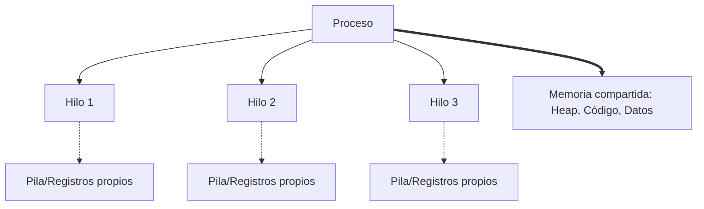
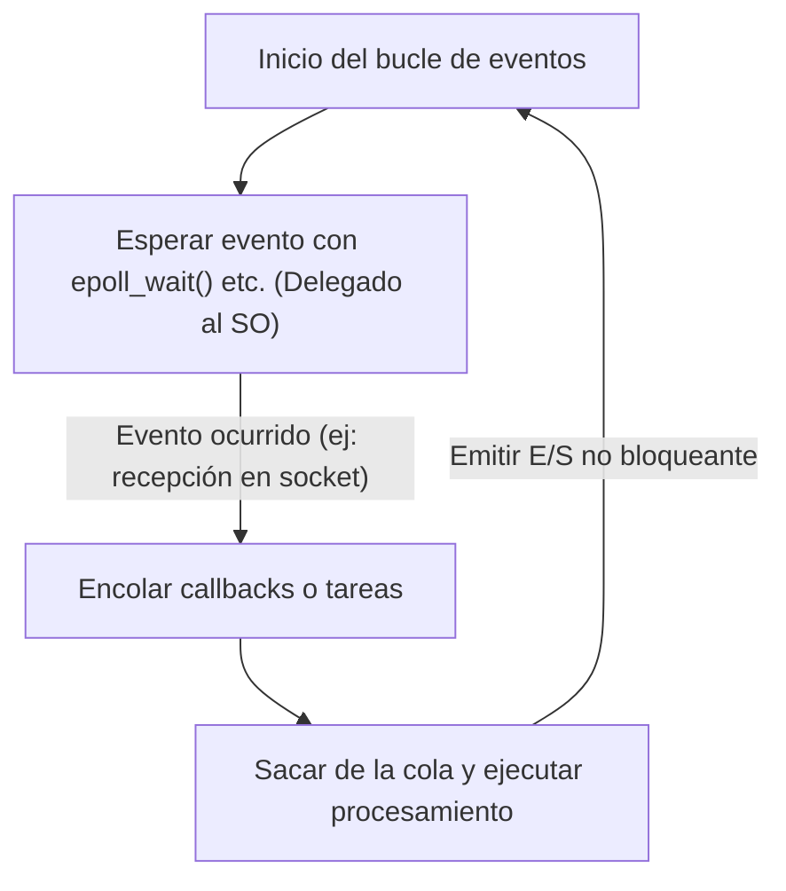

En el desarrollo de software moderno, el rendimiento y la escalabilidad son temas importantes inseparables. Especialmente en servidores web de alto tráfico y sistemas que manejan comunicación en tiempo real, "cuán eficientemente se procesan las solicitudes" determina la vida o muerte del sistema.

Para abordar este problema, muchos de los lenguajes de programación modernos ofrecen sintaxis de procesamiento asíncrono como `async` / `await`. Sin embargo, ¿por qué es necesario el procesamiento asíncrono? ¿Por qué el modelo simple tradicional de "asignar un hilo por cada solicitud" tiene sus límites?

La respuesta está profundamente arraigada en el mecanismo y costo del "cambio de contexto" (context switch) a nivel del kernel del sistema operativo (SO), así como en las restricciones de la arquitectura del hardware. En este artículo, exploraremos a fondo desde los mecanismos de gestión de procesos e hilos del SO, pasando por los costos de hardware del cambio de contexto, el problema C10K, la arquitectura orientada a eventos (epoll/kqueue), hasta los mecanismos de corrutinas en el espacio de usuario y `async/await`.

## 1. Fundamentos de la gestión de procesos e hilos del SO

### 1.1 ¿Qué es un proceso?
Un proceso es una instancia de un programa en ejecución y es la unidad básica a la que el SO asigna recursos. Un proceso tiene un espacio de memoria independiente (espacio de direcciones virtuales) y está aislado de otros procesos. Para gestionar los procesos, el SO mantiene una estructura de datos llamada **PCB (Process Control Block)** en el espacio del kernel. En el PCB se registran el ID del proceso, el estado de los registros, información de gestión de memoria (como punteros a tablas de páginas), descriptores de archivos abiertos, etc.

### 1.2 La aparición de los hilos y la reducción de peso
En los primeros sistemas operativos, para realizar procesamiento concurrente era necesario crear múltiples procesos (`fork`). Sin embargo, dado que los procesos tienen espacios de memoria completamente independientes, los costos de creación y la sobrecarga (overhead) de la comunicación entre procesos (IPC) eran problemas importantes.

Así fue como surgieron los **hilos (threads)**. Los hilos también se conocen como "procesos ligeros (Lightweight Processes)" y comparten el espacio de memoria (heap, segmento de datos, segmento de código) con otros hilos dentro del mismo proceso. Sin embargo, cada hilo tiene su propio contexto de ejecución, es decir, **una pila (stack) específica del hilo** y un **conjunto de registros (como el contador de programa)**. La información de gestión del hilo se mantiene en el kernel como **TCB (Thread Control Block)**.



Al compartir memoria, los costos de creación de hilos y de comunicación se redujeron drásticamente en comparación con los procesos, pero el overhead fundamental del "programador (scheduler) y el cambio realizado por el kernel" siguió existiendo.

## 2. El verdadero costo del cambio de contexto

En un SO multitarea, para dar la ilusión de que se están ejecutando simultáneamente múltiples hilos en un número limitado de núcleos de CPU, los hilos en ejecución se cambian rápidamente en porciones de tiempo (time slicing). Además, cuando un hilo espera (se bloquea) la finalización de E/S de disco o comunicación de red, el SO realiza un cambio para ceder la CPU a otro hilo. A este trabajo de cambio se le llama **cambio de contexto (Context Switch)**.

El cambio de contexto de ninguna manera es gratis. Su costo va más allá del simple overhead de procesamiento de software y tiene un gran impacto en la arquitectura de caché del hardware.

### 2.1 Guardado y restauración de registros y estados
Cuando ocurre un cambio de contexto, la CPU guarda el estado de los registros (contador de programa, puntero de pila, registros de propósito general, etc.) del hilo actualmente en ejecución en el TCB de ese hilo o en la pila del kernel. Luego, carga (restaura) el estado de los registros desde el TCB del hilo que se va a ejecutar a continuación. Solo esto ya cuesta desde decenas hasta cientos de ciclos.

### 2.2 Vaciado del TLB (Translation Lookaside Buffer)
En el caso del cambio de contexto entre procesos, se produce un costo aún mayor. Se trata del **vaciado del TLB (TLB flush)**. El TLB es una memoria ultra rápida dentro de la CPU que almacena en caché los resultados de la traducción de direcciones virtuales a direcciones físicas.
Cuando el proceso cambia, el espacio de direcciones virtuales también cambia, por lo que las entradas del TLB del proceso anterior se vuelven inválidas. Por lo tanto, el SO debe vaciar (borrar) el TLB, y justo después de que el nuevo proceso reanuda su ejecución, es necesario consultar la tabla de páginas en memoria (page walk) para la traducción de direcciones cada vez, lo que provoca una grave caída del rendimiento.

### 2.3 Contaminación e invalidación de la caché de la CPU (L1/L2/L3)
Incluso en los cambios de contexto entre hilos (incluso dentro del mismo proceso), ocurre la **contaminación de la caché (cache pollution)**. El hilo recién programado expulsa los datos que el hilo anterior dejó en la caché y comienza a cargar sus propios datos en ella. Esto provoca frecuentes fallos de caché (cache misses) y aumenta la latencia de acceso a la memoria.

De esta manera, el mayor costo del cambio de contexto no es el "tiempo de procesamiento para guardar y restaurar", sino "la disminución indirecta del rendimiento debido al reinicio de los mecanismos de optimización del pipeline de la CPU, como la caché y el TLB".

## 3. El problema C10K y los límites del "Hilo por Conexión"

En los inicios de la popularización de Internet, los servidores web (por ejemplo, el primer Apache) adoptaron el modelo de **"asignar un hilo del SO (o proceso) para cada conexión de red"** (Thread-per-connection).

Este modelo tenía la ventaja de que el código era muy simple. Al llamar a una función para leer datos de la red, el hilo simplemente se bloqueaba (dormía) hasta que llegaban los datos.

```c
// Pseudocódigo del modelo Thread-per-connection
void handle_connection(int socket) {
    char buffer[1024];
    // Este hilo es bloqueado (detenido) por el kernel hasta que llegan datos
    int bytes = read(socket, buffer, 1024); 
    process_data(buffer, bytes);
    write(socket, response);
}
```

Sin embargo, a medida que entramos en la década de los 2000 y el número de conexiones simultáneas alcanzó los 10,000 (10K), este modelo colapsó. Este es el famoso **problema C10K (10,000 Client Problem)**.

### Razón del límite 1: Agotamiento de la memoria
Cuando se crea un hilo del SO, se le asigna un área de pila (stack) propia para cada hilo (normalmente, unos pocos MB por defecto en Linux). Si se crean 10,000 hilos para procesar 10,000 conexiones, solo para las pilas se necesitarán decenas de GB de memoria. Era un tamaño poco realista para el hardware de la época.

### Razón del límite 2: Tormenta de cambios de contexto
¿Qué sucede cuando existen de miles a decenas de miles de hilos que repiten el ciclo de bloquearse y despertarse esperando la finalización de E/S de red? El planificador del kernel tiene un aumento en la sobrecarga para buscar qué hilo ejecutar a continuación, y además se producen frecuentes fallos de caché debido a los cambios de contexto mencionados anteriormente. Como resultado, la mayor parte del tiempo de la CPU se desperdicia en "cambio de hilos (procesamiento del kernel)" en lugar del "procesamiento real".

## 4. Arquitectura orientada a eventos y E/S no bloqueante

Para resolver el problema C10K, surgió un modelo que combinaba la **arquitectura orientada a eventos (Event-Driven Architecture)** y la **E/S no bloqueante**. Nginx, Node.js, Redis, entre otros, adoptaron esta arquitectura para lograr un rendimiento abrumador.

### 4.1 E/S no bloqueante
Al operar un socket en modo no bloqueante, incluso si los datos aún no han llegado, el kernel no bloquea el hilo y devuelve un error inmediatamente (`EAGAIN` o `EWOULDBLOCK`). Esto permite que un hilo no entre en estado de espera y pueda continuar con otros procesos.

### 4.2 Mecanismos de notificación de eventos a nivel del kernel (epoll / kqueue)
Sin embargo, preguntar (hacer polling) repetidamente "¿Han llegado datos?" a decenas de miles de sockets no bloqueantes es extremadamente ineficiente.

Por lo tanto, el kernel del SO proporcionó llamadas al sistema avanzadas para la **multiplexación de E/S (I/O Multiplexing)**.
- Linux: **`epoll`**
- BSD/macOS: **`kqueue`**
- Windows: **IOCP (I/O Completion Ports)**

Los antiguos `select` y `poll` funcionaban pasando cada vez al kernel la lista de todos los descriptores de archivos (FD) a monitorear, y el kernel los escaneaba en O(N).
En contraste, `epoll` mantiene una tabla de eventos dentro del kernel y solo devuelve a la aplicación la lista de los FD donde ocurrieron eventos de E/S, por lo que funciona en O(1) (para ser exactos, en proporción al número de eventos ocurridos).

### 4.3 El nacimiento del bucle de eventos
Con esto, se hizo posible manejar eficientemente decenas de miles de conexiones con un solo hilo (o un pequeño número de hilos igual al número de núcleos de la CPU). Este es el **bucle de eventos (Event Loop)**.



El bucle de eventos simplemente repite el ciclo de "preguntar al SO por eventos" → "ejecutar los procesos (callbacks) correspondientes a los eventos ocurridos". Esto permitió eliminar los pesados cambios de contexto a nivel del SO y utilizar los recursos de la CPU al límite.

## 5. Corrutinas en el espacio de usuario y async/await

La arquitectura orientada a eventos fue una solución perfecta en términos de rendimiento, pero trajo un gran sufrimiento a los programadores. Eso es el **Infierno de Callbacks (Callback Hell)**.

Cada vez que se realizaba una operación de E/S, era necesario registrar una función de callback, lo que dividía el flujo de ejecución del código y dificultaba el manejo de errores y la gestión compleja de estados.

### 5.1 Traslado de corrutinas y cambios de contexto al espacio de usuario
Para resolver esta complejidad mientras se mantenía el rendimiento, se popularizó el concepto de "**Corrutinas (Coroutine)**" o "**Hilos Verdes (Green Thread)**". Un ejemplo representativo son las Goroutines del lenguaje Go.

Estos son "hilos ligeros gestionados en el espacio de usuario (lado del programa)" que se ejecutan sobre los hilos del kernel del SO.
Cuando una corrutina espera por E/S, en lugar de devolver el control al kernel (bloquear), el **planificador del espacio de usuario (runtime)** guarda el estado de ejecución de esa corrutina y cambia a otra corrutina.

Este cambio en el espacio de usuario no involucra el cambio de contexto del SO, ni la transición a un modo privilegiado (llamada al sistema) o el vaciado del TLB, por lo que se completa con un costo extremadamente bajo, de unos pocos a unas decenas de nanosegundos.

### 5.2 La magia de async/await: Conversión a máquina de estados por el compilador
Además, muchos lenguajes modernos (C#, JavaScript/TypeScript, Python, Rust, etc.) introdujeron `async` y `await`, integrando este procesamiento asíncrono como sintaxis del lenguaje.

El verdadero poder de `async/await` reside en que **"el compilador transforma en segundo plano el código escrito de forma síncrona (de arriba hacia abajo) para los humanos, en una máquina de estados (state machine) y la integra con el bucle de eventos"**.

Cuando aparece la palabra clave `await`, el hilo en realidad no se detiene allí.
1. El estado de la función actual (variables locales, etc.) se guarda en un objeto en el heap (como un Future o Promise).
2. El proceso de E/S se registra en el bucle de eventos (o epoll).
3. La ejecución de la función se interrumpe temporalmente (`yield`), y el control vuelve al bucle de eventos o al invocador.
4. Cuando finaliza la E/S, el bucle de eventos lo detecta y reanuda (`resume`) la ejecución de la función desde el estado guardado.

```rust
// Imagen del procesamiento asíncrono en Rust
async fn fetch_data() -> Result<Data, Error> {
    // Iniciar conexión de red asincrónicamente
    let mut stream = TcpStream::connect("example.com").await?; 
    // En el .await anterior, la función en realidad se interrumpe y vuelve al bucle de eventos.
    // Una vez que se establece la conexión, la ejecución se reanuda desde aquí.
    
    let mut buffer = Vec::new();
    // Lectura de datos. Esto también es asíncrono y no bloquea.
    stream.read_to_end(&mut buffer).await?;
    
    Ok(parse(buffer))
}
```

En lenguajes como Rust, que promueven abstracciones de costo cero, las funciones `async` se transforman completamente en tiempo de compilación en máquinas de estado basadas en `enum` que mantienen estados. Incluso las asignaciones dinámicas de memoria se minimizan, logrando un rendimiento extremo.

## 6. Desafíos del procesamiento asíncrono: "El color de las funciones (What Color is Your Function?)"

`async/await` es poderoso, pero no es una bala de plata. El desafío arquitectónico más conocido es el "problema de la coloración de funciones".

Para hacer `await` dentro de una función asíncrona (digamos, una función roja), la función que la llama también debe ser una función asíncrona (roja). No se puede llamar a una función asíncrona directamente desde una función síncrona (función azul) y esperar el resultado.
Esto provoca el problema de que toda la base de código se divide en el "mundo síncrono" y el "mundo asíncrono".

Además, si se ejecuta un procesamiento ligado a la CPU (CPU bound, intensivo en cálculo) durante mucho tiempo dentro de una función `async`, se puede bloquear el propio bucle de eventos, deteniendo todas las demás tareas asíncronas (Starvation) y causando un riesgo de errores graves. En el mundo asíncrono, se permite "bloquearse a la espera de E/S", pero está estrictamente prohibido "monopolizar el bucle con cálculos de CPU".

## 7. Conclusión

Detrás de la sintaxis concisa de `async` / `await` que usamos casualmente, hay décadas de historia de optimización en ciencias de la computación.

- Para evitar los **costosos cambios de contexto de hardware** (vaciado del TLB, fallos de caché).
- Para conservar los **recursos de memoria (pilas de hilos)** que se agotan.
- Para aprovechar el poder de **epoll/kqueue** del kernel.
- Y para **liberar a los desarrolladores** de la complejidad de los callbacks asíncronos.

Nacido de los límites de la gestión de procesos e hilos del SO, evolucionado hacia la arquitectura orientada a eventos, y abstraído con el poder de los compiladores, el resultado es el `async/await` moderno. Al comprender estos profundos mecanismos, serás capaz de diseñar sistemas más seguros, escalables y con un mayor rendimiento.
