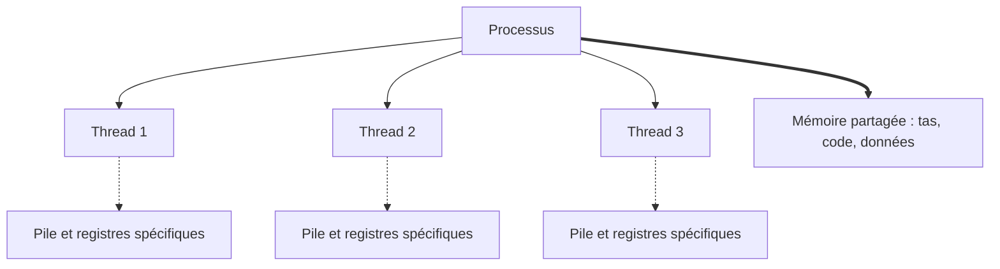
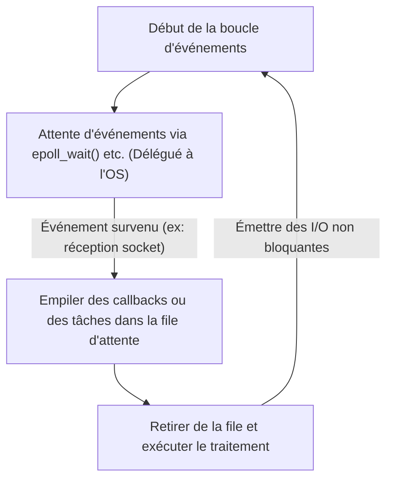

Dans le développement logiciel moderne, les performances et la scalabilité sont des thèmes importants et indissociables. En particulier, pour les serveurs Web à fort trafic et les systèmes gérant des communications en temps réel, « comment traiter efficacement les requêtes » fait la différence entre la vie et la mort du système.

Pour faire face à ce problème, de nombreux langages de programmation modernes proposent des syntaxes de traitement asynchrone telles que `async` / `await`. Mais pourquoi le traitement asynchrone est-il nécessaire ? Pourquoi le modèle simple traditionnel « allouer un thread par requête » atteint-il ses limites ?

La réponse est profondément enracinée dans le mécanisme du « changement de contexte » au niveau du noyau de l'OS (système d'exploitation) et son coût, ainsi que dans les contraintes de l'architecture matérielle. Dans cet article, nous explorerons en profondeur, en commençant par les mécanismes de gestion des processus et des threads de l'OS, le coût matériel du changement de contexte, le problème C10K, l'architecture orientée événements (epoll/kqueue), jusqu'aux mécanismes des coroutines et de `async/await` dans l'espace utilisateur.

## 1. Bases de la gestion des processus et threads de l'OS

### 1.1 Qu'est-ce qu'un processus ?
Un processus est une instance d'un programme en cours d'exécution et l'unité de base à laquelle l'OS alloue des ressources. Un processus possède un espace mémoire indépendant (espace d'adressage virtuel) et est isolé des autres processus. Pour gérer les processus, l'OS maintient dans l'espace noyau une structure de données appelée **PCB (Process Control Block)**. Le PCB enregistre l'ID du processus, l'état des registres, les informations de gestion de la mémoire (comme un pointeur vers la table des pages), les descripteurs de fichiers ouverts, etc.

### 1.2 Apparition et allègement des threads
Dans les premiers systèmes d'exploitation, pour effectuer des traitements parallèles, il fallait créer de multiples processus (`fork`). Cependant, comme un processus possède un espace mémoire totalement indépendant, cela posait le problème du coût de création élevé et d'une surcharge (overhead) importante de la communication inter-processus (IPC).

C'est là que le **thread** est apparu. Un thread est également appelé « processus léger » (Lightweight Process) et partage l'espace mémoire (tas, segment de données, segment de code) avec d'autres threads au sein du même processus. Toutefois, chaque thread possède son propre contexte d'exécution, c'est-à-dire **une pile spécifique au thread** et **un ensemble de registres (comme le compteur de programme)**. Les informations de gestion des threads sont maintenues dans le noyau sous forme de **TCB (Thread Control Block)**.



Bien que le partage de la mémoire ait considérablement réduit le coût de création et de communication des threads par rapport aux processus, le surcoût fondamental de « la planification et du basculement par le noyau » persiste.

## 2. Le véritable coût du changement de contexte

Dans un OS multitâche, pour donner l'illusion que plusieurs threads s'exécutent simultanément sur un nombre limité de cœurs de processeur, l'OS bascule rapidement les threads en exécution par un partage du temps (time-slicing). De plus, lorsqu'un thread attend l'achèvement d'une I/O disque ou d'une communication réseau (se bloque), l'OS effectue également un basculement pour céder le CPU à un autre thread. Cette opération de basculement est appelée **changement de contexte (Context Switch)**.

Le changement de contexte n'est en aucun cas gratuit. Son coût va au-delà d'une simple surcharge de traitement logiciel et a un impact majeur sur l'architecture du cache matériel.

### 2.1 Sauvegarde et restauration des registres et de l'état
Lorsqu'un changement de contexte se produit, le CPU sauvegarde (sauve) l'état des registres (compteur de programme, pointeur de pile, registres à usage général, etc.) du thread en cours d'exécution dans le TCB de ce thread ou dans la pile du noyau. Ensuite, il lit (restaure) l'état des registres depuis le TCB du thread qui sera exécuté ensuite. Rien que cela coûte de plusieurs dizaines à plusieurs centaines de cycles.

### 2.2 Vidage du TLB (Translation Lookaside Buffer)
Dans le cas d'un changement de contexte entre processus, un coût encore plus lourd survient. Il s'agit du **vidage du TLB (flush TLB)**. Le TLB est une mémoire ultra-rapide à l'intérieur du CPU qui met en cache les résultats de la traduction d'adresses virtuelles en adresses physiques.
Lorsque le processus change, l'espace d'adressage virtuel change également, ce qui invalide les entrées du TLB de l'ancien processus. Par conséquent, l'OS doit vider (effacer) le TLB, et immédiatement après qu'un nouveau processus reprend son exécution, il est nécessaire de consulter la table des pages en mémoire (page walk) pour chaque traduction d'adresse, ce qui entraîne une grave dégradation des performances.

### 2.3 Pollution et invalidation du cache CPU (L1/L2/L3)
Même avec un changement de contexte entre threads (même au sein du même processus), une **pollution du cache (cache pollution)** se produit. Le nouveau thread planifié expulse les données laissées dans le cache par le thread précédent et commence à charger ses propres données dans le cache. En conséquence, les défauts de cache (cache misses) deviennent fréquents, ce qui augmente la latence de l'accès à la mémoire.

Ainsi, le coût majeur du changement de contexte n'est pas le « temps de traitement de la sauvegarde et de la restauration », mais « la dégradation indirecte des performances due à la réinitialisation des mécanismes d'optimisation du pipeline, tels que le cache du CPU et le TLB ».

## 3. Le problème C10K et les limites du « Thread-per-connection »

Aux débuts de la popularisation d'Internet, les serveurs Web (par exemple le premier Apache) adoptaient le modèle **« un thread d'OS (ou processus) alloué à une connexion réseau »** (Thread-per-connection).

Ce modèle avait l'avantage de rendre le code très simple. En effet, lors de l'appel d'une fonction pour lire des données depuis le réseau, il suffisait que le thread se bloque (se mette en sommeil) en attendant que les données arrivent.

```c
// Pseudo-code du modèle Thread-per-connection
void handle_connection(int socket) {
    char buffer[1024];
    // Ce thread est bloqué (arrêté) par le noyau jusqu'à ce que les données arrivent
    int bytes = read(socket, buffer, 1024); 
    process_data(buffer, bytes);
    write(socket, response);
}
```

Cependant, dans les années 2000, lorsque le nombre de connexions simultanées a atteint 10 000 (10K), ce modèle s'est effondré. C'est le célèbre **problème C10K (10,000 Client Problem)**.

### Raison de la limite 1 : Épuisement de la mémoire
Lorsqu'un thread d'OS est créé, un espace de pile spécifique (généralement de plusieurs Mo par défaut sous Linux) est alloué à chaque thread. Si 10 000 threads sont créés pour gérer 10 000 connexions, des dizaines de Go de mémoire seront nécessaires rien que pour la pile. C'était une taille irréaliste pour le matériel de l'époque.

### Raison de la limite 2 : La tempête de changements de contexte
Que se passe-t-il s'il y a des milliers, voire des dizaines de milliers de threads, et qu'ils ne cessent de se bloquer et de se réveiller en attendant l'achèvement des I/O réseau ? Le planificateur (scheduler) du noyau voit son overhead augmenter pour trouver le prochain thread à exécuter, et de plus, les défauts de cache causés par les changements de contexte mentionnés précédemment deviennent très fréquents. En conséquence, la majeure partie du temps CPU est gaspillée dans le « basculement des threads (traitement du noyau) » plutôt que dans le « traitement réel ».

## 4. Architecture orientée événements et I/O non bloquantes

Pour résoudre le problème C10K, le modèle combinant l'**architecture orientée événements (Event-Driven Architecture)** et les **I/O non bloquantes** a fait son apparition. Nginx, Node.js, Redis, etc., ont adopté cette architecture pour atteindre des performances écrasantes.

### 4.1 I/O non bloquantes
Lorsque vous manipulez des sockets en mode non bloquant, même si les données ne sont pas encore arrivées, le noyau ne bloque pas le thread et renvoie immédiatement une erreur (`EAGAIN` ou `EWOULDBLOCK`). Grâce à cela, un seul thread ne reste pas inactif et peut continuer à exécuter d'autres tâches.

### 4.2 Mécanisme de notification d'événements au niveau du noyau (epoll / kqueue)
Cependant, il est extrêmement inefficace de demander sans cesse « les données sont-elles arrivées ? » (polling) tour à tour à des dizaines de milliers de sockets non bloquants.

Ainsi, le noyau de l'OS a fourni des appels système avancés pour le **multiplexage des I/O (I/O Multiplexing)**.
- Linux : **`epoll`**
- BSD/macOS : **`kqueue`**
- Windows : **IOCP (I/O Completion Ports)**

Les anciens `select` ou `poll` fonctionnaient en transmettant à chaque fois au noyau la liste de tous les descripteurs de fichiers (FD) à surveiller, que le noyau analysait en O(N).
En revanche, `epoll` maintient une table d'événements à l'intérieur du noyau et ne renvoie à l'application que la liste des FD où un événement I/O s'est produit, fonctionnant ainsi en O(1) (plus précisément proportionnellement au nombre d'événements survenus).

### 4.3 Naissance de la boucle d'événements
Grâce à cela, il est devenu possible de gérer efficacement des dizaines de milliers de connexions avec un seul thread (ou un petit nombre de threads égal au nombre de cœurs CPU). C'est ce qu'on appelle la **boucle d'événements (Event Loop)**.



La boucle d'événements continue simplement de faire tourner le cycle « interroger l'OS sur les événements » → « exécuter les traitements correspondants aux événements survenus (callbacks) ». Cela a permis d'éliminer les lourds changements de contexte au niveau de l'OS et d'utiliser les ressources CPU jusqu'à leurs limites.

## 5. Coroutines dans l'espace utilisateur et async/await

Bien que l'architecture orientée événements ait été une solution parfaite du point de vue des performances, elle a apporté de grandes souffrances aux programmeurs. Il s'agit de **l'enfer des callbacks (Callback Hell)**.

Il fallait enregistrer des fonctions de callback à chaque opération d'I/O, le flux d'exécution du code était fragmenté et la gestion des erreurs ainsi que la gestion d'états complexes devenaient difficiles.

### 5.1 Déplacement des coroutines et du changement de contexte vers l'espace utilisateur
Pour résoudre cette complexité tout en maintenant les performances, le concept de « **coroutine (Coroutine)** » ou « **green thread (Green Thread)** » s'est répandu. Les Goroutines du langage Go en sont représentatives.

Il s'agit de « threads légers gérés côté programme (espace utilisateur) » qui s'exécutent sur les threads du noyau de l'OS.
Lorsqu'une certaine coroutine est en attente d'I/O, au lieu de rendre le contrôle au noyau (se bloquer), **le planificateur de l'espace utilisateur (runtime)** sauvegarde l'état d'exécution de cette coroutine et bascule vers une autre coroutine.

Ce basculement dans l'espace utilisateur n'implique pas de changement de contexte de l'OS, et n'entraîne pas de transition vers le mode privilégié (appel système) ni de vidage du TLB, de sorte qu'il se termine avec un coût extrêmement faible de quelques nanosecondes à quelques dizaines de nanosecondes.

### 5.2 La magie de async/await : Transformation en machine à états par le compilateur
De plus, de nombreux langages modernes (C#, JavaScript/TypeScript, Python, Rust, etc.) ont introduit `async` et `await`, intégrant ce traitement asynchrone en tant que syntaxe du langage.

Le véritable pouvoir de `async/await` réside dans le fait que **« le code écrit de manière synchrone (de haut en bas) pour l'humain est transformé en arrière-plan par le compilateur en une machine à états (automate fini) et intégré à la boucle d'événements »**.

Lorsque le mot-clé `await` apparaît, le thread ne s'arrête pas réellement à cet endroit.
1. L'état de la fonction actuelle (variables locales, etc.) est sauvegardé dans un objet sur le tas (comme un Future ou une Promise).
2. Le traitement d'I/O est enregistré dans la boucle d'événements (ou epoll).
3. L'exécution de la fonction est temporairement suspendue (`yield`), et le contrôle est rendu à la boucle d'événements ou à l'appelant.
4. Lorsque l'I/O est terminée, la boucle d'événements la détecte et l'exécution de la fonction reprend (`resume`) à partir de l'état sauvegardé.

```rust
// Image du traitement asynchrone en Rust
async fn fetch_data() -> Result<Data, Error> {
    // Démarrer la connexion réseau de manière asynchrone
    let mut stream = TcpStream::connect("example.com").await?; 
    // Au .await ci-dessus, la fonction est en fait suspendue et retourne à la boucle d'événements.
    // Une fois la connexion établie, l'exécution reprend d'ici.
    
    let mut buffer = Vec::new();
    // Lecture des données. C'est également asynchrone et non bloquant.
    stream.read_to_end(&mut buffer).await?;
    
    Ok(parse(buffer))
}
```

Dans les langages qui prônent une abstraction à coût nul (zero-cost abstraction) comme Rust, les fonctions `async` sont complètement transformées à la compilation en machines à états basées sur des `enum` possédant des états. Même l'allocation dynamique de mémoire est minimisée, offrant des performances extrêmes.

## 6. Les défis du traitement asynchrone : « La couleur des fonctions (What Color is Your Function?) »

`async/await` est puissant, mais ce n'est pas une solution miracle. Le défi architectural le plus connu est le « problème de la coloration des fonctions ».

Pour faire un `await` à l'intérieur d'une fonction asynchrone (disons une fonction rouge), la fonction appelante doit également être une fonction asynchrone (rouge). On ne peut pas appeler directement une fonction asynchrone depuis une fonction synchrone (fonction bleue) pour attendre son résultat.
Cela crée un problème où l'ensemble de la base de code se retrouve scindé en un « monde synchrone » et un « monde asynchrone ».

De plus, si un traitement intensif en CPU (liée au CPU) est exécuté pendant une longue période à l'intérieur d'une fonction `async`, il bloquera la boucle d'événements elle-même, entraînant le risque d'un bogue grave où toutes les autres tâches asynchrones s'arrêtent (Starvation - Famine). Dans le monde asynchrone, « se bloquer en attente d'I/O » est autorisé, mais « monopoliser la boucle par des calculs CPU » est strictement interdit.

## 7. Conclusion

Derrière la syntaxe concise `async` / `await` que nous utilisons de façon si désinvolte se cachent des décennies d'histoire d'optimisation en informatique.

- Pour éviter les **changements de contexte matériels coûteux** (vidage du TLB, défauts de cache).
- Pour économiser les **ressources mémoire (pile de threads)** qui s'épuisent.
- Pour tirer parti de la puissance de **epoll/kqueue** du noyau.
- Et pour **libérer les développeurs** de la complexité des callbacks asynchrones.

Né des limites de la gestion des processus et des threads de l'OS, évoluant vers l'architecture orientée événements, et le résultat de l'abstraction par le pouvoir du compilateur, c'est cela le `async/await` moderne. En comprenant ces mécanismes profonds, vous serez en mesure de concevoir des systèmes plus performants, sûrs et scalables.
