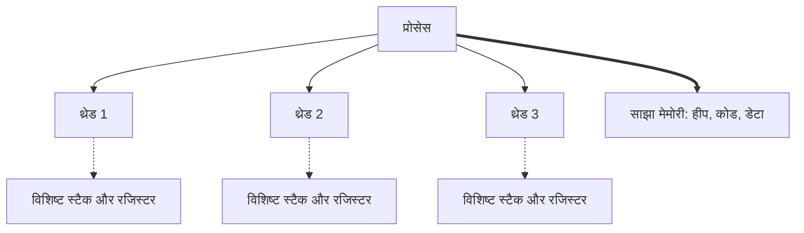
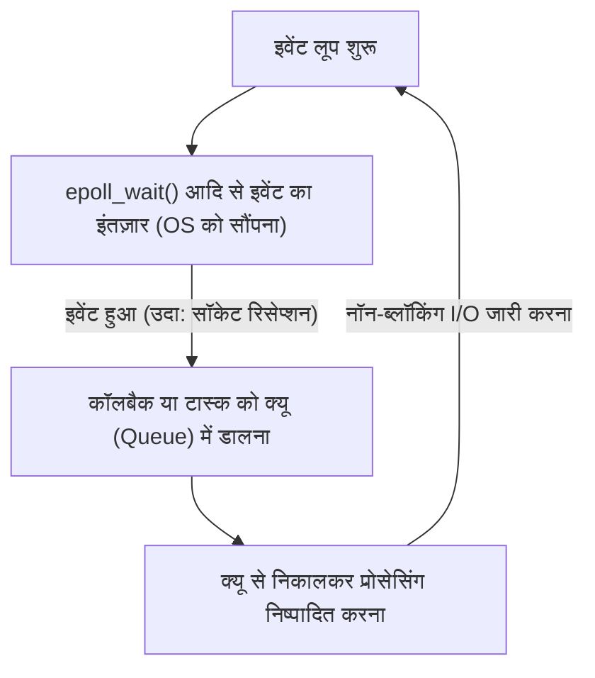

आधुनिक सॉफ्टवेयर विकास में, प्रदर्शन (परफॉरमेंस) और स्केलेबिलिटी (विस्तारणीयता) दो अभिन्न और महत्वपूर्ण विषय हैं। विशेष रूप से, उच्च ट्रैफ़िक वाले वेब सर्वर या रियल-टाइम संचार को संभालने वाले सिस्टम में, "अनुरोधों (रिक्वेस्ट्स) को कितनी कुशलता से प्रोसेस किया जाता है" यह सिस्टम की सफलता या विफलता तय करता है।

इस समस्या से निपटने के लिए, कई आधुनिक प्रोग्रामिंग भाषाएँ `async` / `await` जैसे एसिंक्रोनस (अतुल्यकालिक) प्रोसेसिंग सिंटैक्स प्रदान करती हैं। लेकिन एसिंक्रोनस प्रोसेसिंग की आवश्यकता क्यों है? "एक अनुरोध के लिए एक थ्रेड आवंटित करने" वाले पारंपरिक सरल मॉडल की सीमाएँ क्या हैं?

इसका उत्तर ऑपरेटिंग सिस्टम (OS) के कर्नेल स्तर पर "कॉन्टेक्स्ट स्विच (Context Switch)" तंत्र और इसकी कीमत, तथा हार्डवेयर आर्किटेक्चर की सीमाओं में गहराई से निहित है। इस लेख में, हम OS की प्रोसेस और थ्रेड मैनेजमेंट के बेसिक्स से शुरू करेंगे और कॉन्टेक्स्ट स्विच की हार्डवेयर लागत, C10K समस्या, इवेंट-ड्रिवन आर्किटेक्चर (epoll/kqueue), और यूज़र स्पेस में कोरुटीन तथा `async/await` के काम करने के तरीके तक गहराई से चर्चा करेंगे।

## 1. OS की प्रोसेस और थ्रेड मैनेजमेंट के बेसिक्स

### 1.1 प्रोसेस क्या है?
प्रोसेस, निष्पादित हो रहे प्रोग्राम का एक इंस्टेंस है और यह वह बुनियादी इकाई है जिसके लिए OS संसाधनों (रिसोर्सेस) को आवंटित करता है। एक प्रोसेस का अपना स्वतंत्र मेमोरी स्पेस (वर्चुअल एड्रेस स्पेस) होता है, और यह अन्य प्रोसेस से अलग-थलग होता है। प्रोसेस को मैनेज करने के लिए, OS कर्नेल स्पेस में **PCB (Process Control Block)** नामक एक डेटा स्ट्रक्चर रखता है। PCB में प्रोसेस ID, रजिस्टर की स्थिति, मेमोरी मैनेजमेंट की जानकारी (जैसे पेज टेबल के पॉइंटर), और खुले हुए फ़ाइल डिस्क्रिप्टर आदि रिकॉर्ड होते हैं।

### 1.2 थ्रेड्स की शुरुआत और हल्कापन (Lightweighting)
शुरुआती OS में, समवर्ती (कन्करेंट) प्रोसेसिंग करने के लिए कई प्रोसेस बनाना (`fork`) आवश्यक था। हालाँकि, चूँकि प्रोसेस का पूरी तरह से स्वतंत्र मेमोरी स्पेस होता है, इसलिए नई प्रोसेस बनाने की लागत और इंटर-प्रोसेस कम्यूनिकेशन (IPC) का ओवरहेड बहुत ज़्यादा था।

यहीं पर **थ्रेड्स (Threads)** सामने आए। थ्रेड्स को "लाइटवेट प्रोसेस" भी कहा जाता है, और वे एक ही प्रोसेस के भीतर अन्य थ्रेड्स के साथ मेमोरी स्पेस (हीप, डेटा सेगमेंट, कोड सेगमेंट) साझा करते हैं। हालाँकि, प्रत्येक थ्रेड का अपना निष्पादन कॉन्टेक्स्ट (एक्ज़ीक्यूशन कॉन्टेक्स्ट) होता है, यानी **थ्रेड-विशिष्ट स्टैक** और **रजिस्टर सेट (जैसे प्रोग्राम काउंटर)**। थ्रेड मैनेजमेंट की जानकारी कर्नेल में **TCB (Thread Control Block)** के रूप में रखी जाती है।



मेमोरी साझा करने से थ्रेड बनाने और संचार की लागत प्रोसेस की तुलना में काफी कम हो गई, लेकिन फिर भी "कर्नेल द्वारा शेड्यूलिंग और स्विचिंग" का मूलभूत ओवरहेड बना रहता है।

## 2. कॉन्टेक्स्ट स्विच की असली कीमत

मल्टीटास्किंग OS में, ऐसा दिखाने के लिए कि सीमित CPU कोर पर कई थ्रेड्स एक साथ निष्पादित हो रहे हैं, समय-विभाजन (टाइम स्लाइस) के आधार पर थ्रेड्स को तेज़ी से स्विच किया जाता है। इसके अलावा, जब कोई थ्रेड डिस्क I/O या नेटवर्क संचार के पूरा होने की प्रतीक्षा (ब्लॉक) करता है, तो OS CPU को अन्य थ्रेड्स को सौंपने के लिए स्विच करता है। इस स्विचिंग कार्य को **कॉन्टेक्स्ट स्विच (Context Switch)** कहा जाता है।

कॉन्टेक्स्ट स्विच कभी भी मुफ़्त नहीं होता। इसकी कीमत केवल सॉफ़्टवेयर प्रोसेसिंग के ओवरहेड तक सीमित नहीं है, बल्कि हार्डवेयर के कैश आर्किटेक्चर पर भी इसका भारी प्रभाव पड़ता है।

### 2.1 रजिस्टर और स्थिति को सहेजना और पुनर्स्थापित करना (Save and Restore)
जब कॉन्टेक्स्ट स्विच होता है, तो CPU वर्तमान में निष्पादित थ्रेड के रजिस्टर की स्थिति (प्रोग्राम काउंटर, स्टैक पॉइंटर, जनरल-परपज़ रजिस्टर आदि) को उस थ्रेड के TCB या कर्नेल स्टैक में सहेजता (सेव करता) है। फिर, यह अगले निष्पादित होने वाले थ्रेड के TCB से रजिस्टर स्थिति को पढ़ता (रीस्टोर करता) है। अकेले इस प्रक्रिया में दसियों से लेकर सैकड़ों साइकल्स की लागत आती है।

### 2.2 TLB (Translation Lookaside Buffer) फ्लश
प्रोसेस के बीच कॉन्टेक्स्ट स्विच के मामले में, लागत और भी अधिक होती है। यह है **TLB फ्लश**। TLB CPU के अंदर एक अल्ट्रा-फ़ास्ट मेमोरी है जो वर्चुअल एड्रेस से फिजिकल एड्रेस में रूपांतरण के परिणामों को कैश करती है।
जब प्रोसेस बदलती है, तो वर्चुअल एड्रेस स्पेस बदल जाता है, जिससे पिछली प्रोसेस की TLB प्रविष्टियाँ अमान्य हो जाती हैं। इसलिए, OS को TLB को फ्लश (क्लियर) करना पड़ता है, और जब नई प्रोसेस फिर से निष्पादन शुरू करती है, तो एड्रेस रूपांतरण के लिए हर बार मेमोरी में पेज टेबल को देखना पड़ता है (पेज वॉक), जिससे प्रदर्शन में गंभीर गिरावट आती है।

### 2.3 CPU कैश (L1/L2/L3) प्रदूषण (Pollution) और अमान्यता
भले ही कॉन्टेक्स्ट स्विच थ्रेड्स के बीच हो (एक ही प्रोसेस के भीतर), **कैश पॉल्यूशन (कैश प्रदूषण)** होता है। नया शेड्यूल किया गया थ्रेड पिछले थ्रेड द्वारा कैश में छोड़े गए डेटा को हटा देता है और अपने डेटा को कैश में पढ़ना शुरू कर देता है। इसके परिणामस्वरूप बार-बार कैश मिस होते हैं और मेमोरी एक्सेस लेटेंसी बढ़ जाती है।

इस तरह, कॉन्टेक्स्ट स्विच की सबसे बड़ी कीमत "सेव और रिस्टोर करने का प्रोसेसिंग समय" नहीं है, बल्कि "CPU के कैश और TLB जैसे पाइपलाइन ऑप्टिमाइज़ेशन मैकेनिज़्म के रीसेट होने से होने वाली अप्रत्यक्ष प्रदर्शन गिरावट" है।

## 3. C10K समस्या और "थ्रेड-पर-कनेक्शन" की सीमाएँ

इंटरनेट के शुरुआती दिनों में, वेब सर्वर (जैसे शुरुआती Apache) **"एक नेटवर्क कनेक्शन के लिए एक OS थ्रेड (या प्रोसेस) आवंटित करने"** वाले मॉडल (Thread-per-connection) का उपयोग करते थे।

इस मॉडल का फायदा यह था कि कोड बहुत सरल होता था। किसी फ़ंक्शन को कॉल करके नेटवर्क से डेटा पढ़ते समय, थ्रेड को बस तब तक ब्लॉक (स्लीप) रहना होता था जब तक कि डेटा आ न जाए।

```c
// Thread-per-connection मॉडल का स्यूडो-कोड (Pseudo-code)
void handle_connection(int socket) {
    char buffer[1024];
    // डेटा आने तक यह थ्रेड कर्नेल द्वारा ब्लॉक (रोक दिया) किया जाता है
    int bytes = read(socket, buffer, 1024); 
    process_data(buffer, bytes);
    write(socket, response);
}
```

हालाँकि, 2000 के दशक में, जब एक साथ कनेक्शन की संख्या 10,000 (10K) तक पहुँच गई, तो यह मॉडल विफल हो गया। यही प्रसिद्ध **C10K समस्या (10,000 Client Problem)** है।

### सीमा का कारण 1: मेमोरी का समाप्त होना
जब OS थ्रेड्स बनाए जाते हैं, तो प्रत्येक थ्रेड को अपना विशिष्ट स्टैक एरिया (आमतौर पर Linux में डिफ़ॉल्ट रूप से कई MB) आवंटित किया जाता है। यदि 10,000 कनेक्शन को संभालने के लिए 10,000 थ्रेड बनाए जाते हैं, तो केवल स्टैक के लिए ही दसियों GB मेमोरी की आवश्यकता होगी। उस समय के हार्डवेयर के लिए यह अवास्तविक था।

### सीमा का कारण 2: कॉन्टेक्स्ट स्विच का तूफ़ान
क्या होगा अगर हज़ारों या दसियों हज़ार थ्रेड मौजूद हों और वे नेटवर्क I/O के पूरा होने की प्रतीक्षा में बार-बार ब्लॉक और जागृत (wake up) हों? कर्नेल शेड्यूलर के लिए अगले थ्रेड को खोजने का ओवरहेड बढ़ जाएगा, और पहले बताए गए कॉन्टेक्स्ट स्विच के कारण बार-बार कैश मिस होंगे। परिणामस्वरूप, CPU का अधिकांश समय "वास्तविक प्रोसेसिंग" के बजाय "थ्रेड स्विचिंग (कर्नेल प्रोसेसिंग)" में बर्बाद हो जाएगा।

## 4. इवेंट-ड्रिवन आर्किटेक्चर और नॉन-ब्लॉकिंग I/O

C10K समस्या को हल करने के लिए **इवेंट-ड्रिवन आर्किटेक्चर (Event-Driven Architecture)** और **नॉन-ब्लॉकिंग I/O** को मिलाकर एक मॉडल सामने आया। Nginx, Node.js, और Redis जैसे सिस्टम ने इसी आर्किटेक्चर को अपनाकर बेजोड़ प्रदर्शन हासिल किया।

### 4.1 नॉन-ब्लॉकिंग I/O
जब सॉकेट को नॉन-ब्लॉकिंग मोड में संचालित किया जाता है, तो भले ही डेटा अभी तक नहीं आया हो, कर्नेल थ्रेड को ब्लॉक नहीं करता है, और तुरंत एक त्रुटि (जैसे `EAGAIN` या `EWOULDBLOCK`) लौटाता है। इससे एक थ्रेड प्रतीक्षा की स्थिति में नहीं फँसता है, और अन्य प्रोसेसिंग जारी रख सकता है।

### 4.2 कर्नेल स्तर का इवेंट नोटिफिकेशन मैकेनिज्म (epoll / kqueue)
लेकिन, क्या हज़ारों नॉन-ब्लॉकिंग सॉकेट्स से बारी-बारी से यह पूछना कि "क्या डेटा आ गया है?" (पोलिंग करना) अत्यधिक अकुशल नहीं होगा?

इसीलिए, OS कर्नेल ने **I/O मल्टीप्लेक्सिंग (I/O Multiplexing)** के लिए उन्नत सिस्टम कॉल प्रदान किए।
- Linux: **`epoll`**
- BSD/macOS: **`kqueue`**
- Windows: **IOCP (I/O Completion Ports)**

शुरुआती `select` और `poll` कर्नेल को हर बार उन सभी फ़ाइल डिस्क्रिप्टर (FD) की सूची पास करते थे जिनकी निगरानी करनी होती थी, और कर्नेल उसे O(N) में स्कैन करता था।
इसके विपरीत, `epoll` कर्नेल के अंदर एक इवेंट टेबल रखता है, और केवल उन FD की सूची एप्लिकेशन को लौटाता है जिनमें I/O इवेंट हुआ है, इसलिए यह O(1) (सटीक रूप से कहें तो, हुए इवेंट्स की संख्या के अनुपात में) में काम करता है।

### 4.3 इवेंट लूप का जन्म
इसके साथ, एक ही थ्रेड (या CPU कोर की संख्या के बराबर कुछ थ्रेड्स) हज़ारों कनेक्शनों को कुशलतापूर्वक संभाल सकता है। यही **इवेंट लूप (Event Loop)** है।



इवेंट लूप बस लगातार "OS से इवेंट के बारे में पूछने" → "हुए इवेंट से संबंधित प्रोसेसिंग (कॉलबैक) को निष्पादित करने" का चक्र चलाता रहता है। इससे OS-स्तर के भारी कॉन्टेक्स्ट स्विच को खत्म किया जा सका, और CPU संसाधनों का उनकी सीमा तक उपयोग किया जा सका।

## 5. यूज़र स्पेस के कोरुटीन और async/await

हालाँकि इवेंट-ड्रिवन आर्किटेक्चर प्रदर्शन के मामले में एक अचूक समाधान था, लेकिन इसने प्रोग्रामर्स के लिए बड़ी मुसीबतें खड़ी कर दीं। जिसे **कॉलबैक नर्क (Callback Hell)** कहा जाता है।

हर I/O ऑपरेशन के लिए एक कॉलबैक फ़ंक्शन को रजिस्टर करना पड़ता था, जिससे कोड का निष्पादन प्रवाह (एक्ज़ीक्यूशन फ्लो) खंडित हो गया, और एरर हैंडलिंग तथा जटिल स्थिति प्रबंधन (स्टेट मैनेजमेंट) मुश्किल हो गया।

### 5.1 कोरुटीन और कॉन्टेक्स्ट स्विच का यूज़र स्पेस में जाना
इस जटिलता को सुलझाने और प्रदर्शन को बनाए रखने के लिए, "**कोरुटीन (Coroutine)**" या "**ग्रीन थ्रेड (Green Thread)**" की अवधारणा लोकप्रिय हुई। Go भाषा का Goroutine इसका एक प्रमुख उदाहरण है।

ये "यूज़र स्पेस (प्रोग्राम साइड) में प्रबंधित हल्के थ्रेड" हैं जो OS कर्नेल थ्रेड पर चलते हैं।
जब कोई कोरुटीन I/O की प्रतीक्षा करता है, तो वह कर्नेल को नियंत्रण वापस करने (ब्लॉक करने) के बजाय, **यूज़र स्पेस शेड्यूलर (रनटाइम)** उस कोरुटीन के निष्पादन की स्थिति को सहेज लेता है और उसे दूसरे कोरुटीन में स्विच कर देता है।

यूज़र स्पेस में होने वाली यह स्विचिंग OS के कॉन्टेक्स्ट स्विच से नहीं जुड़ी होती, और न ही इसमें प्रिविलेज्ड मोड (सिस्टम कॉल) में ट्रांज़िशन होता है या TLB फ्लश होता है, इसलिए यह कुछ नैनोसेकंड से लेकर दसियों नैनोसेकंड की बेहद कम लागत में पूरी हो जाती है।

### 5.2 async/await का जादू: कंपाइलर द्वारा स्टेट मशीन में रूपांतरण
इसके अलावा, कई आधुनिक भाषाओं (C#, JavaScript/TypeScript, Python, Rust आदि) ने इस एसिंक्रोनस प्रोसेसिंग को भाषा के सिंटैक्स के रूप में एकीकृत करते हुए `async` और `await` को पेश किया है।

`async/await` की असली शक्ति इस तथ्य में है कि **"इंसानों के लिए सिंक्रोनस (ऊपर से नीचे) लिखे गए कोड को, कंपाइलर पर्दे के पीछे एक स्टेट मशीन (स्टेट ट्रांज़िशन मशीन) में बदल देता है, और उसे इवेंट लूप के साथ जोड़ देता है।"**

जब `await` कीवर्ड आता है, तो थ्रेड वास्तव में वहाँ नहीं रुकता।
1. वर्तमान फ़ंक्शन की स्थिति (जैसे स्थानीय चर/लोकल वेरिएबल्स) हीप पर एक ऑब्जेक्ट (Future या Promise आदि) में सहेजी जाती है।
2. I/O प्रोसेसिंग को इवेंट लूप (या epoll) में रजिस्टर किया जाता है।
3. फ़ंक्शन का निष्पादन अस्थायी रूप से रोक दिया जाता है (`yield`), और नियंत्रण इवेंट लूप या कॉलर के पास लौट जाता है।
4. जब I/O पूरा हो जाता है, तो इवेंट लूप इसका पता लगाता है, और सहेजी गई स्थिति से फ़ंक्शन का निष्पादन फिर से शुरू करता है (`resume`)।

```rust
// Rust की एसिंक्रोनस प्रोसेसिंग का उदाहरण
async fn fetch_data() -> Result<Data, Error> {
    // नेटवर्क कनेक्शन एसिंक्रोनस रूप से शुरू करें
    let mut stream = TcpStream::connect("example.com").await?; 
    // ऊपर दिए गए .await पर, फ़ंक्शन वास्तव में रुक जाता है और इवेंट लूप में लौट आता है।
    // कनेक्शन स्थापित होने के बाद, यहाँ से निष्पादन फिर से शुरू होता है।
    
    let mut buffer = Vec::new();
    // डेटा पढ़ना। यह भी एसिंक्रोनस है और ब्लॉक नहीं करेगा।
    stream.read_to_end(&mut buffer).await?;
    
    Ok(parse(buffer))
}
```

Rust जैसी भाषाओं में जो ज़ीरो-कॉस्ट एब्स्ट्रैक्शन (शून्य-लागत अमूर्तन) का दावा करती हैं, `async` फ़ंक्शंस को संकलन (कंपाइल) के समय पूरी तरह से एक स्थिति-आधारित `enum` स्टेट मशीन में बदल दिया जाता है। डायनामिक मेमोरी एलोकेशन (गतिशील मेमोरी आवंटन) को भी न्यूनतम रखा जाता है, जिससे अत्यधिक प्रदर्शन (एक्सट्रीम परफॉरमेंस) मिलता है।

## 6. एसिंक्रोनस प्रोसेसिंग की चुनौती: "रंगीन फ़ंक्शन (What Color is Your Function?)"

`async/await` शक्तिशाली है, लेकिन यह कोई जादू की छड़ी (सिल्वर बुलेट) नहीं है। सबसे प्रसिद्ध आर्किटेक्चरल चुनौती "फ़ंक्शन को रंगने की समस्या" है।

किसी एसिंक्रोनस फ़ंक्शन (मान लीजिए, लाल फ़ंक्शन) के अंदर `await` करने के लिए, कॉलर फ़ंक्शन को भी एक एसिंक्रोनस फ़ंक्शन (लाल) होना चाहिए। आप सीधे सिंक्रोनस फ़ंक्शन (नीले फ़ंक्शन) से किसी एसिंक्रोनस फ़ंक्शन को कॉल करके परिणाम की प्रतीक्षा नहीं कर सकते।
इसके कारण यह समस्या उत्पन्न होती है कि पूरा कोडबेस "सिंक्रोनस दुनिया" और "एसिंक्रोनस दुनिया" में विभाजित हो जाता है।

इसके अलावा, यदि कोई CPU-बाउंड (गहन गणना वाला) कार्य किसी `async` फ़ंक्शन के अंदर लंबे समय तक चलता है, तो यह इवेंट लूप को ही ब्लॉक कर सकता है, जिससे अन्य सभी एसिंक्रोनस कार्य रुक जाते हैं (Starvation/भुखमरी), जो एक गंभीर बग का कारण বাগ सकता है। एसिंक्रोनस दुनिया में, "I/O की प्रतीक्षा में ब्लॉक होना" स्वीकार्य है, लेकिन "CPU गणना के साथ लूप पर एकाधिकार जमाना" सख़्त मना है।

## 7. निष्कर्ष

हम जिस `async` / `await` जैसे सरल सिंटैक्स का अनायास उपयोग करते हैं, उसके पीछे कंप्यूटर विज्ञान में दशकों के ऑप्टिमाइज़ेशन का इतिहास छिपा है।

- **उच्च-लागत वाले हार्डवेयर कॉन्टेक्स्ट स्विच** (TLB फ्लश, कैश मिस) से बचने के लिए।
- घटते **मेमोरी संसाधनों (थ्रेड स्टैक)** को बचाने के लिए।
- कर्नेल के **epoll/kqueue** की शक्ति का पूरा उपयोग करने के लिए।
- और, डेवलपर्स को एसिंक्रोनस कॉलबैक की जटिलता से **मुक्त करने** के लिए।

OS प्रोसेस और थ्रेड मैनेजमेंट की सीमाओं से जन्म लेकर, इवेंट-ड्रिवन आर्किटेक्चर में विकसित होकर, और कंपाइलर की शक्ति के माध्यम से एब्स्ट्रैक्ट (अमूर्त) होने का परिणाम ही आधुनिक `async/await` है। इन गहरे तंत्रों को समझने से, आप अधिक प्रदर्शन वाले, सुरक्षित और स्केलेबल सिस्टम डिज़ाइन करने में सक्षम होंगे।
