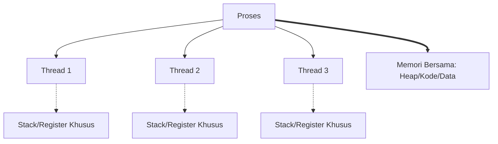
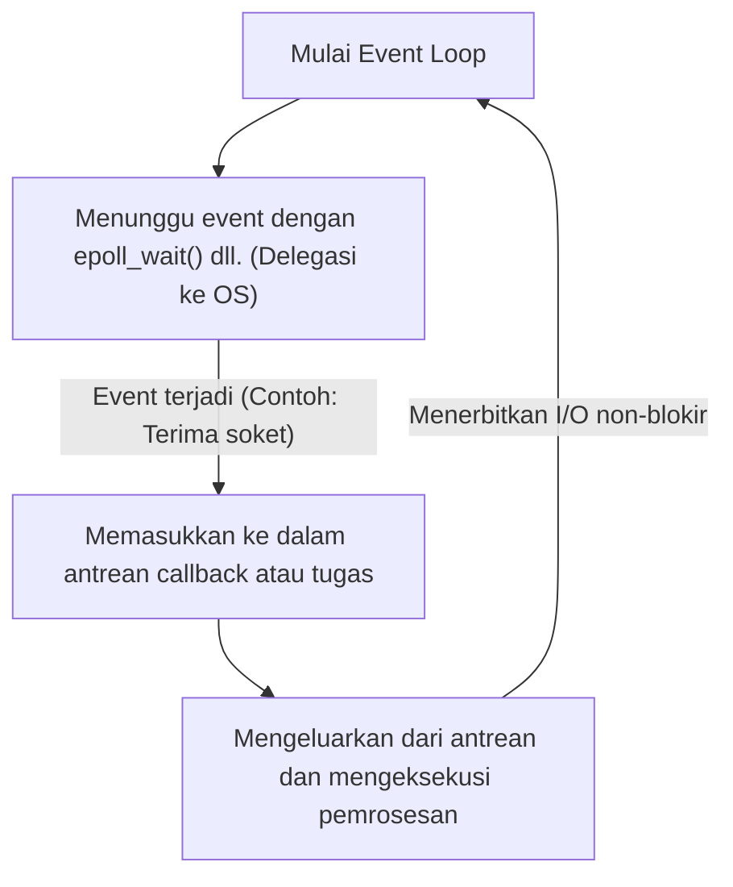

Dalam pengembangan perangkat lunak modern, performa dan skalabilitas adalah tema penting yang tidak dapat dipisahkan. Terutama pada sistem yang menangani server Web lalu lintas tinggi atau komunikasi real-time, "seberapa efisien Anda dapat memproses permintaan" adalah penentu hidup dan matinya sistem.

Untuk mengatasi masalah ini, banyak bahasa pemrograman modern menyediakan sintaks pemrosesan asinkron seperti `async` / `await`. Namun, mengapa pemrosesan asinkron itu diperlukan? Mengapa model sederhana tradisional seperti "mengalokasikan satu thread untuk satu permintaan" memiliki batasan?

Jawabannya berakar dalam pada mekanisme "context switch" pada tingkat kernel OS (Sistem Operasi) beserta harganya, dan batasan arsitektur perangkat keras. Dalam artikel ini, kita akan menggali lebih dalam mulai dari mekanisme manajemen proses dan thread pada OS, biaya perangkat keras dari context switch, masalah C10K, arsitektur event-driven (epoll/kqueue), hingga mekanisme coroutine dan `async/await` di ruang pengguna (user space).

## 1. Dasar Manajemen Proses dan Thread OS

### 1.1 Apa Itu Proses
Proses adalah instansi dari program yang sedang berjalan dan merupakan unit dasar yang dialokasikan sumber dayanya oleh OS. Sebuah proses memiliki ruang memori independen (ruang alamat virtual) dan terisolasi dari proses lainnya. Untuk mengelola proses, OS mempertahankan struktur data yang disebut **PCB (Process Control Block)** di ruang kernel. Di dalam PCB, dicatat ID proses, status register, informasi manajemen memori (seperti pointer ke page table), file descriptor yang terbuka, dan lain-lain.

### 1.2 Kemunculan Thread dan Peringanannya
Pada OS awal, untuk melakukan pemrosesan paralel, perlu dilakukan pembuatan beberapa proses (`fork`). Namun, karena proses memiliki ruang memori yang sepenuhnya independen, terdapat masalah yaitu besarnya biaya pembuatan dan overhead komunikasi antar proses (IPC).

Maka muncullah **thread**. Thread juga disebut "Proses Ringan (Lightweight Process)" dan berbagi ruang memori (heap, data segment, code segment) dengan thread lain dalam proses yang sama. Namun, setiap thread memiliki konteks eksekusi sendiri, yaitu **stack khusus thread** dan **kumpulan register (seperti program counter)**. Informasi manajemen thread disimpan di kernel sebagai **TCB (Thread Control Block)**.



Dengan berbagi memori, biaya pembuatan thread dan komunikasi menurun drastis dibandingkan proses, namun overhead mendasar dari "penjadwalan dan peralihan oleh kernel" tetap ada.

## 2. Harga Sebenarnya dari Context Switch

Dalam OS multitasking, untuk membuatnya tampak seolah-olah beberapa thread dieksekusi secara bersamaan pada core CPU yang terbatas, thread yang dieksekusi dialihkan dengan cepat secara pembagian waktu (time-slicing). Selain itu, ketika sebuah thread menunggu (terblokir) hingga I/O disk atau komunikasi jaringan selesai, OS juga melakukan peralihan untuk menyerahkan CPU ke thread lain. Operasi peralihan ini disebut **Context Switch**.

Context switch sama sekali tidak gratis. Biayanya lebih dari sekadar overhead pemrosesan perangkat lunak, dan memiliki dampak besar pada arsitektur cache perangkat keras.

### 2.1 Penyimpanan dan Pemulihan Register dan Status
Ketika terjadi context switch, CPU menyimpan (menyelamatkan) status register dari thread yang sedang berjalan (seperti program counter, stack pointer, general-purpose register) ke dalam TCB dari thread tersebut atau kernel stack. Kemudian, CPU membaca (memulihkan) status register dari TCB thread berikutnya yang akan dieksekusi. Ini saja membutuhkan biaya dari puluhan hingga ratusan siklus CPU.

### 2.2 Pengosongan TLB (Translation Lookaside Buffer)
Pada kasus context switch antar proses, terdapat biaya yang lebih berat lagi. Itu adalah **Pengosongan (Flush) TLB**. TLB adalah memori sangat cepat di dalam CPU yang menyimpan cache hasil konversi dari alamat virtual ke alamat fisik.
Ketika proses beralih, ruang alamat virtual berubah, sehingga entri TLB dari proses sebelumnya menjadi tidak valid. Oleh karena itu, OS harus mengosongkan (menghapus) TLB, dan segera setelah proses baru mulai mengeksekusi, ia harus merujuk pada page table di memori setiap kali melakukan konversi alamat (page walk), yang menyebabkan penurunan performa yang serius.

### 2.3 Pencemaran dan Pembatalan Cache CPU (L1/L2/L3)
Bahkan pada context switch antar thread (meskipun dalam proses yang sama), **Cache Pollution (Pencemaran Cache)** tetap terjadi. Thread yang baru dijadwalkan akan mengusir data yang ditinggalkan thread sebelumnya di cache, dan mulai memuat datanya sendiri ke cache. Akibatnya, cache miss sering terjadi, dan latensi akses memori meningkat.

Dengan demikian, harga terbesar dari context switch bukanlah "waktu pemrosesan penyimpanan dan pemulihan", melainkan "penurunan performa secara tidak langsung akibat pengaturan ulang (reset) mekanisme optimalisasi pipeline seperti cache CPU dan TLB".

## 3. Masalah C10K dan Batas dari "Thread per Koneksi"

Pada awal populernya internet, server Web (misalnya Apache awal) mengadopsi model **"mengalokasikan satu thread OS (atau proses) untuk satu koneksi jaringan"** (Thread-per-connection).

Model ini memiliki keuntungan karena kode menjadi sangat sederhana. Saat memanggil fungsi untuk membaca data dari jaringan, thread tersebut hanya perlu memblokir (tidur) sampai data tiba.

```c
// Kode semu dari model Thread-per-connection
void handle_connection(int socket) {
    char buffer[1024];
    // Thread ini diblokir (dihentikan) oleh kernel sampai data tiba
    int bytes = read(socket, buffer, 1024); 
    process_data(buffer, bytes);
    write(socket, response);
}
```

Namun, memasuki tahun 2000-an, ketika jumlah koneksi bersamaan mencapai 10.000 (10K), model ini hancur. Ini adalah masalah yang terkenal yaitu **Masalah C10K (10,000 Client Problem)**.

### Alasan Batasan 1: Kehabisan Memori
Saat membuat thread OS, area stack spesifik dialokasikan untuk setiap thread (biasanya, Linux mengalokasikan beberapa MB secara default). Jika Anda membuat 10.000 thread untuk memproses 10.000 koneksi, Anda akan membutuhkan puluhan GB memori hanya untuk stack. Ini adalah ukuran yang tidak realistis untuk perangkat keras saat itu.

### Alasan Batasan 2: Badai Context Switch
Apa yang terjadi jika ada ribuan hingga puluhan ribu thread yang berulang kali terblokir dan bangun menunggu selesainya I/O jaringan? Overhead bagi scheduler kernel untuk menemukan thread berikutnya yang akan dieksekusi akan meningkat, dan selain itu, cache miss akibat context switch yang disebutkan di atas akan sering terjadi. Akibatnya, sebagian besar waktu CPU akan terbuang untuk "peralihan thread (pemrosesan kernel)" dan bukan untuk "pemrosesan aktual".

## 4. Arsitektur Event-Driven dan I/O Non-Blokir

Untuk memecahkan masalah C10K, muncullah model yang menggabungkan **Arsitektur Event-Driven (Event-Driven Architecture)** dengan **I/O Non-Blokir (Non-blocking I/O)**. Nginx, Node.js, Redis, dan lainnya mengadopsi arsitektur ini untuk mencapai performa yang luar biasa.

### 4.1 I/O Non-Blokir
Ketika Anda mengoperasikan soket dalam mode non-blokir, meskipun data belum tiba, kernel tidak akan memblokir thread tersebut dan akan segera mengembalikan error (`EAGAIN` atau `EWOULDBLOCK`). Dengan ini, satu thread tidak perlu berada dalam status tunggu dan dapat melanjutkan pemrosesan lainnya.

### 4.2 Mekanisme Pemberitahuan Event Tingkat Kernel (epoll / kqueue)
Namun, sangat tidak efisien (polling) untuk terus-menerus bertanya "apakah data sudah datang?" kepada puluhan ribu soket non-blokir secara bergantian.

Oleh karena itu, kernel OS menyediakan sistem call yang canggih untuk **I/O Multiplexing**.
- Linux: **`epoll`**
- BSD/macOS: **`kqueue`**
- Windows: **IOCP (I/O Completion Ports)**

Fungsi awal seperti `select` atau `poll` bekerja dengan meneruskan daftar semua file descriptor (FD) yang akan diawasi ke kernel setiap saat, dan kernel akan memindainya dengan kompleksitas O(N).
Sebaliknya, `epoll` menyimpan tabel event di dalam kernel dan hanya mengembalikan daftar FD yang telah mengalami event I/O ke aplikasi, sehingga beroperasi dengan O(1) (lebih tepatnya sebanding dengan jumlah event yang terjadi).

### 4.3 Lahirnya Event Loop
Dengan ini, menjadi mungkin untuk menangani puluhan ribu koneksi secara efisien hanya dengan satu thread (atau jumlah thread yang sedikit sebanding dengan jumlah core CPU). Inilah yang disebut **Event Loop**.



Event loop terus memutar siklus "bertanya event kepada OS" → "mengeksekusi pemrosesan (callback) yang sesuai dengan event yang terjadi". Dengan ini, context switch yang berat di tingkat OS dapat dihilangkan, dan sumber daya CPU dapat digunakan hingga batas maksimum.

## 5. Coroutine Ruang Pengguna dan async/await

Meskipun arsitektur event-driven adalah solusi sempurna dalam hal performa, hal ini membawa penderitaan besar bagi para programmer. Itu adalah **Callback Hell (Neraka Callback)**.

Mereka harus mendaftarkan fungsi callback setiap kali ada operasi I/O, yang memecah alur eksekusi kode dan membuat penanganan error serta manajemen status yang kompleks menjadi sulit.

### 5.1 Memindahkan Coroutine dan Context Switch ke Ruang Pengguna
Untuk mengatasi kerumitan ini dengan tetap mempertahankan performa, konsep "**Coroutine**" atau "**Green Thread**" menjadi populer. Contoh tipikal adalah Goroutine pada bahasa Go.

Ini adalah "thread ringan yang dikelola di ruang pengguna (sisi program)" yang berjalan di atas kernel thread OS.
Ketika sebuah coroutine sedang menunggu I/O, ia tidak mengembalikan kontrol ke kernel (memblokir), melainkan **scheduler ruang pengguna (runtime)** akan menyimpan status eksekusi coroutine tersebut dan beralih ke coroutine lain.

Peralihan di ruang pengguna ini tidak melibatkan context switch OS, tidak menyebabkan perpindahan ke mode istimewa (system call), maupun pengosongan TLB, sehingga selesai dengan biaya yang sangat rendah, berkisar dari beberapa nanodetik hingga puluhan nanodetik.

### 5.2 Keajaiban async/await: Transformasi Mesin Status oleh Kompiler
Lebih lanjut, banyak bahasa pemrograman modern (C#, JavaScript/TypeScript, Python, Rust, dll.) telah memperkenalkan `async` dan `await`, yang mengintegrasikan pemrosesan asinkron ini sebagai sintaks bahasa.

Kekuatan sejati dari `async/await` terletak pada kenyataan bahwa **"kode yang ditulis secara sinkron (dari atas ke bawah) untuk manusia, di belakang layar diubah oleh kompiler menjadi mesin status (state machine) dan diintegrasikan dengan event loop"**.

Ketika kata kunci `await` muncul, thread sebenarnya tidak berhenti di sana.
1. Status fungsi saat ini (seperti variabel lokal) disimpan dalam objek di heap (seperti Future atau Promise).
2. Pemrosesan I/O didaftarkan ke event loop (atau epoll).
3. Eksekusi fungsi dihentikan sementara (`yield`), dan kontrol dikembalikan ke event loop atau pemanggil fungsi.
4. Ketika I/O selesai, event loop mendeteksinya dan melanjutkan eksekusi fungsi (`resume`) dari status yang tersimpan.

```rust
// Gambaran pemrosesan asinkron di Rust
async fn fetch_data() -> Result<Data, Error> {
    // Memulai koneksi jaringan secara asinkron
    let mut stream = TcpStream::connect("example.com").await?; 
    // Pada .await di atas, fungsi sebenarnya dihentikan dan kembali ke event loop.
    // Ketika koneksi berhasil dibuat, eksekusi dilanjutkan dari sini.
    
    let mut buffer = Vec::new();
    // Membaca data. Ini juga asinkron dan tidak memblokir.
    stream.read_to_end(&mut buffer).await?;
    
    Ok(parse(buffer))
}
```

Pada bahasa yang menjanjikan zero-cost abstraction seperti Rust, fungsi `async` sepenuhnya diubah menjadi mesin status berbasis `enum` yang menyimpan status pada saat kompilasi. Bahkan alokasi memori dinamis diminimalkan seminimal mungkin, menghasilkan performa ekstrem.

## 6. Tantangan Pemrosesan Asinkron: "Fungsi Berwarna (What Color is Your Function?)"

`async/await` memang kuat, tetapi bukan peluru perak. Tantangan arsitektur yang paling terkenal adalah "masalah penamaan warna fungsi".

Untuk menggunakan `await` di dalam fungsi asinkron (anggaplah fungsi merah), fungsi pemanggil juga harus merupakan fungsi asinkron (merah). Anda tidak dapat memanggil fungsi asinkron secara langsung dari fungsi sinkron (fungsi biru) dan menunggu hasilnya.
Hal ini menyebabkan masalah di mana keseluruhan basis kode terbelah menjadi "dunia sinkron" dan "dunia asinkron".

Selain itu, jika proses CPU-bound (komputasi berat) dijalankan dalam waktu lama di dalam fungsi `async`, hal itu akan memblokir event loop itu sendiri, yang membawa risiko menyebabkan bug fatal di mana semua tugas asinkron lainnya berhenti (Starvation). Di dunia asinkron, "terblokir karena menunggu I/O" diperbolehkan, namun "memonopoli loop untuk komputasi CPU" sangat dilarang.

## 7. Kesimpulan

Di balik sintaks sederhana `async` / `await` yang kita gunakan dengan santai, tersimpan sejarah optimalisasi selama puluhan tahun dalam ilmu komputer.

- Untuk menghindari **context switch perangkat keras yang mahal** (Pengosongan TLB, cache miss).
- Untuk menghemat **sumber daya memori yang cepat habis (stack thread)**.
- Untuk mengeluarkan potensi penuh dari **epoll/kqueue** pada kernel.
- Dan untuk **membebaskan pengembang** dari kerumitan callback asinkron.

Bermula dari keterbatasan proses OS dan manajemen thread, berkembang menjadi arsitektur event-driven, dan hasil dari abstraksi dengan kekuatan kompiler adalah `async/await` modern. Dengan memahami mekanisme mendalam ini, Anda akan dapat merancang sistem yang lebih berkinerja tinggi, aman, dan dapat diskalakan.
