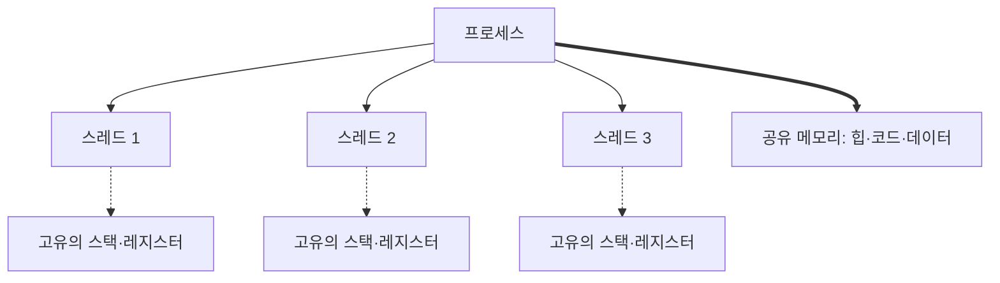
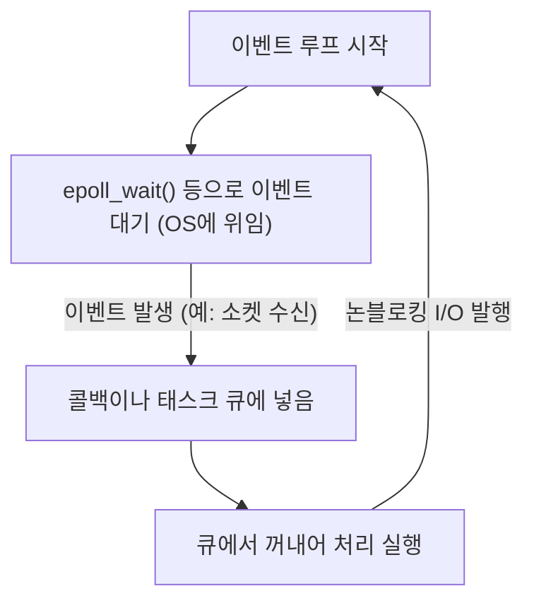

현대 소프트웨어 개발에 있어 성능과 확장성은 떼려야 뗄 수 없는 중요한 주제입니다. 특히 트래픽이 많은 웹 서버나 실시간 통신을 다루는 시스템에서는 '얼마나 효율적으로 요청을 처리하는가'가 시스템의 생사를 가릅니다.

이 문제에 대처하기 위해, 현대의 많은 프로그래밍 언어는 `async` / `await`와 같은 비동기 처리 구문을 제공합니다. 하지만 왜 비동기 처리가 필요한 걸까요? 왜 과거처럼 '1개의 요청에 1개의 스레드를 할당한다'는 단순한 모델에는 한계가 있는 걸까요?

그 해답은 OS(운영체제)의 커널 수준에 있는 '컨텍스트 스위치'의 구조와 그 대가, 그리고 하드웨어 아키텍처의 제약에 깊게 뿌리내리고 있습니다. 본 문서에서는 OS의 프로세스 및 스레드 관리 기구에서 시작하여 컨텍스트 스위치의 하드웨어적 비용, C10K 문제, 이벤트 기반 아키텍처(epoll/kqueue), 그리고 유저 공간(user space)에서의 코루틴과 `async/await`의 작동 원리까지 깊이 파고들어 해설합니다.

## 1. OS 프로세스와 스레드 관리의 기초

### 1.1 프로세스란 무엇인가
프로세스란 실행 중인 프로그램의 인스턴스이며, OS가 리소스를 할당하는 기본 단위입니다. 프로세스는 독립된 메모리 공간(가상 주소 공간)을 가지며, 다른 프로세스로부터 격리되어 있습니다. 프로세스를 관리하기 위해 OS는 **PCB(Process Control Block)**라는 데이터 구조를 커널 공간에 유지합니다. PCB에는 프로세스 ID, 레지스터 상태, 메모리 관리 정보(페이지 테이블에 대한 포인터 등), 열려 있는 파일 디스크립터 등이 기록됩니다.

### 1.2 스레드의 등장과 경량화
초기 OS에서는 병행 처리를 수행하기 위해 여러 프로세스를 생성(`fork`)해야 했습니다. 하지만 프로세스는 완전히 독립된 메모리 공간을 가지므로, 생성 비용이나 프로세스 간 통신(IPC)의 오버헤드가 크다는 과제가 있었습니다.

그래서 등장한 것이 **스레드**입니다. 스레드는 '경량 프로세스(Lightweight Process)'라고도 불리며, 동일 프로세스 내의 다른 스레드와 메모리 공간(힙, 데이터 세그먼트, 코드 세그먼트)을 공유합니다. 단, 각 스레드는 고유의 실행 컨텍스트, 즉 **스레드 고유의 스택**과 **레지스터 세트(프로그램 카운터 등)**를 갖습니다. 스레드의 관리 정보는 **TCB(Thread Control Block)**로서 커널에 유지됩니다.



메모리를 공유함으로써 스레드 생성 및 통신 비용은 프로세스에 비해 대폭 낮아졌지만, 여전히 '커널에 의한 스케줄링 및 전환'이라는 근본적인 오버헤드는 계속 존재합니다.

## 2. 컨텍스트 스위치의 진정한 대가

멀티태스킹 OS에서는 제한된 CPU 코어에서 여러 스레드를 동시에 실행하는 것처럼 보이기 위해 시분할(타임 슬라이스)로 실행할 스레드를 빠르게 전환합니다. 또한, 스레드가 디스크 I/O나 네트워크 통신 완료를 기다리며 차단(block)될 때도 OS는 CPU를 다른 스레드에 양보하기 위해 전환을 수행합니다. 이 전환 작업을 **컨텍스트 스위치(Context Switch)**라고 부릅니다.

컨텍스트 스위치는 결코 공짜가 아닙니다. 그 대가는 단순한 소프트웨어 처리 오버헤드를 넘어 하드웨어 캐시 아키텍처에 큰 영향을 미칩니다.

### 2.1 레지스터 및 상태의 대피와 복원
컨텍스트 스위치가 발생하면 CPU는 현재 실행 중인 스레드의 레지스터 상태(프로그램 카운터, 스택 포인터, 범용 레지스터 등)를 해당 스레드의 TCB나 커널 스택에 저장(대피)합니다. 그리고 다음에 실행할 스레드의 TCB에서 레지스터 상태를 읽어(복원)옵니다. 이 작업만으로도 수십에서 수백 사이클의 비용이 발생합니다.

### 2.2 TLB(Translation Lookaside Buffer) 플러시
프로세스 간 컨텍스트 스위치의 경우 더 큰 비용이 발생합니다. 바로 **TLB 플러시**입니다. TLB는 가상 주소에서 물리 주소로의 변환 결과를 캐시하는 CPU 내의 초고속 메모리입니다.
프로세스가 전환되면 가상 주소 공간이 바뀌므로, 이전 프로세스의 TLB 엔트리는 무효화됩니다. 따라서 OS는 TLB를 플러시(초기화)해야 하며, 새로운 프로세스가 실행을 재개한 직후에는 주소 변환을 위해 매번 메모리 상의 페이지 테이블을 참조(페이지 워크)해야 하므로 심각한 성능 저하를 초래합니다.

### 2.3 CPU 캐시(L1/L2/L3) 오염과 무효화
스레드 간 컨텍스트 스위치일지라도(동일 프로세스 내라 하더라도) **캐시 폴루션(캐시 오염)**이 발생합니다. 새로 스케줄링된 스레드는 이전 스레드가 캐시에 남겨둔 데이터를 밀어내고 자신의 데이터를 캐시에 읽어 들이기 시작합니다. 이로 인해 캐시 미스가 빈발하여 메모리 접근 레이턴시가 증가합니다.

이처럼 컨텍스트 스위치의 가장 큰 대가는 '대피와 복원에 드는 처리 시간'이 아니라, 'CPU 캐시나 TLB 같은 파이프라인 최적화 메커니즘이 리셋됨에 따른 간접적인 성능 저하'인 것입니다.

## 3. C10K 문제와 '스레드 퍼 커넥션'의 한계

인터넷 보급 초기, 웹 서버(예: 초기 Apache)는 **'1개의 네트워크 연결에 1개의 OS 스레드(또는 프로세스)를 할당한다'**는 모델(Thread-per-connection)을 채택했습니다.

이 모델은 코드가 매우 단순해진다는 장점이 있었습니다. 함수를 호출하여 네트워크에서 데이터를 읽어 들일 때, 데이터가 도착할 때까지 해당 스레드는 단순히 차단(sleep)되면 그만이기 때문입니다.

```c
// Thread-per-connection 모델의 의사 코드
void handle_connection(int socket) {
    char buffer[1024];
    // 데이터가 올 때까지 이 스레드는 커널에 의해 차단(정지)된다
    int bytes = read(socket, buffer, 1024); 
    process_data(buffer, bytes);
    write(socket, response);
}
```

하지만 2000년대에 들어 동시 접속자 수가 1만 대(10K)에 달하게 되자 이 모델은 파탄 났습니다. 이것이 유명한 **C10K 문제(10,000 Client Problem)**입니다.

### 한계의 이유 1: 메모리 고갈
OS 스레드를 생성하면 각 스레드에 고유한 스택 영역(일반적으로 Linux의 경우 기본적으로 수 MB)이 할당됩니다. 1만 개의 연결을 처리하기 위해 1만 개의 스레드를 만들면 스택에만 수십 GB의 메모리가 필요해집니다. 당시 하드웨어로서는 비현실적인 크기였습니다.

### 한계의 이유 2: 컨텍스트 스위치의 폭풍
수천에서 수만 개의 스레드가 존재하고 그들이 네트워크 I/O 완료를 기다리며 차단과 깨어남을 반복하면 어떻게 될까요? 커널 스케줄러는 다음에 실행할 스레드를 찾기 위한 오버헤드가 증가하고, 앞서 언급한 컨텍스트 스위치에 의한 캐시 미스가 빈발합니다. 결과적으로 CPU 시간의 대부분이 '실제 처리'가 아닌 '스레드 전환(커널 처리)'에 낭비되게 됩니다.

## 4. 이벤트 기반 아키텍처와 논블로킹 I/O

C10K 문제를 해결하기 위해 등장한 것이 **이벤트 기반 아키텍처(Event-Driven Architecture)**와 **논블로킹 I/O**를 결합한 모델입니다. Nginx, Node.js, Redis 등이 이 아키텍처를 채택하여 압도적인 성능을 구현했습니다.

### 4.1 논블로킹 I/O
논블로킹 모드로 소켓을 조작하면 데이터가 아직 도착하지 않은 경우에도 커널은 스레드를 차단하지 않고 즉시 에러(`EAGAIN`이나 `EWOULDBLOCK`)를 반환합니다. 이를 통해 하나의 스레드가 대기 상태에 빠지지 않고 다른 처리를 계속할 수 있습니다.

### 4.2 커널 수준의 이벤트 알림 기구 (epoll / kqueue)
하지만 수만 개의 논블로킹 소켓을 향해 순서대로 '데이터가 왔습니까?'라고 계속 묻는(폴링하는) 것은 극히 비효율적입니다.

그래서 OS 커널은 **I/O 멀티플렉싱(I/O Multiplexing)**을 위한 고도의 시스템 콜을 제공했습니다.
- Linux: **`epoll`**
- BSD/macOS: **`kqueue`**
- Windows: **IOCP (I/O Completion Ports)**

초기의 `select`나 `poll`은 감시 대상인 모든 파일 디스크립터(FD) 목록을 매번 커널에 전달하고, 커널이 이를 O(N)으로 스캔하는 구조였습니다.
반면 `epoll`은 커널 내에 이벤트 테이블을 유지하고 I/O 이벤트가 발생한 FD 목록만을 애플리케이션에 반환하므로 O(1)(정확히는 발생한 이벤트 수에 비례)로 작동합니다.

### 4.3 이벤트 루프의 탄생
이로써 1개의 스레드(또는 CPU 코어 수와 동일한 소수의 스레드)로 수만 개의 연결을 효율적으로 처리할 수 있게 되었습니다. 이것이 **이벤트 루프(Event Loop)**입니다.



이벤트 루프는 그저 묵묵히 'OS에 이벤트를 묻는다' → '발생한 이벤트에 해당하는 처리(콜백)를 실행한다'는 사이클을 계속 돌립니다. 이로 인해 OS 수준의 무거운 컨텍스트 스위치를 배제하고 CPU 리소스를 한계까지 사용할 수 있게 되었습니다.

## 5. 유저 공간 코루틴과 async/await

이벤트 기반 아키텍처는 성능 면에서 완벽한 해결책이었지만, 프로그래머에게 큰 고통을 안겨주었습니다. 바로 **콜백 지옥(Callback Hell)**입니다.

I/O 조작 때마다 콜백 함수를 등록해야 했고, 코드의 실행 흐름이 끊기며 에러 핸들링과 복잡한 상태 관리가 어려워졌습니다.

### 5.1 코루틴과 컨텍스트 스위치의 유저 공간으로의 이동
이러한 복잡성을 해결하면서도 성능을 유지하기 위해 '**코루틴(Coroutine)**' 또는 '**그린 스레드(Green Thread)**'라는 개념이 널리 퍼졌습니다. Go 언어의 Goroutine 등이 대표적입니다.

이들은 OS의 커널 스레드 위에서 동작하는 '유저랜드(프로그램 측)에서 관리되는 경량 스레드'입니다.
어떤 코루틴이 I/O 대기 상태가 되면, 커널로 제어권을 돌려주는(차단하는) 것이 아니라, **유저 공간의 스케줄러(런타임)**가 해당 코루틴의 실행 상태를 저장하고 다른 코루틴으로 전환합니다.

이 유저 공간에서의 전환은 OS의 컨텍스트 스위치를 동반하지 않으며, 특권 모드로의 전환(시스템 콜)이나 TLB 플러시도 발생하지 않으므로 수 나노초에서 수십 나노초라는 극히 낮은 비용으로 완료됩니다.

### 5.2 async/await의 마법: 컴파일러에 의한 상태 머신 변환
게다가 많은 현대 언어(C#, JavaScript/TypeScript, Python, Rust 등)는 이러한 비동기 처리를 언어 구문으로 통합한 `async`와 `await`를 도입했습니다.

`async/await`의 진정한 힘은 **'사람에게는 동기적으로(위에서 아래로) 쓰인 코드를, 컴파일러가 이면에서 상태 머신(State Machine)으로 변환하여 이벤트 루프와 통합해 준다'**는 점에 있습니다.

`await` 키워드가 나타난다고 해서 실제로 그곳에서 스레드가 정지하는 것은 아닙니다.
1. 현재 함수의 상태(지역 변수 등)가 힙 상의 객체(Future나 Promise 등)에 저장됩니다.
2. I/O 처리가 이벤트 루프(또는 epoll)에 등록됩니다.
3. 함수 실행은 일단 중단(`yield`)되고, 제어권이 이벤트 루프나 호출자에게 돌아갑니다.
4. I/O가 완료되면 이벤트 루프가 이를 감지하고, 저장되어 있던 상태로부터 함수 실행을 재개(`resume`)합니다.

```rust
// Rust의 비동기 처리 이미지
async fn fetch_data() -> Result<Data, Error> {
    // 네트워크 연결을 비동기로 시작
    let mut stream = TcpStream::connect("example.com").await?; 
    // 위의 .await에서 실제로는 함수가 중단되고 이벤트 루프로 돌아간다.
    // 연결이 확립되면 여기부터 실행이 재개된다.
    
    let mut buffer = Vec::new();
    // 데이터 읽기. 이 역시 비동기이며 차단하지 않는다.
    stream.read_to_end(&mut buffer).await?;
    
    Ok(parse(buffer))
}
```

Rust처럼 제로 비용 추상화를 표방하는 언어에서는 `async` 함수가 컴파일 시에 상태를 가지는 `enum` 기반 상태 머신으로 완전히 변환됩니다. 동적인 메모리 할당조차 최소화되어 극한의 성능을 발휘합니다.

## 6. 비동기 처리의 과제: '색깔 있는 함수 (What Color is Your Function?)'

`async/await`는 강력하지만 은탄환은 아닙니다. 가장 잘 알려진 아키텍처 상의 과제가 '함수의 색 지정 문제'입니다.

비동기 함수(빨간색 함수라고 합시다) 안에서 `await`하기 위해서는 호출자 함수 역시 비동기 함수(빨간색)여야만 합니다. 동기 함수(파란색 함수)에서 비동기 함수를 직접 호출하여 결과를 기다릴 수는 없습니다.
이로 인해 코드베이스 전체가 '동기 세계'와 '비동기 세계'로 분단되어 버린다는 문제가 발생합니다.

나아가 CPU 바운드(계산 집약적) 처리를 `async` 함수 내에서 장시간 실행해 버리면, 이벤트 루프 자체를 차단하여 다른 모든 비동기 태스크가 정지해 버리는(기아 상태, Starvation) 중대한 버그를 일으킬 위험성도 있습니다. 비동기 세계에서는 'I/O 대기로 차단하는 것'은 허용되지만 'CPU 계산으로 루프를 독점하는 것'은 엄금해야 합니다.

## 7. 결론

우리가 무심코 사용하는 `async` / `await`라는 간결한 구문 이면에는 컴퓨터 과학에 있어서 수십 년간의 최적화 역사가 담겨 있습니다.

- **고비용 하드웨어적 컨텍스트 스위치**(TLB 플러시, 캐시 미스)를 피하기 위해.
- 고갈되는 **메모리 리소스(스레드 스택)**를 절약하기 위해.
- 커널의 **epoll/kqueue**의 힘을 끌어내기 위해.
- 그리고 비동기 콜백의 복잡성으로부터 **개발자를 해방하기** 위해.

OS의 프로세스 및 스레드 관리의 한계에서 태어나 이벤트 기반 아키텍처로 진화하고, 컴파일러의 힘으로 추상화된 결과가 현대의 `async/await`입니다. 이 깊은 메커니즘을 이해함으로써 더 성능이 뛰어나고 안전하며 확장 가능한 시스템을 설계할 수 있게 될 것입니다.
