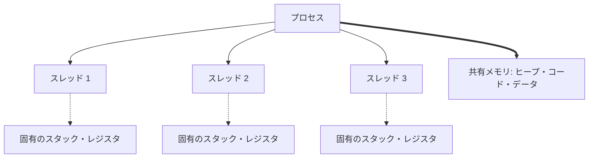
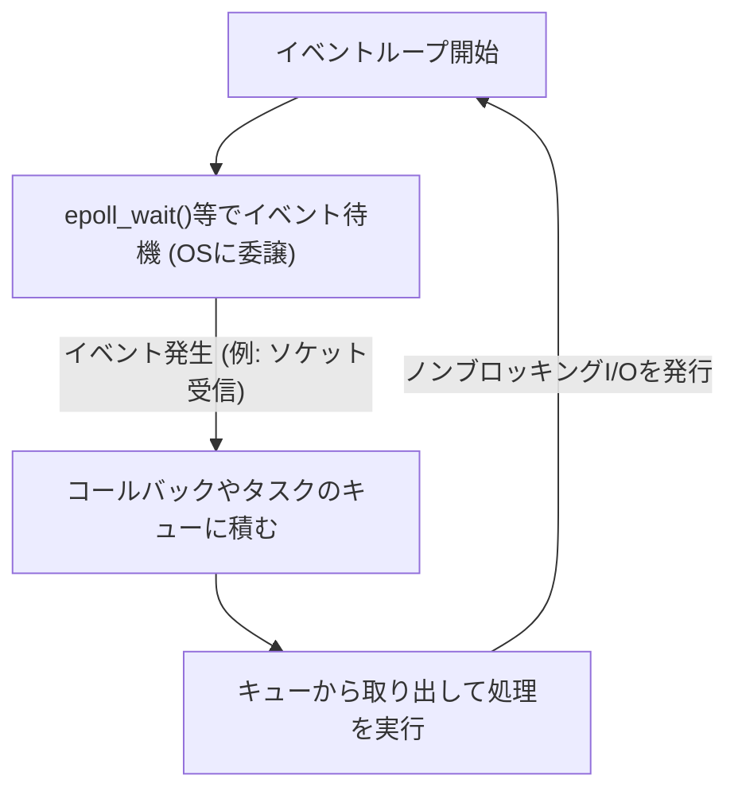

現代のソフトウェア開発において、パフォーマンスとスケーラビリティは切り離せない重要なテーマです。特に、高トラフィックなWebサーバーやリアルタイム通信を扱うシステムでは、「いかに効率よくリクエストを処理するか」がシステムの生死を分けます。

この問題に対処するため、現代のプログラミング言語の多くは `async` / `await` といった非同期処理の構文を提供しています。しかし、なぜ非同期処理が必要なのでしょうか？なぜ従来のように「1つのリクエストに対して1つのスレッドを割り当てる」というシンプルなモデルでは限界があるのでしょうか？

その答えは、OS（オペレーティングシステム）のカーネルレベルにおける「コンテキストスイッチ」の仕組みとその代償、そしてハードウェアアーキテクチャの制約に深く根ざしています。本記事では、OSのプロセスとスレッドの管理機構から始まり、コンテキストスイッチのハードウェア的なコスト、C10K問題、イベント駆動アーキテクチャ（epoll/kqueue）、そしてユーザー空間でのコルーチンと `async/await` の仕組みまでを深く掘り下げて解説します。

## 1. OSのプロセスとスレッド管理の基礎

### 1.1 プロセスとは何か
プロセスとは、実行中のプログラムのインスタンスであり、OSがリソースを割り当てる基本単位です。プロセスは独立したメモリ空間（仮想アドレス空間）を持ち、他のプロセスから隔離されています。プロセスを管理するために、OSは **PCB (Process Control Block)** と呼ばれるデータ構造をカーネル空間に保持しています。PCBには、プロセスID、レジスタの状態、メモリ管理情報（ページテーブルへのポインタなど）、開いているファイルディスクリプタなどが記録されています。

### 1.2 スレッドの登場と軽量化
初期のOSでは、並行処理を行うためには複数のプロセスを生成（`fork`）する必要がありました。しかし、プロセスは完全に独立したメモリ空間を持つため、生成コストやプロセス間通信（IPC）のオーバーヘッドが大きいという課題がありました。

そこで登場したのが**スレッド**です。スレッドは「軽量プロセス (Lightweight Process)」とも呼ばれ、同じプロセス内の他のスレッドとメモリ空間（ヒープ、データセグメント、コードセグメント）を共有します。ただし、各スレッドは独自の実行コンテキスト、つまり**スレッド固有のスタック**と**レジスタセット（プログラムカウンタなど）**を持ちます。スレッドの管理情報は **TCB (Thread Control Block)** としてカーネルに保持されます。



メモリを共有することでスレッド生成や通信のコストはプロセスに比べて大幅に下がりましたが、それでも「カーネルによるスケジュールと切り替え」という根本的なオーバーヘッドは存在し続けます。

## 2. コンテキストスイッチの真の代償

マルチタスクOSでは、限られたCPUコアで複数のスレッドを同時に実行しているように見せるため、時分割（タイムスライス）で実行するスレッドを高速に切り替えています。また、スレッドがディスクI/Oやネットワーク通信の完了を待つ（ブロックする）際にも、OSはCPUを他のスレッドに譲るために切り替えを行います。この切り替え作業を **コンテキストスイッチ (Context Switch)** と呼びます。

コンテキストスイッチは決して無料（タダ）ではありません。その代償は、単なるソフトウェア処理のオーバーヘッドを超え、ハードウェアのキャッシュアーキテクチャに大きな影響を与えます。

### 2.1 レジスタと状態の退避・復元
コンテキストスイッチが発生すると、CPUは現在実行中のスレッドのレジスタ状態（プログラムカウンタ、スタックポインタ、汎用レジスタなど）をそのスレッドの TCB またはカーネルスタックに保存（退避）します。そして、次に実行するスレッドの TCB からレジスタ状態を読み込み（復元）ます。これだけでも数十から数百サイクルのコストがかかります。

### 2.2 TLB (Translation Lookaside Buffer) のフラッシュ
プロセス間のコンテキストスイッチの場合、さらに重いコストが発生します。それは **TLBのフラッシュ** です。TLBは、仮想アドレスから物理アドレスへの変換結果をキャッシュするCPU内の超高速なメモリです。
プロセスが切り替わると、仮想アドレス空間が変わるため、以前のプロセスのTLBエントリは無効になります。そのため、OSはTLBをフラッシュ（クリア）しなければならず、新しいプロセスが実行を再開した直後は、アドレス変換のために毎回メモリ上のページテーブルを参照する（ページウォーク）必要があり、深刻なパフォーマンス低下を招きます。

### 2.3 CPUキャッシュ (L1/L2/L3) の汚染と無効化
スレッド間のコンテキストスイッチであっても（同じプロセス内であっても）、**キャッシュ・ポリューション（キャッシュ汚染）** が発生します。新しくスケジュールされたスレッドは、前のスレッドがキャッシュに残したデータを追い出し、自身のデータをキャッシュに読み込み始めます。これにより、キャッシュミスが頻発し、メモリアクセスのレイテンシが増大します。

このように、コンテキストスイッチの最大の代償は「退避と復元の処理時間」ではなく、「CPUのキャッシュやTLBといったパイプライン最適化メカニズムがリセットされることによる間接的なパフォーマンス低下」なのです。

## 3. C10K問題と「スレッド・パー・コネクション」の限界

インターネットの普及初期、Webサーバー（例えば初期のApache）は **「1つのネットワーク接続に対して1つのOSスレッド（またはプロセス）を割り当てる」** というモデル（Thread-per-connection）を採用していました。

このモデルは、コードが非常にシンプルになるという利点がありました。関数を呼び出してネットワークからデータを読み込む際、データが届くまでそのスレッドは単にブロック（スリープ）していれば良いからです。

```c
// Thread-per-connectionモデルの疑似コード
void handle_connection(int socket) {
    char buffer[1024];
    // データが来るまでこのスレッドはカーネルによってブロック（停止）される
    int bytes = read(socket, buffer, 1024); 
    process_data(buffer, bytes);
    write(socket, response);
}
```

しかし、2000年代に入り、同時接続数が1万台（10K）に達するようになると、このモデルは破綻しました。これが有名な **C10K問題 (10,000 Client Problem)** です。

### 限界の理由1：メモリの枯渇
OSのスレッドを作成すると、各スレッドに固有のスタック領域（通常、Linuxではデフォルトで数MB）が割り当てられます。1万個の接続を処理するために1万個のスレッドを作ると、スタックだけで数十GBのメモリが必要になります。当時のハードウェアにとっては非現実的なサイズでした。

### 限界の理由2：コンテキストスイッチの嵐
数千から数万のスレッドが存在し、それらがネットワークI/Oの完了を待ってブロックと起床を繰り返すとどうなるでしょうか。カーネルのスケジューラは、次に実行すべきスレッドを探すためのオーバーヘッドが増大し、さらに前述したコンテキストスイッチによるキャッシュミスが頻発します。結果として、CPU時間の大部分が「実際の処理」ではなく「スレッドの切り替え（カーネル処理）」に浪費されることになります。

## 4. イベント駆動アーキテクチャとノンブロッキングI/O

C10K問題を解決するために登場したのが **イベント駆動アーキテクチャ (Event-Driven Architecture)** と **ノンブロッキングI/O** を組み合わせたモデルです。NginxやNode.js、Redisなどがこのアーキテクチャを採用して圧倒的なパフォーマンスを実現しました。

### 4.1 ノンブロッキングI/O
ノンブロッキングモードでソケットを操作すると、データがまだ到着していない場合でも、カーネルはスレッドをブロックさせず、即座にエラー（`EAGAIN` や `EWOULDBLOCK`）を返します。これにより、1つのスレッドが待機状態にならず、他の処理を続けることができます。

### 4.2 カーネルレベルのイベント通知機構 (epoll / kqueue)
しかし、数万のノンブロッキングソケットに対して、順番に「データは来ましたか？」と尋ね続ける（ポーリングする）のは非効率の極みです。

そこで、OSカーネルは**I/O多重化 (I/O Multiplexing)** のための高度なシステムコールを提供しました。
- Linux: **`epoll`**
- BSD/macOS: **`kqueue`**
- Windows: **IOCP (I/O Completion Ports)**

初期の `select` や `poll` は、監視対象のすべてのファイルディスクリプタ（FD）のリストを毎回カーネルに渡し、カーネルがそれを O(N) でスキャンする仕組みでした。
対して `epoll` は、カーネル内にイベントテーブルを保持し、I/Oイベントが発生したFDのリストだけをアプリケーションに返すため、O(1) （正確には発生したイベント数に比例）で動作します。

### 4.3 イベントループの誕生
これにより、1つのスレッド（またはCPUコア数と同数の少数のスレッド）で、数万の接続を効率的に捌けるようになりました。これが **イベントループ (Event Loop)** です。



イベントループは、ただひたすらに「OSにイベントを尋ねる」→「発生したイベントに対応する処理（コールバック）を実行する」というサイクルを回し続けます。これにより、OSレベルの重いコンテキストスイッチを排除し、CPUリソースを限界まで使い切ることができるようになりました。

## 5. ユーザー空間のコルーチンと async/await

イベント駆動アーキテクチャはパフォーマンスの面で完璧な解決策でしたが、プログラマに大きな苦痛をもたらしました。それが **コールバック地獄 (Callback Hell)** です。

I/O操作のたびにコールバック関数を登録しなければならず、コードの実行フローが分断され、エラーハンドリングや複雑な状態管理が困難になりました。

### 5.1 コルーチンとコンテキストスイッチのユーザー空間への移動
この複雑さを解決しつつ、パフォーマンスを維持するために「**コルーチン (Coroutine)**」または「**グリーンスレッド (Green Thread)**」という概念が普及しました。Go言語のGoroutineなどが代表的です。

これらは、OSのカーネルスレッド上で動作する「ユーザーランド（プログラム側）で管理される軽量なスレッド」です。
あるコルーチンがI/O待ちになると、カーネルに制御を戻す（ブロックする）のではなく、**ユーザー空間のスケジューラ（ランタイム）** がそのコルーチンの実行状態を保存し、別のコルーチンに切り替えます。

このユーザー空間での切り替えは、OSのコンテキストスイッチを伴わず、特権モードへの移行（システムコール）やTLBのフラッシュも発生しないため、数ナノ秒から数十ナノ秒という極めて低いコストで完了します。

### 5.2 async/await の魔法：コンパイラによるステートマシン変換
さらに、多くの現代言語（C#, JavaScript/TypeScript, Python, Rust など）は、この非同期処理を言語構文として統合した `async` と `await` を導入しました。

`async/await` の真の力は、**「人間にとっては同期的に（上から下へ）書かれているコードを、コンパイラが裏側でステートマシン（状態遷移機械）に変換し、イベントループと統合してくれる」** という点にあります。

`await` キーワードが現れると、実際にはそこでスレッドが停止するわけではありません。
1. 現在の関数の状態（ローカル変数など）がヒープ上のオブジェクト（FutureやPromiseなど）に保存されます。
2. I/O処理がイベントループ（またはepoll）に登録されます。
3. 関数の実行は一旦中断（`yield`）され、制御がイベントループや呼び出し元に戻ります。
4. I/Oが完了すると、イベントループがそれを検知し、保存されていた状態から関数の実行を再開（`resume`）します。

```rust
// Rustの非同期処理のイメージ
async fn fetch_data() -> Result<Data, Error> {
    // ネットワーク接続を非同期で開始
    let mut stream = TcpStream::connect("example.com").await?; 
    // 上の .await で、実際には関数が中断し、イベントループに戻る。
    // 接続が確立されると、ここから実行が再開される。
    
    let mut buffer = Vec::new();
    // データの読み込み。これも非同期でありブロックしない。
    stream.read_to_end(&mut buffer).await?;
    
    Ok(parse(buffer))
}
```

Rustのようなゼロコスト抽象化を掲げる言語では、`async` 関数はコンパイル時に、状態を持つ `enum` ベースのステートマシンに完全に変換されます。動的なメモリ割り当てすら最小限に抑えられ、極限のパフォーマンスを発揮します。

## 6. 非同期処理の課題：「色のついた関数 (What Color is Your Function?)」

`async/await` は強力ですが、銀の弾丸ではありません。最もよく知られるアーキテクチャ上の課題が「関数の色付け問題」です。

非同期関数（赤色の関数とします）の中で `await` するためには、呼び出し元の関数もまた非同期関数（赤色）でなければなりません。同期関数（青色の関数）から非同期関数を直接呼び出して結果を待つことはできません。
これにより、コードベース全体が「同期の世界」と「非同期の世界」に分断されてしまうという問題が発生します。

さらに、CPUバウンド（計算集約型）の処理を `async` 関数内で長時間実行してしまうと、イベントループ自体をブロックしてしまい、他のすべての非同期タスクが停止してしまう（Starvation）という重大なバグを引き起こす危険性もあります。非同期の世界では、「I/O待ちでブロックする」ことは許されますが、「CPU計算でループを専有する」ことは厳禁なのです。

## 7. 結論

私たちが何気なく使っている `async` / `await` という簡潔な構文の裏には、コンピュータサイエンスにおける数十年間の最適化の歴史が詰まっています。

- **高コストなハードウェア的コンテキストスイッチ**（TLBフラッシュ、キャッシュミス）を避けるために。
- 枯渇する **メモリリソース（スレッドスタック）** を節約するために。
- カーネルの **epoll/kqueue** の力を引き出すために。
- そして、非同期コールバックの複雑さから **開発者を解放する** ために。

OSのプロセスとスレッド管理の限界から生まれ、イベント駆動アーキテクチャへと進化し、コンパイラの力で抽象化された結果が、現代の `async/await` です。この深いメカニズムを理解することで、よりパフォーマンスが高く、安全でスケーラブルなシステムを設計できるようになるでしょう。
