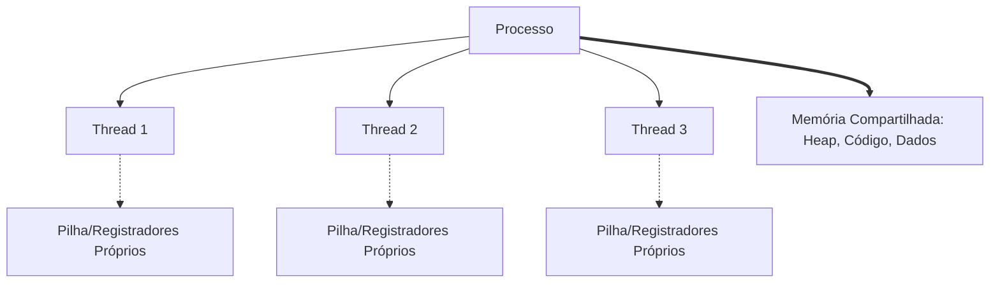
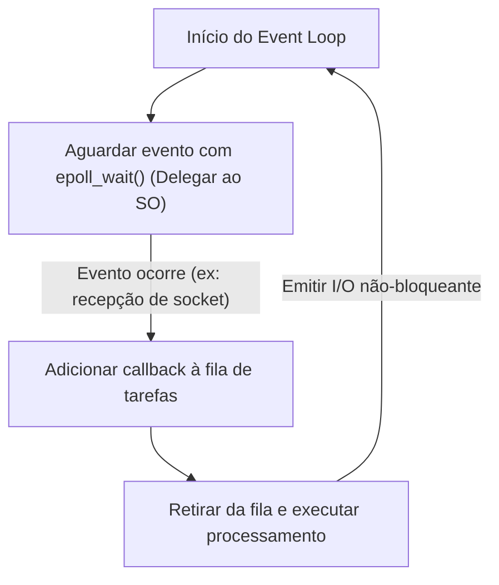

No desenvolvimento de software moderno, desempenho e escalabilidade são temas vitais e inseparáveis. Especialmente em servidores web de alto tráfego ou sistemas que lidam com comunicação em tempo real, "quão eficientemente os pedidos são processados" divide a vida ou a morte do sistema.

Para lidar com esse problema, muitas linguagens de programação modernas oferecem sintaxe de processamento assíncrono, como `async` / `await`. No entanto, por que o processamento assíncrono é necessário? Por que o modelo tradicional e simples de "atribuir uma thread para cada solicitação" tem limites?

A resposta está profundamente enraizada no mecanismo de "mudança de contexto" em nível de kernel do SO (Sistema Operacional) e seus custos, bem como nas restrições da arquitetura de hardware. Neste artigo, exploraremos profundamente, começando pela estrutura de gerenciamento de processos e threads do SO, os custos de hardware da mudança de contexto, o problema C10K, a arquitetura orientada a eventos (epoll/kqueue) e o funcionamento de corrotinas no espaço do usuário e do `async/await`.

## 1. Fundamentos do Gerenciamento de Processos e Threads no SO

### 1.1 O que é um Processo
Um processo é uma instância de um programa em execução e é a unidade básica à qual o SO aloca recursos. Um processo possui um espaço de memória independente (espaço de endereçamento virtual) e está isolado de outros processos. Para gerenciar processos, o SO mantém uma estrutura de dados chamada **PCB (Process Control Block)** no espaço do kernel. O PCB registra informações como o ID do processo, o estado dos registradores, informações de gerenciamento de memória (como ponteiros para a tabela de páginas) e os descritores de arquivo abertos.

### 1.2 O Surgimento das Threads e a Redução de Peso
Nos sistemas operacionais iniciais, para realizar o processamento concorrente, era necessário criar (fazer um `fork`) de vários processos. No entanto, como os processos possuem espaços de memória completamente independentes, o custo de criação e a sobrecarga (overhead) da comunicação interprocessos (IPC) eram muito grandes.

Foi então que surgiram as **threads**. As threads também são chamadas de "processos leves" (Lightweight Process) e compartilham o espaço de memória (heap, segmento de dados e segmento de código) com outras threads dentro do mesmo processo. Contudo, cada thread tem seu próprio contexto de execução, isto é, uma **pilha (stack) específica da thread** e um **conjunto de registradores (como o contador de programa)**. As informações de gerenciamento da thread são mantidas no kernel como **TCB (Thread Control Block)**.



Ao compartilhar a memória, o custo de criação de threads e a comunicação diminuíram significativamente em comparação com os processos, mas o overhead fundamental de "agendamento e mudança (switching) feitos pelo kernel" continuou existindo.

## 2. O Verdadeiro Preço da Mudança de Contexto

Em sistemas operacionais multitarefa, para fazer parecer que várias threads estão sendo executadas simultaneamente em núcleos de CPU limitados, as threads em execução são rapidamente alternadas através de divisão de tempo (time-slicing). Além disso, quando uma thread espera (bloqueia) a conclusão de I/O de disco ou comunicação de rede, o SO também realiza a troca para ceder a CPU a outra thread. Esse processo de alternância é chamado de **Mudança de Contexto (Context Switch)**.

A mudança de contexto não é, de forma alguma, gratuita. Seu custo vai além da simples sobrecarga de processamento de software e tem um grande impacto na arquitetura de cache do hardware.

### 2.1 Salvamento e Restauração de Registradores e Estado
Quando ocorre uma mudança de contexto, a CPU salva (guarda) o estado dos registradores (contador de programa, ponteiro de pilha, registradores de uso geral, etc.) da thread atualmente em execução em seu TCB ou na pilha do kernel. Em seguida, ela lê (restaura) o estado dos registradores a partir do TCB da próxima thread a ser executada. Apenas isso já custa dezenas a centenas de ciclos.

### 2.2 Flush do TLB (Translation Lookaside Buffer)
No caso de mudanças de contexto entre processos, um custo ainda maior é incorrido. É o **flush do TLB**. O TLB é uma memória ultrarrápida dentro da CPU que faz o cache dos resultados da tradução de endereços virtuais para endereços físicos.
Quando um processo muda, como o espaço de endereçamento virtual é alterado, as entradas do TLB do processo anterior tornam-se inválidas. Por isso, o SO precisa realizar um flush (limpeza) do TLB, e logo após a retomada da execução do novo processo, é necessário consultar a tabela de páginas na memória (page walk) todas as vezes para a tradução de endereços, o que causa uma severa queda de desempenho.

### 2.3 Poluição e Invalidação da Cache da CPU (L1/L2/L3)
Mesmo na mudança de contexto entre threads (mesmo dentro do mesmo processo), ocorre a **Poluição da Cache (Cache Pollution)**. A thread recém-agendada expulsa os dados que a thread anterior deixou na cache e começa a carregar os seus próprios dados na cache. Como resultado, as falhas de cache (cache misses) tornam-se frequentes e a latência de acesso à memória aumenta.

Assim, o maior custo da mudança de contexto não é o "tempo de processamento de salvar e restaurar", mas sim a "queda de desempenho indireta causada pelo reset de mecanismos de otimização de pipeline, como a cache da CPU e o TLB".

## 3. O Problema C10K e os Limites do "Thread-per-Connection"

Nos primórdios da popularização da internet, os servidores web (como as versões antigas do Apache) adotavam o modelo de **"atribuir uma thread (ou processo) do SO para cada conexão de rede"** (Thread-per-connection).

Esse modelo tinha a vantagem de tornar o código muito simples. Quando uma função é chamada para ler dados da rede, a thread apenas precisa bloquear (dormir) até que os dados cheguem.

```c
// Pseudocódigo do modelo Thread-per-connection
void handle_connection(int socket) {
    char buffer[1024];
    // Esta thread será bloqueada (paralisada) pelo kernel até a chegada dos dados
    int bytes = read(socket, buffer, 1024); 
    process_data(buffer, bytes);
    write(socket, response);
}
```

No entanto, nos anos 2000, quando o número de conexões simultâneas chegou a 10.000 (10K), esse modelo quebrou. Este é o famoso **Problema C10K (10,000 Client Problem)**.

### Motivo do Limite 1: Esgotamento da Memória
Quando uma thread do SO é criada, uma área de pilha específica (geralmente, o padrão no Linux é de alguns MB) é alocada para cada thread. Se criarmos 10.000 threads para processar 10.000 conexões, seriam necessárias dezenas de GB de memória apenas para as pilhas. Para o hardware da época, esse tamanho era irreal.

### Motivo do Limite 2: Tempestade de Mudanças de Contexto
O que acontece quando milhares ou dezenas de milhares de threads existem, repetindo o bloqueio e despertar enquanto aguardam a conclusão de operações de I/O de rede? O escalonador do kernel enfrenta um overhead crescente ao buscar qual thread deve ser executada a seguir, e além disso, ocorrem falhas frequentes de cache devido às mudanças de contexto mencionadas anteriormente. Como resultado, a maior parte do tempo da CPU é desperdiçada na "troca de threads (processamento do kernel)" em vez de ser usada no "processamento real".

## 4. Arquitetura Orientada a Eventos e I/O Não-Bloqueante

Para resolver o problema C10K, surgiu um modelo que combinava a **Arquitetura Orientada a Eventos (Event-Driven Architecture)** com **I/O não-bloqueante (Non-blocking I/O)**. Softwares como Nginx, Node.js e Redis adotaram essa arquitetura para alcançar um desempenho esmagador.

### 4.1 I/O Não-Bloqueante
Ao operar um socket no modo não-bloqueante, mesmo se os dados ainda não tiverem chegado, o kernel não bloqueia a thread, retornando imediatamente um erro (`EAGAIN` ou `EWOULDBLOCK`). Isso impede que uma única thread entre em estado de espera, permitindo que ela continue outras tarefas.

### 4.2 Mecanismo de Notificação de Eventos em Nível de Kernel (epoll / kqueue)
No entanto, ficar perguntando repetidamente "os dados chegaram?" (polling) para dezenas de milhares de sockets não-bloqueantes é extremamente ineficiente.

Por isso, o kernel do SO passou a fornecer chamadas de sistema avançadas para **Multiplexação de I/O (I/O Multiplexing)**.
- Linux: **`epoll`**
- BSD/macOS: **`kqueue`**
- Windows: **IOCP (I/O Completion Ports)**

As antigas `select` e `poll` entregavam uma lista de todos os descritores de arquivos (FDs) a serem monitorados para o kernel todas as vezes, e o kernel tinha que verificá-los em O(N).
Em contraste, o `epoll` mantém uma tabela de eventos dentro do kernel e retorna ao aplicativo apenas a lista de FDs onde os eventos de I/O ocorreram, operando em O(1) (mais precisamente, proporcional ao número de eventos ocorridos).

### 4.3 O Nascimento do Event Loop
Com isso, passou a ser possível lidar de forma eficiente com dezenas de milhares de conexões usando uma única thread (ou um pequeno número de threads, igual ao número de núcleos da CPU). Este é o **Event Loop (Laço de Eventos)**.



O Event Loop simplesmente continua girando no ciclo de "perguntar sobre eventos ao SO" -> "executar a rotina (callback) correspondente ao evento que ocorreu". Isso eliminou as pesadas mudanças de contexto no nível do SO e permitiu a utilização dos recursos da CPU até o limite máximo.

## 5. Corrotinas no Espaço do Usuário e async/await

Embora a arquitetura orientada a eventos tenha sido a solução perfeita em termos de desempenho, ela trouxe grande sofrimento aos programadores. Isso é o **Callback Hell (Inferno dos Callbacks)**.

Era necessário registrar funções de callback a cada operação de I/O, dividindo o fluxo de execução do código e dificultando o tratamento de erros e o gerenciamento complexo de estados.

### 5.1 Corrotinas e a Movimentação da Mudança de Contexto para o Espaço do Usuário
Para resolver essa complexidade enquanto mantinha o desempenho, o conceito de "**Corrotinas (Coroutine)**" ou "**Green Threads**" tornou-se popular. As Goroutines da linguagem Go são um exemplo representativo.

Elas são "threads leves gerenciadas no nível do usuário (pelo programa)" que funcionam sobre as threads do kernel do SO.
Quando uma corrotina aguarda por um I/O, em vez de devolver o controle (bloquear) para o kernel, um **escalonador no espaço do usuário (runtime)** salva o estado de execução daquela corrotina e muda para outra.

Essa mudança no espaço do usuário não envolve a mudança de contexto do SO, nem gera transições para o modo privilegiado (chamada de sistema) ou flush do TLB, sendo concluída a um custo extremamente baixo, que varia de poucos a dezenas de nanossegundos.

### 5.2 A Magia do async/await: Transformação em Máquina de Estados pelo Compilador
Além disso, muitas linguagens modernas (C#, JavaScript/TypeScript, Python, Rust, etc.) introduziram `async` e `await`, integrando esse processamento assíncrono na sintaxe da linguagem.

O verdadeiro poder do `async/await` reside no fato de que **"código que é escrito de maneira síncrona (de cima para baixo) para os humanos é convertido pelo compilador em uma máquina de estados nos bastidores e integrado ao event loop"**.

Quando a palavra-chave `await` aparece, a thread não para de fato ali.
1. O estado atual da função (como variáveis locais) é salvo em um objeto na heap (como Future ou Promise).
2. A operação de I/O é registrada no event loop (ou epoll).
3. A execução da função é suspensa temporariamente (`yield`), e o controle retorna para o event loop ou para o chamador.
4. Quando a operação de I/O é concluída, o event loop a detecta e retoma (`resume`) a execução da função a partir do estado salvo.

```rust
// Imagem de processamento assíncrono em Rust
async fn fetch_data() -> Result<Data, Error> {
    // Inicia a conexão de rede de forma assíncrona
    let mut stream = TcpStream::connect("example.com").await?; 
    // No .await acima, a função é de fato suspensa e retorna ao event loop.
    // Quando a conexão é estabelecida, a execução é retomada daqui.
    
    let mut buffer = Vec::new();
    // Leitura dos dados. Isso também é assíncrono e não bloqueia.
    stream.read_to_end(&mut buffer).await?;
    
    Ok(parse(buffer))
}
```

Em linguagens que promovem abstrações de custo zero como o Rust, funções `async` são completamente convertidas no tempo de compilação em máquinas de estados baseadas em `enum` que retêm estado. Até a alocação dinâmica de memória é minimizada, extraindo a máxima performance.

## 6. O Desafio do Processamento Assíncrono: "Funções Coloridas (What Color is Your Function?)"

`async/await` é poderoso, mas não é uma bala de prata. O problema arquitetônico mais conhecido é o "problema da coloração de funções".

Para fazer `await` dentro de uma função assíncrona (digamos, uma função vermelha), a função chamadora também deve ser uma função assíncrona (vermelha). Você não pode chamar diretamente uma função assíncrona a partir de uma função síncrona (função azul) e esperar pelo resultado.
Isso causa o problema de que toda a base de código fica dividida no "mundo síncrono" e no "mundo assíncrono".

Além disso, se uma operação limitada pela CPU (intensiva em cálculo) for executada por muito tempo dentro de uma função `async`, o próprio event loop será bloqueado, o que tem o perigo de causar um bug crítico (Starvation) onde todas as outras tarefas assíncronas são paralisadas. No mundo assíncrono, "bloquear esperando I/O" é permitido, mas "monopolizar o loop com cálculos da CPU" é estritamente proibido.

## 7. Conclusão

Por trás da sintaxe sucinta de `async` / `await` que usamos casualmente, encontram-se décadas de história de otimização na ciência da computação.

- Para evitar as **custosas mudanças de contexto no hardware** (flushes de TLB, falhas de cache).
- Para conservar os **recursos de memória esgotáveis (pilhas de threads)**.
- Para extrair o poder do **epoll/kqueue** do kernel.
- E para **libertar os desenvolvedores** da complexidade dos callbacks assíncronos.

O moderno `async/await` é o resultado da evolução para a arquitetura orientada a eventos, surgida dos limites do gerenciamento de processos e threads do SO, abstraída pelo poder dos compiladores. Ao compreender esses profundos mecanismos, você será capaz de projetar sistemas com maior desempenho, segurança e escalabilidade.
