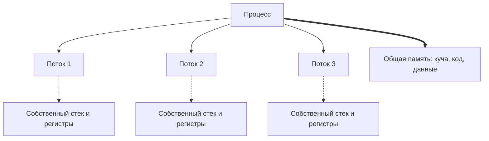
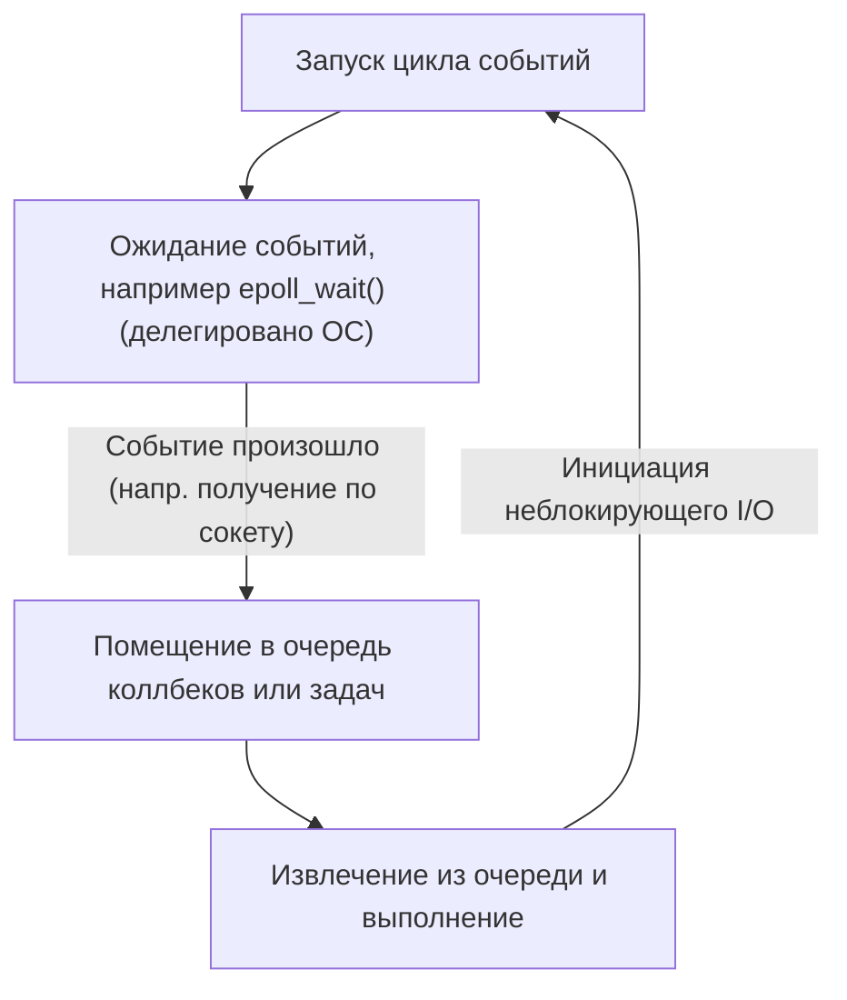

В современной разработке программного обеспечения производительность и масштабируемость — это неразделимые и крайне важные темы. Особенно в системах с высоким трафиком, таких как веб-серверы или приложения для связи в реальном времени, вопрос 'как эффективно обрабатывать запросы' определяет вопрос жизни и смерти системы.

Для решения этой проблемы большинство современных языков программирования предоставляют синтаксис асинхронной обработки, такой как `async` / `await`. Но зачем вообще нужна асинхронная обработка? Почему простая традиционная модель 'один поток на один запрос' имеет свои пределы?

Ответ глубоко кроется в механизме 'переключения контекста' (context switch) на уровне ядра операционной системы (ОС), его цене, а также в ограничениях аппаратной архитектуры. В этой статье мы подробно разберем механизмы управления процессами и потоками ОС, аппаратную стоимость переключения контекста, проблему C10K, событийно-ориентированную архитектуру (epoll/kqueue), а также устройство сопрограмм (корутин) в пользовательском пространстве и механизма `async/await`.

## 1. Основы управления процессами и потоками в ОС

### 1.1 Что такое процесс?
Процесс — это экземпляр выполняемой программы, базовая единица, которой ОС выделяет ресурсы. Процесс имеет независимое пространство памяти (виртуальное адресное пространство) и изолирован от других процессов. Для управления процессами ОС поддерживает в пространстве ядра структуру данных, называемую **PCB (Process Control Block)**. В PCB хранятся идентификатор процесса, состояние регистров, информация об управлении памятью (например, указатели на таблицы страниц), открытые файловые дескрипторы и многое другое.

### 1.2 Появление потоков и облегчение процессов
В ранних операционных системах для выполнения параллельной обработки было необходимо создавать (через `fork`) множество процессов. Однако, поскольку процессы обладают полностью независимым адресным пространством, это приводило к проблемам: высокой стоимости создания и большим накладным расходам на межпроцессное взаимодействие (IPC).

Для решения этого появились **потоки (threads)**. Потоки также называют 'легковесными процессами' (Lightweight Processes). Они разделяют пространство памяти (кучу, сегмент данных, сегмент кода) с другими потоками внутри одного и того же процесса. Тем не менее, каждый поток обладает своим собственным контекстом выполнения, а именно: **индивидуальным стеком потока** и **набором регистров (счетчиком команд и т.д.)**. Информация для управления потоками хранится в ядре в виде **TCB (Thread Control Block)**.



Благодаря разделению памяти, стоимость создания потоков и взаимодействия между ними значительно снизилась по сравнению с процессами. Однако фундаментальные накладные расходы на 'планирование и переключение контекста ядром' никуда не исчезли.

## 2. Истинная цена переключения контекста

В многозадачных ОС для создания иллюзии одновременного выполнения нескольких потоков на ограниченном количестве ядер ЦП используется быстрое переключение между потоками с разделением времени (квантование времени). Кроме того, когда поток ожидает завершения дискового ввода-вывода или сетевого взаимодействия (блокируется), ОС переключается, чтобы уступить ЦП другому потоку. Эта операция переключения называется **переключением контекста (Context Switch)**.

Переключение контекста отнюдь не бесплатно. Его цена выходит далеко за рамки простых программных накладных расходов и оказывает значительное влияние на аппаратную архитектуру кэша.

### 2.1 Сохранение и восстановление регистров и состояния
Когда происходит переключение контекста, ЦП сохраняет (вытесняет) состояние регистров выполняемого потока (счетчик команд, указатель стека, регистры общего назначения и т.д.) в TCB этого потока или в стек ядра. Затем он считывает (восстанавливает) состояние регистров из TCB следующего потока, который будет выполняться. Только это требует затрат в десятки или сотни циклов процессора.

### 2.2 Сброс TLB (Translation Lookaside Buffer)
При переключении контекста между процессами возникают еще более тяжелые накладные расходы — **сброс TLB**. TLB (буфер ассоциативной трансляции) — это сверхбыстрая память внутри ЦП, кэширующая результаты трансляции виртуальных адресов в физические.
При смене процесса изменяется виртуальное адресное пространство, поэтому записи TLB предыдущего процесса становятся недействительными. В связи с этим ОС должна сбросить (очистить) TLB. Сразу после возобновления работы нового процесса для каждой трансляции адреса приходится обращаться к таблицам страниц в оперативной памяти (page walk), что приводит к серьезному падению производительности.

### 2.3 Загрязнение и инвалидация кэша ЦП (L1/L2/L3)
Даже при переключении контекста между потоками (в рамках одного процесса) возникает **загрязнение кэша (cache pollution)**. Вновь запланированный поток вытесняет данные, оставленные в кэше предыдущим потоком, и начинает загружать в него собственные данные. Это приводит к частым промахам кэша (cache misses) и увеличивает задержку доступа к памяти.

Таким образом, самая большая цена переключения контекста кроется не во времени 'сохранения и восстановления', а в 'косвенном снижении производительности из-за сброса механизмов оптимизации конвейера, таких как кэш ЦП и TLB'.

## 3. Проблема C10K и пределы модели 'поток на соединение'

На заре распространения Интернета веб-серверы (например, ранний Apache) применяли модель, при которой **'на каждое сетевое соединение выделялся один поток (или процесс) ОС'** (Thread-per-connection).

У этой модели было преимущество в виде крайней простоты кода. При вызове функции для чтения данных из сети поток мог просто блокироваться (засыпать) в ожидании прибытия этих данных.

```c
// Псевдокод модели Thread-per-connection
void handle_connection(int socket) {
    char buffer[1024];
    // Поток блокируется (останавливается) ядром до поступления данных
    int bytes = read(socket, buffer, 1024); 
    process_data(buffer, bytes);
    write(socket, response);
}
```

Однако с наступлением 2000-х, когда число одновременных подключений начало достигать 10 тысяч (10K), эта модель рухнула. Это известная **проблема C10K (10,000 Client Problem)**.

### Причина 1: Исчерпание памяти
При создании потока ОС каждому из них выделяется отдельная область стека (в Linux обычно несколько мегабайт по умолчанию). Если создать 10 тысяч потоков для обработки 10 тысяч соединений, только для стеков потребуются десятки гигабайт памяти. Для аппаратного обеспечения того времени это был нереалистичный объем.

### Причина 2: Шторм переключений контекста
Что произойдет, если существуют тысячи и десятки тысяч потоков, которые постоянно блокируются в ожидании завершения сетевого ввода-вывода и снова пробуждаются? Накладные расходы планировщика ядра на поиск следующего потока для выполнения возрастают, и, как уже упоминалось, из-за переключений контекста начинают часто происходить промахи кэша. В результате большая часть процессорного времени тратится не на 'реальную обработку', а растрачивается на 'переключение потоков (работу ядра)'.

## 4. Событийно-ориентированная архитектура и неблокирующий ввод-вывод

Для решения проблемы C10K появилась модель, сочетающая **событийно-ориентированную архитектуру (Event-Driven Architecture)** и **неблокирующий ввод-вывод (non-blocking I/O)**. Эту архитектуру внедрили Nginx, Node.js, Redis и другие, добившись благодаря ей впечатляющей производительности.

### 4.1 Неблокирующий ввод-вывод
Если управлять сокетом в неблокирующем режиме, то, даже когда данные еще не прибыли, ядро не будет блокировать поток. Вместо этого оно немедленно вернет ошибку (`EAGAIN` или `EWOULDBLOCK`). Это позволяет одному потоку не переходить в состояние ожидания и продолжать выполнять другие задачи.

### 4.2 Механизмы уведомления о событиях на уровне ядра (epoll / kqueue)
Однако по очереди опрашивать десятки тысяч неблокирующих сокетов с вопросом 'Пришли ли данные?' (выполнять поллинг) — это верх неэффективности.

Поэтому ядра операционных систем предоставили продвинутые системные вызовы для **мультиплексирования ввода-вывода (I/O Multiplexing)**.
- Linux: **`epoll`**
- BSD/macOS: **`kqueue`**
- Windows: **IOCP (I/O Completion Ports)**

Ранние вызовы, такие как `select` и `poll`, работали по принципу, когда при каждом обращении ядру передавался список всех наблюдаемых файловых дескрипторов (FD), и ядро сканировало его за время O(N).
В отличие от них, `epoll` сохраняет таблицу событий внутри ядра и возвращает приложению только список тех FD, на которых произошли события ввода-вывода, поэтому он работает за время O(1) (если точнее, пропорционально числу произошедших событий).

### 4.3 Рождение цикла событий
Благодаря этому стало возможным эффективно обрабатывать десятки тысяч соединений с помощью одного потока (или небольшого их количества, равного числу ядер ЦП). Это и есть **цикл событий (Event Loop)**.



Цикл событий непрерывно выполняет один и тот же процесс: 'запрос событий у ОС' → 'выполнение обработки (коллбека), соответствующей произошедшему событию'. Это позволяет устранить тяжелые переключения контекста на уровне ОС и использовать ресурсы ЦП на максимум.

## 5. Корутины в пользовательском пространстве и async/await

Событийно-ориентированная архитектура стала идеальным решением с точки зрения производительности, но принесла программистам огромную боль. Имя ей — **Ад коллбеков (Callback Hell)**.

Для каждой операции ввода-вывода приходилось регистрировать функцию обратного вызова (коллбек), что разрывало поток выполнения кода и сильно усложняло обработку ошибок и управление сложным состоянием.

### 5.1 Перенос корутин и переключений контекста в пользовательское пространство
Чтобы решить эту проблему сложности, сохранив при этом производительность, широкое распространение получили концепции **'сопрограмм' (корутин, Coroutine)** и **'зеленых потоков' (Green Thread)**. Ярким примером служат горутины (Goroutines) в языке Go.

Это 'легковесные потоки, управляемые в пространстве пользователя (на стороне программы)', работающие поверх потоков ядра ОС.
Когда корутина переходит в состояние ожидания ввода-вывода, она не возвращает управление ядру (не блокируется). Вместо этого **планировщик пользовательского пространства (среда выполнения / runtime)** сохраняет состояние выполнения этой корутины и переключается на другую.

Такое переключение в пользовательском пространстве не сопровождается переключением контекста ОС. При нем не происходит перехода в привилегированный режим (системного вызова) или сброса TLB, поэтому оно завершается с крайне низкими затратами — за время от нескольких до десятков наносекунд.

### 5.2 Магия async/await: преобразование в конечный автомат на этапе компиляции
Более того, многие современные языки (C#, JavaScript/TypeScript, Python, Rust и другие) внедрили `async` и `await`, интегрировав асинхронную обработку непосредственно в синтаксис языка.

Истинная сила `async/await` заключается в том, что **'код, написанный человеком в синхронном стиле (сверху вниз), под капотом преобразуется компилятором в конечный автомат (машину состояний) и интегрируется с циклом событий'**.

Когда встречается ключевое слово `await`, на самом деле поток там не останавливается.
1. Состояние текущей функции (например, локальные переменные) сохраняется в объекте в куче (таком как Future или Promise).
2. Операция ввода-вывода регистрируется в цикле событий (или в epoll).
3. Выполнение функции временно приостанавливается (`yield`), и управление возвращается циклу событий или вызывающей функции.
4. По завершении ввода-вывода цикл событий обнаруживает это и возобновляет выполнение функции (`resume`) с сохраненного состояния.

```rust
// Пример асинхронной обработки в Rust
async fn fetch_data() -> Result<Data, Error> {
    // Асинхронное начало сетевого подключения
    let mut stream = TcpStream::connect("example.com").await?; 
    // На .await выше функция фактически приостанавливается и возвращается в цикл событий.
    // Когда соединение установлено, выполнение возобновляется с этого места.
    
    let mut buffer = Vec::new();
    // Чтение данных. Это также асинхронно и не блокирует поток.
    stream.read_to_end(&mut buffer).await?;
    
    Ok(parse(buffer))
}
```

В языках, провозглашающих абстракции с нулевой стоимостью (zero-cost abstractions), таких как Rust, функции `async` на этапе компиляции полностью преобразуются в конечные автоматы на базе `enum`, сохраняющие состояние. Даже динамическое выделение памяти сведено к минимуму, что позволяет добиться максимальной производительности.

## 6. Проблемы асинхронной обработки: "Цветные функции (What Color is Your Function?)"

Хотя `async/await` является мощным инструментом, это не серебряная пуля. Самая известная архитектурная проблема носит название 'проблема цвета функции'.

Чтобы использовать `await` внутри асинхронной функции (назовем ее красной функцией), вызывающая функция также должна быть асинхронной (красной). Невозможно напрямую вызвать асинхронную функцию из синхронной (синей функции) и дождаться её результата.
Это порождает проблему, при которой вся кодовая база разделяется на 'синхронный мир' и 'асинхронный мир'.

Кроме того, если внутри `async`-функции в течение длительного времени выполнять задачи, интенсивно использующие процессор (CPU-bound), это заблокирует сам цикл событий, что может привести к критическому багу: остановке всех остальных асинхронных задач (голоданию, Starvation). В асинхронном мире допускается 'блокировка в ожидании I/O', но категорически запрещено 'монополизировать цикл событий ресурсоемкими вычислениями ЦП'.

## 7. Заключение

За лаконичным синтаксисом `async` / `await`, которым мы непринужденно пользуемся, стоят десятилетия истории оптимизаций в компьютерных науках.

- Чтобы избежать **дорогостоящих аппаратных переключений контекста** (сброс TLB, промахи кэша).
- Чтобы сэкономить исчерпываемые **ресурсы памяти (стеки потоков)**.
- Чтобы раскрыть мощь ядерных механизмов **epoll/kqueue**.
- И, наконец, чтобы **освободить разработчиков** от сложности асинхронных коллбеков.

Современный `async/await` — это результат эволюции, рожденной из пределов управления процессами и потоками ОС, перешедшей в событийно-ориентированную архитектуру и абстрагированной мощью компиляторов. Понимание этого глубокого механизма позволит вам проектировать более производительные, безопасные и масштабируемые системы.
