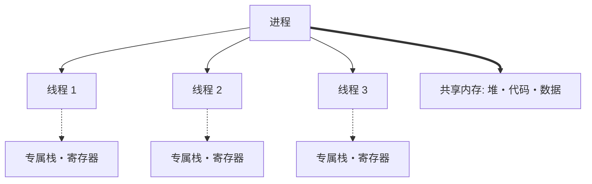
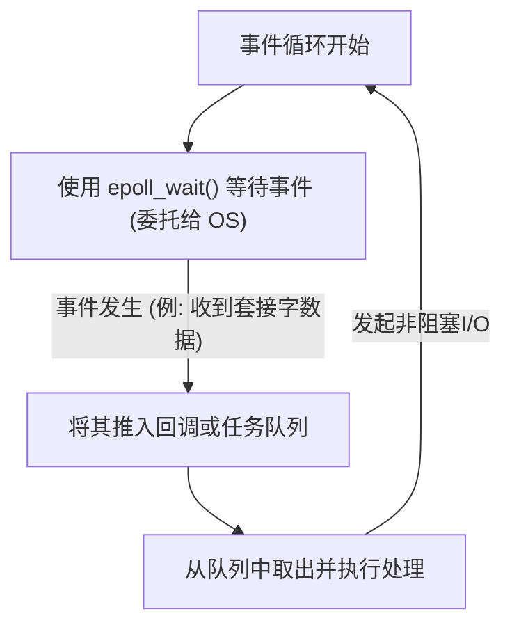

现代软件开发中，性能与可扩展性是不可分割的重要主题。特别是在处理高流量Web服务器和实时通信的系统中，“如何高效处理请求”往往决定了系统的生死。

为了应对这一问题，许多现代编程语言都提供了 `async` / `await` 等异步处理语法。但是，为什么需要异步处理呢？为什么像以前那样“为每个请求分配一个线程”的简单模型会面临局限性？

答案深深根植于操作系统（OS）内核级别中“上下文切换”机制的代价，以及硬件架构的限制之中。本文将从操作系统的进程与线程管理机制出发，深入探讨上下文切换的硬件成本、C10K问题、事件驱动架构（epoll/kqueue），直至用户空间中的协程（Coroutine）和 `async/await` 的底层机制。

## 1. 操作系统进程与线程管理基础

### 1.1 什么是进程
进程是正在执行的程序的实例，也是操作系统分配资源的基本单位。进程拥有独立的内存空间（虚拟地址空间），并与其他进程相互隔离。为了管理进程，操作系统在内核空间中维护着称为 **PCB (Process Control Block)** 的数据结构。PCB中记录了进程ID、寄存器状态、内存管理信息（如指向页表的指针）、打开的文件描述符等。

### 1.2 线程的出现与轻量化
在早期的操作系统中，为了实现并发处理，需要生成（`fork`）多个进程。然而，由于进程拥有完全独立的内存空间，创建成本以及进程间通信（IPC）的开销非常大。

于是，**线程**应运而生。线程也被称为“轻量级进程 (Lightweight Process)”，它与同一进程内的其他线程共享内存空间（堆、数据段、代码段）。但是，每个线程都有自己独立的执行上下文，即**线程特有的栈**和**寄存器集合（程序计数器等）**。线程的管理信息作为 **TCB (Thread Control Block)** 保存在内核中。



通过共享内存，线程的创建和通信成本与进程相比大幅降低，但“内核的调度和切换”这一根本性的开销依然存在。

## 2. 上下文切换的真正代价

在多任务操作系统中，为了在有限的CPU核心上制造出多个线程同时执行的假象，系统会通过时间分片（Time Slice）快速切换执行的线程。此外，当线程等待磁盘I/O或网络通信完成而阻塞时，操作系统也会进行切换，将CPU让给其他线程。这种切换操作被称为 **上下文切换 (Context Switch)**。

上下文切换绝不是免费的。其代价不仅仅是软件处理上的开销，更对硬件的缓存架构产生了巨大影响。

### 2.1 寄存器与状态的保存和恢复
当上下文切换发生时，CPU会将当前正在执行的线程的寄存器状态（程序计数器、栈指针、通用寄存器等）保存（退避）到该线程的 TCB 或内核栈中。然后，从下一个要执行的线程的 TCB 中读取（恢复）寄存器状态。仅仅这一操作就会消耗数十到数百个周期的成本。

### 2.2 TLB (Translation Lookaside Buffer) 的刷新
如果是进程间的上下文切换，会产生更沉重的代价，那就是 **TLB的刷新**。TLB是CPU内部的高速缓存，用于缓存从虚拟地址到物理地址的转换结果。
进程切换后，虚拟地址空间发生改变，之前进程的TLB条目便会失效。因此，操作系统必须刷新（清除）TLB。当新进程重新开始执行后，最初的每次地址转换都必须访问内存中的页表（Page Walk），这会导致严重的性能下降。

### 2.3 CPU缓存 (L1/L2/L3) 的污染与失效
即使是线程间的上下文切换（即使在同一个进程内），也会发生 **缓存污染 (Cache Pollution)**。新调度的线程会将前一个线程留在缓存中的数据驱逐出去，并开始将自己的数据加载到缓存中。这会导致缓存未命中频繁发生，从而增加内存访问的延迟。

因此，上下文切换最大的代价并不是“保存和恢复的处理时间”，而是“由于CPU缓存和TLB等流水线优化机制被重置而导致的间接性能下降”。

## 3. C10K问题与“每连接一线程”的局限

在互联网普及初期，Web服务器（例如早期的Apache）采用了 **“为一个网络连接分配一个OS线程（或进程）”** 的模型（Thread-per-connection）。

这种模型的优点在于代码非常简单。当调用函数从网络读取数据时，在数据到达之前，该线程只需单纯地阻塞（休眠）即可。

```c
// Thread-per-connection 模型的伪代码
void handle_connection(int socket) {
    char buffer[1024];
    // 在数据到达之前，该线程会被内核阻塞（停止）
    int bytes = read(socket, buffer, 1024); 
    process_data(buffer, bytes);
    write(socket, response);
}
```

然而，进入21世纪后，当并发连接数达到1万个（10K）时，这种模型便崩溃了。这就是著名的 **C10K问题 (10,000 Client Problem)**。

### 局限原因1：内存耗尽
创建OS线程时，会为每个线程分配特定的栈区域（通常在Linux中默认大小为几MB）。如果为了处理1万个连接而创建1万个线程，仅仅是栈就需要几十GB的内存。这在当时的硬件条件下是不切实际的。

### 局限原因2：上下文切换风暴
当存在数以千计、万计的线程，并且它们都在反复等待网络I/O完成而阻塞和唤醒时，会发生什么呢？内核调度器寻找下一个要执行线程的开销会急剧增大，而且前文提到的由上下文切换引发的缓存未命中也会频繁发生。结果导致大部分CPU时间被浪费在“线程切换（内核处理）”上，而不是“实际业务处理”上。

## 4. 事件驱动架构与非阻塞I/O

为了解决C10K问题，结合了 **事件驱动架构 (Event-Driven Architecture)** 和 **非阻塞I/O** 的模型应运而生。Nginx、Node.js、Redis等都采用了这种架构，并实现了压倒性的性能优势。

### 4.1 非阻塞I/O
当以非阻塞模式操作套接字时，如果数据尚未到达，内核不会让线程阻塞，而是立即返回一个错误（`EAGAIN` 或 `EWOULDBLOCK`）。这样一来，单个线程就不会进入等待状态，可以继续执行其他处理。

### 4.2 内核级事件通知机制 (epoll / kqueue)
然而，对于数以万计的非阻塞套接字，依次轮询询问“数据到了吗？”是极其低效的。

因此，OS内核提供了用于 **I/O多路复用 (I/O Multiplexing)** 的高级系统调用。
- Linux: **`epoll`**
- BSD/macOS: **`kqueue`**
- Windows: **IOCP (I/O Completion Ports)**

早期的 `select` 或 `poll` 机制需要每次将所有被监控的文件描述符（FD）列表传递给内核，内核以 O(N) 的时间复杂度进行扫描。
相比之下，`epoll` 在内核中维护了一个事件表，只将发生I/O事件的FD列表返回给应用程序，因此它以 O(1)（准确地说是与发生的事件数量成正比）的时间复杂度运行。

### 4.3 事件循环的诞生
借此，只需使用1个线程（或数量等于CPU核心数的少数线程），就能高效地处理数以万计的连接。这就是 **事件循环 (Event Loop)**。



事件循环就是不断重复“向OS询问事件” -> “执行对应事件的处理（回调）”的循环。通过这种方式，消除了OS级别沉重的上下文切换，使得CPU资源得以被利用到极限。

## 5. 用户空间协程与 async/await

事件驱动架构在性能上是完美的解决方案，但却给程序员带来了极大的痛苦。那就是 **回调地狱 (Callback Hell)**。

每次进行I/O操作时都必须注册回调函数，代码的执行流被严重割裂，使得错误处理和复杂的状态管理变得极其困难。

### 5.1 协程与上下文切换向用户空间的转移
为了在解决这种复杂性的同时维持性能，“**协程 (Coroutine)**”或“**绿色线程 (Green Thread)**”的概念开始普及。Go语言的Goroutine便是其中的典型代表。

它们是在OS内核线程之上运行的，由“用户态（程序侧）管理的轻量级线程”。
当一个协程因等待I/O而需要等待时，它不会将控制权交回内核（不会阻塞），而是由 **用户空间的调度器（Runtime）** 保存该协程的执行状态，并切换到另一个协程。

这种在用户空间中的切换不涉及OS的上下文切换，不会转入特权模式（系统调用），也不会触发TLB的刷新，因此只需几纳秒到几十纳秒的极低开销即可完成。

### 5.2 async/await 的魔法：编译器将其转换为状态机
此外，许多现代语言（C#、JavaScript/TypeScript、Python、Rust等）引入了 `async` 和 `await`，将这种异步处理整合为语言级别的语法。

`async/await` 的真正威力在于：**“对于人类而言，看起来是从上到下同步编写的代码，编译器会在后台将其转换为状态机（State Machine），并与事件循环相结合”**。

当遇到 `await` 关键字时，线程并不会在那里真正停止。
1. 当前函数的状态（局部变量等）会被保存到堆上的对象中（例如Future或Promise）。
2. I/O处理被注册到事件循环（或epoll）中。
3. 函数的执行暂时挂起（`yield`），控制权交还给事件循环或调用者。
4. I/O完成时，事件循环会检测到，并从保存的状态处恢复（`resume`）函数的执行。

```rust
// Rust中异步处理的示意
async fn fetch_data() -> Result<Data, Error> {
    // 异步发起网络连接
    let mut stream = TcpStream::connect("example.com").await?; 
    // 在上述的 .await 处，函数实际上会挂起并返回到事件循环。
    // 连接建立后，将从此处恢复执行。
    
    let mut buffer = Vec::new();
    // 读取数据。这也是异步的，不会发生阻塞。
    stream.read_to_end(&mut buffer).await?;
    
    Ok(parse(buffer))
}
```

在像Rust这样倡导零成本抽象的语言中，`async` 函数在编译时会被彻底转换为基于 `enum` 管理状态的状态机。甚至连动态内存分配都被降至最低，从而发挥出极限的性能。

## 6. 异步处理的挑战：“有颜色的函数 (What Color is Your Function?)”

`async/await` 虽然强大，但并非银弹。其中最著名的架构挑战便是“函数着色问题”。

为了在异步函数（假设为红色函数）中使用 `await`，调用方函数也必须是异步函数（红色）。我们无法直接从同步函数（蓝色函数）中调用异步函数并等待结果。
这就导致了一个问题：整个代码库被割裂为“同步世界”和“异步世界”两部分。

此外，如果在 `async` 函数内部长时间运行CPU密集型的计算任务，就会阻塞事件循环本身，从而导致所有其他异步任务都被迫停止（饥饿，Starvation）。这是一种极其危险的Bug。在异步世界中，“因为等待I/O而挂起”是被允许的，但“占用CPU循环进行计算”是严厉禁止的。

## 7. 结论

在我们习以为常地使用 `async` / `await` 这样简洁语法的背后，凝聚着计算机科学数十年来在性能优化上的历史沉淀。

- 为了避免 **代价高昂的硬件级上下文切换**（TLB刷新、缓存未命中）。
- 为了节省可能耗尽的 **内存资源（线程栈）**。
- 为了充分发挥内核 **epoll/kqueue** 的强大能力。
- 以及，为了 **将开发者从异步回调的复杂性中解放出来**。

从OS进程与线程管理的局限性中诞生，进化至事件驱动架构，再通过编译器强大的抽象能力，最终造就了现代的 `async/await`。只要深入理解这一机制，你就能设计出性能更高、安全且可扩展的系统。
