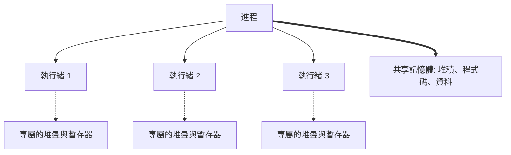
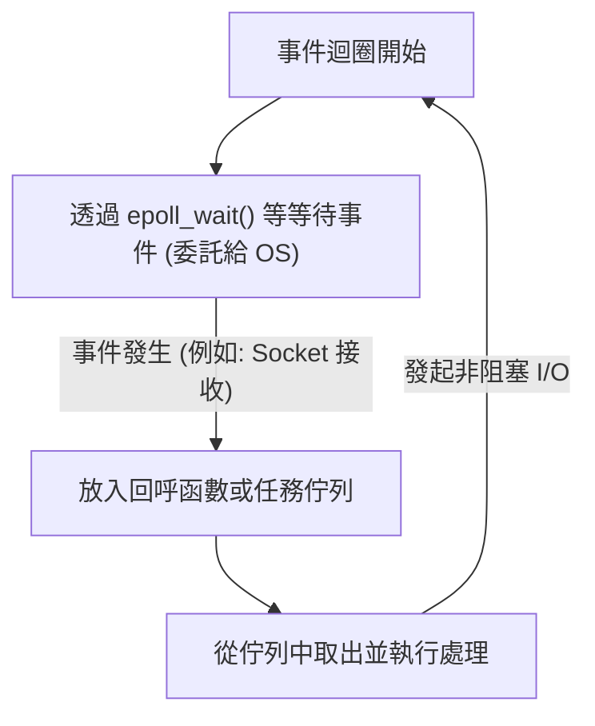

現代軟體開發中，效能與可擴展性是密不可分的重要主題。特別是在處理高流量的 Web 伺服器或即時通訊的系統中，「如何高效地處理請求」將決定系統的生死。

為了解決這個問題，現代許多程式語言都提供了 `async` / `await` 等非同步處理的語法。但是，為什麼需要非同步處理呢？為什麼像過去那樣「對一個請求分配一個執行緒」的簡單模型會面臨極限呢？

這個答案深植於 OS（作業系統）核心層級的「上下文切換（Context Switch）」機制及其代價，以及硬體架構的限制中。本篇文章將從 OS 的進程與執行緒管理機制開始，深入探討上下文切換的硬體成本、C10K 問題、事件驅動架構（epoll/kqueue），以及使用者空間的協程（Coroutine）與 `async/await` 機制。

## 1. OS 的進程與執行緒管理基礎

### 1.1 什麼是進程（Process）
進程是執行中程式的實例，也是 OS 分配資源的基本單位。進程擁有獨立的記憶體空間（虛擬位址空間），並與其他進程隔離。為了管理進程，OS 在核心空間中維護一個稱為 **PCB (Process Control Block)** 的資料結構。PCB 中記錄了進程 ID、暫存器狀態、記憶體管理資訊（如指向分頁表的指標）、開啟的檔案描述符（File Descriptor）等。

### 1.2 執行緒的出現與輕量化
在早期的 OS 中，為了進行並行處理，必須生成（`fork`）多個進程。然而，由於進程擁有完全獨立的記憶體空間，因此生成成本和進程間通訊（IPC）的開銷（Overhead）非常大。

於是出現了**執行緒（Thread）**。執行緒也被稱為「輕量級進程 (Lightweight Process)」，它與同一個進程內的其他執行緒共享記憶體空間（堆積、資料區段、程式碼區段）。不過，每個執行緒都有自己的執行上下文，也就是**執行緒專屬的堆疊**和**暫存器集合（如程式計數器）**。執行緒的管理資訊作為 **TCB (Thread Control Block)** 保存在核心中。



透過共享記憶體，執行緒的生成和通訊成本比進程大幅降低，但「由核心進行排程與切換」的根本開銷依然存在。

## 2. 上下文切換的真正代價

在多工 OS 中，為了在有限的 CPU 核心上營造出同時執行多個執行緒的假象，會以分時（Time-slicing）的方式高速切換執行的執行緒。此外，當執行緒等待磁碟 I/O 或網路通訊完成（即阻塞，Block）時，OS 也會進行切換，將 CPU 讓給其他執行緒。這個切換過程稱為**上下文切換 (Context Switch)**。

上下文切換絕不是免費的。它的代價不僅僅是軟體處理上的開銷，更會對硬體的快取架構造成重大影響。

### 2.1 暫存器與狀態的保存與還原
當發生上下文切換時，CPU 會將目前正在執行的執行緒的暫存器狀態（程式計數器、堆疊指標、通用暫存器等）保存（退避）到該執行緒的 TCB 或核心堆疊中。接著，再從下一個要執行的執行緒的 TCB 中讀取（還原）暫存器狀態。光是這樣就需要花費數十到數百個時脈週期的成本。

### 2.2 TLB (Translation Lookaside Buffer) 的刷新
如果是進程間的上下文切換，還會產生更沉重的成本，那就是 **TLB 的刷新（Flush）**。TLB 是 CPU 內部的一種超高速記憶體，用於快取從虛擬位址到實體位址的轉換結果。
當進程切換時，虛擬位址空間會改變，因此前一個進程的 TLB 條目將會失效。為此，OS 必須刷新（清除）TLB，而新進程恢復執行後，為了進行位址轉換，每次都需要查詢記憶體中的分頁表（Page Walk），這會導致嚴重的效能下降。

### 2.3 CPU 快取 (L1/L2/L3) 的污染與失效
即使是執行緒間的上下文切換（就算是在同一個進程內），也會發生**快取污染（Cache Pollution）**。新排程的執行緒會將前一個執行緒留在快取中的資料擠出，並開始將自己的資料載入快取。這會導致頻繁的快取未命中（Cache Miss），進而增加記憶體存取的延遲（Latency）。

因此，上下文切換最大的代價並非「保存與還原的處理時間」，而是「CPU 快取和 TLB 等管線最佳化機制被重置所造成的間接效能下降」。

## 3. C10K 問題與「每個連線一個執行緒」的極限

在網際網路普及初期，Web 伺服器（例如早期的 Apache）採用的是 **「對每個網路連線分配一個 OS 執行緒（或進程）」** 的模型（Thread-per-connection）。

這個模型的優點在於程式碼非常簡單。當呼叫函式從網路讀取資料時，在資料到達之前，該執行緒只需單純地阻塞（Sleep）即可。

```c
// Thread-per-connection 模型的虛擬碼
void handle_connection(int socket) {
    char buffer[1024];
    // 在資料到來之前，此執行緒會被核心阻塞（暫停）
    int bytes = read(socket, buffer, 1024); 
    process_data(buffer, bytes);
    write(socket, response);
}
```

然而，到了 2000 年代，當同時連線數達到一萬台（10K）時，這個模型就崩潰了。這就是著名的 **C10K 問題 (10,000 Client Problem)**。

### 極限的原因 1：記憶體耗盡
當建立一個 OS 執行緒時，系統會為每個執行緒分配專屬的堆疊空間（在 Linux 中預設通常為數 MB）。為了處理一萬個連線而建立一萬個執行緒，光是堆疊就需要數十 GB 的記憶體。這對當時的硬體來說是不切實際的容量。

### 極限的原因 2：上下文切換風暴
當存在數千到數萬個執行緒，且它們不斷重複等待網路 I/O 完成而阻塞和喚醒時，會發生什麼事呢？核心的排程器尋找下一個應執行執行緒的開銷會增加，且如前所述，上下文切換導致的快取未命中會頻繁發生。結果，CPU 大部分的時間都被浪費在「執行緒切換（核心處理）」上，而不是「實際的處理」上。

## 4. 事件驅動架構與非阻塞 I/O

為了解決 C10K 問題，結合了**事件驅動架構 (Event-Driven Architecture)** 與**非阻塞 I/O (Non-blocking I/O)** 的模型應運而生。Nginx、Node.js、Redis 等都採用了這種架構，實現了壓倒性的效能。

### 4.1 非阻塞 I/O
如果在非阻塞模式下操作 Socket，即使資料尚未到達，核心也不會讓執行緒阻塞，而是立即回傳錯誤（`EAGAIN` 或 `EWOULDBLOCK`）。這樣一來，單一執行緒就不會處於等待狀態，可以繼續執行其他處理。

### 4.2 核心層級的事件通知機制 (epoll / kqueue)
然而，對於數萬個非阻塞 Socket，依序不斷詢問「資料來了嗎？」（即輪詢，Polling）是極度低效的。

因此，OS 核心提供了用於 **I/O 多工處理 (I/O Multiplexing)** 的進階系統呼叫。
- Linux: **`epoll`**
- BSD/macOS: **`kqueue`**
- Windows: **IOCP (I/O Completion Ports)**

早期的 `select` 或 `poll` 會在每次呼叫時，將所有受監控的檔案描述符（FD）列表傳遞給核心，而核心則以 O(N) 的時間複雜度掃描它們。
相較之下，`epoll` 會在核心內部維護一個事件表，並且只將發生 I/O 事件的 FD 列表回傳給應用程式，因此它以 O(1)（精確來說是與發生的事件數量成正比）運作。

### 4.3 事件迴圈的誕生
藉由上述機制，只需使用單一執行緒（或數量與 CPU 核心數相同的一小群執行緒），就能高效地處理數萬個連線。這就是**事件迴圈 (Event Loop)**。



事件迴圈只是一直重複「向 OS 詢問事件」→「執行對應發生事件的處理（Callback）」這個循環。如此便排除了 OS 層級繁重的上下文切換，將 CPU 資源發揮到極限。

## 5. 使用者空間的協程與 async/await

事件驅動架構在效能方面是完美的解決方案，但卻給程式設計師帶來了巨大的痛苦。那就是**回呼地獄 (Callback Hell)**。

每次進行 I/O 操作都必須註冊回呼函數，導致程式碼的執行流程被分割，錯誤處理和複雜的狀態管理變得非常困難。

### 5.1 協程與上下文切換移至使用者空間
為了解決這種複雜性同時保持效能，「**協程 (Coroutine)**」或「**綠色執行緒 (Green Thread)**」的概念開始普及。Go 語言的 Goroutine 即是代表之一。

它們是在 OS 的核心執行緒上運作的「由使用者空間（程式端）管理的輕量級執行緒」。
當某個協程進入 I/O 等待時，它不會將控制權交還給核心（阻塞），而是由**使用者空間的排程器（Runtime）**保存該協程的執行狀態，並切換到另一個協程。

這種在使用者空間進行的切換不伴隨 OS 的上下文切換，不會發生特權模式切換（系統呼叫），也不會發生 TLB 刷新，因此可以在數奈秒到數十奈秒的極低成本內完成。

### 5.2 async/await 的魔法：編譯器的狀態機轉換
此外，許多現代語言（C#、JavaScript/TypeScript、Python、Rust 等）引入了 `async` 和 `await`，將非同步處理整合為語言語法。

`async/await` 真正的威力在於：**「將人類眼中同步撰寫（由上往下）的程式碼，由編譯器在背後轉換為狀態機（State Machine），並與事件迴圈整合在一起」**。

當出現 `await` 關鍵字時，執行緒實際上並不會停在那裡。
1. 目前函式的狀態（如區域變數）會被保存到堆積上的物件（如 Future 或 Promise）中。
2. I/O 處理被註冊到事件迴圈（或 epoll）中。
3. 函式的執行暫時中斷（`yield`），控制權交還給事件迴圈或呼叫者。
4. 當 I/O 完成時，事件迴圈偵測到事件，便從保存的狀態中恢復函式的執行（`resume`）。

```rust
// Rust 非同步處理的示意圖
async fn fetch_data() -> Result<Data, Error> {
    // 非同步發起網路連線
    let mut stream = TcpStream::connect("example.com").await?; 
    // 在上面的 .await，函式實際上會中斷，並返回事件迴圈。
    // 當連線建立後，會從這裡恢復執行。
    
    let mut buffer = Vec::new();
    // 讀取資料。這也是非同步的，不會阻塞。
    stream.read_to_end(&mut buffer).await?;
    
    Ok(parse(buffer))
}
```

在標榜零成本抽象（Zero-cost Abstraction）的語言（如 Rust）中，`async` 函式在編譯時會被完全轉換為基於 `enum` 且具有狀態的狀態機。連動態記憶體配置都被限制在最小範圍，從而發揮極限的效能。

## 6. 非同步處理的課題：「函式的顏色 (What Color is Your Function?)」

`async/await` 雖然強大，但並非萬靈丹。最著名的架構問題就是「函式著色問題」。

為了在非同步函式（假設為紅色函式）中使用 `await`，呼叫它的函式也必須是非同步函式（紅色）。同步函式（藍色函式）無法直接呼叫非同步函式並等待結果。
這導致整個程式碼庫被分裂成「同步的世界」與「非同步的世界」。

此外，如果將 CPU 密集型（計算密集型）處理放在 `async` 函式中長時間執行，就會阻塞事件迴圈本身，導致所有其他非同步任務停止（Starvation），有引發嚴重 Bug 的危險。在非同步的世界裡，雖然允許「因等待 I/O 而阻塞」，但嚴禁「因 CPU 計算而獨佔迴圈」。

## 7. 結論

我們日常使用的 `async` / `await` 這般簡潔語法的背後，凝聚了計算機科學幾十年來的最佳化歷史。

- 為了避免**高成本的硬體上下文切換**（TLB 刷新、快取未命中）。
- 為了節省容易耗盡的**記憶體資源（執行緒堆疊）**。
- 為了發揮核心 **epoll/kqueue** 的力量。
- 以及為了**將開發者從非同步回呼的複雜性中解放出來**。

現代的 `async/await` 誕生於 OS 進程與執行緒管理的極限，進化至事件驅動架構，並透過編譯器的力量進行抽象化。理解這層深奧的機制，將有助於您設計出效能更高、更安全且具備可擴展性的系統。
