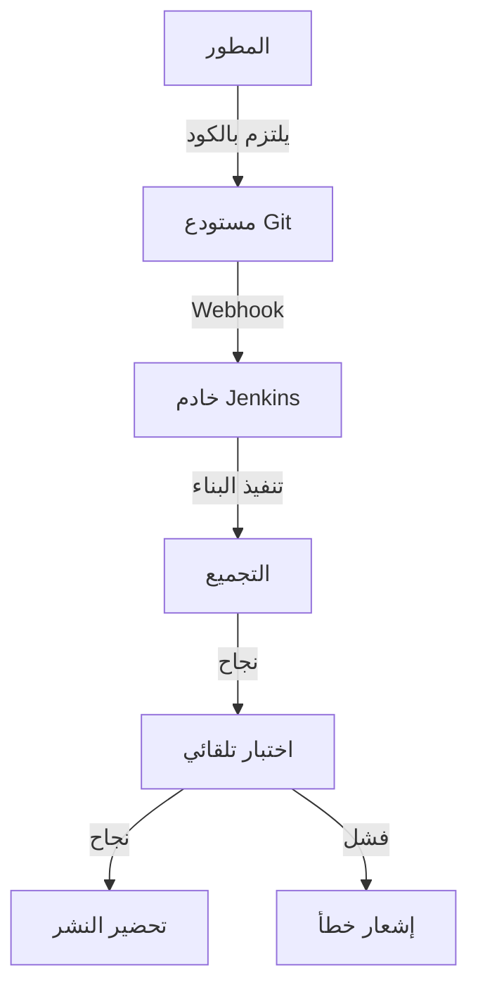
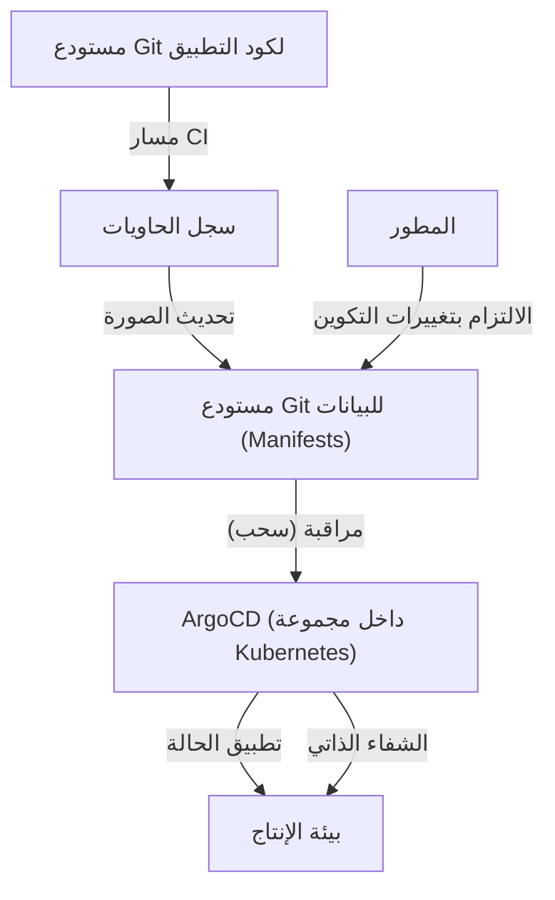

## مقدمة: "الرعب" والكدح باسم النشر

في الماضي، كان إصدار البرمجيات مرادفًا لـ "الرعب". كان المهندسون يتجمعون في الليل أو في أيام العطلات، لتشغيل عملاء FTP يدويًا ورفع الملفات إلى الخوادم. كانت ملفات Excel الضخمة التي تسمى "أدلة الإجراءات" تحتوي على عدد لا يحصى من عناصر التحقق، وإذا كان هناك خطأ واحد فقط، فإن النظام يتوقف، وتنتظرهم نوبات عمل طوال الليل (مسيرة الموت) من أجل التراجع.

كان هذا النشر اليدوي مثالاً صارخًا لما يسمى بـ "الكدح" (Toil: جهد متكرر وغير منتج). الكدح يقلل من دافع المهندسين ويسلبهم الوقت المخصص للابتكار. في هذا المقال، سنتعمق في هذا المسار الملحمي، من العصور المظلمة للنشر اليدوي إلى GitOps الحديثة، وكيف تطورت ممارسات التكامل المستمر / التسليم المستمر (CI/CD) وغيرت عالم تطوير البرمجيات من جذوره.

## الفصل الأول: البرمجة القصوى (XP) وولادة التكامل المستمر

في تاريخ هندسة البرمجيات، تم تحديد مفهوم التكامل المستمر (Continuous Integration: CI) بوضوح في أواخر التسعينيات من خلال "البرمجة القصوى (XP)" التي اقترحها كينت بيك وآخرون.

في بيئات التطوير في ذلك الوقت، كان النهج السائد يُعرف بـ "تكامل الانفجار العظيم". حيث يكتب كل مطور كودًا بشكل مستقل لأسابيع أو أشهر، ويحاول دمج (تكامل) جميع الأكواد في النهاية. ومع ذلك، في هذه اللحظة، كانت "عاصفة من تعارضات الدمج" تهب دائمًا تقريبًا. مجرد تحديد تغيير من الذي تسبب في تعطل النظام كان يضيع قدرًا هائلاً من الوقت.

حاولت البرمجة القصوى (XP) حل هذه المشكلة من خلال "التكامل المتكرر". يدمج المطورون أكوادهم في الفرع الرئيسي عدة مرات في اليوم، ويديرون اختبارات تلقائية في كل مرة. الفلسفة هي "إذا كان مكسورًا، فلاحظ ذلك فورًا وأصلحه". ولكن، لتنفيذ ذلك، كان من الضروري وجود آلية لأتمتة البناء والاختبار والسماح لأي شخص بتنفيذها بسهولة.

## الفصل الثاني: إضفاء الطابع الديمقراطي على الأتمتة بواسطة Hudson (Jenkins)

في منتصف العقد الأول من القرن الحادي والعشرين، ظهر بطل رئيسي نشر مفهوم التكامل المستمر من عدد قليل من الفرق المتقدمة إلى بيئات التطوير حول العالم. هذا هو "Hudson"، الذي أصبح لاحقًا "Jenkins".

اكتسب Hudson، الذي طوره كوسوكي كاواغوتشي، شعبية هائلة كخادم تكامل مستمر مفتوح المصدر يعتمد على Java. ما جعل Jenkins رائدًا هو نظامه البيئي القوي للإضافات. يمكنه دمج أي أداة بسلاسة، مثل أنظمة التحكم في الإصدار (Subversion و Git)، أدوات البناء (Ant و Maven و Gradle)، أطر الاختبار، وحتى أدوات الإشعارات (مثل البريد الإلكتروني و Slack).

أخذ Jenkins الدور المعتمد على الأفراد لـ "رجل البناء" من المهندسين وأضفى الطابع الديمقراطي على عملية CI/CD. بدأت الفرق تهتم بجودة الكود للحفاظ على "الكرة الزرقاء" (نجاح) على لوحة المعلومات، وترسخت ثقافة الإصلاح الفوري إذا ظهرت "الكرة الحمراء" (فشل).

ومع ذلك، واجه Jenkins أيضًا تحديات. كان يتطلب تشغيل وصيانة الخادم، وكان عرضة للوقوع في "جحيم الإضافات" حيث تصبح تبعيات الإضافات معقدة. بالإضافة إلى ذلك، نظرًا لأن التكوين كان يتم غالبًا من خلال واجهة المستخدم الرسومية (GUI)، فقد كان غير كافٍ من منظور البنية التحتية ككود (Infrastructure as Code).

## الفصل الثالث: الاندماج مع تقنية الحاويات (Docker)

في عام 2013، مع ظهور Docker، تغير نموذج تطوير البرمجيات بشكل جذري. العذر القديم "إنه يعمل على جهازي" أصبح من الماضي بفضل تقنية الحاويات.

أدى دمج CI/CD وتقنية الحاويات إلى تحسين موثوقية التسليم بشكل كبير. من خلال تجميع التطبيق وجميع تبعياته (المكتبات، بيئة التشغيل، وما إلى ذلك) في صورة حاوية، تم القضاء تمامًا على الاختلافات البيئية بين بيئات التطوير والاختبار والإنتاج.

منذ هذه الحقبة، انتقل المنتج النهائي لعملية التكامل المستمر (CI) من "ملف قابل للتنفيذ" إلى "صورة حاوية". يتم دفع الصورة المبنية إلى سجل الحاويات، وتتولى عملية التسليم المستمر (CD) الأمر وتنشره في كل بيئة.

## الفصل الرابع: صعود GitHub Actions و CI/CD بدون خادم (Serverless)

برزت خدمات CI/CD القائمة على السحابة لحل تحديات إدارة البنية التحتية التي واجهها Jenkins. مهدت Travis CI و CircleCI الطريق، وبعد ذلك، أصبح "GitHub Actions" الذي تقدمه GitHub نفسها هو المعيار الفعلي في الصناعة.

أكبر ميزة لـ GitHub Actions هي أن المنصة التي تستضيف الكود ومنصة CI/CD مدمجتان تمامًا. بمجرد وضع ملف YAML (تعريف سير العمل) في دليل `.github/workflows` داخل المستودع، يمكن تحقيق أي نوع من الأتمتة.

نظراً لكونه بدون خادم، لا يحتاج فريق التطوير إلى القلق بشأن تصحيح أو توسيع خادم CI. بالإضافة إلى ذلك، من خلال مفهوم الخطوات القابلة لإعادة الاستخدام المسماة "Actions"، أصبح من الممكن تجميع مسارات عمل معقدة مثل كتل البناء من خلال الجمع بين عدد لا يحصى من الـ Actions التي أنشأها مجتمع المصادر المفتوحة.

## الفصل الخامس: GitOps — الشكل النهائي من خلال نهج السحب (Pull)

وصل تطور CI/CD أخيرًا إلى نموذج قوي يسمى "GitOps". اقترحته Weaveworks، وهو نهج يجعل "مستودع Git هو المصدر الوحيد الموثوق للحقيقة للنظام".

كاستمرار لمسار CI، اتخذت أدوات CD التقليدية (مثل Jenkins) نهج "الدفع" (Push) لأوامر النشر إلى بيئات خارجية (مثل مجموعات Kubernetes) بعد اكتمال البناء. ومع ذلك، في نموذج "الدفع" هذا، تحتاج أداة CI إلى صلاحيات قوية على بيئة الإنتاج، مما أدى إلى وجود مخاطر أمنية. بالإضافة إلى ذلك، إذا تم تغيير إعدادات بيئة الإنتاج يدويًا، ستنشأ مشكلة انحراف (Drift) بين الإعدادات على Git والحالة الفعلية.

في المقابل، تتبنى أدوات GitOps مثل ArgoCD و Flux نهج "السحب" (Pull).

1. **التعريف التصريحي**: يتم حفظ جميع الحالات المرغوبة (Desired State) للبنية التحتية والتطبيقات في Git كبيانات (Manifests) Kubernetes أو مخططات Helm.
2. **المزامنة التلقائية**: يقوم وكيل GitOps (مثل ArgoCD) الذي يعمل داخل المجموعة بمراقبة (سحب) مستودع Git بانتظام.
3. **الشفاء الذاتي**: إذا كان هناك فرق بين تعريف Git والحالة الفعلية للمجموعة، يكتشف الوكيل ذلك تلقائيًا ويقوم بتصحيح (مزامنة) حالة المجموعة لتتطابق مع تعريف Git.

بفضل GitOps، أصبح النشر مجرد "التزام ودمج في Git". حتى في حالة حدوث فشل، يمكنك ببساطة استخدام `git revert` للالتزام السابق على Git، وسيعود النظام فورًا إلى حالة آمنة سابقة.

## الخلاصة: جعل الإصدار "مملاً"

لم يعد النشر حدثًا مليئًا بالرعب. في الممارسات الحديثة والممتازة لـ CI/CD و GitOps، يجب أن يكون الإصدار "مهمة روتينية طبيعية ومملة للغاية، تمامًا مثل تدفق الماء".

بدءًا من رفع FTP اليدوي، إلى فلسفة XP، والنظام البيئي لإضافات Jenkins، وقابلية نقل Docker، وتحول GitHub Actions إلى بنية بدون خادم، وصولاً إلى التحكم المستقل لـ GitOps الذي قدمه ArgoCD. هذا المسار الطويل من التطور كان كله تاريخًا يهدف إلى "السماح للبشر بالتركيز على العمل الإبداعي حقًا".

ستستمر التكنولوجيا في التطور في المستقبل. ومع ذلك، فإن الفلسفة الأساسية لـ CI/CD، وهي "القضاء على الكدح من خلال الأتمتة وتسريع دورة تقديم القيمة"، لن تتغير أبدًا.
