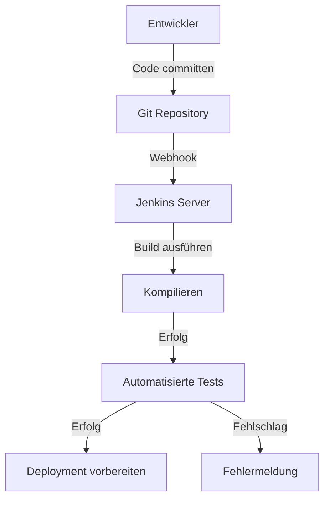
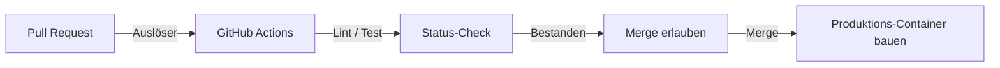
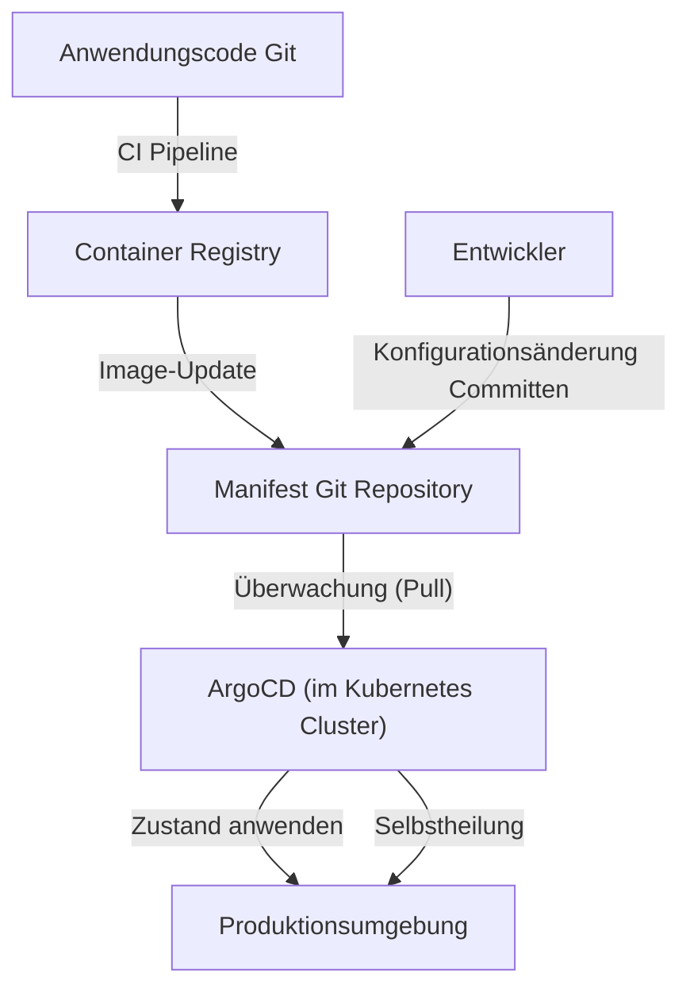

## Einleitung: Die "Angst" namens Deployment und Toil

Früher war ein Software-Release gleichbedeutend mit "Angst". Ingenieure versammelten sich nachts oder an Wochenenden, bedienten manuelle FTP-Clients und luden Dateien auf Server hoch. Lange Excel-Dateien namens "Handbücher" enthielten unzählige Prüfpunkte, und schon ein einziger Fehler konnte das System zum Stillstand bringen, was eine ganze Nacht Arbeit (Death March) für den Rollback bedeutete.

Dieses manuelle Deployment war das beste Beispiel für sogenannten "Toil" (unproduktive, sich wiederholende Arbeit). Toil verringert die Motivation der Ingenieure und raubt Zeit für Innovationen. In diesem Artikel werden wir die epische Reise vertiefen, wie CI/CD (Continuous Integration / Continuous Delivery) von den dunklen Zeiten des manuellen Deployments bis zum modernen GitOps gewachsen ist und die Welt der Softwareentwicklung grundlegend verändert hat.

## Kapitel 1: Extreme Programming (XP) und die Geburt von Continuous Integration

In der Geschichte der Softwareentwicklung wurde das Konzept der Continuous Integration (CI) erst Ende der 1990er Jahre im Rahmen des von Kent Beck und anderen vorgeschlagenen "Extreme Programming (XP)" klar definiert.

Zu dieser Zeit war die sogenannte "Big Bang Integration" die vorherrschende Methode. Jeder Entwickler schrieb unabhängig voneinander über Wochen oder Monate hinweg Code, um schließlich am Ende den gesamten Code zusammenzuführen (zu integrieren). In diesem Moment brach jedoch fast immer ein "Sturm von Merge-Konflikten" aus. Allein die Identifizierung, wessen Änderung das System beschädigt hatte, verschwendete enorm viel Zeit.

XP versuchte dieses Problem durch "häufiges Integrieren" zu lösen. Entwickler mergen ihren Code mehrmals täglich in den Main-Branch und führen jedes Mal automatisierte Tests aus. Die Philosophie lautete: "Wenn etwas kaputt ist, bemerke es sofort und repariere es". Um dies in die Praxis umzusetzen, war jedoch ein Mechanismus unerlässlich, der Builds und Tests automatisierte und von jedem einfach ausgeführt werden konnte.

## Kapitel 2: Demokratisierung der Automatisierung durch Hudson (Jenkins)

Mitte der 2000er Jahre tauchte ein Schlüsselakteur auf, der das CI-Konzept von einigen wenigen fortschrittlichen Teams auf Entwicklungsstandorte weltweit ausweitete. Dies war "Hudson", später bekannt als "Jenkins".

Hudson, entwickelt von Kohsuke Kawaguchi, erlangte als Java-basierter Open-Source-CI-Server explosive Beliebtheit. Das Bahnbrechende an Jenkins war sein starkes Plugin-Ökosystem. Es ermöglichte die nahtlose Integration aller möglichen Tools, wie Versionskontrollsysteme (Subversion oder Git), Build-Tools (Ant, Maven, Gradle), Test-Frameworks und sogar Benachrichtigungs-Tools (wie E-Mail und Slack).

Jenkins entzog den Ingenieuren die stark personenabhängige Rolle des "Build-Onkels" und demokratisierte den CI/CD-Prozess. Teams begannen, mehr auf Code-Qualität zu achten, um die "blauen Bälle (Erfolg)" auf dem Dashboard aufrechtzuerhalten, und die Kultur, sofort zu korrigieren, wenn "rote Bälle (Fehlschlag)" auftauchten, schlug Wurzeln.

Allerdings hatte Jenkins auch seine Probleme. Server-Wartung und -Betrieb waren notwendig, und man konnte leicht in eine "Plugin-Hölle" geraten, in der Plugin-Abhängigkeiten immer komplexer wurden. Zudem wurden Konfigurationen oft über die GUI vorgenommen, was aus der Perspektive von Infrastructure as Code (IaC) unzureichend war.

## Kapitel 3: Fusion mit Containertechnologie (Docker)

Als Docker 2013 erschien, veränderte sich das Paradigma der Softwareentwicklung dramatisch. Die alte Ausrede "Auf meiner Maschine funktioniert es (It works on my machine)" gehörte durch die Containertechnologie der Vergangenheit an.

Die Fusion von CI/CD und Containertechnologie hat die Zuverlässigkeit der Auslieferung dramatisch erhöht. Durch das Verpacken der Anwendung und all ihrer Abhängigkeiten (Bibliotheken, Laufzeitumgebungen usw.) in ein Container-Image wurden Umgebungsunterschiede zwischen Entwicklungs-, Test- und Produktionsumgebungen vollständig eliminiert.

Seit dieser Ära hat sich das finale Ergebnis des CI-Prozesses von einer "ausführbaren Datei" zu einem "Container-Image" verschoben. Das gebaute Image wird in eine Container-Registry gepusht, und der CD-Prozess (Continuous Delivery) übernimmt es und stellt es in den jeweiligen Umgebungen bereit.

## Kapitel 4: Der Aufstieg von GitHub Actions und Serverless CI/CD

Als Lösung für die Infrastrukturmanagement-Probleme von Jenkins kamen cloudbasierte CI/CD-Dienste auf. Travis CI und CircleCI waren Vorreiter, und später etablierte sich "GitHub Actions", angeboten von GitHub selbst, als De-facto-Standard der Industrie.

Der größte Vorteil von GitHub Actions besteht darin, dass der Ort, an dem der Code gehostet wird, vollständig in die CI/CD-Plattform integriert ist. Durch einfaches Platzieren einer YAML-Datei (Workflow-Definition) im `.github/workflows`-Verzeichnis innerhalb des Repositorys kann jede Art von Automatisierung realisiert werden.

Da es serverless ist, müssen sich Entwicklungsteams nicht um das Patchen oder Skalieren von CI-Servern kümmern. Darüber hinaus ermöglichte das Konzept der "Actions" (wiederverwendbare Schritte), unzählige von der Open-Source-Community erstellte Actions zu kombinieren und komplexe Pipelines wie beim Spielen mit Bauklötzen aufzubauen.

## Kapitel 5: GitOps — Die ultimative Form durch den Pull-Ansatz

Die Evolution von CI/CD hat schließlich ein mächtiges Paradigma namens "GitOps" erreicht. Das von Weaveworks vorgeschlagene GitOps ist ein Ansatz, der "das Git-Repository als einzige verlässliche Informationsquelle (Single Source of Truth) für das System nutzt".

Herkömmliche CD-Tools (wie Jenkins) verfolgten als Verlängerung der CI-Pipeline einen "Push"-Ansatz, bei dem Deployment-Befehle nach Abschluss des Builds in externe Umgebungen (wie Kubernetes-Cluster) gesendet wurden. Dieser "Push-Ansatz" barg jedoch Sicherheitsrisiken, da das CI-Tool starke Berechtigungen für die Produktionsumgebung haben musste. Außerdem bestand das Problem, dass sich die Einstellungen in Git und der tatsächliche Zustand voneinander entfernten (Drift), wenn Konfigurationen der Produktionsumgebung manuell geändert wurden.

Im Gegensatz dazu übernehmen GitOps-Tools wie ArgoCD und Flux einen "Pull"-Ansatz.

1. **Deklarative Definition**: Der gewünschte Zustand (Desired State) der Infrastruktur und der Anwendung wird vollständig als Kubernetes-Manifeste oder Helm-Charts in Git gespeichert.
2. **Automatische Synchronisierung**: Ein GitOps-Agent (wie ArgoCD), der im Cluster läuft, überwacht das Git-Repository regelmäßig (Pull).
3. **Selbstheilung**: Wenn es eine Diskrepanz zwischen der Definition in Git und dem tatsächlichen Zustand des Clusters gibt, erkennt der Agent diese automatisch und korrigiert (synchronisiert) den Cluster-Zustand so, dass er mit der Git-Definition übereinstimmt.

Mit GitOps wurde das Deployment zu einem einfachen "Git Commit und Merge". Selbst im Fehlerfall kann man durch einen einfachen `git revert` auf den vorherigen Commit in Git das System sofort in seinen vorherigen, sicheren Zustand zurückversetzen.

## Fazit: Wie man Releases "langweilig" macht

Ein Deployment ist kein von Angst erfülltes Großereignis mehr. Bei hervorragenden modernen CI/CD- und GitOps-Praktiken sollte ein Release eine "so natürliche wie fließendes Wasser und extrem langweilige Routineaufgabe" sein.

Angefangen beim manuellen FTP-Upload über die Philosophie von XP, das Plugin-Ökosystem von Jenkins, die Portabilität von Docker, den Serverless-Ansatz von GitHub Actions bis hin zur autonomen Steuerung von GitOps durch ArgoCD: Diese lange Evolutionsreise war nichts anderes als eine Geschichte, deren Ziel es ist, "dass sich Menschen auf wirklich kreative Arbeit konzentrieren können".

Die Technologie wird sich auch weiterhin weiterentwickeln. Doch die grundlegende Philosophie von CI/CD, "Toil durch Automatisierung zu eliminieren und den Zyklus der Wertschöpfung zu beschleunigen", wird sich für immer nicht ändern.
