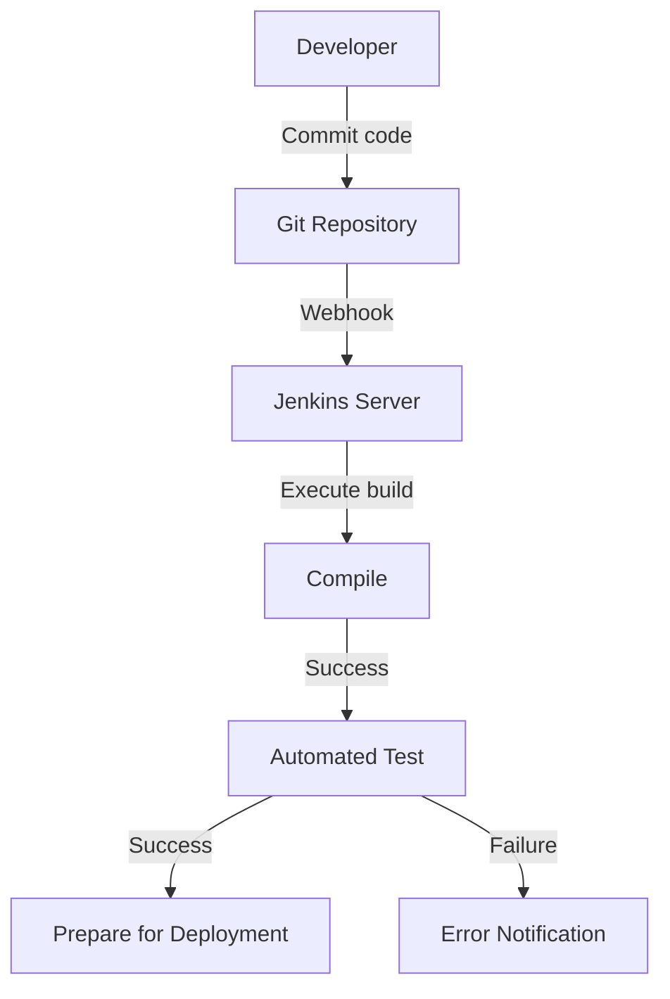
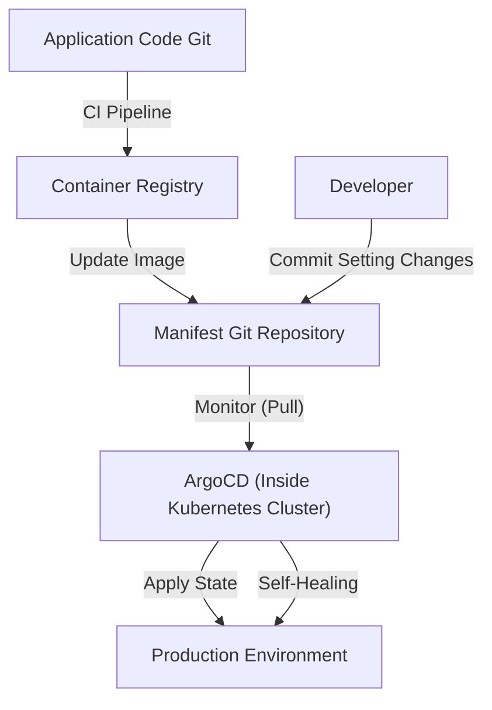

## Introduction: The "Horror" of Deployment and Toil

In the past, software releases were synonymous with "horror". Engineers would gather at night or on holidays, manually operate FTP clients, and upload files to servers. The "procedure manual", a massive Excel file, contained countless check items, and a single mistake would silence the system, awaiting an all-night effort (death march) to roll back.

This manual deployment was the prime example of "toil" (unproductive repetitive labor). Toil drains engineers' motivation and steals time for innovation. In this article, we delve deeply into the grand trajectory of how CI/CD (Continuous Integration / Continuous Delivery) has evolved from the dark ages of manual deployment to modern GitOps, fundamentally transforming the world of software development.

## Chapter 1: Extreme Programming (XP) and the Birth of Continuous Integration

In the history of software engineering, the concept of Continuous Integration (CI) was clearly defined in "Extreme Programming (XP)", advocated by Kent Beck and others in the late 1990s.

At the time, a method called "Big Bang Integration" was mainstream in development. Each developer would write code independently over weeks or months, and finally attempt to combine (integrate) all the code at the end. However, this moment almost always brought a "storm of merge conflicts". A massive amount of time was wasted just identifying whose changes broke the system.

XP attempted to solve this problem by "integrating frequently". Developers merge code into the main branch multiple times a day, running automated tests each time. The philosophy is "if it's broken, notice it immediately and fix it." However, to practice this, a mechanism to automate builds and tests so anyone could easily execute them was absolutely necessary.

## Chapter 2: The Democratization of Automation by Hudson (Jenkins)

In the mid-2000s, a key player emerged that spread the concept of CI from a few progressive teams to development sites worldwide. That was "Hudson", later known as "Jenkins".

Developed by Kohsuke Kawaguchi, Hudson gained explosive popularity as a Java-based open-source CI server. What made Jenkins groundbreaking was its powerful plugin ecosystem. It could seamlessly integrate with version control systems (Subversion, Git), build tools (Ant, Maven, Gradle), test frameworks, and even notification tools (Email, Slack, etc.).

Jenkins took away the personalized role of the "build guy" from engineers and democratized the CI/CD process. Teams began paying attention to code quality to maintain the "blue ball" (success) on the dashboard, and a culture of immediately fixing the code when a "red ball" (failure) appeared took root.

However, Jenkins also had challenges. It required server operation and maintenance, and it was easy to fall into "plugin hell" where plugin dependencies became complicated. Furthermore, settings were often done via GUI, which was insufficient from the perspective of Infrastructure as Code.

## Chapter 3: Convergence with Container Technology (Docker)

When Docker appeared in 2013, the software development paradigm changed dramatically. The old excuse "It works on my machine" became a thing of the past thanks to container technology.

The convergence of CI/CD and container technology dramatically increased delivery certainty. By packaging the application and all its dependencies (libraries, runtimes, etc.) into a container image, environment differences between development, testing, and production environments were completely eliminated.

From this era, the final product of the CI process shifted from "executable files" to "container images". The built image is pushed to a container registry, and the CD (Continuous Delivery) process takes over to deploy it to each environment.

## Chapter 4: GitHub Actions and the Rise of Serverless CI/CD

Emerging to solve the infrastructure management challenges of Jenkins were cloud-based CI/CD services. Travis CI and CircleCI paved the way, and then "GitHub Actions", provided by GitHub itself, became established as the industry's de facto standard.

The biggest advantage of GitHub Actions is that the place where the code is hosted and the CI/CD platform are completely integrated. Simply placing a YAML file (workflow definition) in the `.github/workflows` directory of the repository enables all kinds of automation.

Being serverless means development teams don't have to worry about patching or scaling the CI server. Also, the concept of reusable steps called "Actions" allowed developers to combine countless Actions created by the open-source community to build complex pipelines like building blocks.

## Chapter 5: GitOps — The Ultimate Form via Pull-based Approach

The evolution of CI/CD finally reached a powerful paradigm called "GitOps". Advocated by Weaveworks, GitOps is an approach that "makes the Git repository the Single Source of Truth for the system".

Traditional CD tools (like Jenkins) took a "Push" approach where deployment commands were pushed to external environments (like Kubernetes clusters) after the build completed, as an extension of the CI pipeline. However, this "Push type" required the CI tool to have powerful permissions for the production environment, presenting security risks. Also, if production environment settings were manually changed, there was a problem of divergence (drift) between the settings on Git and the actual state.

In contrast, GitOps tools like ArgoCD and Flux adopt a "Pull-based" approach.

1. **Declarative Definition**: All desired states of infrastructure and applications are stored in Git as Kubernetes manifests or Helm charts.
2. **Automated Synchronization**: A GitOps agent (like ArgoCD) running inside the cluster periodically monitors (Pulls) the Git repository.
3. **Self-Healing**: If there is a difference between the Git definition and the actual cluster state, the agent automatically detects it and fixes (synchronizes) the cluster state to match the Git definition.

With GitOps, deployment has become merely a "Git commit and merge". Even if a failure occurs, the system instantly rolls back to the previous safe state simply by executing `git revert` to the previous commit on Git.

## Conclusion: Making Releases "Boring"

Deployment is no longer a major event filled with terror. In the practice of modern excellent CI/CD and GitOps, a release should be a "perfectly natural and extremely boring daily task, like flowing water."

Starting from manual FTP uploads, through the philosophy of XP, the plugin ecosystem of Jenkins, the portability of Docker, the serverless nature of GitHub Actions, and the autonomous control of GitOps brought by ArgoCD. This long trajectory of evolution has entirely been a history of "letting humans focus on truly creative work."

Technology will undoubtedly continue to evolve. However, the fundamental philosophy of CI/CD—"eliminating toil through automation and accelerating the cycle of value delivery"—will remain unchanged forever.
