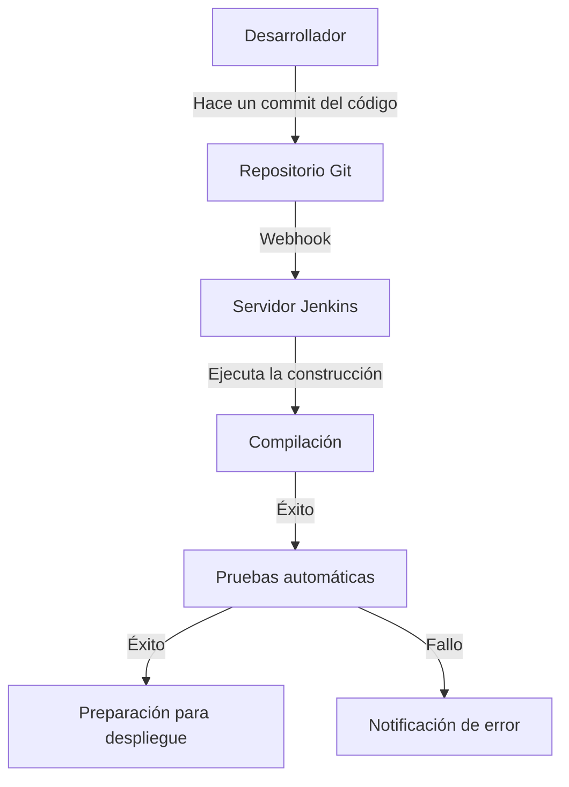
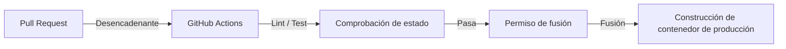
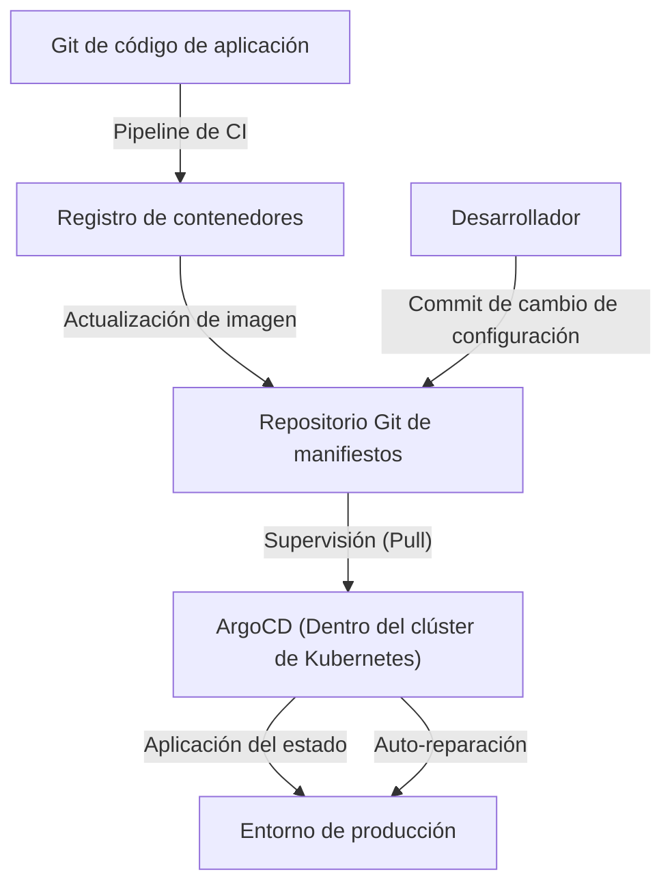

## Introducción: El "terror" llamado despliegue y el "toil" (trabajo repetitivo)

En el pasado, el lanzamiento de software era sinónimo de "terror". Los ingenieros se reunían por las noches o los fines de semana, operaban manualmente clientes FTP y subían archivos a los servidores. Un enorme archivo Excel llamado "manual de procedimientos" contenía innumerables puntos de control, y si había un solo error, el sistema se silenciaba, y les esperaba un trabajo nocturno (marcha de la muerte) para revertir los cambios.

Este despliegue manual era el máximo ejemplo del llamado "toil" (esfuerzo repetitivo sin productividad). El "toil" merma la motivación de los ingenieros y roba tiempo para la innovación. En este artículo, profundizaremos en la gran trayectoria de cómo CI/CD (Integración Continua / Entrega Continua) ha evolucionado desde aquella era oscura del despliegue manual hasta el moderno GitOps, y cómo ha transformado fundamentalmente el mundo del desarrollo de software.

## Capítulo 1: Programación Extrema (XP) y el nacimiento de la Integración Continua

En la historia de la ingeniería de software, el concepto de Integración Continua (Continuous Integration: CI) se definió claramente en la "Programación Extrema (XP)", propuesta por Kent Beck y otros a finales de los años 90.

En el entorno de desarrollo de aquella época, la técnica predominante era la llamada "Integración Big Bang". Cada desarrollador escribía código de forma independiente durante semanas o meses, y al final intentaban combinar (integrar) todo el código a la vez. Sin embargo, en ese momento siempre se desataba una "tormenta de conflictos de fusión". Se perdía una enorme cantidad de tiempo solo en identificar el cambio de quién había provocado la ruptura del sistema.

XP intentó resolver este problema integrando con frecuencia. Los desarrolladores fusionaban su código en la rama principal varias veces al día y ejecutaban pruebas automáticas en cada ocasión. La filosofía era: "Si está roto, date cuenta y arréglalo de inmediato". Sin embargo, para poner esto en práctica, era indispensable contar con un mecanismo que automatizara la construcción y las pruebas, y que cualquiera pudiera ejecutar fácilmente.

## Capítulo 2: La democratización de la automatización gracias a Hudson (Jenkins)

A mediados de la década del 2000, surgió un protagonista que popularizó el concepto de CI desde unos pocos equipos de vanguardia hacia los entornos de desarrollo de todo el mundo. Ese fue "Hudson", que más tarde se conocería como "Jenkins".

Desarrollado por Kohsuke Kawaguchi, Hudson ganó una popularidad explosiva como servidor de CI de código abierto basado en Java. Lo que hizo revolucionario a Jenkins fue su poderoso ecosistema de plugins. Permitía integrar sin problemas todo tipo de herramientas: sistemas de control de versiones (Subversion, Git), herramientas de construcción (Ant, Maven, Gradle), marcos de pruebas y herramientas de notificación (como correo electrónico y Slack).

Jenkins arrebató a los ingenieros el rol personalista del "tío de las builds" y democratizó el proceso de CI/CD. Los equipos comenzaron a preocuparse por la calidad del código para mantener la "bola azul (éxito)" en el panel de control, y se arraigó la cultura de arreglar de inmediato si aparecía una "bola roja (fallo)".

Sin embargo, Jenkins también tenía sus desafíos. Requería mantenimiento operativo del servidor, y era fácil caer en el "infierno de los plugins" debido a la complejidad de sus dependencias. Además, la configuración se hacía frecuentemente a través de una interfaz gráfica (GUI), lo cual era insuficiente desde el punto de vista de la infraestructura como código (Infrastructure as Code).

## Capítulo 3: Fusión con la tecnología de contenedores (Docker)

En 2013, con la aparición de Docker, el paradigma del desarrollo de software cambió drásticamente. La antigua excusa de "en mi máquina funcionaba (It works on my machine)" pasó a ser historia gracias a la tecnología de contenedores.

La fusión de CI/CD y la tecnología de contenedores aumentó drásticamente la fiabilidad de las entregas. Al empaquetar la aplicación y todas sus dependencias (bibliotecas, tiempo de ejecución, etc.) en una imagen de contenedor, se eliminaron por completo las diferencias de entorno entre el entorno de desarrollo, el entorno de pruebas y el entorno de producción.

Desde esa era, el artefacto final del proceso de CI pasó de ser un "archivo ejecutable" a una "imagen de contenedor". La imagen construida se enviaba a un registro de contenedores, y el proceso de CD (Entrega Continua) tomaba el relevo para desplegarla en cada entorno.

## Capítulo 4: El auge de GitHub Actions y CI/CD Serverless

Los servicios de CI/CD basados en la nube surgieron para resolver los problemas de gestión de infraestructura que tenía Jenkins. Travis CI y CircleCI fueron pioneros, y posteriormente "GitHub Actions", proporcionado por el propio GitHub, se estableció como el estándar de facto en la industria.

La mayor ventaja de GitHub Actions es que el lugar donde se aloja el código y la plataforma de CI/CD están completamente integrados. Con solo colocar un archivo YAML (definición de flujo de trabajo) en el directorio `.github/workflows` del repositorio, se logra cualquier tipo de automatización.

Al ser serverless, los equipos de desarrollo no tienen que preocuparse por aplicar parches o escalar el servidor de CI. Además, gracias al concepto de "Actions", que son pasos reutilizables, se hizo posible construir complejas canalizaciones (pipelines) como si fuera un juego de bloques, combinando innumerables acciones creadas por la comunidad de código abierto.

## Capítulo 5: GitOps — La forma definitiva mediante el enfoque basado en "Pull"

La evolución de CI/CD finalmente alcanzó un paradigma poderoso llamado "GitOps". GitOps, propuesto por Weaveworks, es un enfoque que hace que "el repositorio Git sea la única fuente de verdad fiable (Single Source of Truth) del sistema".

Las herramientas de CD tradicionales (como Jenkins), como extensión del pipeline de CI, adoptaban un enfoque de empuje ("Push"), donde enviaban comandos de despliegue a entornos externos (como clústeres de Kubernetes) después de completar la construcción. Sin embargo, en este modelo "Push", la herramienta de CI necesitaba tener privilegios elevados en el entorno de producción, lo que suponía un riesgo de seguridad. Además, si la configuración del entorno de producción se cambiaba manualmente, se producía una discrepancia (drift) entre la configuración en Git y el estado real.

Frente a esto, las herramientas de GitOps como ArgoCD o Flux adoptan un enfoque de extracción ("Pull").

1. **Definición declarativa**: Todo el estado deseado (Desired State) de la infraestructura y las aplicaciones se guarda en Git como manifiestos de Kubernetes o gráficos de Helm.
2. **Sincronización automática**: Un agente de GitOps (como ArgoCD) que se ejecuta dentro del clúster supervisa (Pull) periódicamente el repositorio Git.
3. **Auto-reparación**: Si hay una diferencia entre la definición en Git y el estado real del clúster, el agente lo detecta automáticamente y corrige (sincroniza) el estado del clúster para que coincida con la definición de Git.

Con GitOps, el despliegue se convirtió simplemente en un "commit y merge en Git". Incluso si ocurre un fallo, con solo hacer un `git revert` al commit anterior en Git, el sistema retrocede instantáneamente a un estado anterior seguro.

## Conclusión: Para que los lanzamientos sean "aburridos"

Los despliegues ya no son grandes eventos llenos de terror. En la excelente práctica moderna de CI/CD y GitOps, los lanzamientos deben ser "rutinas extremadamente aburridas y tan naturales como el flujo del agua".

Comenzando con la subida manual por FTP, la filosofía de XP, el ecosistema de plugins de Jenkins, la portabilidad de Docker, la adopción serverless de GitHub Actions y el control autónomo de GitOps impulsado por ArgoCD. Esta larga trayectoria de evolución ha sido toda una historia para "permitir que los humanos se concentren en el trabajo verdaderamente creativo".

La tecnología seguirá evolucionando. Sin embargo, la idea fundamental de CI/CD de "eliminar el toil mediante la automatización y acelerar el ciclo de entrega de valor" nunca cambiará.
