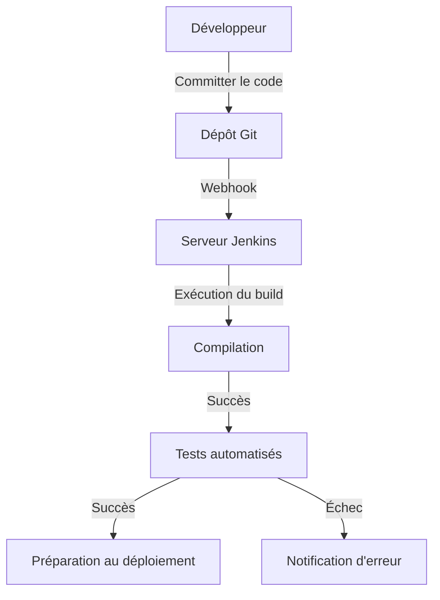
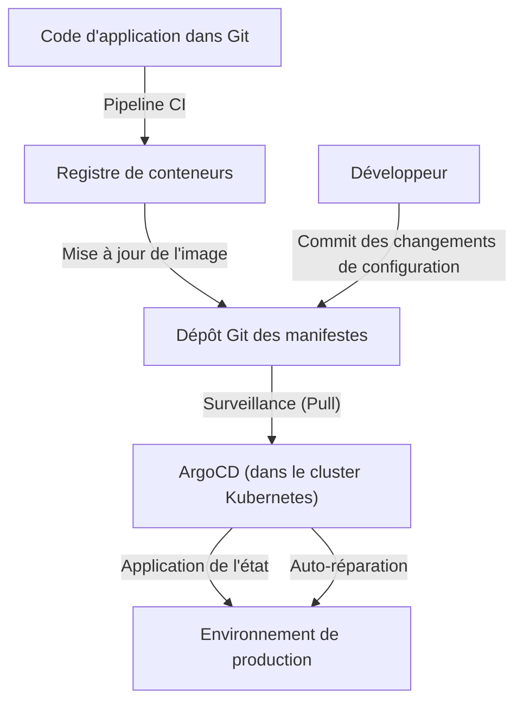

## Introduction : La « peur » et le labeur du déploiement

Autrefois, le déploiement de logiciels était synonyme de « peur ». Les ingénieurs se réunissaient la nuit ou les jours fériés pour manipuler manuellement les clients FTP et uploader les fichiers sur les serveurs. De longs fichiers Excel appelés « manuels de procédures » contenaient d'innombrables cases à cocher, et une seule erreur suffisait pour que le système devienne silencieux, ce qui impliquait de travailler toute la nuit (marche de la mort) pour effectuer un rollback.

Ces déploiements manuels étaient l'exemple parfait du « Toil » (le labeur : travail répétitif sans productivité). Le toil mine la motivation des ingénieurs et vole le temps consacré à l'innovation. Dans cet article, nous explorerons la trajectoire épique de l'évolution du CI/CD (Intégration Continue / Livraison Continue), de l'âge sombre des déploiements manuels à l'ère moderne de GitOps, et comment il a fondamentalement transformé le monde du développement logiciel.

## Chapitre 1 : Extreme Programming (XP) et la naissance de l'Intégration Continue

Dans l'histoire du génie logiciel, le concept d'Intégration Continue (Continuous Integration : CI) a été clairement défini à la fin des années 1990 par Kent Beck et d'autres dans le cadre de la méthodologie « Extreme Programming (XP) ».

À l'époque, la méthode appelée « Big Bang Integration » dominait. Chaque développeur écrivait du code de manière indépendante pendant des semaines, voire des mois, puis essayait d'intégrer l'ensemble du code à la toute fin. Cependant, ce moment déclenchait presque systématiquement une « tempête de conflits de fusion ». Beaucoup de temps était perdu simplement pour identifier la modification responsable de la panne du système.

XP a tenté de résoudre ce problème en « intégrant fréquemment ». Les développeurs fusionnaient leur code dans la branche principale plusieurs fois par jour, et des tests automatisés étaient exécutés à chaque fois. La philosophie était la suivante : « S'il est cassé, repérez-le et réparez-le immédiatement. » Cependant, pour mettre cela en pratique, il était essentiel d'automatiser les builds et les tests, et de disposer d'un système que tout le monde pouvait exécuter facilement.

## Chapitre 2 : La démocratisation de l'automatisation par Hudson (Jenkins)

Au milieu des années 2000, le pionnier qui a popularisé le concept de CI, le faisant passer des équipes avancées aux environnements de développement du monde entier, est apparu : il s'agissait de « Hudson », qui allait devenir plus tard « Jenkins ».

Développé par Kohsuke Kawaguchi, Hudson a gagné une popularité explosive en tant que serveur CI open-source basé sur Java. Ce qui rendait Jenkins révolutionnaire, c'était son puissant écosystème de plugins. Il permettait une intégration transparente avec toutes sortes d'outils, qu'il s'agisse de systèmes de contrôle de version (Subversion ou Git), d'outils de construction (Ant, Maven, Gradle), de frameworks de tests, ou encore d'outils de notification (emails, Slack, etc.).

Jenkins a retiré le rôle personnalisé du « gars des builds » aux ingénieurs, démocratisant ainsi le processus CI/CD. Les équipes ont commencé à prêter attention à la qualité du code pour maintenir la « boule bleue (succès) » sur le tableau de bord, et la culture de corriger immédiatement le code lorsqu'une « boule rouge (échec) » apparaissait a pris racine.

Cependant, Jenkins avait aussi ses défis. Il nécessitait des opérations de maintenance du serveur et était susceptible de tomber dans « l'enfer des plugins », où les dépendances entre les plugins devenaient trop complexes. De plus, la configuration se faisait souvent via l'interface graphique (GUI), ce qui n'était pas adéquat du point de vue de l'Infrastructure as Code (l'infrastructure en tant que code).

## Chapitre 3 : La convergence avec la technologie des conteneurs (Docker)

En 2013, l'émergence de Docker a radicalement changé le paradigme du développement logiciel. La vieille excuse « Ça marche sur ma machine » est devenue obsolète grâce à la technologie des conteneurs.

L'intégration du CI/CD et de la technologie des conteneurs a considérablement amélioré la fiabilité des livraisons. En packagenant l'application et toutes ses dépendances (bibliothèques, runtimes, etc.) dans une image de conteneur, ils ont complètement éliminé les différences d'environnement entre le développement, les tests et la production.

Depuis cette époque, le livrable final du processus CI est passé de « fichier exécutable » à « image de conteneur ». Les images construites sont poussées dans des registres de conteneurs, et le processus CD (Continuous Delivery) prend le relais pour les déployer dans différents environnements.

## Chapitre 4 : L'essor de GitHub Actions et du CI/CD Serverless

Les services CI/CD basés sur le cloud ont émergé pour résoudre les problèmes de gestion d'infrastructure rencontrés par Jenkins. Travis CI et CircleCI ont ouvert la voie, suivis de « GitHub Actions », fourni par GitHub lui-même, qui est devenu la norme de facto de l'industrie.

Le plus grand avantage de GitHub Actions est que la plateforme CI/CD est parfaitement intégrée à l'endroit où le code est hébergé. Il suffit de placer des fichiers YAML (définitions de workflows) dans le répertoire `.github/workflows` du dépôt pour réaliser tout type d'automatisation.

Étant serverless, les équipes de développement n'ont plus à se soucier de l'application de correctifs ou de la mise à l'échelle des serveurs CI. De plus, grâce au concept d'étapes réutilisables appelées « Actions », il est désormais possible de combiner d'innombrables Actions créées par la communauté open source pour construire des pipelines complexes, comme des blocs de construction.

## Chapitre 5 : GitOps — L'étape ultime via l'approche Pull

L'évolution du CI/CD a finalement abouti à un paradigme puissant appelé « GitOps ». Proposé par Weaveworks, GitOps est une approche selon laquelle « le dépôt Git sert de source unique de vérité pour le système » (Single Source of Truth).

Les outils CD traditionnels (comme Jenkins) adoptaient une approche de type « Push », où, en tant qu'extension du pipeline CI, ils poussaient les commandes de déploiement vers des environnements externes (comme les clusters Kubernetes) une fois le build terminé. Cependant, cette méthode « Push » nécessitait que l'outil CI détienne des droits d'accès importants à l'environnement de production, ce qui présentait des risques de sécurité. De plus, si des configurations étaient modifiées manuellement en production, un décalage (drift) se produisait entre l'état réel et la configuration définie dans Git.

En revanche, les outils GitOps comme ArgoCD et Flux adoptent une approche de type « Pull » (Tirer).

1. **Définitions déclaratives** : L'état souhaité (Desired State) de l'infrastructure et des applications est entièrement stocké dans Git sous forme de manifestes Kubernetes ou de charts Helm.
2. **Synchronisation automatique** : Les agents GitOps (comme ArgoCD) s'exécutant au sein du cluster surveillent (Pull) régulièrement le dépôt Git.
3. **Auto-réparation** : S'il y a un décalage entre la définition dans Git et l'état réel du cluster, l'agent le détecte automatiquement et corrige (synchronise) l'état du cluster pour correspondre à la définition Git.

Grâce à GitOps, les déploiements se résument désormais à de simples « commits et fusions Git ». En cas de problème, il suffit de faire un `git revert` vers le commit précédent dans Git, et le système revient instantanément à un état de sécurité antérieur.

## Conclusion : Pour rendre les livraisons « ennuyeuses »

Les déploiements ne sont plus des événements majeurs remplis de peur. Dans les excellentes pratiques de CI/CD et de GitOps modernes, une livraison devrait être « une tâche quotidienne extrêmement ennuyeuse et aussi naturelle que l'eau qui coule ».

En commençant par les uploads manuels par FTP, puis la philosophie d'XP, l'écosystème de plugins de Jenkins, la portabilité de Docker, l'approche serverless de GitHub Actions, et enfin le contrôle autonome de GitOps apporté par ArgoCD. Cette longue trajectoire d'évolution était en réalité une histoire visant à « permettre aux humains de se concentrer sur un travail véritablement créatif ».

La technologie continuera sans doute d'évoluer. Toutefois, la philosophie fondamentale du CI/CD, qui consiste à « éliminer le labeur grâce à l'automatisation et à accélérer le cycle de création de valeur », restera à jamais inchangée.
