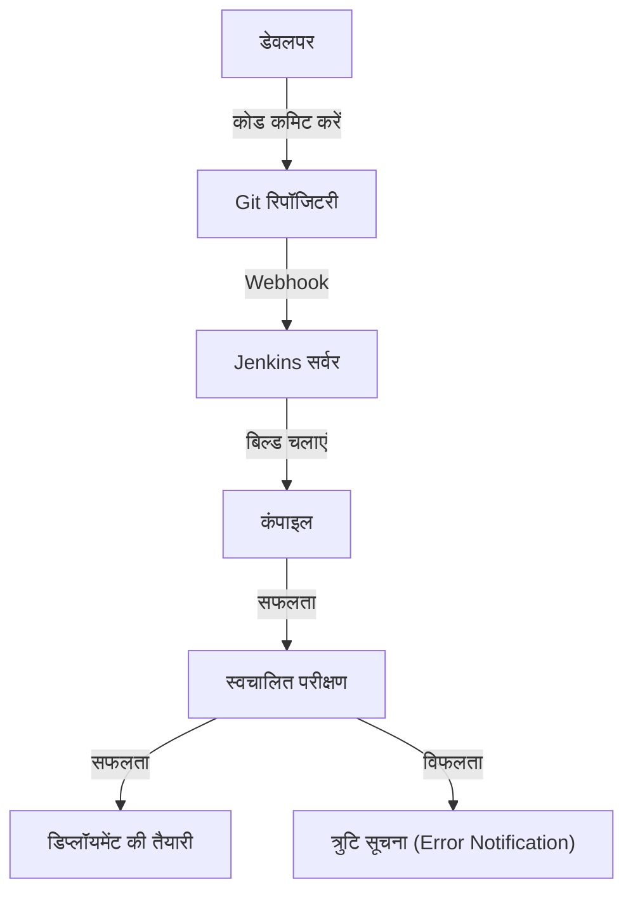
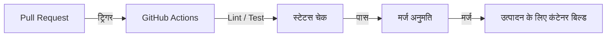
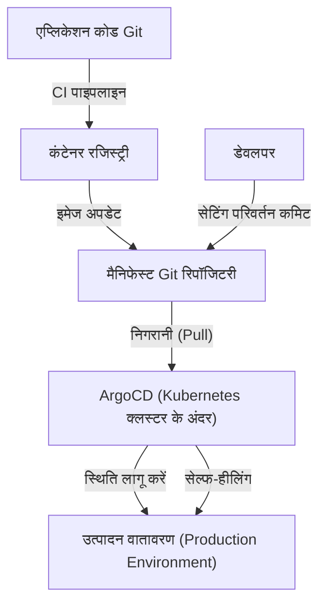

## प्रस्तावना: डिप्लॉयमेंट नाम का "डर" और टॉयल (Toil)

एक समय था जब सॉफ्टवेयर रिलीज़ का मतलब "डर" होता था। इंजीनियर रात में या छुट्टियों में इकट्ठा होते थे, मैनुअल रूप से एफ़टीपी (FTP) क्लाइंट संचालित करते थे और सर्वर पर फाइलें अपलोड करते थे। "प्रक्रिया नियमावली" (Procedure Manual) नामक एक लंबी एक्सेल फ़ाइल में अनगिनत चेकलिस्ट आइटम होते थे, और एक भी गलती होने पर सिस्टम बंद हो जाता था, जिसके बाद रोलबैक करने के लिए रात भर काम (डेथ मार्च) करना पड़ता था।

यह मैनुअल डिप्लॉयमेंट "टॉयल" (Toil: बिना उत्पादकता वाला दोहरावदार श्रम) का सबसे बड़ा उदाहरण था। टॉयल इंजीनियरों के मनोबल को कम करता है और नवाचार (innovation) का समय छीन लेता है। इस लेख में, हम गहराई से जानेंगे कि कैसे CI/CD (निरंतर एकीकरण / निरंतर वितरण) विकसित हुआ और मैनुअल डिप्लॉयमेंट के उस अंधेरे युग से लेकर आधुनिक GitOps तक सॉफ्टवेयर विकास की दुनिया को मौलिक रूप से बदल दिया।

## अध्याय 1: एक्सट्रीम प्रोग्रामिंग (XP) और निरंतर एकीकरण (Continuous Integration) का जन्म

सॉफ्टवेयर इंजीनियरिंग के इतिहास में, "निरंतर एकीकरण" (Continuous Integration: CI) की अवधारणा को पहली बार 1990 के दशक के अंत में केंट बेक और अन्य द्वारा प्रस्तावित "एक्सट्रीम प्रोग्रामिंग (XP)" में स्पष्ट रूप से परिभाषित किया गया था।

उस समय, विकास के माहौल में "बिग बैंग इंटीग्रेशन" नामक विधि मुख्यधारा में थी। प्रत्येक डेवलपर हफ्तों या महीनों तक स्वतंत्र रूप से कोड लिखता था, और अंत में सभी कोड को एक साथ जोड़ने (एकीकृत करने) का प्रयास करता था। लेकिन इस क्षण में लगभग हमेशा "मर्ज कॉन्फ्लिक्ट्स का तूफान" आता था। केवल यह पता लगाने में ही बहुत समय बर्बाद हो जाता था कि किसके बदलाव के कारण सिस्टम टूटा है।

XP ने कोड को "लगातार मर्ज करके" इस समस्या को हल करने का प्रयास किया। डेवलपर्स दिन में कई बार मुख्य ब्रांच में कोड मर्ज करते हैं और हर बार स्वचालित परीक्षण (automated tests) चलाते हैं। इसके पीछे का दर्शन है: "यदि यह टूटा हुआ है, तो इसे तुरंत पहचानें और ठीक करें।" हालांकि, इसे व्यवहार में लाने के लिए, बिल्ड और परीक्षण को स्वचालित करना और ऐसा सिस्टम बनाना आवश्यक था जिसे कोई भी आसानी से चला सके।

## अध्याय 2: हडसन (Hudson / Jenkins) द्वारा स्वचालन (Automation) का लोकतंत्रीकरण

2000 के दशक के मध्य में, एक ऐसा टूल उभरा जिसने CI की अवधारणा को कुछ उन्नत टीमों से हटाकर दुनिया भर के विकास वातावरण में फैला दिया। वह था "Hudson", जिसे बाद में "Jenkins" के रूप में जाना गया।

कोसुके कावागुची द्वारा विकसित Hudson ने जावा-आधारित ओपन सोर्स CI सर्वर के रूप में अपार लोकप्रियता हासिल की। Jenkins की क्रांतिकारी विशेषता इसका शक्तिशाली प्लगइन इकोसिस्टम था। यह वर्जन कंट्रोल सिस्टम (Subversion या Git), बिल्ड टूल (Ant, Maven, Gradle), टेस्टिंग फ्रेमवर्क, और यहां तक कि नोटिफिकेशन टूल (ईमेल, Slack आदि) जैसे किसी भी उपकरण को मूल रूप से एकीकृत कर सकता था।

Jenkins ने इंजीनियरों से "बिल्ड अंकल" (वह व्यक्ति जो बिल्ड के लिए ज़िम्मेदार होता था) की व्यक्ति-निर्भर भूमिका को छीन लिया और CI/CD प्रक्रिया का लोकतंत्रीकरण किया। टीमों ने डैशबोर्ड पर "नीली गेंद (सफलता)" बनाए रखने के लिए कोड की गुणवत्ता पर ध्यान देना शुरू कर दिया, और यदि "लाल गेंद (विफलता)" दिखाई देती, तो उसे तुरंत ठीक करने की संस्कृति जड़ पकड़ने लगी।

हालांकि, Jenkins की भी अपनी चुनौतियां थीं। सर्वर के संचालन और रखरखाव की आवश्यकता थी, और यह "प्लगइन हेल" (Plugin Hell) में पड़ने की संभावना रखता था जहाँ प्लगइन्स की निर्भरता जटिल हो जाती थी। इसके अलावा, चूंकि कॉन्फ़िगरेशन अक्सर GUI के माध्यम से किया जाता था, यह इन्फ्रास्ट्रक्चर एज़ कोड (Infrastructure as Code) के दृष्टिकोण से अपर्याप्त था।

## अध्याय 3: कंटेनर तकनीक (Docker) के साथ एकीकरण

2013 में, Docker के आगमन के साथ, सॉफ्टवेयर विकास का प्रतिमान नाटकीय रूप से बदल गया। "मेरे कंप्यूटर पर यह काम कर रहा था (It works on my machine)" का पुराना बहाना कंटेनर तकनीक के कारण अतीत की बात हो गया।

CI/CD और कंटेनर तकनीक के एकीकरण ने डिलीवरी की निश्चितता को काफी बढ़ा दिया। एप्लिकेशन और उसकी सभी निर्भरताओं (लाइब्रेरी, रनटाइम, आदि) को कंटेनर इमेज में पैकेज करके, विकास वातावरण, परीक्षण वातावरण और उत्पादन (production) वातावरण के बीच के अंतर को पूरी तरह से समाप्त कर दिया गया।

इस युग से, CI प्रक्रिया का अंतिम आउटपुट "निष्पादन योग्य फ़ाइल (Executable File)" से "कंटेनर इमेज" में स्थानांतरित हो गया। निर्मित (built) इमेज को कंटेनर रजिस्ट्री में धकेल दिया जाता है, और CD (Continuous Delivery) प्रक्रिया इसे अपने अधिकार में ले लेती है और प्रत्येक वातावरण में डिप्लॉय कर देती है।

## अध्याय 4: GitHub Actions और सर्वरलेस CI/CD का उदय

क्लाउड-आधारित CI/CD सेवाएं Jenkins की बुनियादी ढांचे के प्रबंधन की चुनौतियों को हल करने के लिए उभरीं। Travis CI और CircleCI ने रास्ता दिखाया, और बाद में GitHub द्वारा प्रदान की गई "GitHub Actions" उद्योग के वास्तविक मानक (de facto standard) के रूप में स्थापित हो गई।

GitHub Actions का सबसे बड़ा लाभ यह है कि कोड को होस्ट करने का स्थान और CI/CD प्लेटफ़ॉर्म पूरी तरह से एकीकृत हैं। बस रिपॉजिटरी में `.github/workflows` निर्देशिका में YAML फ़ाइलें (वर्कफ़्लो परिभाषाएँ) रखकर, सभी प्रकार के स्वचालन को प्राप्त किया जा सकता है।

चूंकि यह सर्वरलेस है, इसलिए विकास टीमों को CI सर्वर की पैचिंग या स्केलिंग के बारे में चिंता करने की आवश्यकता नहीं है। इसके अलावा, "Actions" नामक पुन: प्रयोज्य (reusable) चरणों की अवधारणा के साथ, अब ओपन-सोर्स समुदाय द्वारा बनाए गए अनगिनत Actions को मिलाकर ब्लॉक गेम की तरह जटिल पाइपलाइन बनाना संभव हो गया है।

## अध्याय 5: GitOps — पुल-आधारित (Pull-based) दृष्टिकोण द्वारा अंतिम रूप

CI/CD का विकास अंततः "GitOps" नामक एक शक्तिशाली प्रतिमान तक पहुंच गया है। Weaveworks द्वारा प्रस्तावित GitOps, "Git रिपॉजिटरी को सिस्टम की सच्चाई का एकमात्र स्रोत (Single Source of Truth) बनाने" का दृष्टिकोण है।

पारंपरिक CD टूल (जैसे Jenkins) ने CI पाइपलाइन के विस्तार के रूप में बिल्ड पूरा होने के बाद डिप्लॉयमेंट कमांड को बाहरी वातावरण (जैसे Kubernetes क्लस्टर) में "Push" करने का दृष्टिकोण अपनाया था। हालाँकि, इस "Push-आधारित" विधि में, CI टूल के पास उत्पादन वातावरण के शक्तिशाली अधिकार होने चाहिए, जिससे सुरक्षा जोखिम पैदा होते हैं। इसके अलावा, यदि उत्पादन वातावरण सेटिंग्स को मैन्युअल रूप से बदला जाता है, तो Git पर सेटिंग्स और वास्तविक स्थिति (drift) के बीच अंतर की समस्या उत्पन्न होती है।

इसके विपरीत, ArgoCD और Flux जैसे GitOps टूल "Pull-आधारित" दृष्टिकोण अपनाते हैं।

1. **घोषणात्मक परिभाषा (Declarative Definition)**: बुनियादी ढांचे और एप्लिकेशन की वांछित स्थिति (Desired State) को Kubernetes मैनिफेस्ट या Helm चार्ट के रूप में Git में सहेजा जाता है।
2. **स्वचालित तुल्यकालन (Auto Synchronization)**: क्लस्टर के अंदर चलने वाला GitOps एजेंट (जैसे ArgoCD) नियमित रूप से Git रिपॉजिटरी की निगरानी (Pull) करता है।
3. **सेल्फ-हीलिंग (Self-Healing)**: यदि Git परिभाषा और वास्तविक क्लस्टर स्थिति के बीच कोई अंतर है, तो एजेंट स्वचालित रूप से इसका पता लगाता है और क्लस्टर की स्थिति को Git परिभाषा से मेल खाने के लिए सही (सिंक) करता है।

GitOps के साथ, डिप्लॉयमेंट मात्र "Git का कमिट और मर्ज" बन गया है। यदि कोई विफलता होती है, crossed, तो आप बस Git पर पिछले कमिट में `git revert` कर सकते हैं, और सिस्टम तुरंत अपनी पिछली सुरक्षित स्थिति में वापस आ जाता है।

## निष्कर्ष: रिलीज़ को "उबाऊ" बनाने के लिए

डिप्लॉयमेंट अब डर से भरी कोई बड़ी घटना नहीं है। उत्कृष्ट आधुनिक CI/CD और GitOps प्रथाओं में, रिलीज़ "पानी के बहने की तरह स्वाभाविक, और बेहद उबाऊ दैनिक कार्य" होना चाहिए।

मैनुअल एफ़टीपी अपलोड से शुरू होकर, XP का दर्शन, Jenkins का प्लगइन इकोसिस्टम, Docker की पोर्टेबिलिटी, GitHub Actions का सर्वरलेस स्वरूप, और ArgoCD द्वारा लाया गया GitOps स्वायत्त नियंत्रण। विकास का यह लंबा प्रक्षेपवक्र इस इतिहास के बारे में है कि "मनुष्यों को वास्तव में रचनात्मक कार्य पर ध्यान केंद्रित करने की अनुमति कैसे दी जाए।"

भविष्य में भी तकनीक का विकास जारी रहेगा। हालांकि, "स्वचालन के माध्यम से टॉयल को खत्म करने और मूल्य वितरण चक्र (value delivery cycle) को तेज करने" का बुनियादी CI/CD विचार हमेशा के लिए अपरिवर्तित रहेगा।
