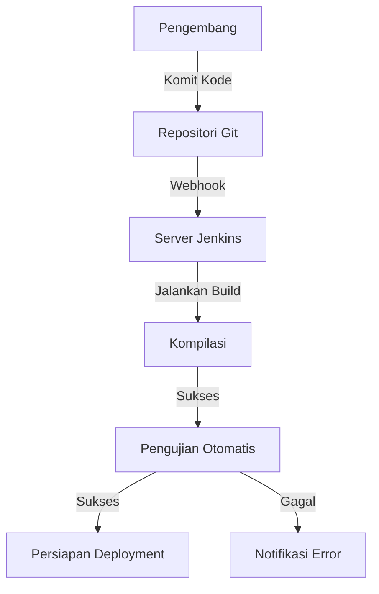
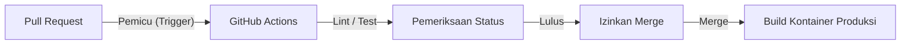
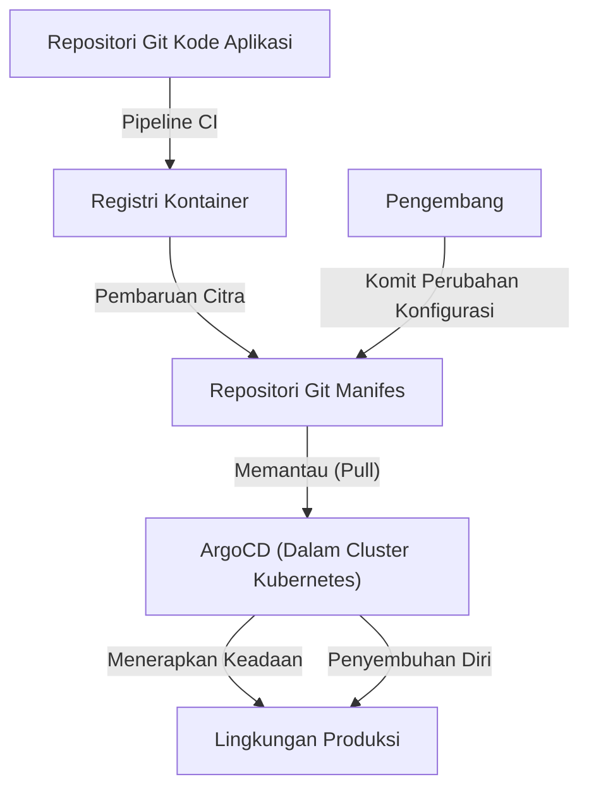

## Pengantar: "Teror" Bernama Deployment dan Toil

Dulu, merilis perangkat lunak identik dengan "teror". Para insinyur berkumpul pada malam hari atau hari libur, secara manual mengoperasikan klien FTP, dan mengunggah file ke server. Sebuah file Excel panjang bernama "Panduan Langkah-langkah" dipenuhi daftar periksa yang tak terhitung jumlahnya, dan jika ada satu kesalahan saja, sistem akan diam, diikuti dengan kerja semalaman (death march) untuk melakukan rollback.

Deployment manual ini adalah contoh utama dari "toil" (upaya berulang yang tidak produktif). Toil mengurangi motivasi insinyur dan merampas waktu untuk inovasi. Artikel ini akan membahas lebih dalam tentang jejak epik bagaimana CI/CD (Continuous Integration/Continuous Delivery) berevolusi dari era kelam deployment manual hingga GitOps modern, dan bagaimana hal itu secara fundamental mengubah dunia pengembangan perangkat lunak.

## Bab 1: Extreme Programming (XP) dan Lahirnya Continuous Integration

Dalam sejarah rekayasa perangkat lunak, konsep Continuous Integration (CI) didefinisikan secara jelas pada akhir 1990-an dalam "Extreme Programming (XP)" yang diusulkan oleh Kent Beck dan rekan-rekannya.

Pada saat itu, pendekatan "Big Bang Integration" sangat umum di lapangan. Setiap pengembang akan menulis kode secara independen selama berminggu-minggu hingga berbulan-bulan, lalu mencoba menggabungkan (mengintegrasikan) semua kode pada akhirnya. Namun, hampir setiap saat, "badai konflik merge" akan terjadi. Mereka membuang banyak waktu hanya untuk mengidentifikasi perubahan siapa yang menyebabkan sistem rusak.

XP mencoba memecahkan masalah ini dengan "sering menggabungkan". Pengembang menggabungkan kode ke cabang utama (main branch) beberapa kali sehari dan menjalankan pengujian otomatis setiap kalinya. Filosofinya adalah "jika rusak, segera sadari dan perbaiki". Namun, untuk mempraktikkan ini, diperlukan sistem di mana kompilasi dan pengujian dapat diotomatisasi dan dijalankan dengan mudah oleh siapa saja.

## Bab 2: Demokratisasi Otomatisasi dengan Hudson (Jenkins)

Pada pertengahan 2000-an, muncullah pahlawan yang mempopulerkan konsep CI dari segelintir tim progresif ke lokasi pengembangan di seluruh dunia. Itu adalah "Hudson", yang kemudian dikenal sebagai "Jenkins".

Dikembangkan oleh Kohsuke Kawaguchi, Hudson mendapatkan popularitas luar biasa sebagai server CI sumber terbuka berbasis Java. Yang membuat Jenkins revolusioner adalah ekosistem plugin-nya yang kuat. Ia dapat berintegrasi dengan lancar dengan berbagai alat, mulai dari sistem kontrol versi (Subversion atau Git), alat kompilasi (Ant, Maven, Gradle), kerangka pengujian, hingga alat notifikasi (email atau Slack).

Jenkins merampas peran spesifik yang melekat pada "paman tukang build" dari para insinyur dan mendemokratisasi proses CI/CD. Tim mulai memperhatikan kualitas kode demi mempertahankan "bola biru (sukses)" di dasbor, dan budaya untuk segera memperbaiki begitu "bola merah (gagal)" muncul menjadi tertanam.

Namun, Jenkins juga memiliki tantangan. Pemeliharaan operasi server diperlukan, dan seringkali terjebak dalam "neraka plugin" di mana ketergantungan plugin menjadi rumit. Selain itu, konfigurasi sering dilakukan melalui GUI, yang dirasa kurang memadai dari perspektif Infrastructure as Code (Infrastruktur sebagai Kode).

## Bab 3: Penggabungan dengan Teknologi Kontainer (Docker)

Pada tahun 2013, dengan munculnya Docker, paradigma pengembangan perangkat lunak berubah drastis. Alasan lama "ini berjalan di mesin saya" (It works on my machine) menjadi masa lalu berkat teknologi kontainer.

Perpaduan antara CI/CD dan teknologi kontainer secara eksponensial meningkatkan keandalan pengiriman. Dengan memaketkan aplikasi beserta dependensinya (pustaka, runtime, dll.) ke dalam citra kontainer (container image), perbedaan lingkungan antara lingkungan pengembangan, pengujian, dan produksi benar-benar dihilangkan.

Sejak era ini, hasil akhir dari proses CI bergeser dari "file yang dapat dieksekusi" ke "citra kontainer". Citra yang dibuat didorong (push) ke registri kontainer, dan proses CD (Continuous Delivery) mengambil alih untuk mendistribusikannya ke masing-masing lingkungan.

## Bab 4: GitHub Actions dan Kebangkitan CI/CD Tanpa Server (Serverless)

Layanan CI/CD berbasis cloud muncul untuk memecahkan masalah manajemen infrastruktur yang dihadapi Jenkins. Travis CI dan CircleCI memelopori hal ini, kemudian "GitHub Actions" yang disediakan oleh GitHub sendiri menetapkan dirinya sebagai standar de facto industri.

Keuntungan terbesar dari GitHub Actions adalah platform CI/CD terintegrasi penuh dengan lokasi kode di-host. Cukup dengan menempatkan file YAML (definisi alur kerja) di direktori `.github/workflows` dalam repositori, berbagai otomatisasi dapat diwujudkan.

Karena tanpa server (serverless), tim pengembang tidak perlu khawatir tentang penambalan (patching) atau penskalaan server CI. Selain itu, berkat konsep langkah (step) yang dapat digunakan kembali yang disebut "Actions", pipeline kompleks dapat dibangun layaknya menyusun blok mainan dengan menggabungkan tindakan yang tak terhitung jumlahnya dari komunitas open source.

## Bab 5: GitOps — Bentuk Akhir melalui Pendekatan Pull

Evolusi CI/CD akhirnya mencapai paradigma kuat yang disebut "GitOps". Diusulkan oleh Weaveworks, GitOps adalah pendekatan yang "menjadikan repositori Git sebagai satu-satunya sumber kebenaran (Single Source of Truth) dari sistem".

Alat CD konvensional (seperti Jenkins), sebagai perpanjangan dari pipeline CI, mengambil pendekatan "Push" di mana perintah deployment didorong ke lingkungan eksternal (seperti cluster Kubernetes) setelah proses build selesai. Namun, dalam tipe "Push" ini, alat CI perlu memiliki hak istimewa yang kuat ke lingkungan produksi, yang menimbulkan risiko keamanan. Selain itu, jika konfigurasi lingkungan produksi diubah secara manual, muncul masalah terjadinya penyimpangan (drift) antara pengaturan di Git dan keadaan aktual.

Di sisi lain, alat GitOps seperti ArgoCD dan Flux mengadopsi pendekatan "Pull".

1. **Definisi Deklaratif**: Seluruh keadaan (Desired State) yang diinginkan dari infrastruktur dan aplikasi disimpan di Git sebagai manifes Kubernetes atau grafik Helm.
2. **Sinkronisasi Otomatis**: Agen GitOps (seperti ArgoCD) yang beroperasi di dalam cluster secara teratur memantau (Pull) repositori Git.
3. **Penyembuhan Diri (Self-healing)**: Jika terdapat perbedaan antara definisi di Git dan status cluster yang sebenarnya, agen akan secara otomatis mendeteksinya dan memperbaiki (menyinkronkan) status cluster agar sesuai dengan definisi di Git.

Melalui GitOps, deployment sekadar menjadi "komit dan merge di Git". Bahkan jika terjadi kegagalan, cukup melakukan `git revert` ke komit sebelumnya di Git, dan sistem akan langsung dikembalikan ke kondisi aman sebelumnya.

## Kesimpulan: Untuk Menjadikan Rilis "Membosankan"

Deployment tidak lagi menjadi acara besar yang penuh teror. Dalam praktik CI/CD modern yang sangat baik dan GitOps, rilis harus menjadi "tugas harian yang sangat membosankan, semengalir air".

Berawal dari unggahan FTP manual, filosofi XP, ekosistem plugin Jenkins, portabilitas Docker, tanpa server GitHub Actions, dan kontrol otonom GitOps yang dibawa oleh ArgoCD. Jalur evolusi panjang ini pada akhirnya merupakan sejarah tentang "membiarkan manusia fokus pada pekerjaan yang benar-benar kreatif".

Teknologi akan terus berevolusi. Namun, ide dasar CI/CD, yaitu "menghilangkan toil melalui otomatisasi dan mempercepat siklus pengiriman nilai", tidak akan pernah berubah untuk selama-lamanya.
